

# 
COURSE PROJECT

    <strong>Universidad Peruana de Ciencias Aplicadas</strong> 
    </img> 
    <strong>Ingeniería de Software - 2024-2</strong> 
    <strong>Aplicaciones Web - WX53</strong> 
    <strong>Profesor: Alberto Wilmer Sanchez Seña</strong> 
     INFORME DE TRABAJO FINAL - TB1

    <strong>Startup: Apple Web</strong> 
    <strong>Producto: DebtGo</strong>

    <h3>Team Members:</h3>
    <table align="center">
        <tr>
            <th style="text-align:center;">Member</th>
            <th style="text-align:center;">Code</th>
        </tr>
        <tr>
            <td>Medina Chocce, Karito Dianeth</td>
            <td>U20221C769</td>
        </tr>
        <tr>
            <td>Sanchez Rios, Camila Cristina</td>
            <td>U202210973</td>
        </tr>
        <tr>
            <td>Durand Vera, Gianfranco Angel</td>
            <td>U20201F640</td>
        </tr>
        <tr>
            <td>Chávarri Zarzosa, Daniel Jhared </td>
            <td>U202211108</td>
        </tr>
         <tr>
            <td>Duran Santander, Emilia Mercedes </td>
            <td>U201914541</td>
         </tr>
    </table>

    <strong>Agosto, 2024</strong>

 

<h1 align="center">Registro de versiones del Informe</h1>
 
<table>
        <thead>
            <tr>
                <th>Versión</th>
                <th>Fecha</th>
                <th>Autor</th>
                <th>Descripción de modificaciones</th>
            </tr>
        </thead>
        <tbody>
            <tr>
                <th>TB1</th>
                <td>20/08/2024</td>
                <td>
                    <ul>
          <li>Karito Medina</li>
          <li>Camila Sanchez</li>
          <li>Gianfranco Durand</li>
          <li>Daniel Chávarri</li>
          <li>Emilia Duran</li>
                    <ul>
           </td>
      <td>            
             <ul>
          <li>Capítulo I: Introducción</li>
          <li>Capítulo II: Requirements Elicitation & Analysis</li>
          <li>Capítulo III: Requirements Specification</li>
          <li>Capítulo IV: Product Design</li>
          <li>Avance del Capítulo V: Product Implementation, Validation & Deployment hasta el punto 5.2.1.8</li>
          <li>Avance de Conclusiones, Bibliografía y Anexos</li>
        </ul>
      </td>
  </tr>
</tbody>
</table>

# Project Report Collaboration Insights

# Contenido
[Student Outcome](#student-outcome)

[Capítulo I: Introducción](#capitulo-i-introducción)
- [1.1. Startup Profile](#11-startup-profile)
  - [1.1.1. Descripción de la Startup](#111-descripción-de-la-startup)
  - [1.1.2. Perfiles de integrantes del equipo](#112-perfiles-de-integrantes-del-equipo)
- [1.2. Solution Profile](#12-solution-profile)
  - [1.2.1 Antecedentes y problemática](#121-antecedentes-y-problemática)
  - [1.2.2 Lean UX Process](#122-lean-ux-process)
    - [1.2.2.1. Lean UX Problem Statements](#1221-lean-ux-problem-statements)
    - [1.2.2.2. Lean UX Assumptions](#1222-lean-ux-assumptions)
    - [1.2.2.3. Lean UX Hypothesis Statements](#1223-lean-ux-hypothesis-statements)
    - [1.2.2.4. Lean UX Canvas](#1224-lean-ux-canvas)
- [1.3. Segmentos objetivo](#13-segmentos-objetivo)

[Capítulo II: Requirements Elicitation & Analysis](#capítulo-ii-requirements-elicitation--analysis)
- [2.1. Competidores](#21-competidores)
  - [2.1.1. Análisis competitivo](#211-análisis-competitivo)
  - [2.1.2. Estrategias y tácticas frente a competidores](#212-estrategias-y-tácticas-frente-a-competidores)
- [2.2. Entrevistas](#22-entrevistas)
  - [2.2.1. Diseño de entrevistas](#221-diseño-de-entrevistas)
  - [2.2.2. Registro de entrevistas](#222-registro-de-entrevistas)
  - [2.2.3. Análisis de entrevistas](#223-análisis-de-entrevistas)
- [2.3. Needfinding](#23-needfinding)
  - [2.3.1. User Personas](#231-user-personas)
  - [2.3.2. User Task Matrix](#232-user-task-matrix)
  - [2.3.3. User Journey Mapping](#233-user-journey-mapping)
  - [2.3.4. Empathy Mapping](#234-empathy-mapping)
  - [2.3.5. As-is Scenario Mapping](#235-as-is-scenario-mapping)
- [2.4. Ubiquitous Language](#24-ubiquitous-language)

[Capítulo III: Requirements Specification](#capítulo-iii-requirements-specification)
- [3.1. To-Be Scenario Mapping](#31-to-be-scenario-mapping)
- [3.2. User Stories](#32-user-stories)
- [3.3. Impact Mapping](#33-impact-mapping)
- [3.4. Product Backlog](#34-product-backlog)

[Capítulo IV: Product Design](#capítulo-iv-product-design)
- [4.1. Style Guidelines](#41-style-guidelines)
  - [4.1.1. General Style Guidelines](#411-general-style-guidelines)
  - [4.1.2. Web Style Guidelines](#412-web-style-guidelines)
- [4.2. Information Architecture](#42-information-architecture)
  - [4.2.1. Organization Systems](#421-organization-systems)
  - [4.2.2. Labeling Systems](#422-labeling-systems)
  - [4.2.3. SEO Tags and Meta Tag](#423-seo-tags-and-meta-tag)
  - [4.2.4. Searching Systems](#424-searching-systems)
  - [4.2.5. Navigation Systems](#425-navigation-systems)
- [4.3. Landing Page UI Design](#43-landing-page-ui-design)
  - [4.3.1. Landing Page Wireframe](#431-landing-page-wireframe)
  - [4.3.2. Landing Page Mock-up](#432-landing-page-mock-up)
- [4.4. Web Applications UX/UI Design](#44-web-applications-uxui-design)
  - [4.4.1. Web Applications Wireframes](#411-general-style-guidelines)
  - [4.4.2. Web Applications Wireflow Diagrams](#442-web-applications-wireflow-diagrams)
  - [4.4.3. Web Applications Mock-ups](#443-web-applications-mock-ups)
  - [4.4.4. Web Applications User Flow Diagrams](#444-web-applications-user-flow-diagrams)
- [4.5. Web Applications Prototyping](#45-web-applications-prototyping)
- [4.6. Domain-Driven Software Architecture](#46-domain-driven-software-architecture)
  - [4.6.1. Software Architecture Context Diagram](#461-software-architecture-context-diagram)
  - [4.6.2. Software Architecture Container Diagrams](#462-software-architecture-container-diagrams)
  - [4.6.3. Software Architecture Components Diagrams](#463-software-architecture-components-diagrams)
- [4.7. Software Object-Oriented Design](#47-software-object-oriented-design)
  - [4.7.1. Class Diagrams](#471-class-diagrams)
  - [4.7.2. Class Dictionary](#472-class-dictionary)
- [4.8. Database Design](#48-database-design)
  - [4.8.1. Database Diagram](#481-database-diagram)

[Capítulo V: Product Implementation, Validation & Deployment](#capítulo-v-product-implementation-validation--deployment)
- [5.1. Software Configuration Management](#51-software-configuration-management)
  - [5.1.1. Software Development Environment Configuration](#511-software-development-environment-configuration)
  - [5.1.2. Source Code Management](#512-source-code-management)
  - [5.1.3. Source Code Style Guide & Conventions](#513-source-code-style-guide--conventions)
  - [5.1.4. Software Deployment Configuration](#514-software-deployment-configuration)
- [5.2. Landing Page, Services & Applications Implementation](#52-landing-page-services--applications-implementation)
  - [5.2.X. Sprint ](#52x-sprint)
    - [5.2.X.1. Sprint Planning n](#52x1-sprint-planning-n)
    - [5.2.X.2. Sprint Backlog n](#52x2-sprint-backlog-n)
    - [5.2.X.3. Development Evidence for Sprint Review](#52x3-development-evidence-for-sprint-review)
    - [5.2.X.4. Testing Suite Evidence for Sprint Review](#52x4-testing-suite-evidence-for-sprint-review)
    - [5.2.X.5. Execution Evidence for Sprint Review](#52x5-execution-evidence-for-sprint-review)
    - [5.2.X.6. Services Documentation Evidence for Sprint Review](#52x6-services-documentation-evidence-for-sprint-review)
    - [5.2.X.7. Software Deployment Evidence for Sprint Review](#52x7-software-deployment-evidence-for-sprint-review)
    - [5.2.X.8. Team Collaboration Insights during Sprint](#52x8-team-collaboration-insights-during-sprint)
- [5.3. Validation Interviews](#53-validation-interviews)
  - [5.3.1. Diseño de Entrevistas](#531-diseño-de-entrevistas)
  - [5.3.2. Registro de Entrevistas](#532-registro-de-entrevistas)
  - [5.3.3. Evaluaciones según heurísticas](#533-evaluaciones-según-heurísticas)
- [5.4. Video About-the-Product](#54-video-about-the-product)

[Conclusiones](#conclusiones)
- [Conclusiones y recomendaciones](#conclusiones-y-recomendaciones)
- [Video About-the-Team](#video-about-the-team)

[Bibliografía](#bibliografía)

[Anexos](#anexos)

# Student Outcome

# Capítulo I: Introducción
## 1.1. Startup Profile
### 1.1.1. Descripción de la Startup
### 1.1.2. Perfiles de integrantes del equipo
## 1.2. Solution Profile
### 1.2.1 Antecedentes y problemática
### 1.2.2 Lean UX Process
#### 1.2.2.1. Lean UX Problem Statements
#### 1.2.2.2. Lean UX Assumptions
#### 1.2.2.3. Lean UX Hypothesis Statements
#### 1.2.2.4. Lean UX Canvas
## 1.3. Segmentos objetivo

# Capítulo II: Requirements Elicitation & Analysis 

## 2.1. Competidores

Comprender el panorama competitivo es crucial para el éxito de DebtGo. En esta sección, identificaremos y describiremos a nuestros principales competidores directos e indirectos que operan en el ámbito de la gestión de deudas y la educación financiera. Analizaremos sus modelos de negocio, estrategias de marketing, productos y servicios, y los canales de distribución que utilizan. Además, realizaremos un análisis comparativo detallado de sus fortalezas, debilidades, oportunidades y amenazas (SWOT) en relación con DebtGo. Este análisis nos permitirá entender mejor el entorno competitivo y ajustar nuestras estrategias para maximizar nuestra ventaja en el mercado.

1. Mint (Intuit): Mint es una aplicación popular para la gestión de finanzas personales que ofrece seguimiento de gastos, presupuestos y alertas financieras. Es conocida por su interfaz intuitiva y sus capacidades de agregación de datos financieros.

2. You Need a Budget (YNAB): YNAB se centra en la creación de presupuestos y la gestión de finanzas personales mediante un enfoque basado en la asignación de cada dólar a una tarea específica. Ofrece herramientas para planificar el gasto y gestionar las deudas.

3. Credit Karma: Credit Karma ofrece herramientas para el seguimiento del crédito, la gestión de deudas y la comparación de productos financieros. Aunque su enfoque principal es el monitoreo del crédito, también proporciona recomendaciones para la gestión de deudas.

## 2.1.1. Analisis competitivo

El análisis competitivo implica examinar detenidamente a nuestros competidores para identificar sus fortalezas, debilidades, oportunidades y amenazas. Esto nos proporcionará una visión clara de nuestro posicionamiento en el mercado y nos ayudará a desarrollar estrategias efectivas.

<table>
  <tr>
    <th colspan="7" valign="top"><b>Competitive Analysis Landscape</b></th>
  </tr>
  <tr>
    <td colspan="2" rowspan="2">¿Por qué llevar a cabo este análisis?</td>
    <td colspan="5">Escriba en el recuadro la pregunta que busca responder o el objetivo de este análisis.</td>
  </tr>
  <tr>
    <td colspan="5">El análisis competitivo es fundamental para entender el entorno en el que DebtGo opera, identificar las fortalezas y debilidades de los competidores, y descubrir oportunidades y amenazas en el mercado. Este análisis ayuda a posicionar mejor nuestra startup en relación con los competidores y a definir estrategias que maximicen nuestra ventaja competitiva.</td>
  </tr>
  <tr>
    <td colspan="3">Nombre y Logo</td>
    <td colspan="1" valign="top" style="font-weight: bold;">
        DebtGo
         
        

                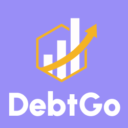</img>
        

    <td colspan="1" valign="top" style="font-weight: bold;">
    Mint
    

                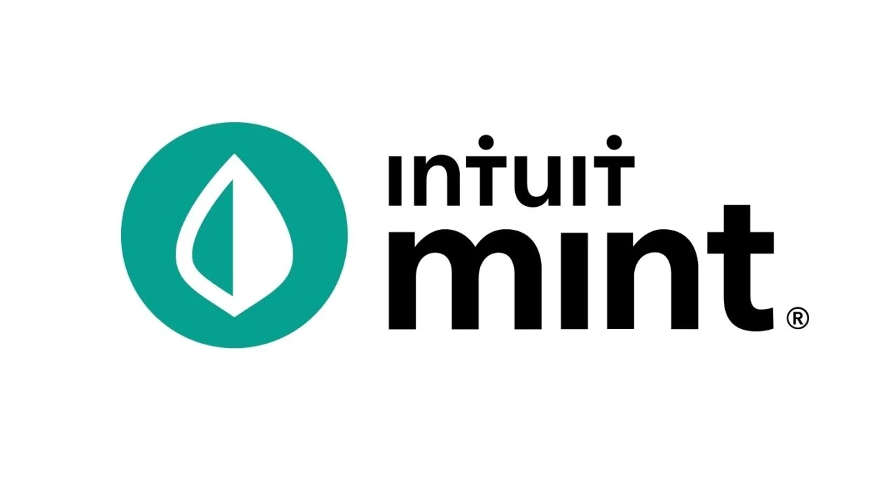</img>
        

    </td>
    <td colspan="1" valign="top" style="font-weight: bold;">
      YNAB
      

                </img>
            

      </td>
    <td colspan="1" valign="top" style="font-weight: bold;" >
      Credit Karma
      

                </img>
            

    </td>
  </tr>
  <tr>
    <td colspan="1" rowspan="2">
Perfil
</td>
    <td colspan="2">Overview</td>
    <td colspan="1" valign="top">Aplicación para gestionar deudas y educación financiera. Ofrece herramientas para seguimiento de ingresos, gastos y presupuestos.</td>
    <td colspan="1" valign="top">Plataforma para gestión de finanzas personales con seguimiento de gastos y presupuestos.</td>
    <td colspan="1" valign="top">Herramienta enfocada en la creación de presupuestos y asignación de fondos.</td>
    <td colspan="1" valign="top">Servicio de monitoreo de crédito con herramientas de gestión de deudas y recomendaciones financieras.</td>
  </tr>
  <tr>
    <td colspan="2">Ventaja competitiva¿Qué valor ofrece a los clientes?</td>
    <td colspan="1" valign="top">Personalización avanzada de presupuestos y recomendaciones financieras.</td>
    <td colspan="1" valign="top">Amplia integración con cuentas bancarias y tarjetas.</td>
    <td colspan="1" valign="top">Enfoque en la metodología de presupuesto y planificación.</td>
    <td colspan="1" valign="top">Monitoreo de crédito gratuito y recomendaciones personalizadas.</td>
  </tr>
  <tr>
    <td colspan="1" rowspan="2">
Perfil de Marketing
</td>
    <td colspan="2">Mercado objetivo</td>
    <td colspan="1" valign="top">Jóvenes y adultos que desean mejorar su educación financiera y gestionar sus deudas.</td>
    <td colspan="1" valign="top">Usuarios interesados en el seguimiento de gastos y la gestión financiera.</td>
    <td colspan="1" valign="top">Personas que buscan un enfoque riguroso en la creación y seguimiento de presupuestos.</td>
    <td colspan="1" valign="top">Usuarios que desean monitorear su crédito y gestionar deudas.</td>
  </tr>
  <tr>
    <td colspan="2">Estrategias de marketing</td>
    <td colspan="1" valign="top">Marketing digital dirigido a usuarios interesados en finanzas personales.</td>
    <td colspan="1" valign="top">Publicidad a través de canales digitales y colaboraciones con influencers financieros.</td>
    <td colspan="1" valign="top">Marketing basado en testimonios y demostraciones del enfoque de presupuesto.</td>
    <td colspan="1" valign="top">Publicidad a través de contenido educativo sobre crédito y finanzas personales.</td>
  </tr>
  <tr>
    <td colspan="1" rowspan="3">
Perfil de Producto
</td>
    <td colspan="2">Productos & Servicios</td>
    <td colspan="1" valign="top">Aplicación móvil con suscripción para características premium y servicios de consultoría financiera personalizada.</td>
    <td colspan="1" valign="top">Aplicación gratuita con opciones premium para características avanzadas.</td>
    <td colspan="1" valign="top">Suscripción mensual para acceso a herramientas de presupuesto y planificación.</td>
    <td colspan="1" valign="top">Aplicación gratuita con características premium para monitoreo avanzado y recomendaciones.</td>
  </tr>
  <tr>
    <td colspan="2">Precios & Costos</td>
    <td colspan="1" valign="top">Tarifa mensual o anual para suscripción premium, tarifas adicionales para consultoría y talleres.</td>
    <td colspan="1" valign="top">Gratuita con opciones de pago para características adicionales.</td>
    <td colspan="1" valign="top">Suscripción mensual o anual.</td>
    <td colspan="1" valign="top">Gratuita con opciones de pago para características avanzadas.</td>
  </tr>
  <tr>
    <td colspan="2">Canales de distribución (Web y/o Móvil)</td>
    <td colspan="1" valign="top">Web y móvil (iOS y Android).</td>
    <td colspan="1" valign="top">Web y móvil (iOS y Android).</td>
    <td colspan="1" valign="top">Web y móvil (iOS y Android).</td>
    <td colspan="1" valign="top">Web y móvil (iOS y Android).</td>
  </tr>
  <tr>
    <td colspan="1" rowspan="5">
Análisis SWOT
</td>
    <td colspan="6">Realice esto para su startup y sus competidores. Sus fortalezas deberían apoyar sus oportunidades y contribuir a lo que ustedes definen como su posible ventaja competitiva.</td>
  </tr>
  <tr>
    <td colspan="2">Fortalezas</td>
    <td colspan="1" valign="top">Innovación en personalización y enfoque en educación financiera.</td>
    <td colspan="1" valign="top">Amplia integración con bancos y tarjetas.</td>
    <td colspan="1" valign="top">Método comprobado de asignación de presupuesto.</td>
    <td colspan="1" valign="top">Monitoreo de crédito gratuito y recomendaciones personalizadas.</td>
  </tr>
  <tr>
    <td colspan="2">Debilidades</td>
    <td colspan="1" valign="top">Falta de reconocimiento de marca en comparación con competidores establecidos.</td>
    <td colspan="1" valign="top">Dependencia de ingresos por publicidad y promociones.</td>
    <td colspan="1" valign="top">Curva de aprendizaje en la metodología de presupuesto.</td>
    <td colspan="1" valign="top">Limitación en la profundidad del análisis de finanzas más allá del crédito.</td>
  </tr>
  <tr>
    <td colspan="2">Oportunidades</td>
    <td colspan="1" valign="top">Creciente interés en la educación financiera y gestión de deudas.</td>
    <td colspan="1" valign="top">Expansión en mercados internacionales.</td>
    <td colspan="1" valign="top">Integración de características adicionales basadas en IA.</td>
    <td colspan="1" valign="top">Expansión en servicios de planificación financiera.</td>
  </tr>
  <tr>
    <td colspan="2">Amenazas</td>
    <td colspan="1" valign="top">Competencia creciente y posibles cambios en regulaciones financieras.</td>
    <td colspan="1" valign="top">Competencia de aplicaciones de finanzas personales más integrales.</td>
    <td colspan="1" valign="top">Competencia de plataformas con características similares.</td>
    <td colspan="1" valign="top">Cambios en regulaciones de crédito y competencia de herramientas de gestión financiera.</td>
  </tr>
</table>

## 2.1.2. Estrategias y tácticas frente a competidores

Desarrollar estrategias y tácticas sólidas para enfrentar a nuestros competidores es fundamental para alcanzar una ventaja competitiva sostenible. En esta sección, exploraremos cómo podemos diferenciarnos y destacarnos en el mercado.

<strong>Estrategias y Tácticas Preliminares de DebtGo:</strong>

#1 Diferenciación a través de Persoanlización Avanzada:
- **Estrategia:** Posicionar a DebtGo como la opción más avanzada en personalización de presupuestos y recomendaciones financieras.
- **Táctica:** Desarrollar y promocionar funcionalidades de inteligencia artificial que ofrezcan recomendaciones financieras ultra-personalizadas. Realizar campañas de marketing que destaquen esta capacidad única y cómo se traduce en mejores resultados financieros para los usuarios.

#2 Enfoque en Educación Financiera:
- **Estrategia:** Aprovechar el interés creciente en la educación financiera para atraer usuarios que buscan mejorar su bienestar financiero a través de conocimientos prácticos y personalizados.
- **Táctica:** Ofrecer contenido educativo exclusivo y talleres interactivos como parte del paquete premium. Publicar estudios de caso y testimonios de usuarios que han logrado mejorar sus finanzas utilizando DebtGo.

#3 Optimización de la Experiencia de Usuario (UX):
- **Estrategia:** Garantizar que la experiencia de usuario sea superior y sin distracciones, en comparación con competidores que dependen de modelos basados en publicidad.
- **Táctica:** Implementar una interfaz de usuario intuitiva y realizar pruebas continuas para optimizar la navegación y la usabilidad. Recolectar y analizar feedback de usuarios para realizar mejoras continuas.

#4 Innovación Tecnológica:
- **Estrategia:** Utilizar la tecnología de vanguardia para mantener una ventaja competitiva y diferenciarse en el mercado.
- **Táctica:** Invertir en el desarrollo de tecnologías emergentes, como el aprendizaje automático y la inteligencia artificial, para ofrecer características innovadoras que los competidores aún no tienen. Lanzar nuevas funcionalidades en fases para mantener el interés y la retención de los usuarios.
 
#5 Vigilancia y Adaptación Continua:
- **Estrategia:** Monitorear continuamente el panorama competitivo para adaptar las estrategias y tácticas en función de las tendencias y cambios del mercado.
- **Tácticas:** Establecer un equipo dedicado a la investigación competitiva y al análisis del mercado. Ajustar las estrategias de marketing y producto basadas en la evolución de las ofertas de los competidores y las expectativas de los usuarios.

Estas estrategias y tácticas nos ayudarán a posicionar a DebtGo de manera efectiva en el mercado, aprovechando sus fortalezas y oportunidades mientras se enfrentan a las debilidades y amenazas que presentan los competidores.

## 2.2. Entrevistas
### 2.2.1. Diseño de entrevistas

**Segmento Objetivo: Consultores financieros:**

1. ¿Cuál es su nombre completo?
2. ¿Cuál es su edad?
3. ¿En qué distrito reside actualmente?
4. ¿Cuál es su ocupación/profesión y cuántos años de experiencia tiene en el campo de la economía o la consultoría financiera?
5. ¿Está familiarizado con el término "educación financiera"? ¿Cómo lo definiría en su propio contexto profesional?
6. ¿Qué dispositivos tecnológicos utiliza con mayor frecuencia en su trabajo diario? ¿Cuál considera más esencial para su actividad profesional?
7. ¿Qué redes sociales utiliza para mantenerse actualizado en temas financieros o económicos? ¿Cómo las utiliza en su práctica profesional?
8. ¿Ha visto algún tipo de anuncio o promoción relacionada con aplicaciones de gestión financiera en su dispositivo? ¿Cuál fue su impresión?
9. ¿En su rol actual, gestiona o asesora sobre responsabilidades económicas de empresas o individuos? ¿Podría darme un ejemplo?
10. ¿Conoce INFOCORP u otras bases de datos de informes crediticios? ¿Qué importancia les da en su práctica profesional?
11. ¿Qué desafíos ve en la gestión de finanzas personales de sus clientes o en su propia vida financiera?
12. ¿Ha utilizado o recomendado alguna aplicación para la gestión de finanzas personales o empresariales? ¿Qué características le parecen más útiles?
13. En su opinión, ¿cuál es la necesidad más importante en la educación financiera de las personas actuales? ¿Cómo cree que una app como DebtGo podría abordar esta necesidad?
14. ¿Considera que una aplicación de gestión financiera personalizada puede tener un impacto significativo en la mejora de las finanzas personales de los usuarios? ¿Por qué sí o por qué no?

**Segmento Objetivo: Gestores de Deudas y Emprendedores**

1. ¿Cuál es su nombre completo?
2. ¿Cuál es su edad?
3. ¿En qué distrito reside actualmente?
4. ¿Qué tipo de empresa estás interesado en iniciar?
5. ¿Cuál es tu nivel de conocimiento de finanzas? 
6. ¿Has trabajado con consultores financieros anteriormente? ¿Crees que deberían tener experiencia en tu rubro para poder asesorarte?
7. ¿Tienes alguna experiencia en la obtención de préstamos?
8. ¿Está familiarizado con términos financieros como crédito, interés, liquidez, etc.? 
9. ¿Qué pasos en el proceso de la obtención de préstamos resultan más confusos?
10. ¿Qué te preocupa más al momento de solicitar préstamos para tu negocio? (ie.  interés, condiciones, etc)
11. ¿A qué plataformas consideras acudir para adquirir préstamos? ¿Por qué?
12. ¿Qué criterios utilizas para identificar si una publicidad de préstamos es real, o si es un intento de estafa?
13. ¿Utilizas aplicaciones de banca móvil? ¿Cómo te sientes acerca del nivel de seguridad ofrecido por estas aplicaciones?
14. ¿A qué nivel estarías dispuesto a compartir tus datos financieros en una aplicación de consultas financieras?
15. ¿Qué condiciones o garantías lo harían sentir más seguro al momento de compartir información financiera?

### 2.2.2. Registro de entrevistas

**Segmento Objetivo: Consultores financieros:**

**Entrevista #1**

- Nombre: Jose Luza
- Edad: 19 años
- Distrito: Surquillo
-  Duración: 5:49 minutos

[Entrevista 1 - video](https://bit.ly/3Z6sFbM): https://bit.ly/3Z6sFbM

Resumen:

En la entrevista, José Adrián Luza, un joven de 19 años y estudiante de la carrera Ing. Software, comparte sus perspectivas sobre la educación financiera y el uso de tecnologías en la gestión económica personal. Aunque no tiene experiencia profesional en economía o consultoría financiera, se muestra familiarizado con conceptos básicos como el ahorro y la generación de ingresos, los cuales considera fundamentales en su carrera. José utiliza frecuentemente su teléfono y laptop para administrar sus finanzas personales y prefiere Twitter para mantenerse actualizado en temas económicos. Expresa críticas hacia algunas aplicaciones financieras que considera incompletas y destaca la importancia de Infocorp para el control crediticio. Además, subraya la necesidad de una buena educación financiera para evitar problemas económicos y cree que una aplicación personalizada podría tener un impacto positivo en la gestión de las finanzas personales.

**Entrevista #2**
- Nombre: Rafael Palomino
- Edad:  19 años
- Distrito: Molina
- Duración: 7:55 minutos

[Entrevista 2 - video](https://bit.ly/4cTGdur): https://bit.ly/4cTGdur

Resumen: 

Rafael, un joven de 19 años estudiante de comunicación y marketing, comparte sus opiniones sobre la educación financiera y el uso de la tecnología en la gestión personal de finanzas. Aunque no tiene experiencia directa en economía o consultoría financiera, ha estado interesado en el tema durante el último año y lo considera crucial para su futuro. Rafael utiliza con frecuencia su celular y laptop para buscar información financiera y sigue a referentes en Instagram y Youtube. Si bien no ha encontrado una aplicación financiera que considere completamente adecuada, destaca la relevancia de Infocorp para el control de deudas y la importancia de educarse financieramente, algo que no se enseña en colegios ni universidades. Además, cree que una aplicación bien estructurada podría tener un impacto positivo en la gestión de las finanzas personales y ayudar a las personas a manejar mejor su economía.

**Entrevista #3**
- Nombre: Marisol Ordoñez
- Edad: 28 años
- Distrito: San Juan de Lurigancho
- Duración: 7:33 minutos

[Entrevista 3 - video](https://shorturl.at/2eBIT): https://shorturl.at/2eBIT

Resumen: 

Marisol, economista y consultora financiera de 28 años con 5 años de experiencia, considera esencial la educación financiera para gestionar adecuadamente las finanzas personales y empresariales. Define la educación financiera como el proceso de adquirir conocimientos sobre ahorro, inversión, crédito y planificación a largo plazo. Utiliza su laptop y teléfono para su trabajo, destacando la laptop como la herramienta más importante. Para mantenerse actualizada, sigue a profesionales e instituciones en LinkedIn y a economistas en Twitter. Aunque ve anuncios de aplicaciones de gestión financiera, opina que deben ofrecer herramientas robustas para ser realmente útiles. 
En su rol, asesora a empresas e individuos, y valora Infocorp y otras bases de datos para evaluar la solvencia crediticia. Señala la falta de planificación a largo plazo y el desconocimiento sobre el crédito como desafíos comunes. Recomienda aplicaciones que permiten el seguimiento automático de gastos y la creación de presupuestos personalizados. 
Sobre DebtGo, Marisol cree que una aplicación que ayude a gestionar y reducir deudas puede ser muy beneficiosa, y que una herramienta personalizada puede mejorar significativamente la gestión financiera personal al ofrecer recomendaciones ajustadas a los hábitos y objetivos de los usuarios.

**Segmento Objetivo: Gestores de Deudas y Emprendedores**

**Entrevista #1**

- Nombre: Emilio Chávarri
- Edad: 54 años
- Distrito: San Juan de Lurigancho 
- Duración: 4:38 minutos

[Entrevista 1 - video](https://upcedupe-my.sharepoint.com/:v:/g/personal/u202211108_upc_edu_pe/EYsHot_bR4FLtZs1tok9abIBf1ZfOJsBVIy0KEwKFc6AEA?e=bER0c8&nav=eyJyZWZlcnJhbEluZm8iOnsicmVmZXJyYWxBcHAiOiJTdHJlYW1XZWJBcHAiLCJyZWZlcnJhbFZpZXciOiJTaGFyZURpYWxvZy1MaW5rIiwicmVmZXJyYWxBcHBQbGF0Zm9ybSI6IldlYiIsInJlZmVycmFsTW9kZSI6InZpZXcifSwicGxheWJhY2tPcHRpb25zIjp7InN0YXJ0VGltZUluU2Vjb25kcyI6Mi40OH19): https://shorturl.at/M76Qv

Resumen:

Emilio Chávarri, de 54 años, es una persona que quiere emprender en el rubro de comunicaciones, tiene experiencia en la obtención de préstamos a entidades bancarias pero presenta dificultades en cuanto a firma de documentos de préstamos, ya que hay muchos términos que se tiene que leer y entender. Lo que más le preocupa de solicitar préstamos es el interés que va a pagar por el mismo. El criterio que utiliza para identificar si una publicidad de préstamo es real, primeramente ve qué empresa es la que está publicitando, y luego por medio del internet va al mercado de valores para ver la condición financiera de la empresa. También utiliza ciertas aplicaciones de banca móvil y a su vez, siente que es muy segura y que conforme pasa el tiempo los bancos van mejorando en cuestión de seguridad. Finalmente, las condiciones con las que se sentiría seguro al momento de compartir información financiera es la seguridad de la misma aplicación, ver cuántas restricciones tiene para acceder a su información, conocer más a la empresa, su ubicación, el software que está utilizando, que tan fácil es usarlo.

**Entrevista #2** 
- Nombre: Estrella Ticona
- Edad: 19 años
- Distrito: Chorrillos
- Duración: 4:40 minutos

[Entrevista 2 - video](https://shorturl.at/JQK2Y): https://shorturl.at/JQK2Y

Resumen:

Estrella, de 19 años, está interesada en iniciar una empresa tecnológica centrada en el desarrollo de software y soluciones basadas en inteligencia artificial. Aunque no tiene experiencia profesional en economía o consultoría financiera, posee un alto nivel de conocimiento en finanzas, desde conceptos básicos hasta estrategias avanzadas. A pesar de no haber trabajado con consultores financieros, cree que la experiencia en el rubro es importante para ofrecer asesoría efectiva. Al momento de obtener un préstamo se preocupa principalmente por la claridad y transparencia de las condiciones, así como por las tasas de interés. Considera que la revelación de las tasas y las cláusulas del contrato son aspectos confusos. Prefiere plataformas como bancos móviles y fintechs reconocidos por su seguridad y transparencia. Utiliza la app del BCP para su banca móvil y se siente segura gracias a las medidas de seguridad, como la autenticación de dos factores. Está dispuesta a compartir sus datos financieros solo con aplicaciones que ofrezcan altos estándares de seguridad y políticas claras de privacidad.

**Entrevista #3**
- Nombre: 
- Edad:  años
- Distrito: 
- Duración:  minutos

Resumen: 

### 2.2.3. Análisis de entrevistas

**Segmento Objetivo: Consultores financieros:**

*Perfil Profesional y Uso de Herramientas:*

- Marisol, como consultora financiera con 5 años de experiencia, destaca el valor de la educación financiera y el uso de herramientas digitales (laptop y móvil) para su trabajo, similar a José Adrián y Rafael, quienes también priorizan el uso de tecnología (laptop y móvil) en la gestión de sus finanzas personales.
- Todos los entrevistados utilizan dispositivos electrónicos para estar al día y realizar gestiones financieras, subrayando la importancia de crear aplicaciones optimizadas para diferentes plataformas (especialmente móviles y laptops).

*Educación Financiera y Retos:*

- Marisol ve la educación financiera como clave para evitar problemas financieros, un punto también mencionado por Rafael y José Adrián, quienes reconocen la falta de educación formal en finanzas personales, tanto en universidades como colegios.
- Desconocimiento del crédito y la falta de planificación a largo plazo son desafíos comunes que Marisol observa en sus clientes. Esta carencia de conocimientos es igualmente resaltada por los otros entrevistados, lo que refleja una necesidad clara de más educación en este tema.

*Percepción de Aplicaciones Financieras:*

- Marisol critica las aplicaciones financieras que no ofrecen herramientas robustas para la gestión de deudas y presupuesto, una preocupación también reflejada por José Adrián, quien señala que las aplicaciones actuales son incompletas.

*Uso de Infocorp y Control Crediticio:*

- Todos los entrevistados, valoran el uso de Infocorp para el control de deudas y la evaluación crediticia. Esto demuestra la importancia de integrar herramientas para el control de créditos dentro de la aplicación que propone la startup.

*Tecnología y Redes Sociales:*

- Marisol utiliza LinkedIn y Twitter para mantenerse actualizada en temas financieros, lo que coincide con José Adrián, quien también prefiere Twitter para seguir tendencias económicas. Rafael, en cambio, opta por Instagram y YouTube. Esto indica que la educación financiera a través de redes sociales y formatos multimedia es clave para captar a diferentes grupos de usuarios.

*Potencial de DebtGo:*

- Todos coinciden en que una aplicación que ayude a gestionar y reducir deudas podría tener un impacto positivo. Marisol resalta el valor de una herramienta personalizada para mejorar la gestión financiera, una idea que también es respaldada por Rafael y José Adrián, quienes buscan soluciones prácticas y accesibles para jóvenes y profesionales.

**Segmento Objetivo: Gestores de Deudas y Emprendedores**

## 2.3. Needfinding
### 2.3.1. User Personas

Para esta sección se han creado personajes ficticios, cada uno diseñado para representar a un segmento específico de usuarios. La información utilizada para desarrollar estos "User personas" proviene de entrevistas previas realizadas a cada segmento objetivo. Estas entrevistas tenían como objetivo comprender mejor a las personas a las que se dirige la aplicación. Se consideraron datos demográficos, metas, motivaciones frustraciones, marcas relacionadas con el tema de la aplicación canales digitales más utilizados, entre otros. La creación de esta sección se llevó a cabo utilizando la plataforma UXPressia.

**Segmento Objetivo: Consultores financieros:**

#### User Persona 1: 

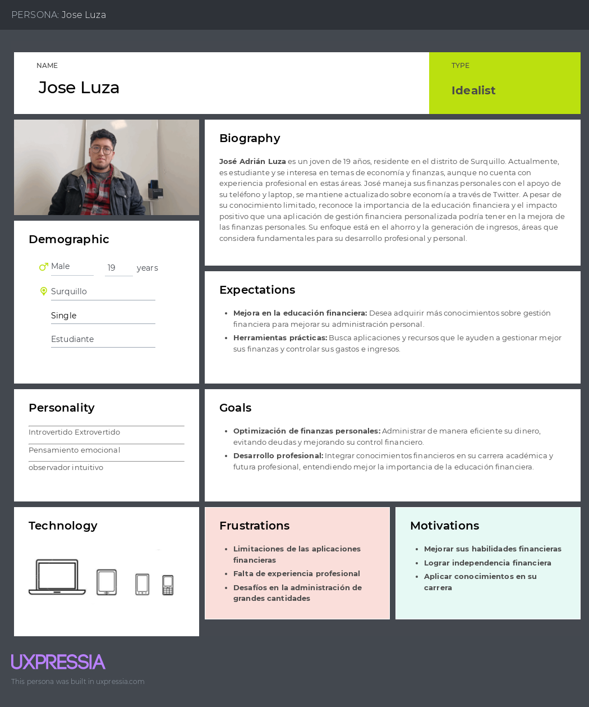
*Imagen (N°2). Elaboración propia. Realizado en UXPRESSIA*

**Segmento Objetivo: Gestores de Deudas y Emprendedores**

#### User Persona 2:

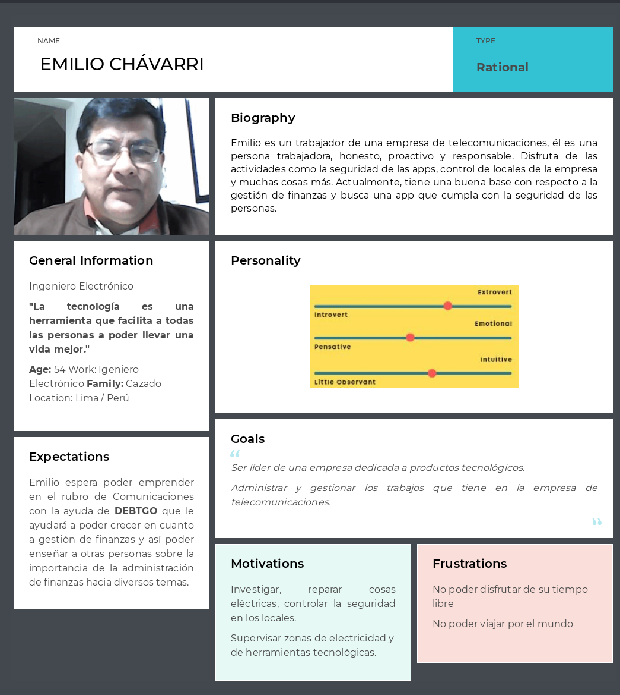
*Imagen (N°3). Elaboración propia. Realizado en UXPRESSIA*

<!-- 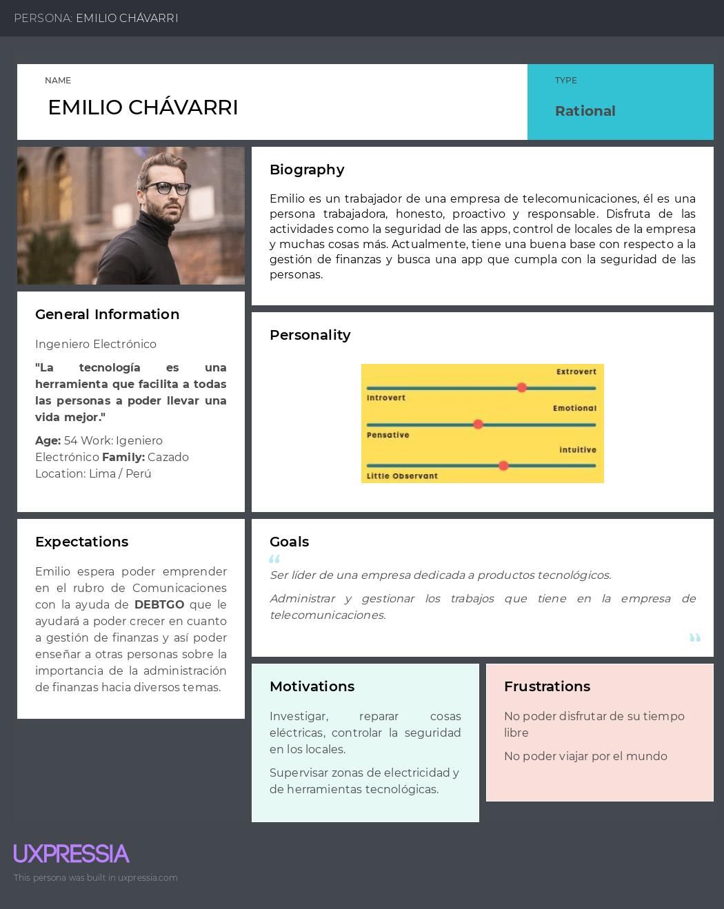
*Imagen (N°). Elaboración propia. Realizado en UXPRESSIA* -->

### 2.3.2. User Task Matrix
En esta sección se presenta el user task matrix, herramienta centrada en los segmentos objetivos, que nos permitirá identificar las tareas y objetivos claves de los usuarios. Además, nos permitirá priorizar características y funcionalidades al momento de realizar el product backlog. Para la frecuencia se han considerado cinco opciones:nunca ,casi nunca, a veces, a menudo ,siempre; y para la importancia tres opciones: bajo, medio, alto". En relación con la matriz de tareas de los usuarios, podemos identificar tanto las tareas de mayor frecuencia como las de mayor importancia, así como las diferencias y similitudes entre los diferentes tipos de usuarios.

<table>
<tr><th rowspan="2" valign="top">
<b><i>User task Matrix</i></b></th>
<th colspan="2" valign="top">
<b><i>Segmento 1</i></b></th>
<th colspan="2" valign="top">

<b><i>Segmento 2</i></b>
 

<b><i></i></b>

 </th></tr>
<tr><td valign="top"><b><i>Frecuencia</i></b> </td>
<td valign="top"><b><i>Importancia</i></b></td>
<td valign="top"><b><i>Frecuencia</i></b> </td>
<td valign="top"><b><i>Importancia</i></b></td>
</tr>
<tr><td>Registrarse en la plataforma </td>
<td><b><i>A menudo</i></b></td>
<td><b><i>Alta</i></b></td>
<td><b><i>A menudo</i></b></td>
<td><b><i>Medio</i></b></td>
</tr>
<tr><td>Llenar datos sobre el usuario </td>
<td><b><i>Amenudo</i></b></td>
<td><b><i>Alta</i></b></td>
<td><b><i>A menudo</i></b></td>
<td><b><i>Medio</i></b></td>
</tr>
<tr><td>Indicar el nivel de experiencia que tiene
con la gestión financiera</td>
<td><b><i>A menudo</i></b></td>
<td><b><i>Muy alta</i></b></td>
<td><b><i>A menudo</i></b></td>
<td><b><i>Muy alta</i></b></td></tr>
<tr><td>Buscar sus deudas pendientes</td>
<td><b><i>Alta</i></b></td>
<td><b><i>Medio</i></b></td>
<td><b><i>Siempre</i></b></td>
<td><b><i>Alta</i></b></td>
</tr>
<tr><td>Seleccionar sobre la opción gestión de
deudas o gastos personales
</td>
<td><b><i>Alta</i></b></td>
<td><b><i>Alta</i></b></td>
<td><b><i>A menudo</i></b></td>
<td><b><i>Alta</i></b></td>
</tr>
<tr><td>Chat online con un asesor</td>
<td><b><i>Casi nunca</i></b></td>
<td><b><i>Baja</i></b></td>
<td><b><i>Casi nunca</i></b></td>
<td><b><i>Baja</i></b></td>
</tr>
</table>

### 2.3.3. User Journey Mapping
En esta sección, explicaremos en detalle los user journey mapping para dos tipos de usuarios distintos: Consultores Financieros/Economistas y Gestores de Deudas y Emprendedores. Estos mapas proporcionarán una visión exhaustiva de cómo cada segmento de usuario interactúa con la plataforma, desde su primer contacto hasta su uso continuo y el análisis de resultados. Mejoraremos la presentación de estos mapas, destacando las etapas clave y las necesidades específicas de cada usuario para garantizar una comprensión clara y concisa de su experiencia a lo largo de su viaje:

**Segmento Objetivo: Consultores financieros:**

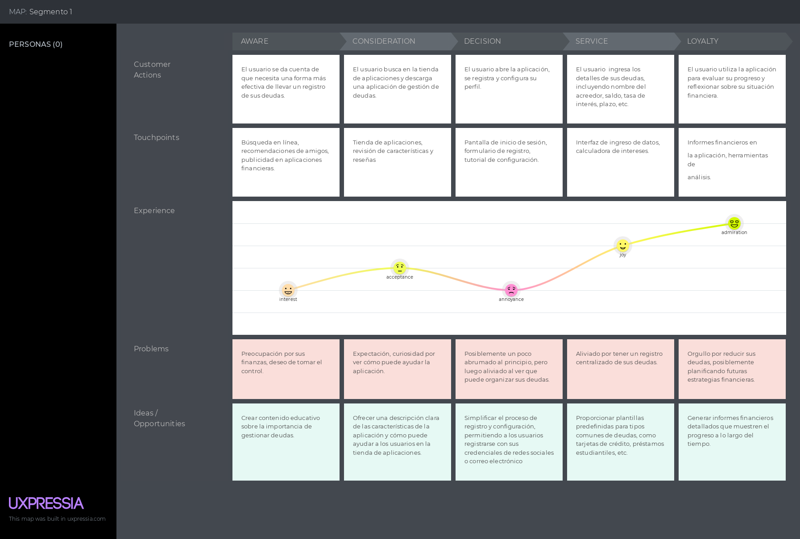

*Imagen (N°4). Elaboración propia. Realizado en UXPRESSIA* 

**Segmento Objetivo: Gestores de Deudas y Emprendedores**

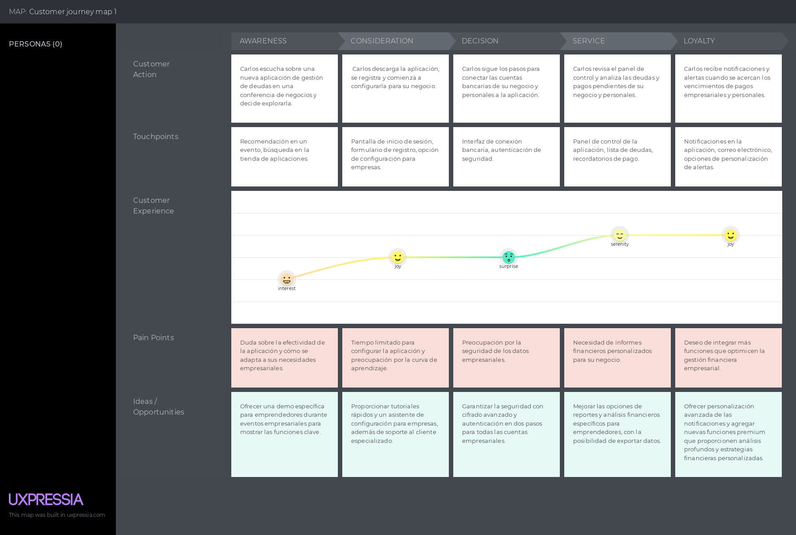

*Imagen (N°5). Elaboración propia. Realizado en UXPRESSIA.*

<!-- 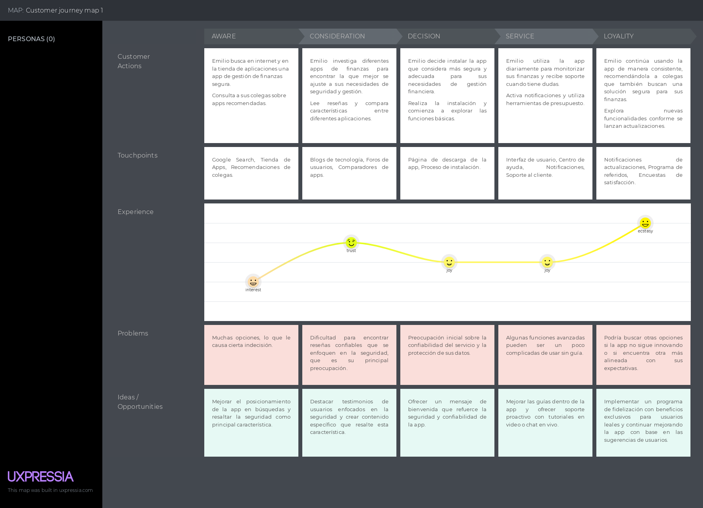

*Imagen (N°). Elaboración propia. Realizado en UXPRESSIA. -->

### 2.3.4. Empathy Mapping

**Segmento objetivo: Consultores financieros**

**Segmento objetivo: Emprendedores**

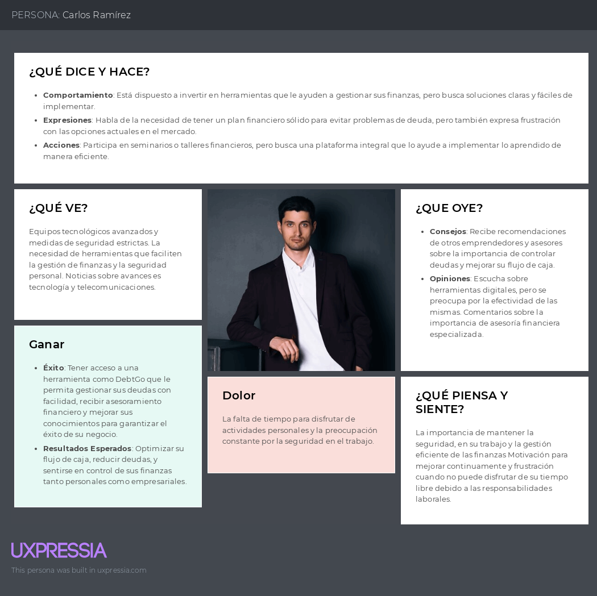
*Imagen (N°). Elaboración propia. Realizado en UXPRESSIA.*

### 2.3.5. As-is Scenario Mapping

**Segmento objetivo: Consultores financieros**
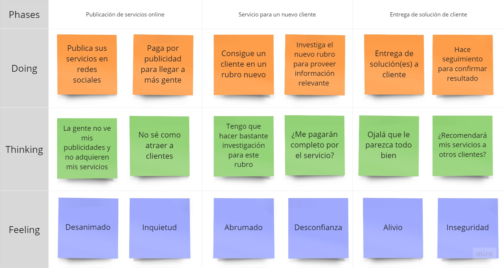
*Imagen (N°6). Elaboración propia. Realizado en [Miro](https://miro.com/app/board/uXjVKilDDEs=/?share_link_id=237055566961).*

**Segmento objetivo: Emprendedores**
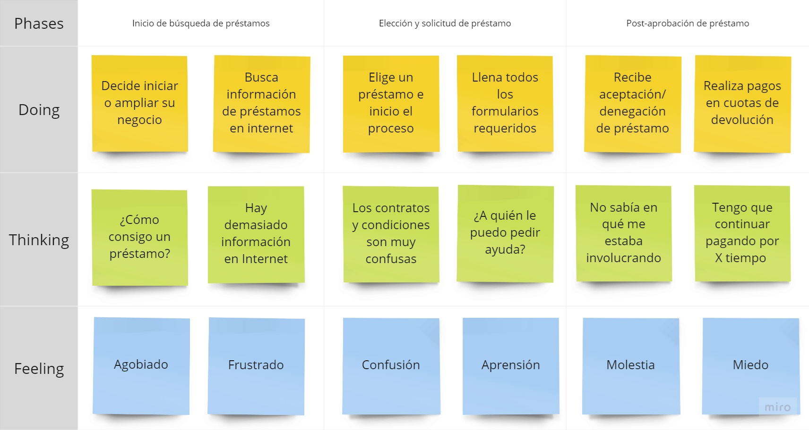
*Imagen (N°7). Elaboración propia. Realizado en [Miro](https://miro.com/app/board/uXjVKilDDEs=/?share_link_id=237055566961).*

<!-- 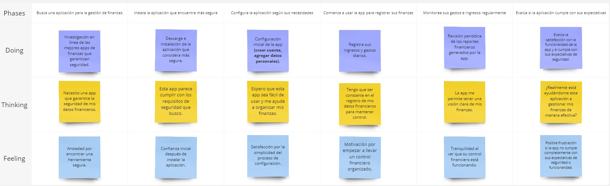
*Imagen (N°). Elaboración propia. Realizado en [Miro](https://miro.com/app/board/uXjVKisf19Y=/).*
 -->
## 2.4. Ubiquitous Language

<strong>1. Debt Management (Gestión de Deudas):</strong> Proceso mediante el cual los usuarios monitorean, controlan y organizan el pago de sus deudas personales o empresariales para evitar caer en mora o aumentar los intereses acumulados.

<strong>2. Financial Literacy (Educación Financiera):</strong> Nivel de conocimiento que los usuarios tienen sobre conceptos financieros básicos, como cómo funcionan los préstamos, los intereses y cómo se gestionan las deudas de manera efectiva.

<strong>3. Custom Payment Plans (Planes de Pago Personalizados):</strong> Soluciones de pago que DebtGo ofrece a los usuarios, adaptadas a sus necesidades financieras específicas, con el fin de ayudarlos a saldar sus deudas de manera eficiente y estructurada.

<strong>4. Income and Expense Tracking (Seguimiento de Ingresos y Gastos):</strong> Funcionalidad de DebtGo que permite a los usuarios registrar y monitorear sus ingresos y gastos diarios para obtener una visión clara de su situación financiera.

<strong>5. Financial Consultants (Consultores Financieros):</strong> Profesionales especializados que proporcionan asesoramiento personalizado a los usuarios de DebtGo para ayudarlos a mejorar su gestión de deudas y finanzas personales.

<strong>6. Personalized Budgeting (Presupuestación Personalizada):</strong> Herramienta que permite a los usuarios crear presupuestos ajustados a su realidad económica, ayudándoles a manejar sus ingresos, gastos y deudas de forma organizada.

<strong>7. Financial Workshops (Talleres Financieros):</strong> Sesiones educativas en línea ofrecidas por DebtGo para mejorar el conocimiento financiero de los usuarios, capacitándolos en la gestión de deudas y en la toma de decisiones financieras informadas.

<strong>8. Debt Cycle (Ciclo de Endeudamiento):</strong> Situación en la que los usuarios adquieren nuevas deudas para pagar deudas anteriores, lo que incrementa su carga financiera y perpetúa el problema de la deuda.

<strong>9. Interest Accumulation (Acumulación de Intereses):</strong> Proceso por el cual los intereses sobre una deuda se incrementan con el tiempo si los pagos no se realizan puntualmente.

<strong>10. Debt Reminders (Recordatorios de Deuda):</strong> Notificaciones automáticas que DebtGo envía a los usuarios para recordarles las fechas de vencimiento de los pagos de sus deudas y evitar penalidades por retraso.

<strong>11. Financial Stress (Estrés Financiero):</strong> Estado emocional negativo que experimentan los usuarios debido a la incapacidad de gestionar sus deudas de manera efectiva, lo que puede tener consecuencias graves en su bienestar personal y salud mental.

<strong>12. Debt Consolidation (Consolidación de Deudas):</strong> Estrategia de gestión de deudas que permite a los usuarios combinar múltiples deudas en una sola, con condiciones de pago más favorables.

<strong>13. Subscription Model (Modelo de Suscripción):</strong> Estructura de pago en la que los usuarios de DebtGo pueden acceder a características premium, como análisis financieros avanzados y contenido educativo exclusivo, mediante una tarifa mensual o anual.

<strong>14. Financial Advisory (Asesoría Financiera):</strong> Servicio ofrecido por DebtGo que proporciona recomendaciones y planes personalizados a los usuarios para ayudarles a tomar decisiones financieras informadas.

<strong>15. Credit Score (Historial Crediticio):</strong> Registro de la capacidad de un usuario para pagar sus deudas, que influye en su elegibilidad para obtener futuros créditos o préstamos.

<strong>16. Debt Accumulation (Acumulación de Deudas):</strong> Proceso mediante el cual los usuarios incrementan la cantidad total de sus deudas debido a la falta de pagos o al uso constante de crédito sin una gestión adecuada.

<strong>17. Default Risk (Riesgo de Mora):</strong> Posibilidad de que los usuarios no puedan cumplir con sus obligaciones financieras, lo que puede resultar en penalidades o acciones legales.

<strong>18. Artificial Intelligence (Inteligencia Artificial):</strong> Tecnología que DebtGo planea integrar para personalizar aún más las recomendaciones financieras y mejorar la experiencia del usuario mediante el análisis avanzado de su comportamiento financiero.

# Capítulo III: Requirements Specification
## 3.1. To-Be Scenario Mapping
## 3.2. User Stories
## 3.3. Impact Mapping
## 3.4. Product Backlog

# Capítulo IV: Product Design
## 4.1. Style Guidelines
### 4.1.1. General Style Guidelines
### 4.1.2. Web Style Guidelines
## 4.2. Information Architecture
### 4.2.1. Organization Systems
### 4.2.2. Labeling Systems
### 4.2.3. SEO Tags and Meta Tag
### 4.2.4. Searching Systems
### 4.2.5. Navigation Systems
## 4.3. Landing Page UI Design
### 4.3.1. Landing Page Wireframe
### 4.3.2. Landing Page Mock-up
## 4.4. Web Applications UX/UI Design
### 4.4.1. Web Applications Wireframes
### 4.4.2. Web Applications Wireflow Diagrams
### 4.4.3. Web Applications Mock-ups
### 4.4.4. Web Applications User Flow Diagrams
## 4.5. Web Applications Prototyping
## 4.6. Domain-Driven Software Architecture
### 4.6.1. Software Architecture Context Diagram
### 4.6.2. Software Architecture Container Diagrams
### 4.6.3. Software Architecture Components Diagrams
## 4.7. Software Object-Oriented Design
### 4.7.1. Class Diagrams
### 4.7.2. Class Dictionary
## 4.8. Database Design
## 4.8.1. Database Diagram

# Capítulo V: Product Implementation, Validation & Deployment
## 5.1. Software Configuration Management
### 5.1.1. Software Development Environment Configuration
### 5.1.2. Source Code Management
### 5.1.3. Source Code Style Guide & Conventions
### 5.1.4. Software Deployment Configuration
## 5.2. Landing Page, Services & Applications Implementation
### 5.2.X. Sprint 
#### 5.2.X.1. Sprint Planning n
#### 5.2.X.2. Sprint Backlog n
#### 5.2.X.3. Development Evidence for Sprint Review
#### 5.2.X.4. Testing Suite Evidence for Sprint Review
#### 5.2.X.5. Execution Evidence for Sprint Review
#### 5.2.X.6. Services Documentation Evidence for Sprint Review
#### 5.2.X.7. Software Deployment Evidence for Sprint Review
#### 5.2.X.8. Team Collaboration Insights during Sprint
## 5.3. Validation Interviews
### 5.3.1. Diseño de Entrevistas
### 5.3.2. Registro de Entrevistas
### 5.3.3. Evaluaciones según heurísticas
# 5.4. Video About-the-Product

# Conclusiones
## Conclusiones y recomendaciones
## Video About-the-Team.

# Bibliografía

# Anexos
****