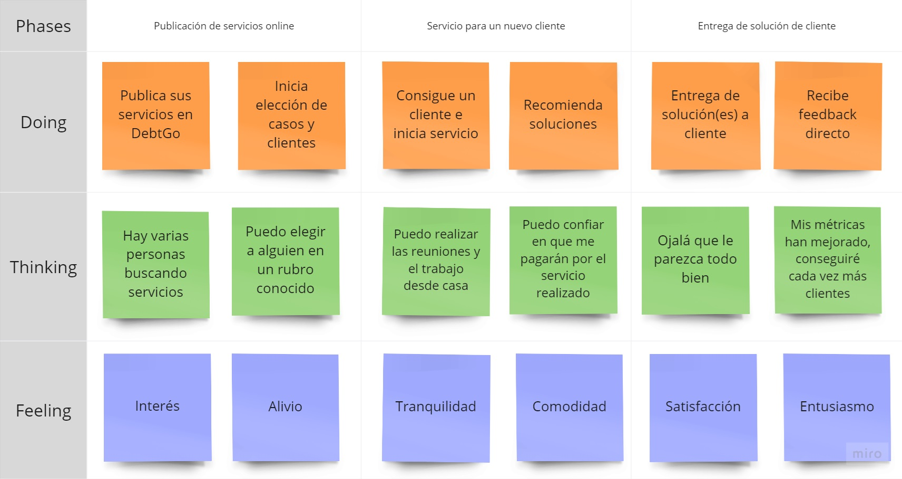
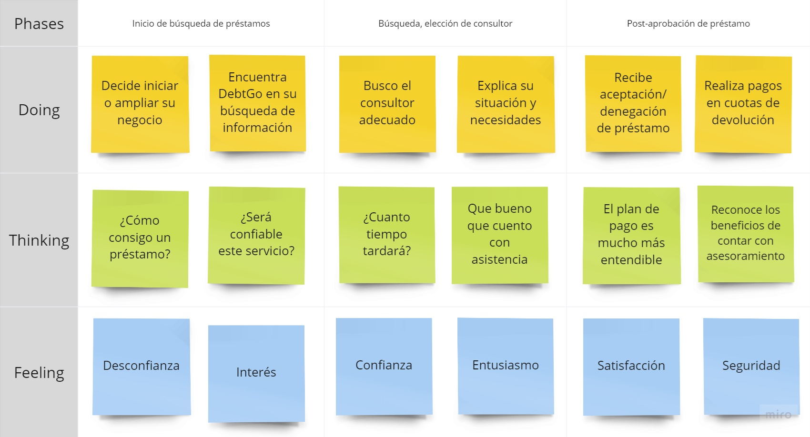

# 
COURSE PROJECT

    <strong>Universidad Peruana de Ciencias Aplicadas</strong> 
    </img> 
    <strong>Ingeniería de Software - 2024-2</strong> 
    <strong>Aplicaciones Web - WX53</strong> 
    <strong>Profesor: Alberto Wilmer Sanchez Seña</strong> 
     INFORME DE TRABAJO FINAL - TB1

    <strong>Startup: Apple Web</strong> 
    <strong>Producto: DebtGo</strong>

    <h3>Team Members:</h3>
    <table align="center">
        <tr>
            <th style="text-align:center;">Member</th>
            <th style="text-align:center;">Code</th>
        </tr>
        <tr>
            <td>Medina Chocce, Karito Dianeth</td>
            <td>U20221C769</td>
        </tr>
        <tr>
            <td>Sanchez Rios, Camila Cristina</td>
            <td>U202210973</td>
        </tr>
        <tr>
            <td>Durand Vera, Gianfranco Angel</td>
            <td>U20201F640</td>
        </tr>
        <tr>
            <td>Chávarri Zarzosa, Daniel Jhared </td>
            <td>U202211108</td>
        </tr>
         <tr>
            <td>Duran Santander, Emilia Mercedes </td>
            <td>U201914541</td>
         </tr>
    </table>

    <strong>Agosto, 2024</strong>

 

<h1 align="center">Registro de versiones del Informe</h1>
 
<table>
        <thead>
            <tr>
                <th>Versión</th>
                <th>Fecha</th>
                <th>Autor</th>
                <th>Descripción de modificaciones</th>
            </tr>
        </thead>
        <tbody>
            <tr>
                <th>TB1</th>
                <td>20/08/2024</td>
                <td>
                    <ul>
          <li>Karito Medina</li>
          <li>Camila Sanchez</li>
          <li>Gianfranco Durand</li>
          <li>Daniel Chávarri</li>
          <li>Emilia Duran</li>
                    <ul>
           </td>
      <td>            
             <ul>
          <li>Capítulo I: Introducción</li>
          <li>Capítulo II: Requirements Elicitation & Analysis</li>
          <li>Capítulo III: Requirements Specification</li>
          <li>Capítulo IV: Product Design</li>
          <li>Avance del Capítulo V: Product Implementation, Validation & Deployment hasta el punto 5.2.1.8</li>
          <li>Avance de Conclusiones, Bibliografía y Anexos</li>
        </ul>
      </td>
  </tr>
</tbody>
</table>

# Project Report Collaboration Insights

# Contenido
[Student Outcome](#student-outcome)

[Capítulo I: Introducción](#capitulo-i-introducción)
- [1.1. Startup Profile](#11-startup-profile)
  - [1.1.1. Descripción de la Startup](#111-descripción-de-la-startup)
  - [1.1.2. Perfiles de integrantes del equipo](#112-perfiles-de-integrantes-del-equipo)
- [1.2. Solution Profile](#12-solution-profile)
  - [1.2.1 Antecedentes y problemática](#121-antecedentes-y-problemática)
  - [1.2.2 Lean UX Process](#122-lean-ux-process)
    - [1.2.2.1. Lean UX Problem Statements](#1221-lean-ux-problem-statements)
    - [1.2.2.2. Lean UX Assumptions](#1222-lean-ux-assumptions)
    - [1.2.2.3. Lean UX Hypothesis Statements](#1223-lean-ux-hypothesis-statements)
    - [1.2.2.4. Lean UX Canvas](#1224-lean-ux-canvas)
- [1.3. Segmentos objetivo](#13-segmentos-objetivo)

[Capítulo II: Requirements Elicitation & Analysis](#capítulo-ii-requirements-elicitation--analysis)
- [2.1. Competidores](#21-competidores)
  - [2.1.1. Análisis competitivo](#211-análisis-competitivo)
  - [2.1.2. Estrategias y tácticas frente a competidores](#212-estrategias-y-tácticas-frente-a-competidores)
- [2.2. Entrevistas](#22-entrevistas)
  - [2.2.1. Diseño de entrevistas](#221-diseño-de-entrevistas)
  - [2.2.2. Registro de entrevistas](#222-registro-de-entrevistas)
  - [2.2.3. Análisis de entrevistas](#223-análisis-de-entrevistas)
- [2.3. Needfinding](#23-needfinding)
  - [2.3.1. User Personas](#231-user-personas)
  - [2.3.2. User Task Matrix](#232-user-task-matrix)
  - [2.3.3. User Journey Mapping](#233-user-journey-mapping)
  - [2.3.4. Empathy Mapping](#234-empathy-mapping)
  - [2.3.5. As-is Scenario Mapping](#235-as-is-scenario-mapping)
- [2.4. Ubiquitous Language](#24-ubiquitous-language)

[Capítulo III: Requirements Specification](#capítulo-iii-requirements-specification)
- [3.1. To-Be Scenario Mapping](#31-to-be-scenario-mapping)
- [3.2. User Stories](#32-user-stories)
- [3.3. Impact Mapping](#33-impact-mapping)
- [3.4. Product Backlog](#34-product-backlog)

[Capítulo IV: Product Design](#capítulo-iv-product-design)
- [4.1. Style Guidelines](#41-style-guidelines)
  - [4.1.1. General Style Guidelines](#411-general-style-guidelines)
  - [4.1.2. Web Style Guidelines](#412-web-style-guidelines)
- [4.2. Information Architecture](#42-information-architecture)
  - [4.2.1. Organization Systems](#421-organization-systems)
  - [4.2.2. Labeling Systems](#422-labeling-systems)
  - [4.2.3. SEO Tags and Meta Tag](#423-seo-tags-and-meta-tag)
  - [4.2.4. Searching Systems](#424-searching-systems)
  - [4.2.5. Navigation Systems](#425-navigation-systems)
- [4.3. Landing Page UI Design](#43-landing-page-ui-design)
  - [4.3.1. Landing Page Wireframe](#431-landing-page-wireframe)
  - [4.3.2. Landing Page Mock-up](#432-landing-page-mock-up)
- [4.4. Web Applications UX/UI Design](#44-web-applications-uxui-design)
  - [4.4.1. Web Applications Wireframes](#411-general-style-guidelines)
  - [4.4.2. Web Applications Wireflow Diagrams](#442-web-applications-wireflow-diagrams)
  - [4.4.3. Web Applications Mock-ups](#443-web-applications-mock-ups)
  - [4.4.4. Web Applications User Flow Diagrams](#444-web-applications-user-flow-diagrams)
- [4.5. Web Applications Prototyping](#45-web-applications-prototyping)
- [4.6. Domain-Driven Software Architecture](#46-domain-driven-software-architecture)
  - [4.6.1. Software Architecture Context Diagram](#461-software-architecture-context-diagram)
  - [4.6.2. Software Architecture Container Diagrams](#462-software-architecture-container-diagrams)
  - [4.6.3. Software Architecture Components Diagrams](#463-software-architecture-components-diagrams)
- [4.7. Software Object-Oriented Design](#47-software-object-oriented-design)
  - [4.7.1. Class Diagrams](#471-class-diagrams)
  - [4.7.2. Class Dictionary](#472-class-dictionary)
- [4.8. Database Design](#48-database-design)
  - [4.8.1. Database Diagram](#481-database-diagram)

[Capítulo V: Product Implementation, Validation & Deployment](#capítulo-v-product-implementation-validation--deployment)
- [5.1. Software Configuration Management](#51-software-configuration-management)
  - [5.1.1. Software Development Environment Configuration](#511-software-development-environment-configuration)
  - [5.1.2. Source Code Management](#512-source-code-management)
  - [5.1.3. Source Code Style Guide & Conventions](#513-source-code-style-guide--conventions)
  - [5.1.4. Software Deployment Configuration](#514-software-deployment-configuration)
- [5.2. Landing Page, Services & Applications Implementation](#52-landing-page-services--applications-implementation)
  - [5.2.X. Sprint ](#52x-sprint)
    - [5.2.X.1. Sprint Planning n](#52x1-sprint-planning-n)
    - [5.2.X.2. Sprint Backlog n](#52x2-sprint-backlog-n)
    - [5.2.X.3. Development Evidence for Sprint Review](#52x3-development-evidence-for-sprint-review)
    - [5.2.X.4. Testing Suite Evidence for Sprint Review](#52x4-testing-suite-evidence-for-sprint-review)
    - [5.2.X.5. Execution Evidence for Sprint Review](#52x5-execution-evidence-for-sprint-review)
    - [5.2.X.6. Services Documentation Evidence for Sprint Review](#52x6-services-documentation-evidence-for-sprint-review)
    - [5.2.X.7. Software Deployment Evidence for Sprint Review](#52x7-software-deployment-evidence-for-sprint-review)
    - [5.2.X.8. Team Collaboration Insights during Sprint](#52x8-team-collaboration-insights-during-sprint)
- [5.3. Validation Interviews](#53-validation-interviews)
  - [5.3.1. Diseño de Entrevistas](#531-diseño-de-entrevistas)
  - [5.3.2. Registro de Entrevistas](#532-registro-de-entrevistas)
  - [5.3.3. Evaluaciones según heurísticas](#533-evaluaciones-según-heurísticas)
- [5.4. Video About-the-Product](#54-video-about-the-product)

[Conclusiones](#conclusiones)
- [Conclusiones y recomendaciones](#conclusiones-y-recomendaciones)
- [Video About-the-Team](#video-about-the-team)

[Bibliografía](#bibliografía)

[Anexos](#anexos)

# Student Outcome

# Capítulo I: Introducción
## 1.1. Startup Profile
### 1.1.1. Descripción de la Startup
### 1.1.2. Perfiles de integrantes del equipo
## 1.2. Solution Profile
### 1.2.1 Antecedentes y problemática
### 1.2.2 Lean UX Process
#### 1.2.2.1. Lean UX Problem Statements
#### 1.2.2.2. Lean UX Assumptions
#### 1.2.2.3. Lean UX Hypothesis Statements
#### 1.2.2.4. Lean UX Canvas
## 1.3. Segmentos objetivo

# Capítulo II: Requirements Elicitation & Analysis
## 2.1. Competidores
### 2.1.1. Análisis competitivo
### 2.1.2. Estrategias y tácticas frente a competidores
## 2.2. Entrevistas
### 2.2.1. Diseño de entrevistas
### 2.2.2. Registro de entrevistas
### 2.2.3. Análisis de entrevistas
## 2.3. Needfinding
### 2.3.1. User Personas
### 2.3.2. User Task Matrix
### 2.3.3. User Journey Mapping
### 2.3.4. Empathy Mapping
### 2.3.5. As-is Scenario Mapping
## 2.4. Ubiquitous Language

# Capítulo III: Requirements Specification
## 3.1. To-Be Scenario Mapping

**Segmento objetivo: Consultores financieros**

*Imagen (N°). Elaboración propia. Realizado en [Miro](https://miro.com/app/board/uXjVKilDDEs=/?share_link_id=237055566961).*

**Segmento objetivo: Emprendedores**

*Imagen (N°). Elaboración propia. Realizado en [Miro](https://miro.com/app/board/uXjVKilDDEs=/?share_link_id=237055566961).*

## 3.2. User Stories

### EPICS

  

    <table align="center" border="1" cellpadding="10" cellspacing="0">
        <tr>
            <td style="text-align:center;" colspan="1">EPIC ID</td>
            <td style="text-align:center;" colspan="1">TÍTULO</td>
           <td style="text-align:center;" colspan ="1"> DESCRIPCIÓN</td>
        </tr>
        <tr>
            <td>EP01</td> 
            <td>Visita a landing page</td>
            <td><b>Como</b> visitante <b>deseo</b> visualizar los distintos beneficios y oportunidades de la aplicación <b>para</b> entender el propósito del producto y si este se adecúa a mis necesidades </td>
        </tr>
        <tr>
            <td>EP02</td> 
            <td>Normas de seguridad y registro</td>
            <td><b>Como</b> visitante <b>deseo</b> comprender las medidas de seguridad <b>para</b> decidir si compartiré mis datos personales y financieros </td>
        </tr>
        <tr>
            <td>EP03</td> 
            <td>Registro en aplicación y gestión de cuenta</td>
            <td><b>Como</b> usuario <b>deseo</b> registrarme y gestionar mi cuenta <b>para</b> interactuar con la aplicación</td>
        </tr>
        <tr>
            <td>EP04</td> 
            <td>Opciones de servicio</td>
            <td><b>Como</b> usuario <b>deseo</b> visualizar todas las opciones de servicio <b>para</b> elegir el asesoramiento más adecuado</td>
        </tr>
        <tr>
            <td>EP05</td> 
            <td>Creación y seguimiento de casos</td>
            <td><b>Como</b> usuario <b>deseo</b> crear, modificar y cerrar casos <b>para</b> lograr mis propósitos en la aplicación</td>
        </tr>
        <tr>
            <td>EP06</td> 
            <td>Evaluación de servicios</td>
            <td><b>Como</b> usuario <b>deseo</b> evaluar los servicios ofrecidos <b>para</b> mejorar el servicio en general ofrecido en la aplicación</td>
        </tr>
        <tr>
            <td>EP07</td> 
            <td>Funcionalidades adicionales</td>
            <td><b>Como</b> usuario <b>deseo</b> contar con herramientas adicionales y de educación <b>para</b> incrementar el conocimiento financiero</td>
        </tr>
       </table>

### USER STORIES

| Story ID | Titulo | Descripción | Criterios de Aceptación | Relacionado con (Epic ID) |
|---|---|------|------|---|
|US01|Demostración de la aplicación|**Como** visitante, **deseo** ver una demostración de la aplicación **para** entender rápidamente lo que ofrece | **Dado que** el visitante se encuentra en el landing page, **cuando** navega a la sección About-the-Product **entonces** encuentra un video informativo del producto | EP01|
|US02|Reseñas de la aplicación|**Como** visitante, **deseo** visualizar reseñas de la aplicación **para** decidir si quiero utilizarla|**Dado que** el visitante se encuentra en el landing page **cuando** navega a la sección Reviews **entonces** visualiza las reseñas realizadas por usuarios|EP01|
|US03|Planes de la aplicación |**Como** visitante, **deseo** visualizar los planes de suscripción **para** decidir el más adecuado a mis necesidades|**Dado que** el visitante se encuentra en el landing page **cuando** navega a la sección Plans **entonces** visualiza de modo comparativo los planes de suscripción|EP01|
|US04|Soporte de la aplicación|**Como** visitante, **deseo** poder contactarme con equipo de soporte **para** resolver cualquier duda o acceder a información adicional|**Dado que** el visitante se encuentra en el landing page **cuando** navega a la sección Contact **entonces** ingresa su correo para recibir mayor información|EP01|
|US05|Información de servicios|**Como** visitante del segmento consultor financiero, **deseo** ofrecer mis servicios **para** tener una fuente adicional de dinero | **Dado que** el visitante de segmento consultor financiero se encuentra en el landing page **cuando** ingresa a la sección Offer-Services **entonces** visualiza la explicación de los servicios ofrecidos|EP01|
|US06|Normas de privacidad|**Como** visitante del segmento emprendedor, **deseo** conocer las normas de privacidad **para** contar con la seguridad que mis datos serán protegidos |**Dado que** el visitante de segmento emprendedor se encuentra en el landing page **cuando** ingresa a la sección Benefits **entonces** visualiza las normas de privacidad |EP02|
|US07|Pago por servicios|**Como** visitante del segmento consultor financiero, **deseo** visualizar una explicación del sistema de pago a consultores **para** entender el proceso antes de ofrecer mis servicios|**Dado que** el visitante de segmento consultor financiero se encuentra en el landing page **cuando** ingresa a la sección Offer-Services **entonces** visualiza la explicación de sistema de pago|EP02|
|US08|Registro en aplicación|**Como** visitante, **deseo** registrarme en la aplicación **para** utilizar las funcionalidades ofrecidas|**Escenario 1: Ingreso desde landing page**   **Dado que** el visitante se encuentra en la landing page **cuando** ingresa a la sección Start-Now **entonces** será redirigido a la página de login de la aplicación **e** ingresa su rol e información de registro    **Escenario 2: Ingreso desde landing page**   **Dado que** el visitante se encuentra en la página principal de la aplicación **cuando** hace click en "Sign-in" **entonces** es redirigido a la página de login de la aplicación **e** ingresa su rol e información de registro|EP03|
|US09|Creación de perfil - Consultor financiero|**Como** consultor financiero, **deseo** ingresar mi experiencia e información relevante **para** atraer posibles clientes|**Dado que** el consultor está registrado exitosamente con rol consultor **cuando** accede por primera vez **entonces** la aplicación pide ingresar información para su perfil |EP03|
|US10|Creación de perfil - Emprendedor|**Como** emprendedor, **deseo** registrar mi emprendimiento y mis necesidades **para** empezar a utilizar la aplicación|**Dado que** el emprendedor está registrado exitosamente con rol emprendedor **cuando** accede por primera vez **entonces** la aplicación pide ingresar información para su perfil|EP03|
|US11|Elección y actualización de plan|**Como** emprendedor **deseo** registrar y/o modificar mi plan de suscripción **para** que se adecúe a mis necesidades| **Escenario 01: Ingreso de plan**   **Dado que** el emprendedor está registrado exitosamente con rol emprendedor **cuando** accede por primera vez **entonces** la aplicación le pide elegir su plan de suscripción     **Escenario 02: Modificación de plan** **Dado que** el emprendedor ingresa a la aplicación con rol emprendedor **cuando** ingresa a sección "Settings" Y a sección "Subscription-Plan" **entonces** modifica el plan actual de acuerdo a su preferencia|EP03|
|US12|Elección de pagos por servicios|**Como** consultor financiero, **deseo** ingresar el método de pago de servicios **para** recibir el pago de los mismos|**Escenario 01: Ingreso de datos de pago**  **Dado que** el consultor está registrado exitosamente con rol consultor **cuando** accede por primera vez **entonces** la aplicación le pide ingresar sus datos de pago  **Escenario 02: Modificación de datos de pago**   **Dado que** el consultor ingresa a la aplicación con rol consultor **cuando** ingresa a sección "Settings" Y a sección "Payment-Method" **entonces** modifica los datos actuales de acuerdo a su preferencia|EP03|
|US13|Búsqueda de consultores|**Como** emprendedor, **deseo** encontrar a un consultor que tenga experiencia en mi rubro **para** que comprenda mis necesidades|**Dado que** el emprendedor accede con rol emprendedor **cuando** utiliza la funcionalidad de filtrado por rubro de experiencia **entonces** visualiza  consultores especializados|EP04|
|US14|Lista de servicios guardados|**Como** emprendedor, **deseo** poder comparar los servicios de distintos consultores **para** elegir el más adecuado|**Escenario 1: Adición de servicios a lista**  **Dado que** el emprendedor se encuentra en la búsqueda de servicios **cuando** visualiza ofertas que le atraen **entonces** las agrega a una lista privada   **Escenario 2: Visualización de servicios en lista**  **Dado que** el emprendedor cuenta con una lista de servicios **cuando** ingresa a su perfil **entonces** puede visualizar la lista privada de servicios guardados|EP04|
|US15|Publicación de servicios|**Como** consultor financiero, **deseo** publicar distintos servicios y los precios correspondientes **para** ofrecer varias opciones dependiendo de la necesidad del cliente|**Dado que** el consultor financiero accede con rol consultor **cuando** ingresa a su perfil de consultor **entonces** puede agregar y editar sus servicios disponibles|EP04|
|US16|Establecimiento de horario|**Como** consultor financiero, **deseo** establecer mis horas de trabajo **para** no recibir notificaciones fuera de mi horario laboral|**Dado que** el consultor financiero accede con rol consultor **cuando** ingresa a su perfil de consultor **entonces** hace click en Editar y agrega sus horarios de trabajo|EP04|
|US17|Inicio de caso|**Como** emprendedor, **deseo** tener acceso a asesoramiento personalizado **para** poder acceder a préstamos que se adecuen a mis necesidades|**Dado que** el emprendedor accede a la aplicación con rol emprendedor **cuando** elige un consultor e inicia el ticket del caso **entonces** explica su caso y sus necesidades|EP04|
|US18|Aceptación de caso |**Como** consultor financiero, **deseo** hablar con el emprendedor antes de aceptar el caso **para** entender sus necesidades|**Dado que** el consultor recibe nuevos casos **cuando** lee los detalles del caso **entonces** elige si aceptar o denegar el caso|EP04|
|US19|Visualización de servicios|**Como** consultor financiero, **deseo** visualizar todas las ofertas de servicios de otros consultores **para** poder comparar mis servicios|**Dado que** el consultor financiero accede con rol consultor **cuando** ingresa a la sección servicios **entonces** puede visualizar servicios de otros consultores|EP04|
|US20|Sistema de mensajes y casos|**Como** consultor financiero, **deseo** comunicarme directamente con los clientes **para** ofrecer asesoramiento adecuado|**Escenario 1: Ingreso a mensajes por bandeja**  **Dado que** el consultor accede a la plataforma **cuando** ingresa a la sección Bandeja **entonces** revisa sus mensajes con los clientes  **Escenario 2: Ingreso a mensajes por perfil**  **Dado que** el consultor accede a la plataforma **cuando** ingresa al perfil de un cliente **entonces** puede entrar a los mensajes con el cliente|EP05|
|US21|Historial de casos|**Como** consultor financiero, **deseo** ver el historial de mensajes **para** hacer seguimiento al caso|**Escenario 1: Ingreso a casos por sección Casos** **Dado que** el consultor ingresa a la aplicación **cuando** ingresa a la sección Casos **entonces** puede revisar sus casos activos y archivados  **Escenario 2: Ingreso a casos por perfil de cliente** **Dado que** el consultor se encuentra en el perfil del cliente **cuando** ingresa a la sección mensajes **entonces** visualiza todos los mensajes |EP05|
|US22|Envío de documentos adjuntos |**Como** consultor financiero, **deseo** poder enviar documentos a través de la aplicación **para** apoyar al cliente y darle información necesaria|**Dado que** el consultor necesita enviar información relevante **cuando** ingresa al Caso con el cliente **entonces** adjunta el/los documentos a través de la aplicación|EP05|
|US23|Actualizaciones de solicitudes|**Como** emprendedor, *deseo* recibir actualizaciones de mis solicitudes **para** estar al tanto del progreso de las mismas|**Dado que** el emprendedor activa las notificaciones **cuando** el consultor responde al caso **entonces** el emprendedor recibe una notificación|EP05|
|US24|Alertas de fechas importantes|**Como** emprendedor, **deseo** recibir alertas sobre fechas importantes **para** poder cumplir con los requisitos a tiempo|**Dado que** el emprendedor acepta una solución del caso **cuando** se acerca una fecha importante **entonces** la aplicación envía una notificación|EP05|
|US25|Pedidos de reseñas|**Como** consultor financiero, **deseo** recibir reseñas de mis servicios **para** atraer a clientes|**Dado que** el consultor financiero provee una solución final **cuando** cierra el caso **entonces** indica que desea una reseña del caso|EP06|
|US26|Reseñas de servicios realizados|**Como** emprendedor, **deseo** calificar a los consultores **para** ayudar a otros emprendedores a tomar decisiones informadas|**Escenario 1: Reseña desde cierre de caso**  **Dado que** el emprendedor ha aceptado la solución del caso **cuando** aprueba el cierre del mismo **entonces** el sistema muestra una pantalla de reseña de servicios  **Escenario 2: Reseñas desde sección Casos**  **Dado que** el emprendedor cuenta con varios casos cerrados **cuando** ingresa a la sección Casos y a Casos-Archivados **entonces** hace click en Dejar-Reseña|EP06|
|US27|Visualización de métricas propias|**Como** consultor financiero, **deseo** visualizar métricas de mi desempeño **para** mejorar mis servicios|**Dado que** el consultor ha trabajado por más de 1 mes **cuando** ingresa la sección Métricas en su perfil **entonces** visualiza las métricas del último mes|EP06|
|US28|Terminación de contrato - consultor financiero|**Como** consultor financiero, **deseo** poder terminar el contrato si el cliente no sigue las recomendaciones indicadas **para** no ver mis métricas afectadas |**Dado que** el consultor ha provisto una solución que fue rechazada **cuando** se rechaza una segunda solución **entonces** el consultor apela al Cancelamiento-por-Incumplimiento|EP06|
|US29|Terminación de contrato - emprendedor|**Como** emprendedor, **deseo** poder cancelar el contrato si el consultor no cumple las estipulaciones **para** no verme afectado|**Dado que** el emprendedor no recibe respuesta por más de 7 días **cuando** ingresa al Caso, y a Más Opciones **entonces** apela al Cancelamiento-por-Incumplimiento|EP06|
|US30|Articulos financieros|**Como** emprendedor, **deseo** tener acceso a artículos relacionados **para** incrementar mi conocimiento del tema|**Dado que** el emprendedor no tiene casos activos **cuando** ingresa a la sección Explorar **entonces** visualiza artículos relacionados a su rubro|EP07|
|US31|Herramientas de simulación|**Como** emprendedor, **deseo** tener acceso a simuladores de pagos y cuotas **para** estimar los pagos de mis deudas|**Dado que** el emprendedor adquiere una suscripción premium **cuando** ingresa a la sección Herramientas **entonces** utiliza los simuladores de pago|EP07|
|US32|Talleres gratuitos|**Como** consultor financiero, **deseo** otorgar talleres financieras gratuitos **para** atraer a posibles clientes|**Dado que** el consultor financiero desea proveer el servicio de talleres gratuitos **cuando** ingresa a su perfil de consultor **entonces** agrega el servicio "Talleres Gratuitos"|EP07|
|US33|Seguimiento de Ingresos y Gastos|**Como** emprendedor, **deseo** una herramienta que me permita rastrear mis ingresos y gastos de manera eficiente, **para** tener una visión clara de mi situación financiera y poder tomar decisiones informadas|**Dado que** el emprendedor quiere hacer seguimiento a sus gastos, **cuando** ingresa a la sección Herramienta y a Tracker, **entonces** utiliza la herramienta para ingresar entradas y salidas de dinero|EP07|
|US34|Creación de presupuestos|**Como** emprendedor, **deseo** poder crear presupuestos personalizados basados en mis ingresos y gastos, **para** administrar mejor mi dinero y evitar el endeudamiento excesivo|**Dado que** el emprendedor tiene subscripción premium **cuando** utiliz la aplicación por más de un mes **entonces** visualiza planes de presupuesto|EP07|

## 3.3. Impact Mapping

En esta sección, se presenta el Impact Mapping elaborado para DebtGo, que busca alcanzar el objetivo de aumentar la base de usuarios activos a 10,000 en los próximos 12 meses, con al menos un 30% suscritos a la tarifa mensual premium. El Impact Mapping se ha desglosado en función de dos segmentos de usuarios clave: Consultores Financieros y Gestores de Deudas y Emprendedores. Para cada segmento, se han identificado impactos específicos que contribuyen al logro del objetivo, junto con entregables necesarios para provocar dichos impactos. Además, se han definido historias de usuario que guiarán el desarrollo de las características y funcionalidades requeridas. Este enfoque asegura que DebtGo pueda proporcionar valor y cumplir con las expectativas de sus diversos usuarios, facilitando su crecimiento y sostenibilidad en el mercado. Esta sección se llevó a cabo utilizando la plataforma UXPressia.

**Segmento Objetivo: Consultores financieros:**

#### Impact Mapping 1: 

*Imagen (N°8). Elaboración propia. Realizado en UXPRESSIA*

**Segmento Objetivo: Gestores de Deudas y Emprendedores**

#### Impact Mapping 2: 

*Imagen (N°9). Elaboración propia. Realizado en UXPRESSIA*

## 3.4. Product Backlog

|# Orden|User Story ID|Título|Descripción|Story Points (1 / 2 / 3 / 5 / 8)|
|---|---|------|------|----|
|01|US13|Búsqueda de consultores|**Como** emprendedor, **deseo** encontrar a un consultor que tenga experiencia en mi rubro **para** que comprenda mis necesidades|5|
|02|US17|Inicio de caso|**Como** emprendedor, **deseo** tener acceso a asesoramiento personalizado **para** poder acceder a préstamos que se adecuen a mis necesidades|3|
|03|US20|Sistema de mensajes y casos|**Como** consultor financiero, **deseo** comunicarme directamente con los clientes **para** ofrecer asesoramiento adecuado	|5|
|04|US15|Publicación de servicios|**Como** consultor financiero, **deseo** publicar distintos servicios y los precios correspondientes **para** ofrecer varias opciones dependiendo de la necesidad del cliente	|2|
|05|US31|Herramientas de simulación|**Como** emprendedor, **deseo** tener acceso a simuladores de pagos y cuotas **para** estimar los pagos de mis deudas|5|
|06|US06|Normas de privacidad|**Como** visitante del segmento emprendedor, **deseo** conocer las normas de privacidad **para** contar con la seguridad que mis datos serán protegidos|2|
|07|US14|Lista de servicios guardados|**Como** emprendedor, **deseo** poder comparar los servicios de distintos consultores **para** elegir el más adecuado|3|
|08|US22|Envío de documentos adjuntos|**Como** consultor financiero, **deseo** poder enviar documentos a través de la aplicación **para** apoyar al cliente y darle información necesaria|5|
|09|US18|Aceptación de caso|**Como** consultor financiero, **deseo** hablar con el emprendedor antes de aceptar el caso **para** entender sus necesidades|2|
|10|US08|Registro en aplicación|**Como** visitante, **deseo** registrarme en la aplicación **para** utilizar las funcionalidades ofrecidas|3|
|11|US26|Reseñas de servicios realizados|**Como** emprendedor, **deseo** calificar a los consultores **para** ayudar a otros emprendedores a tomar decisiones informadas|2|
|12|US09|Creación de perfil - Consultor financiero|**Como** consultor financiero, **deseo** ingresar mi experiencia e información relevante **para** atraer posibles clientes|3|
|13|US10|Creación de perfil - Emprendedor	|**Como** emprendedor, **deseo** registrar mi emprendimiento y mis necesidades **para** empezar a utilizar la aplicación|3|
|14|US05|Información de servicios|**Como** visitante del segmento consultor financiero, **deseo** ofrecer mis servicios **para** tener una fuente adicional de dinero|2|
|15|US02|Reseñas de la aplicación|**Como** visitante, **deseo** visualizar reseñas de la aplicación **para** decidir si quiero utilizarla|1|
|16|US03|Planes de la aplicación|**Como** visitante, **deseo** visualizar los planes de suscripción **para** decidir el más adecuado a mis necesidades|2|
|17|US28|Terminación de contrato - consultor financiero	|**Como** consultor financiero, **deseo** poder terminar el contrato si el cliente no sigue las recomendaciones indicadas **para** no ver mis métricas afectadas|2|
|18|US29|Terminación de contrato - emprendedor|**Como** emprendedor, **deseo** poder cancelar el contrato si el consultor no cumple las estipulaciones **para** no verme afectado|2|
|19|US12|Elección de pagos por servicios|**Como** consultor financiero, **deseo** ingresar el método de pago de servicios **para** recibir el pago de los mismos|3|
|20|US11|Elección y actualización de plan|**Como** emprendedor **deseo** registrar y/o modificar mi plan de suscripción **para** que se adecúe a mis necesidades|
|21|US32|Talleres gratuitos|**Como** consultor financiero, **deseo** otorgar talleres financieras gratuitos **para** atraer a posibles clientes	|5|
|22|US30|Articulos financieros|**Como** emprendedor, **deseo** tener acceso a artículos relacionados **para** incrementar mi conocimiento del tema|2|
|23|US01|Demostración de la aplicación|**Como** visitante, **deseo** ver una demostración de la aplicación **para** entender rápidamente lo que ofrece|3|

# Capítulo IV: Product Design
## 4.1. Style Guidelines
### 4.1.1. General Style Guidelines
### 4.1.2. Web Style Guidelines
## 4.2. Information Architecture
### 4.2.1. Organization Systems
### 4.2.2. Labeling Systems
### 4.2.3. SEO Tags and Meta Tag
### 4.2.4. Searching Systems
### 4.2.5. Navigation Systems
## 4.3. Landing Page UI Design
### 4.3.1. Landing Page Wireframe
### 4.3.2. Landing Page Mock-up
## 4.4. Web Applications UX/UI Design
### 4.4.1. Web Applications Wireframes
### 4.4.2. Web Applications Wireflow Diagrams
### 4.4.3. Web Applications Mock-ups
### 4.4.4. Web Applications User Flow Diagrams
## 4.5. Web Applications Prototyping
## 4.6. Domain-Driven Software Architecture
### 4.6.1. Software Architecture Context Diagram
### 4.6.2. Software Architecture Container Diagrams
### 4.6.3. Software Architecture Components Diagrams
## 4.7. Software Object-Oriented Design
### 4.7.1. Class Diagrams
### 4.7.2. Class Dictionary
## 4.8. Database Design
## 4.8.1. Database Diagram

# Capítulo V: Product Implementation, Validation & Deployment
## 5.1. Software Configuration Management
### 5.1.1. Software Development Environment Configuration
### 5.1.2. Source Code Management
### 5.1.3. Source Code Style Guide & Conventions
### 5.1.4. Software Deployment Configuration
## 5.2. Landing Page, Services & Applications Implementation
### 5.2.X. Sprint 
#### 5.2.X.1. Sprint Planning n
#### 5.2.X.2. Sprint Backlog n
#### 5.2.X.3. Development Evidence for Sprint Review
#### 5.2.X.4. Testing Suite Evidence for Sprint Review
#### 5.2.X.5. Execution Evidence for Sprint Review
#### 5.2.X.6. Services Documentation Evidence for Sprint Review
#### 5.2.X.7. Software Deployment Evidence for Sprint Review
#### 5.2.X.8. Team Collaboration Insights during Sprint
## 5.3. Validation Interviews
### 5.3.1. Diseño de Entrevistas
### 5.3.2. Registro de Entrevistas
### 5.3.3. Evaluaciones según heurísticas
# 5.4. Video About-the-Product

# Conclusiones
## Conclusiones y recomendaciones
## Video About-the-Team.

# Bibliografía

# Anexos
