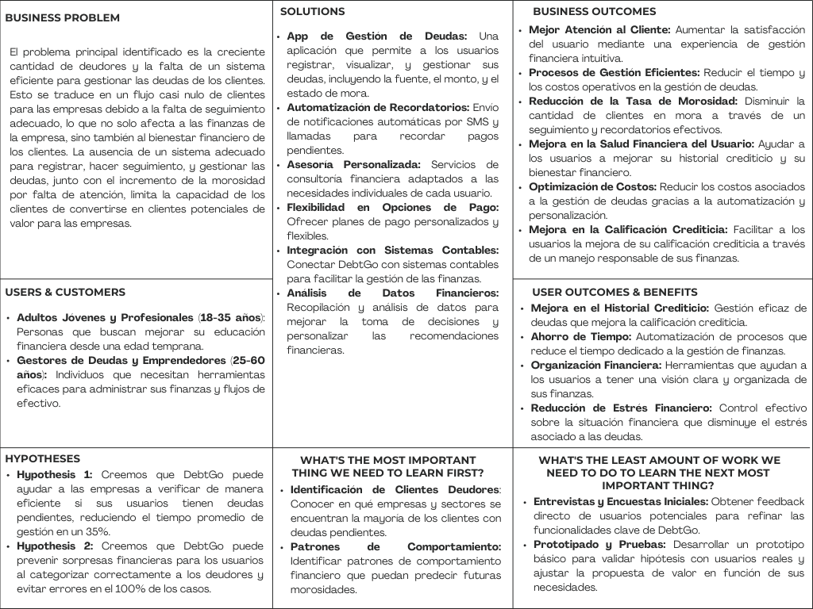

# 
COURSE PROJECT

    <strong>Universidad Peruana de Ciencias Aplicadas</strong> 
    </img> 
    <strong>Ingeniería de Software - 2024-2</strong> 
    <strong>Aplicaciones Web - WX53</strong> 
    <strong>Profesor: Alberto Wilmer Sanchez Seña</strong> 
     INFORME DE TRABAJO FINAL - TB1

    <strong>Startup: Apple Web</strong> 
    <strong>Producto: DebtGo</strong>

    <h3>Team Members:</h3>
    <table align="center">
        <tr>
            <th style="text-align:center;">Member</th>
            <th style="text-align:center;">Code</th>
        </tr>
        <tr>
            <td>Medina Chocce, Karito Dianeth</td>
            <td>U20221C769</td>
        </tr>
        <tr>
            <td>Sanchez Rios, Camila Cristina</td>
            <td>U202210973</td>
        </tr>
        <tr>
            <td>Durand Vera, Gianfranco Angel</td>
            <td>U20201F640</td>
        </tr>
        <tr>
            <td>Chávarri Zarzosa, Daniel Jhared </td>
            <td>U202211108</td>
        </tr>
         <tr>
            <td>Duran Santander, Emilia Mercedes </td>
            <td>U201914541</td>
         </tr>
    </table>

    <strong>Agosto, 2024</strong>

 

<h1 align="center">Registro de versiones del Informe</h1>
 
<table>
        <thead>
            <tr>
                <th>Versión</th>
                <th>Fecha</th>
                <th>Autor</th>
                <th>Descripción de modificaciones</th>
            </tr>
        </thead>
        <tbody>
            <tr>
                <th>TB1</th>
                <td>20/08/2024</td>
                <td>
                    <ul>
          <li>Karito Medina</li>
          <li>Camila Sanchez</li>
          <li>Gianfranco Durand</li>
          <li>Daniel Chávarri</li>
          <li>Emilia Duran</li>
                    <ul>
           </td>
      <td>            
             <ul>
          <li>Capítulo I: Introducción</li>
          <li>Capítulo II: Requirements Elicitation & Analysis</li>
          <li>Capítulo III: Requirements Specification</li>
          <li>Capítulo IV: Product Design</li>
          <li>Avance del Capítulo V: Product Implementation, Validation & Deployment hasta el punto 5.2.1.8</li>
          <li>Avance de Conclusiones, Bibliografía y Anexos</li>
        </ul>
      </td>
  </tr>
</tbody>
</table>

# Project Report Collaboration Insights
Link del repositorio del reporte del TB1: https://github.com/upc-pre-202402-si730-wx53-apple-web 

Para el presente informe, se llevaron a cabo reuniones y se distribuyeron los puntos a elaborar para la entrega actual, correspondientes a los Capítulos I hasta el Capítulo V: Sprint 1. Quedando de la siguiente manera:
- Imágen de las Contribuciones del equipo:

  

# Contenido
[Student Outcome](#student-outcome)

[Capítulo I: Introducción](#capitulo-i-introducción)
- [1.1. Startup Profile](#11-startup-profile)
  - [1.1.1. Descripción de la Startup](#111-descripción-de-la-startup)
  - [1.1.2. Perfiles de integrantes del equipo](#112-perfiles-de-integrantes-del-equipo)
- [1.2. Solution Profile](#12-solution-profile)
  - [1.2.1 Antecedentes y problemática](#121-antecedentes-y-problemática)
  - [1.2.2 Lean UX Process](#122-lean-ux-process)
    - [1.2.2.1. Lean UX Problem Statements](#1221-lean-ux-problem-statements)
    - [1.2.2.2. Lean UX Assumptions](#1222-lean-ux-assumptions)
    - [1.2.2.3. Lean UX Hypothesis Statements](#1223-lean-ux-hypothesis-statements)
    - [1.2.2.4. Lean UX Canvas](#1224-lean-ux-canvas)
- [1.3. Segmentos objetivo](#13-segmentos-objetivo)

[Capítulo II: Requirements Elicitation & Analysis](#capítulo-ii-requirements-elicitation--analysis)
- [2.1. Competidores](#21-competidores)
  - [2.1.1. Análisis competitivo](#211-análisis-competitivo)
  - [2.1.2. Estrategias y tácticas frente a competidores](#212-estrategias-y-tácticas-frente-a-competidores)
- [2.2. Entrevistas](#22-entrevistas)
  - [2.2.1. Diseño de entrevistas](#221-diseño-de-entrevistas)
  - [2.2.2. Registro de entrevistas](#222-registro-de-entrevistas)
  - [2.2.3. Análisis de entrevistas](#223-análisis-de-entrevistas)
- [2.3. Needfinding](#23-needfinding)
  - [2.3.1. User Personas](#231-user-personas)
  - [2.3.2. User Task Matrix](#232-user-task-matrix)
  - [2.3.3. User Journey Mapping](#233-user-journey-mapping)
  - [2.3.4. Empathy Mapping](#234-empathy-mapping)
  - [2.3.5. As-is Scenario Mapping](#235-as-is-scenario-mapping)
- [2.4. Ubiquitous Language](#24-ubiquitous-language)

[Capítulo III: Requirements Specification](#capítulo-iii-requirements-specification)
- [3.1. To-Be Scenario Mapping](#31-to-be-scenario-mapping)
- [3.2. User Stories](#32-user-stories)
- [3.3. Impact Mapping](#33-impact-mapping)
- [3.4. Product Backlog](#34-product-backlog)

[Capítulo IV: Product Design](#capítulo-iv-product-design)
- [4.1. Style Guidelines](#41-style-guidelines)
  - [4.1.1. General Style Guidelines](#411-general-style-guidelines)
  - [4.1.2. Web Style Guidelines](#412-web-style-guidelines)
- [4.2. Information Architecture](#42-information-architecture)
  - [4.2.1. Organization Systems](#421-organization-systems)
  - [4.2.2. Labeling Systems](#422-labeling-systems)
  - [4.2.3. SEO Tags and Meta Tag](#423-seo-tags-and-meta-tag)
  - [4.2.4. Searching Systems](#424-searching-systems)
  - [4.2.5. Navigation Systems](#425-navigation-systems)
- [4.3. Landing Page UI Design](#43-landing-page-ui-design)
  - [4.3.1. Landing Page Wireframe](#431-landing-page-wireframe)
  - [4.3.2. Landing Page Mock-up](#432-landing-page-mock-up)
- [4.4. Web Applications UX/UI Design](#44-web-applications-uxui-design)
  - [4.4.1. Web Applications Wireframes](#411-general-style-guidelines)
  - [4.4.2. Web Applications Wireflow Diagrams](#442-web-applications-wireflow-diagrams)
  - [4.4.3. Web Applications Mock-ups](#443-web-applications-mock-ups)
  - [4.4.4. Web Applications User Flow Diagrams](#444-web-applications-user-flow-diagrams)
- [4.5. Web Applications Prototyping](#45-web-applications-prototyping)
- [4.6. Domain-Driven Software Architecture](#46-domain-driven-software-architecture)
  - [4.6.1. Software Architecture Context Diagram](#461-software-architecture-context-diagram)
  - [4.6.2. Software Architecture Container Diagrams](#462-software-architecture-container-diagrams)
  - [4.6.3. Software Architecture Components Diagrams](#463-software-architecture-components-diagrams)
- [4.7. Software Object-Oriented Design](#47-software-object-oriented-design)
  - [4.7.1. Class Diagrams](#471-class-diagrams)
  - [4.7.2. Class Dictionary](#472-class-dictionary)
- [4.8. Database Design](#48-database-design)
  - [4.8.1. Database Diagram](#481-database-diagram)

[Capítulo V: Product Implementation, Validation & Deployment](#capítulo-v-product-implementation-validation--deployment)
- [5.1. Software Configuration Management](#51-software-configuration-management)
  - [5.1.1. Software Development Environment Configuration](#511-software-development-environment-configuration)
  - [5.1.2. Source Code Management](#512-source-code-management)
  - [5.1.3. Source Code Style Guide & Conventions](#513-source-code-style-guide--conventions)
  - [5.1.4. Software Deployment Configuration](#514-software-deployment-configuration)
- [5.2. Landing Page, Services & Applications Implementation](#52-landing-page-services--applications-implementation)
  - [5.2.X. Sprint ](#52x-sprint)
    - [5.2.X.1. Sprint Planning n](#52x1-sprint-planning-n)
    - [5.2.X.2. Sprint Backlog n](#52x2-sprint-backlog-n)
    - [5.2.X.3. Development Evidence for Sprint Review](#52x3-development-evidence-for-sprint-review)
    - [5.2.X.4. Testing Suite Evidence for Sprint Review](#52x4-testing-suite-evidence-for-sprint-review)
    - [5.2.X.5. Execution Evidence for Sprint Review](#52x5-execution-evidence-for-sprint-review)
    - [5.2.X.6. Services Documentation Evidence for Sprint Review](#52x6-services-documentation-evidence-for-sprint-review)
    - [5.2.X.7. Software Deployment Evidence for Sprint Review](#52x7-software-deployment-evidence-for-sprint-review)
    - [5.2.X.8. Team Collaboration Insights during Sprint](#52x8-team-collaboration-insights-during-sprint)
- [5.3. Validation Interviews](#53-validation-interviews)
  - [5.3.1. Diseño de Entrevistas](#531-diseño-de-entrevistas)
  - [5.3.2. Registro de Entrevistas](#532-registro-de-entrevistas)
  - [5.3.3. Evaluaciones según heurísticas](#533-evaluaciones-según-heurísticas)
- [5.4. Video About-the-Product](#54-video-about-the-product)

[Conclusiones](#conclusiones)
- [Conclusiones y recomendaciones](#conclusiones-y-recomendaciones)
- [Video About-the-Team](#video-about-the-team)

[Bibliografía](#bibliografía)

[Anexos](#anexos)

# Student Outcome

# Capítulo I: Introducción
## 1.1. Startup Profile
### 1.1.1. Descripción de la Startup

DebtGo es una aplicación que revoluciona la manera en que las personas manejan sus deudas y fortalecen su educación financiera. Esta startup impulsa la implementación de una aplicación intuitiva, brindando a los usuarios las herramientas necesarias para gestionar sus deudas de manera efectiva y mejorar su conocimiento financiero. La aplicación ofrece herramientas avanzadas para la gestión de deudas, seguimiento de ingresos y gastos, y la creación de presupuestos personalizados.

Hoy en día las obligaciones económicas desde muy temprana edad son una realidad y DebtGo es el mejor aliado para ayudar tanto a jóvenes como adultos a gestionar sus finanzas y economía para gozar de un bienestar financiero.

Nuestro modelo de negocio digital se centra principalmente en ofrecer servicios de consultoría financiera personalizada y talleres en línea, que los usuarios pueden adquirir por una tarifa adicional. Estos servicios permiten a los usuarios recibir asesoramiento adaptado a sus necesidades específicas y participar en sesiones educativas especializadas. Además, ofrecemos un servicio de suscripción, donde los usuarios pagan una tarifa mensual o anual para acceder a características premium, como análisis financieros detallados, planes de pago personalizados, y contenido educativo exclusivo. Este enfoque diversificado garantiza que DebtGo sea independiente y sostenible, proporcionando un flujo de ingresos continuo mientras se centra en la creación de valor para el usuario.

DebtGo no se basa en el comercio electrónico ni en la publicidad, sino que permite mantener una experiencia de usuario limpia y enfocada en el bienestar financiero. Además, el componente innovador del modelo radica en la personalización avanzada de los presupuestos y recomendaciones financieras adaptadas a las necesidades y hábitos de gasto de los usuarios, lo que distingue DebtGo de otras aplicaciones en el mercado.

A manera de escalabilidad, proponemos introducir a futuro el uso de inteligencia artificial para personalizar aún más las recomendaciones financieras y proveer retroalimentación a los usuarios en su progreso educativo.

### 1.1.2. Perfiles de integrantes del equipo
<table>
  <tr>
    <th>
      
    </th>
    <td valign="top">
      
<b>Durand Vera, Gianfranco Angel</b>

      

        Soy estudiante de la carrera de Ingeniería de Software en la Universidad Peruana de Ciencias Aplicadas, actualmente me encuentro en el sexto ciclo, escogí esta carrera porque me 
        gusta mucho la programación. Tengo experiencia en lenguajes de programación como C++, C#, Python, Kotlin y JavaScript.
      

    </td>
  </tr>
   <tr>
    <th>
      
    </th>
    <td valign="top">
      
<b>Sanchez Rios, Camila Cristina</b>

      

        Soy estudiante de la carrera de Ingeniería de Software en la Universidad Peruana de Ciencias Aplicadas, actualmente me encuentro en el cuarto ciclo. Me gusta escuchar música y 
        leer en los ratos libres y aprender más sobre la carrera.
      

    </td>
  </tr>
     <tr>
    <th>
      
    </th>
    <td valign="top">
      
<b>Medina Chocce, Karito Dianeth</b>

      

        Hola, soy Karito Medina, actualmente estudio Ingeniería de Software en la Universidad de Ciencias Aplicadas (UPC). Me considero una persona responsable, respetuosa y con una 
        fuerte habilidad para trabajar en equipo. Me esfuerzo por contribuir positivamente a cada proyecto en el que participo, buscando siempre mejorar los resultados grupales y 
        alcanzar los objetivos comunes. Estoy entusiasmada por aplicar mis conocimientos y habilidades para enfrentar nuevos desafíos y seguir creciendo en el campo de la tecnología.
      

    </td>
  </tr>
     <tr>
    <th>
      
    </th>
    <td valign="top">
      
<b>Chávarri Zarzosa, Daniel Jhared</b>

      

       Soy estudiante de la UPC, tengo 19 años. Estoy en la carrera de Ingeniería de Software, ya que, siempre me gustó la tecnología, los videojuegos, las páginas web, pero sobre todo 
       cómo crearlos. Estoy cursando el 5 ciclo de la carrera y mis habilidades son C++, Python, HTML y JavaScript. También soy bueno en ser responsable con cada curso y organizar mi 
       tiempo en ellos.
      

    </td>
  </tr>
</table>

## 1.2. Solution Profile
### 1.2.1 Antecedentes y problemática

Muchas personas enfrentan la falta de conocimiento y claridad en relación con las deudas que han adquirido, lo cual es un problema que afecta a una gran parte de la población. Esta situación no solo se debe a la falta de educación financiera, sino también a la complejidad con la que a menudo se presentan los términos y condiciones de los productos crediticios. Como resultado, muchas personas desconocen no solo las fuentes exactas de sus deudas, sino también los montos originales, los intereses acumulados, y las posibles penalidades por pagos tardíos o incumplimientos.

Esta falta de información clara y accesible puede llevar a situaciones en las que los individuos no recuerdan cuándo adquirieron una deuda específica, cómo se calcularon los intereses o qué entidad financiera está gestionando sus pagos. Además, la carencia de recordatorios efectivos o herramientas que faciliten la gestión de sus obligaciones financieras puede hacer que las personas pierdan de vista las fechas de vencimiento de los pagos, lo que a su vez incrementa el riesgo de caer en mora. Este desconocimiento no solo afecta su historial crediticio, sino que también puede generar estrés significativo, impactos negativos en su salud mental y dificultades en su vida cotidiana.

A medida que las deudas se acumulan y se vuelven más difíciles de manejar, muchas personas se encuentran atrapadas en un ciclo de endeudamiento, donde la falta de claridad y organización agrava su situación financiera. Esto puede llevar a tomar decisiones desesperadas, como adquirir nuevas deudas para pagar las existentes, lo que finalmente incrementa la carga financiera y perpetúa un círculo vicioso de deuda. Es fundamental abordar este problema mediante la educación financiera, la transparencia en la información proporcionada por las instituciones crediticias, y el desarrollo de herramientas que permitan a los usuarios gestionar y entender mejor sus deudas. Solo así se podrá reducir la incidencia de problemas financieros graves y mejorar la calidad de vida de las personas afectadas.

**5Ws y 2Hs:**

**Qué:** DebtGo es una aplicación innovadora que proporciona a los usuarios herramientas avanzadas para comprender, monitorear y gestionar sus deudas de manera intuitiva, mientras fortalecen su educación financiera. Ofrece funcionalidades como la creación de presupuestos personalizados, seguimiento de ingresos y gastos, y acceso a contenido educativo.

**Quién:** Está dirigida a dos segmentos principales: jóvenes adultos y profesionales (18-35 años) que buscan mejorar su educación financiera desde una edad temprana, y gestores de deudas y emprendedores (25-60 años) que necesitan soluciones efectivas para manejar sus deudas y mejorar su flujo de efectivo.

**Dónde:** La aplicación estará disponible globalmente a través de las tiendas virtuales de iOS y Android, permitiendo a los usuarios acceder a DebtGo desde cualquier lugar con conexión a Internet.

**Cuándo:** DebtGo estará disponible las 24 horas del día, brindando acceso continuo para que los usuarios puedan gestionar sus finanzas en cualquier momento que lo necesiten.

**Por qué:** DebtGo se enfoca en resolver la problemática de la falta de conocimiento financiero y la complejidad en la gestión de deudas. Muchas personas enfrentan estrés y dificultades financieras debido a la falta de claridad en sus obligaciones crediticias, lo que puede llevar a decisiones financieras deficientes y un ciclo de endeudamiento. La aplicación ofrece una solución integral para mejorar el bienestar financiero.

**Cómo:** Los usuarios podrán ingresar sus pagos pendientes en la sección de deudas, especificando detalles como cuotas, intereses, y plazos. DebtGo generará automáticamente planes de pago personalizados y estrategias para facilitar el cumplimiento de las deudas. Además, la aplicación cuenta con una interfaz amigable y secciones bien organizadas para una visión clara de las deudas, seguimiento de pagos, y contenido educativo. Notificaciones y recordatorios ayudarán a los usuarios a mantenerse al día con sus objetivos financieros.

**Cuánto:** DebtGo adoptará un modelo de monetización freemium, donde la aplicación básica será gratuita, permitiendo acceso a las funcionalidades esenciales. Los usuarios podrán suscribirse a un plan premium para desbloquear características avanzadas, como análisis financieros detallados y contenido educativo exclusivo. Además, se ofrecerán servicios adicionales de consultoría financiera personalizada y talleres en línea, disponibles por una tarifa adicional.

### 1.2.2 Lean UX Process
#### 1.2.2.1. Lean UX Problem Statements

Nuestra aplicación, DebtGo, está diseñada para ofrecer a los usuarios una herramienta poderosa que les permita gestionar sus deudas de manera efectiva, al mismo tiempo que fortalece su educación financiera. DebtGo se presenta como una oportunidad para que los usuarios mejoren su situación financiera, adoptando hábitos saludables que les permitan alcanzar sus objetivos económicos y evitar el ciclo de endeudamiento.

Sin embargo, hemos identificado ciertos factores que podrían ser desafíos significativos para la adopción de nuestra aplicación. Uno de los principales retos es la desconfianza que algunos usuarios pueden tener hacia una nueva empresa tecnológica. Esta desconfianza podría surgir del temor a que la aplicación no cumpla con sus expectativas o que no proporcione los resultados prometidos.

Ante estos desafíos, es crucial que abordemos las siguientes preguntas:

¿Cómo podemos construir confianza y credibilidad entre nuestros usuarios potenciales? Es fundamental demostrar que DebtGo es una herramienta confiable, segura y efectiva para la gestión de deudas. Estrategias como testimonios de usuarios, demostraciones de resultados tangibles, y certificaciones pueden ser claves para eliminar esta desconfianza.

¿Qué tan esencial es una aplicación de educación financiera en el contexto actual? Considerando el aumento del endeudamiento y la falta de educación financiera en diversos segmentos de la población, es primordial mostrar cómo DebtGo no solo facilita la gestión de deudas, sino que también empodera a los usuarios mediante el conocimiento, ayudándoles a tomar decisiones financieras informadas.

¿Cómo podemos motivar a las personas a reconocer el valor de nuestra aplicación? Es necesario comunicar claramente los beneficios y el impacto positivo que DebtGo puede tener en la vida financiera de los usuarios. El uso de casos de éxito, la oferta de pruebas gratuitas, y la integración de contenido educativo relevante pueden motivar a los usuarios a probar y adoptar la aplicación como una herramienta esencial en su vida diaria.

Al abordar estas preguntas de manera proactiva, buscamos no solo atraer a usuarios a DebtGo, sino también convertirnos en un aliado confiable en su camino hacia la estabilidad y el bienestar financiero.

#### 1.2.2.2. Lean UX Assumptions

1. Nuestros clientes una aplicación que no solo les ayude a gestionar sus deudas de manera efectiva, sino que también les ofrezca herramientas y recursos educativos para mejorar su 
   conocimiento financiero. DebtGo está diseñada para facilitar este proceso, permitiendo a los usuarios tomar el control de su situación financiera con mayor confianza y seguridad.

2. La aplicación busca empoderar a los jóvenes adultos con las habilidades necesarias para gestionar sus deudas y mejorar su educación financiera. La aplicación no solo les 
   proporcionará las herramientas para administrar sus finanzas, sino que también los educará sobre conceptos clave que les ayudarán a evitar futuras dificultades financieras.

3. Los usuarios iniciales de DebtGo serán personas mayores de 18 años que buscan una solución intuitiva y educativa para gestionar sus deudas. Este grupo incluye tanto a jóvenes adultos 
   que recién están comenzando a asumir responsabilidades financieras como a personas que desean mejorar su control sobre sus finanzas personales.

4. DebtGo planea generar ingresos a través de un modelo premium, donde los usuarios pueden acceder a funciones avanzadas mediante una suscripción. Esto nos permitirá monetizar a medida 
   que crece la base de usuarios y estos reconocen el valor adicional de las funciones premium.

5. Adquiriremos la mayoría de nuestros clientes a través de alianzas estratégicas con instituciones educativas, universidades, y organizaciones sin fines de lucro que promueven la 
   educación financiera. Ofreceremos seminarios y talleres gratuitos sobre gestión de deudas y finanzas personales, integrando el uso de DebtGo como una herramienta clave en estos 
   programas. Además, lanzaremos campañas de sensibilización en comunidades y foros en línea especializados en finanzas personales, donde podremos interactuar
   directamente con nuestro público objetivo, ofreciendo demostraciones y acceso a recursos exclusivos dentro de la aplicación.

6. Nuestra competencia incluye otras aplicaciones de gestión de deudas y educación financiera que ya están establecidas en el mercado. Sin embargo, DebtGo se diferencia por su enfoque 
   en la simplicidad, la personalización, y la educación financiera continua, que juntas ofrecen una experiencia única y valiosa para los usuarios.

7. Superaremos a nuestra competencia ofreciendo una aplicación que es altamente intuitiva y eficiente, diseñada para ser accesible incluso para aquellos sin conocimientos tecnológicos 
   avanzados. Además, la personalización de los planes de pago y la oferta de contenido educativo relevante nos posicionarán como la opción preferida entre los usuarios.

8. El mayor riesgo para DebtGo radica en la fuerte competencia en el mercado, lo que podría afectar nuestra rentabilidad. Con tantas opciones disponibles, los usuarios pueden optar por 
   aplicaciones más conocidas, lo que dificultará nuestra penetración y crecimiento en el mercado.

9. Para mitigar los riesgos, realizaremos un análisis exhaustivo de las fortalezas y debilidades de nuestra aplicación en comparación con las de la competencia. Utilizaremos esta 
   información para mejorar continuamente DebtGo, enfocándonos en optimizar la experiencia del usuario, ampliar la funcionalidad, y fortalecer nuestra propuesta de valor, asegurando así 
   la calidad y rentabilidad de la aplicación.

#### 1.2.2.3. Lean UX Hypothesis Statements

Creemos que al implementar más herramientas de notificaciones en la aplicación DebtGo, brindaremos a los usuarios alertas más eficaces sobre sus pagos pendientes. Éxito: Sabremos que hemos tenido éxito cuando el 80% de las llamadas registradas no presenten deudas pendientes.

Creemos que al añadir un mecanismo de categorización que permita a los usuarios seleccionar si son empresas o particulares, y que ajuste las funcionalidades de la aplicación según esa selección, mejoraremos la experiencia del usuario. Éxito: Sabremos que hemos tenido éxito cuando el 100% de los usuarios y empresas estén registrados formalmente en la plataforma.

Creemos que al ofrecer recompensas a los usuarios que paguen sus deudas de forma anticipada y sin retrasos, incentivaremos un comportamiento de pago puntual. Éxito: Sabremos que hemos tenido éxito cuando el porcentaje de deudas hacia la empresa disminuya en un 35%.

Creemos que al registrar de manera precisa a los usuarios que pagan y a los que no, reduciremos las llamadas innecesarias y optimizaremos el uso del tiempo. Éxito: Sabremos que hemos tenido éxito cuando el registro de usuarios de las empresas aumente en un 65%.

Creemos que la falta de actualizaciones o implementaciones de software tempranas en la aplicación afectará negativamente la gestión de deudas. Fracaso: Sabremos que hemos fracasado cuando las deudas de las empresas aumenten en un 25%.

Creemos que al no contar con un sistema de seguridad actualizado y moderno en nuestra aplicación, seremos vulnerables a ataques cibernéticos o intentos de hackeo. Fracaso: Sabremos que hemos fracasado cuando los ataques cibernéticos al sistema DebtGo aumenten en un 48%.

#### 1.2.2.4. Lean UX Canvas

 

 *Imagen (N°). Elaboración propia. Realizado en Canva*

## 1.3. Segmentos objetivo

<strong>1. Jóvenes Adultos y Profesionales en Formación Financiera:</strong>

Descripción: Este segmento incluye a jóvenes adultos en edad universitaria (18-25 años) y jóvenes profesionales (25-35 años) que buscan mejorar su educación financiera. Estas personas van a estar interesadas en adquirir conocimientos sobre cómo gestionar sus finanzas de manera efectiva, evitar la acumulación de deudas innecesarias y planificar para su futuro financiero.

Necesidades Satisfechas: DebtGo les ofrece herramientas educativas y recursos que les permiten aprender sobre finanzas personales, crear y seguir un presupuesto, y establecer metas financieras. La aplicación les ayuda a tomar decisiones informadas sobre sus gastos e inversiones, promoviendo hábitos financieros saludables desde una edad temprana.

<strong>2. Gestores de Deudas y Emprendedores</strong>
   
Descripción: Este segmento abarca a personas con deudas existentes (25-60 años), emprendedores o propietarios de pequeñas empresas, y aquellos que necesitan préstamos para iniciar o expandir sus negocios. Estos individuos enfrentan situaciones financieras urgentes y buscan soluciones rápidas y efectivas para gestionar sus deudas y mejorar su flujo de efectivo.

Necesidades Satisfechas: DebtGo les proporciona una plataforma centralizada para gestionar y consolidar sus deudas, crear planes de pago personalizados, y evitar el pago de intereses adicionales. Además, la aplicación ofrece herramientas para optimizar el flujo de efectivo y planificar el crecimiento financiero, asegurando que puedan superar sus urgencias financieras de manera efectiva.

# Capítulo II: Requirements Elicitation & Analysis
## 2.1. Competidores
### 2.1.1. Análisis competitivo
### 2.1.2. Estrategias y tácticas frente a competidores
## 2.2. Entrevistas
### 2.2.1. Diseño de entrevistas
### 2.2.2. Registro de entrevistas
### 2.2.3. Análisis de entrevistas
## 2.3. Needfinding
### 2.3.1. User Personas
### 2.3.2. User Task Matrix
### 2.3.3. User Journey Mapping
### 2.3.4. Empathy Mapping
### 2.3.5. As-is Scenario Mapping
## 2.4. Ubiquitous Language

# Capítulo III: Requirements Specification
## 3.1. To-Be Scenario Mapping
## 3.2. User Stories
## 3.3. Impact Mapping
## 3.4. Product Backlog

# Capítulo IV: Product Design
## 4.1. Style Guidelines
### 4.1.1. General Style Guidelines
### 4.1.2. Web Style Guidelines
## 4.2. Information Architecture
### 4.2.1. Organization Systems
### 4.2.2. Labeling Systems
### 4.2.3. SEO Tags and Meta Tag
### 4.2.4. Searching Systems
### 4.2.5. Navigation Systems
## 4.3. Landing Page UI Design
### 4.3.1. Landing Page Wireframe
### 4.3.2. Landing Page Mock-up
## 4.4. Web Applications UX/UI Design
### 4.4.1. Web Applications Wireframes
### 4.4.2. Web Applications Wireflow Diagrams
### 4.4.3. Web Applications Mock-ups
### 4.4.4. Web Applications User Flow Diagrams
## 4.5. Web Applications Prototyping
## 4.6. Domain-Driven Software Architecture
### 4.6.1. Software Architecture Context Diagram
### 4.6.2. Software Architecture Container Diagrams
### 4.6.3. Software Architecture Components Diagrams
## 4.7. Software Object-Oriented Design
### 4.7.1. Class Diagrams
### 4.7.2. Class Dictionary
## 4.8. Database Design
## 4.8.1. Database Diagram

# Capítulo V: Product Implementation, Validation & Deployment
## 5.1. Software Configuration Management
### 5.1.1. Software Development Environment Configuration
### 5.1.2. Source Code Management
### 5.1.3. Source Code Style Guide & Conventions
### 5.1.4. Software Deployment Configuration
## 5.2. Landing Page, Services & Applications Implementation
### 5.2.X. Sprint 
#### 5.2.X.1. Sprint Planning n
#### 5.2.X.2. Sprint Backlog n
#### 5.2.X.3. Development Evidence for Sprint Review
#### 5.2.X.4. Testing Suite Evidence for Sprint Review
#### 5.2.X.5. Execution Evidence for Sprint Review
#### 5.2.X.6. Services Documentation Evidence for Sprint Review
#### 5.2.X.7. Software Deployment Evidence for Sprint Review
#### 5.2.X.8. Team Collaboration Insights during Sprint
## 5.3. Validation Interviews
### 5.3.1. Diseño de Entrevistas
### 5.3.2. Registro de Entrevistas
### 5.3.3. Evaluaciones según heurísticas
# 5.4. Video About-the-Product

# Conclusiones
## Conclusiones y recomendaciones
## Video About-the-Team.

# Bibliografía

# Anexos
