<hr>

# <center>COURSE PROJECT</center>

<p align="center">
    <strong>Universidad Peruana de Ciencias Aplicadas</strong><br>
    </img><br>
    <strong>Ingeniería de Software - 2024-2</strong><br>
    <strong>Aplicaciones Web - WX53</strong><br>
    <strong>Profesor: Alberto Wilmer Sanchez Seña</strong><br>
    <br>INFORME DE TRABAJO FINAL - TB1
</p>

</p>

<p align="center">
    <strong>Startup: Apple Web</strong><br>
    <strong>Producto: DebtGo</strong>
</p>

<div style="text-align:center;">
    <h3>Team Members:</h3>
    <table align="center">
        <tr>
            <th style="text-align:center;">Member</th>
            <th style="text-align:center;">Code</th>
        </tr>
        <tr>
            <td>Medina Chocce, Karito Dianeth</td>
            <td>U20221C769</td>
        </tr>
        <tr>
            <td>Sanchez Rios, Camila Cristina</td>
            <td>U202210973</td>
        </tr>
        <tr>
            <td>Durand Vera, Gianfranco Angel</td>
            <td>U20201F640</td>
        </tr>
        <tr>
            <td>Chávarri Zarzosa, Daniel Jhared </td>
            <td>U202211108</td>
        </tr>
         <tr>
            <td>Duran Santander, Emilia Mercedes </td>
            <td>U201914541</td>
         </tr>
    </table>
</div>

<p align="center">
    <strong>Agosto, 2024</strong>
</p>
<br>

<h1 align="center">Registro de versiones del Informe</h1>
</br>
<table>
        <thead>
            <tr>
                <th>Versión</th>
                <th>Fecha</th>
                <th>Autor</th>
                <th>Descripción de modificaciones</th>
            </tr>
        </thead>
        <tbody>
            <tr>
                <th>TB1</th>
                <td>20/08/2024</td>
                <td>
                    <ul>
          <li>Karito Medina</li>
          <li>Camila Sanchez</li>
          <li>Gianfranco Durand</li>
          <li>Daniel Chávarri</li>
          <li>Emilia Duran</li>
                    <ul>
           </td>
      <td>            
             <ul>
          <li>Capítulo I: Introducción</li>
          <li>Capítulo II: Requirements Elicitation & Analysis</li>
          <li>Capítulo III: Requirements Specification</li>
          <li>Capítulo IV: Product Design</li>
          <li>Avance del Capítulo V: Product Implementation, Validation & Deployment hasta el punto 5.2.1.8</li>
          <li>Avance de Conclusiones, Bibliografía y Anexos</li>
        </ul>
      </td>
  </tr>
</tbody>
</table>

# Project Report Collaboration Insights

# Contenido
[Student Outcome](#student-outcome)

[Capítulo I: Introducción](#capitulo-i-introducción)
- [1.1. Startup Profile](#11-startup-profile)
  - [1.1.1. Descripción de la Startup](#111-descripción-de-la-startup)
  - [1.1.2. Perfiles de integrantes del equipo](#112-perfiles-de-integrantes-del-equipo)
- [1.2. Solution Profile](#12-solution-profile)
  - [1.2.1 Antecedentes y problemática](#121-antecedentes-y-problemática)
  - [1.2.2 Lean UX Process](#122-lean-ux-process)
    - [1.2.2.1. Lean UX Problem Statements](#1221-lean-ux-problem-statements)
    - [1.2.2.2. Lean UX Assumptions](#1222-lean-ux-assumptions)
    - [1.2.2.3. Lean UX Hypothesis Statements](#1223-lean-ux-hypothesis-statements)
    - [1.2.2.4. Lean UX Canvas](#1224-lean-ux-canvas)
- [1.3. Segmentos objetivo](#13-segmentos-objetivo)

[Capítulo II: Requirements Elicitation & Analysis](#capítulo-ii-requirements-elicitation--analysis)
- [2.1. Competidores](#21-competidores)
  - [2.1.1. Análisis competitivo](#211-análisis-competitivo)
  - [2.1.2. Estrategias y tácticas frente a competidores](#212-estrategias-y-tácticas-frente-a-competidores)
- [2.2. Entrevistas](#22-entrevistas)
  - [2.2.1. Diseño de entrevistas](#221-diseño-de-entrevistas)
  - [2.2.2. Registro de entrevistas](#222-registro-de-entrevistas)
  - [2.2.3. Análisis de entrevistas](#223-análisis-de-entrevistas)
- [2.3. Needfinding](#23-needfinding)
  - [2.3.1. User Personas](#231-user-personas)
  - [2.3.2. User Task Matrix](#232-user-task-matrix)
  - [2.3.3. User Journey Mapping](#233-user-journey-mapping)
  - [2.3.4. Empathy Mapping](#234-empathy-mapping)
  - [2.3.5. As-is Scenario Mapping](#235-as-is-scenario-mapping)
- [2.4. Ubiquitous Language](#24-ubiquitous-language)

[Capítulo III: Requirements Specification](#capítulo-iii-requirements-specification)
- [3.1. To-Be Scenario Mapping](#31-to-be-scenario-mapping)
- [3.2. User Stories](#32-user-stories)
- [3.3. Impact Mapping](#33-impact-mapping)
- [3.4. Product Backlog](#34-product-backlog)

[Capítulo IV: Product Design](#capítulo-iv-product-design)
- [4.1. Style Guidelines](#41-style-guidelines)
  - [4.1.1. General Style Guidelines](#411-general-style-guidelines)
  - [4.1.2. Web Style Guidelines](#412-web-style-guidelines)
- [4.2. Information Architecture](#42-information-architecture)
  - [4.2.1. Organization Systems](#421-organization-systems)
  - [4.2.2. Labeling Systems](#422-labeling-systems)
  - [4.2.3. SEO Tags and Meta Tag](#423-seo-tags-and-meta-tag)
  - [4.2.4. Searching Systems](#424-searching-systems)
  - [4.2.5. Navigation Systems](#425-navigation-systems)
- [4.3. Landing Page UI Design](#43-landing-page-ui-design)
  - [4.3.1. Landing Page Wireframe](#431-landing-page-wireframe)
  - [4.3.2. Landing Page Mock-up](#432-landing-page-mock-up)
- [4.4. Web Applications UX/UI Design](#44-web-applications-uxui-design)
  - [4.4.1. Web Applications Wireframes](#411-general-style-guidelines)
  - [4.4.2. Web Applications Wireflow Diagrams](#442-web-applications-wireflow-diagrams)
  - [4.4.3. Web Applications Mock-ups](#443-web-applications-mock-ups)
  - [4.4.4. Web Applications User Flow Diagrams](#444-web-applications-user-flow-diagrams)
- [4.5. Web Applications Prototyping](#45-web-applications-prototyping)
- [4.6. Domain-Driven Software Architecture](#46-domain-driven-software-architecture)
  - [4.6.1. Software Architecture Context Diagram](#461-software-architecture-context-diagram)
  - [4.6.2. Software Architecture Container Diagrams](#462-software-architecture-container-diagrams)
  - [4.6.3. Software Architecture Components Diagrams](#463-software-architecture-components-diagrams)
- [4.7. Software Object-Oriented Design](#47-software-object-oriented-design)
  - [4.7.1. Class Diagrams](#471-class-diagrams)
  - [4.7.2. Class Dictionary](#472-class-dictionary)
- [4.8. Database Design](#48-database-design)
  - [4.8.1. Database Diagram](#481-database-diagram)

[Capítulo V: Product Implementation, Validation & Deployment](#capítulo-v-product-implementation-validation--deployment)
- [COURSE PROJECT](#course-project)
- [Project Report Collaboration Insights](#project-report-collaboration-insights)
- [Contenido](#contenido)
- [Student Outcome](#student-outcome)
- [Capítulo I: Introducción](#capítulo-i-introducción)
  - [1.1. Startup Profile](#11-startup-profile)
    - [1.1.1. Descripción de la Startup](#111-descripción-de-la-startup)
    - [1.1.2. Perfiles de integrantes del equipo](#112-perfiles-de-integrantes-del-equipo)
  - [1.2. Solution Profile](#12-solution-profile)
    - [1.2.1 Antecedentes y problemática](#121-antecedentes-y-problemática)
    - [1.2.2 Lean UX Process](#122-lean-ux-process)
      - [1.2.2.1. Lean UX Problem Statements](#1221-lean-ux-problem-statements)
      - [1.2.2.2. Lean UX Assumptions](#1222-lean-ux-assumptions)
      - [1.2.2.3. Lean UX Hypothesis Statements](#1223-lean-ux-hypothesis-statements)
      - [1.2.2.4. Lean UX Canvas](#1224-lean-ux-canvas)
  - [1.3. Segmentos objetivo](#13-segmentos-objetivo)
- [Capítulo II: Requirements Elicitation \& Analysis](#capítulo-ii-requirements-elicitation--analysis)
  - [2.1. Competidores](#21-competidores)
    - [2.1.1. Análisis competitivo](#211-análisis-competitivo)
    - [2.1.2. Estrategias y tácticas frente a competidores](#212-estrategias-y-tácticas-frente-a-competidores)
  - [2.2. Entrevistas](#22-entrevistas)
    - [2.2.1. Diseño de entrevistas](#221-diseño-de-entrevistas)
    - [2.2.2. Registro de entrevistas](#222-registro-de-entrevistas)
    - [2.2.3. Análisis de entrevistas](#223-análisis-de-entrevistas)
  - [2.3. Needfinding](#23-needfinding)
    - [2.3.1. User Personas](#231-user-personas)
    - [2.3.2. User Task Matrix](#232-user-task-matrix)
    - [2.3.3. User Journey Mapping](#233-user-journey-mapping)
    - [2.3.4. Empathy Mapping](#234-empathy-mapping)
    - [2.3.5. As-is Scenario Mapping](#235-as-is-scenario-mapping)
  - [2.4. Ubiquitous Language](#24-ubiquitous-language)
- [Capítulo III: Requirements Specification](#capítulo-iii-requirements-specification)
  - [3.1. To-Be Scenario Mapping](#31-to-be-scenario-mapping)
  - [3.2. User Stories](#32-user-stories)
  - [3.3. Impact Mapping](#33-impact-mapping)
  - [3.4. Product Backlog](#34-product-backlog)
- [Capítulo IV: Product Design](#capítulo-iv-product-design)
  - [4.1. Style Guidelines](#41-style-guidelines)
    - [4.1.1. General Style Guidelines](#411-general-style-guidelines)
    - [4.1.2. Web Style Guidelines](#412-web-style-guidelines)
  - [4.2. Information Architecture](#42-information-architecture)
    - [4.2.1. Organization Systems](#421-organization-systems)
    - [4.2.2. Labeling Systems](#422-labeling-systems)
    - [4.2.3. SEO Tags and Meta Tag](#423-seo-tags-and-meta-tag)
    - [4.2.4. Searching Systems](#424-searching-systems)
    - [4.2.5. Navigation Systems](#425-navigation-systems)
  - [4.3. Landing Page UI Design](#43-landing-page-ui-design)
    - [4.3.1. Landing Page Wireframe](#431-landing-page-wireframe)
    - [4.3.2. Landing Page Mock-up](#432-landing-page-mock-up)
  - [4.4. Web Applications UX/UI Design](#44-web-applications-uxui-design)
    - [4.4.1. Web Applications Wireframes](#441-web-applications-wireframes)
    - [4.4.2. Web Applications Wireflow Diagrams](#442-web-applications-wireflow-diagrams)
    - [4.4.3. Web Applications Mock-ups](#443-web-applications-mock-ups)
    - [4.4.4. Web Applications User Flow Diagrams](#444-web-applications-user-flow-diagrams)
  - [4.5. Web Applications Prototyping](#45-web-applications-prototyping)
  - [4.6. Domain-Driven Software Architecture](#46-domain-driven-software-architecture)
    - [4.6.1. Software Architecture Context Diagram](#461-software-architecture-context-diagram)
    - [4.6.2. Software Architecture Container Diagrams](#462-software-architecture-container-diagrams)
    - [4.6.3. Software Architecture Components Diagrams](#463-software-architecture-components-diagrams)
  - [4.7. Software Object-Oriented Design](#47-software-object-oriented-design)
    - [4.7.1. Class Diagrams](#471-class-diagrams)
    - [4.7.2. Class Dictionary](#472-class-dictionary)
  - [4.8. Database Design](#48-database-design)
  - [4.8.1. Database Diagram](#481-database-diagram)
- [Capítulo V: Product Implementation, Validation \& Deployment](#capítulo-v-product-implementation-validation--deployment)
  - [5.1. Software Configuration Management](#51-software-configuration-management)
    - [5.1.1. Software Development Environment Configuration](#511-software-development-environment-configuration)
    - [5.1.2. Source Code Management](#512-source-code-management)
    - [5.1.3. Source Code Style Guide \& Conventions](#513-source-code-style-guide--conventions)
    - [5.1.4. Software Deployment Configuration](#514-software-deployment-configuration)
  - [5.2. Landing Page, Services \& Applications Implementation](#52-landing-page-services--applications-implementation)
    - [5.2.1. Sprint 1](#521-sprint-1)
      - [5.2.1.1. Sprint Planning 1](#5211-sprint-planning-1)
      - [5.2.1.2. Sprint Backlog 1](#5212-sprint-backlog-1)
      - [5.2.1.3. Development Evidence for Sprint Review](#5213-development-evidence-for-sprint-review)
      - [5.2.1.4. Testing Suite Evidence for Sprint Review](#5214-testing-suite-evidence-for-sprint-review)
      - [5.2.1.5. Execution Evidence for Sprint Review](#5215-execution-evidence-for-sprint-review)
      - [5.2.1.6. Services Documentation Evidence for Sprint Review](#5216-services-documentation-evidence-for-sprint-review)
      - [5.2.1.7. Software Deployment Evidence for Sprint Review](#5217-software-deployment-evidence-for-sprint-review)
      - [5.2.1.8. Team Collaboration Insights during Sprint](#5218-team-collaboration-insights-during-sprint)
    - [5.2.2. Sprint 2](#522-sprint-2)
      - [5.2.2.1. Sprint Planning 2](#5221-sprint-planning-2)
      - [5.2.2.2. Sprint Backlog 2](#5222-sprint-backlog-2)
      - [5.2.2.3. Development Evidence for Sprint Review](#5223-development-evidence-for-sprint-review)
      - [5.2.2.4. Testing Suite Evidence for Sprint Review](#5224-testing-suite-evidence-for-sprint-review)
      - [5.2.2.5. Execution Evidence for Sprint Review](#5225-execution-evidence-for-sprint-review)
      - [5.2.2.6. Services Documentation Evidence for Sprint Review](#5226-services-documentation-evidence-for-sprint-review)
      - [5.2.2.7. Software Deployment Evidence for Sprint Review](#5227-software-deployment-evidence-for-sprint-review)
      - [5.2.2.8. Team Collaboration Insights during Sprint](#5228-team-collaboration-insights-during-sprint)
    - [5.2.3. Sprint 3](#523-sprint-3)
      - [5.2.3.1. Sprint Planning 3](#5231-sprint-planning-3)
      - [5.2.3.2. Sprint Backlog 3](#5232-sprint-backlog-3)
      - [5.2.3.3. Development Evidence for Sprint Review](#5233-development-evidence-for-sprint-review)
      - [5.2.3.4. Testing Suite Evidence for Sprint Review](#5234-testing-suite-evidence-for-sprint-review)
      - [5.2.3.5. Execution Evidence for Sprint Review](#5235-execution-evidence-for-sprint-review)
      - [5.2.3.6. Services Documentation Evidence for Sprint Review](#5236-services-documentation-evidence-for-sprint-review)
      - [5.2.3.7. Software Deployment Evidence for Sprint Review](#5237-software-deployment-evidence-for-sprint-review)
      - [5.2.3.8. Team Collaboration Insights during Sprint](#5238-team-collaboration-insights-during-sprint)
    - [5.2.4. Sprint 4](#524-sprint-4)
      - [5.2.4.1. Sprint Planning 4](#5241-sprint-planning-4)
      - [5.2.4.2. Sprint Backlog 4](#5242-sprint-backlog-4)
      - [5.2.4.3. Development Evidence for Sprint Review](#5243-development-evidence-for-sprint-review)
      - [5.2.4.4. Testing Suite Evidence for Sprint Review](#5244-testing-suite-evidence-for-sprint-review)
      - [5.2.4.5. Execution Evidence for Sprint Review](#5245-execution-evidence-for-sprint-review)
      - [5.2.4.6. Services Documentation Evidence for Sprint Review](#5246-services-documentation-evidence-for-sprint-review)
      - [5.2.4.7. Software Deployment Evidence for Sprint Review](#5247-software-deployment-evidence-for-sprint-review)
      - [5.2.4.8. Team Collaboration Insights during Sprint](#5248-team-collaboration-insights-during-sprint)
  - [5.3. Validation Interviews](#53-validation-interviews)
    - [5.3.1. Diseño de Entrevistas](#531-diseño-de-entrevistas)
    - [Segmento Objetivo 1: Consultores Financieros](#segmento-objetivo-1-consultores-financieros)
    - [Segmento Objetivo 2: Emprendedores](#segmento-objetivo-2-emprendedores)
    - [5.3.2. Registro de Entrevistas](#532-registro-de-entrevistas)
  - [**Segmento Objetivo 1: Consultores Financieros**](#segmento-objetivo-1-consultores-financieros-1)
  - [**Segmento Objetivo 2: Emprendedores**](#segmento-objetivo-2-emprendedores-1)
    - [5.3.3. Evaluación según heurísticas](#533-evaluación-según-heurísticas)
  - [Incorporar un botón para grabar mensajes de voz en lugar de solo escribirlos, lo que agilizaría la interacción y haría el sistema más accesible.](#incorporar-un-botón-para-grabar-mensajes-de-voz-en-lugar-de-solo-escribirlos-lo-que-agilizaría-la-interacción-y-haría-el-sistema-más-accesible)
  - [5.4. Video About-The-Product](#54-video-about-the-product)
- [Conclusiones](#conclusiones)
  - [Conclusiones y recomendaciones](#conclusiones-y-recomendaciones)
  - [Video About-the-Team](#video-about-the-team)
- [Bibliografía](#bibliografía)
- [Anexos](#anexos)

[Conclusiones](#conclusiones)
- [Conclusiones y recomendaciones](#conclusiones-y-recomendaciones)
- [Video About-the-Team](#video-about-the-team)

[Bibliografía](#bibliografía)

[Anexos](#anexos)

# Student Outcome


# Capítulo I: Introducción
## 1.1. Startup Profile
### 1.1.1. Descripción de la Startup
### 1.1.2. Perfiles de integrantes del equipo
## 1.2. Solution Profile
### 1.2.1 Antecedentes y problemática
### 1.2.2 Lean UX Process
#### 1.2.2.1. Lean UX Problem Statements
#### 1.2.2.2. Lean UX Assumptions
#### 1.2.2.3. Lean UX Hypothesis Statements
#### 1.2.2.4. Lean UX Canvas
## 1.3. Segmentos objetivo

# Capítulo II: Requirements Elicitation & Analysis
## 2.1. Competidores
### 2.1.1. Análisis competitivo
### 2.1.2. Estrategias y tácticas frente a competidores
## 2.2. Entrevistas
### 2.2.1. Diseño de entrevistas
### 2.2.2. Registro de entrevistas
### 2.2.3. Análisis de entrevistas
## 2.3. Needfinding
### 2.3.1. User Personas
### 2.3.2. User Task Matrix
### 2.3.3. User Journey Mapping
### 2.3.4. Empathy Mapping
### 2.3.5. As-is Scenario Mapping
## 2.4. Ubiquitous Language

# Capítulo III: Requirements Specification
## 3.1. To-Be Scenario Mapping
## 3.2. User Stories
## 3.3. Impact Mapping
## 3.4. Product Backlog

# Capítulo IV: Product Design
## 4.1. Style Guidelines
### 4.1.1. General Style Guidelines
### 4.1.2. Web Style Guidelines
## 4.2. Information Architecture
### 4.2.1. Organization Systems
### 4.2.2. Labeling Systems
### 4.2.3. SEO Tags and Meta Tag
### 4.2.4. Searching Systems
### 4.2.5. Navigation Systems
## 4.3. Landing Page UI Design
### 4.3.1. Landing Page Wireframe
### 4.3.2. Landing Page Mock-up
## 4.4. Web Applications UX/UI Design
### 4.4.1. Web Applications Wireframes
### 4.4.2. Web Applications Wireflow Diagrams
### 4.4.3. Web Applications Mock-ups
### 4.4.4. Web Applications User Flow Diagrams
## 4.5. Web Applications Prototyping
## 4.6. Domain-Driven Software Architecture
### 4.6.1. Software Architecture Context Diagram
### 4.6.2. Software Architecture Container Diagrams
### 4.6.3. Software Architecture Components Diagrams
## 4.7. Software Object-Oriented Design
### 4.7.1. Class Diagrams
### 4.7.2. Class Dictionary
## 4.8. Database Design
## 4.8.1. Database Diagram

# Capítulo V: Product Implementation, Validation & Deployment
## 5.1. Software Configuration Management
### 5.1.1. Software Development Environment Configuration
En la siguiente sección se describe la ruta de referencia de cada uno de los productos de software para
que cualquier miembro del equipo pueda desarrollar cada punto del trabajo.

- **UXPressia:** Plataforma colaborativa que nos permitirá crear user personas e integrados con los
múltiples mapas para evaluar sus prioridades.
- **Figma:** Herramienta colaborativa que nos permitirá desarrollar wireframes y mockups.
- **Vertabelo:** Plataforma colaborativa que nos permitirá crear nuestro diagrama de base de datos.
- **LucidChart:** Aplicación web destinada a la elaboración de Wireflows, Users Flows y diagramas
de clases.
- **WebStorm:** IDE que utilizaremos para trabajar con javascript y desarrollar la landing page y web
application.

### 5.1.2. Source Code Management
El proyecto seguirá las convenciones de flujo de trabajo establecidas por el modelo GitFlow para el control de versiones, utilizando GitHub como plataforma y sistema de control de versiones. A continuación, se detallará cómo se implementará GitFlow como Workflow de control de versiones, además de proporcionar los URL de los repositorios de GitHub para cada producto: Landing Page, Web Services y Frontend Web Applications.

-  [**Repositorio Landing Page:**](https://github.com/upc-pre-202402-si730-wx53-apple-web/Landing-Page)  https://github.com/upc-pre-202402-si730-wx53-apple-web/Landing-Page
-  [**Repositorio Web Services:**](https://github.com/upc-pre-202402-si730-wx53-apple-web/Web-Services) https://github.com/upc-pre-202402-si730-wx53-apple-web/Web-Services
-  [**Repositorio Frontend Web Applications:**](https://github.com/upc-pre-202402-si730-wx53-apple-web/Frontend-Web-Applications) https://github.com/upc-pre-202402-si730-wx53-apple-web/Frontend-Web-Applications

**GitFlow**

Estructura de branches (Ramas):

**1. Master branch (Rama principal):** Esta rama será considerada como la principal para la aplicación, y contendrá versiones
estables y finales del desarrollo. Solo se permitirán cambios que hayan sido previamente probados y verificados en otras
ramas de prueba.

**2. Develop branch (Rama de desarrollo):** El propósito de esta rama es llevar a cabo los avances del proyecto en equipo y
de mantener los archivos centrales del desarrollo continuo.

**3. Feature branches (Ramas de funcionalidad):** Cada funcionalidad desarrollada por el equipo o separada del enfoque
actual del desarrollo tendrá su propia rama. Una vez que una funcionalidad esté completamente trabajada, se fusionará
con la rama de desarrollo del proyecto. Las convenciones para nombrar las ramas de funcionalidad seguirán un patrón
descriptivo y único, por ejemplo, "feature/nombre-de-la-funcionalidad".

**4. Release branches (Ramas de lanzamiento):** Estas ramas se utilizarán para mantener una instancia de la rama develop
que esté próxima a ser incluida en la rama principal. Se seguirá el sistema de versionamiento semántico (Semantic
Versioning) para nombrar las Releases.

**5. Hotfix branches (Ramas de corrección):** Se crearán para abordar de manera puntual y eficiente la corrección de errores
identificados en la rama principal que afecten significativamente la experiencia de los usuarios.

**Versionamiento Semántico:** Para nombrar las Releases, se aplicará el sistema de versionamiento semántico (Semantic
Versioning 2.0.0).

**Convenciones de Commits:** Para los mensajes de los commits realizados, se utilizará la especificación Conventional Commits
basada en Angular Commit Guidelines. La estructura a seguir será la siguiente:


```bash
git commit -m "<type>[optional scope]:<title>" -m"<description>"
```

### 5.1.3. Source Code Style Guide & Conventions

**HTML:** Algunas de las prácticas que deben de seguirse para alcanzar un código coherente, sostenible y ordenado son las
siguientes:
1. Cerrar todos los elementos HTML. Por ejemplo:
``` html
<p>Esto es un párrafo.</p>
```

2. A pesar de que HTML permite combinar mayúsculas y minúsculas en los nombrs de los elementos y atributos, se limitará
al uso de minúsculas para mantener el orden y garantizar la legibilidad.

3. Utilizar comillas en caso de que los atributos contengan espacios entre sí.

4. Procurar especificar el texto alt y las dimensiones width y height de las imágenes, ya que de esta manera se facilitará la
disponibilidad del contenido. Por ejemplo:
``` html
 
```

**CSS:** Entre las prácticas empleadas se mencionan:

1. Los nombres de las clases deben de ser breves y autodescriptivos.

2. Separar los nombres de las clases y ID con un guión. Por ejemplo:
```css
#video-id .hero-shadow
```

3. Evitar especificar la unidad de medida luego de usar el valor 0.

4. Separar las declaraciones y selectores en nuevas líneas para agilizar la legibilidad.

**Gherkin:** Es un lenguaje de dominio específico, el cual busca solucionar un problema concreto, la comunicación entre los
negocios y la parte técnica al trabajar con Behavior Driven Development, abreviado por sus siglas en ingles como BBD. En busca
de una buena práctica, se ocuparon los saltos de línea para mejorar el orden de los diversos tipos de escenarios y diferenciarlos
de forma más óptima. Adicionalmente, se utilizaron las palabras clave "Given", "When", "Then" y "And" para estructurar los
escenarios.

### 5.1.4. Software Deployment Configuration

**Landing Page**

Para poder desplegar la Landing Page resulta necesario contar con una serie de requisitos, entre ellos, es necesario contar con
una cuenta personal, una organización y un repositorio al cual cargar los documentos. A partir de lo anterior, es posible
comenzar el despliegue de la landing page. A continuación se enuncian los pasos a seguir:

1. Crear un repositorio para alojar el Landing Page.

2. Asegurarse de que los archivos sigan las nomenclaturas "index.html", para el contenido de la landing page; "style.css" para los estilos. Se tendra una carpeta "assets" y dentro estaran las carpetas "styles" y "img".

3. Cargar los archivos al repositorio mediante un commit.

4. Dirigirse a Settings > Pages y seleccionar la branch correspondiente dentro de la cual se encuentra el proyecto,
generalmente se trata de "main" o "master".

5. Esperar a que GitHub realice las comprobaciones necesarias. Una vez culminado el proceso, se obtendrá un enlace que
llevará al Landing Page desplegado.

## 5.2. Landing Page, Services & Applications Implementation
### 5.2.1. Sprint 1
Para este Sprint nos enfocaremos en los task para la elaboración de la landing page. Nos dividiremos entre nosotros cada una de las tareas identificadas para el sprint.
#### 5.2.1.1. Sprint Planning 1
| Sprint # | Sprint 1 |
| -------- | -------- |
|**Sprint Planning Background**|
| Date | 2024-08-29|
| Time | 07:00 PM |
| Location | Discord Virtual Meeting |
| Prepared By | Camila Sanchez, Gianfranco Durand |
|Attendees (to planning meeting) | Camila Sanchez, Gianfranco Durand, Daniel Chávarri , Karito Medina, Emilia Duran
| Sprint n – 1 Review Summary | No hubo sprint anterior |
| Sprint n – 1 Retrospective Summary | No hubo sprint anterior |
| **Sprint Goal & User Stories** | 
| Sprint 1 Goal | Realizar la Landing Page |
| Sprint 1 Velocity | 20 |
| Sum of Story Points | 20 | 

#### 5.2.1.2. Sprint Backlog 1
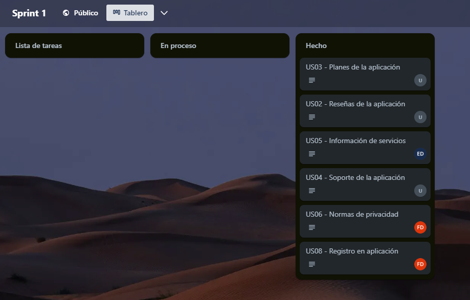

[Link Trello:](https://trello.com/b/cVhofK92/sprint-1) https://trello.com/b/cVhofK92/sprint-1

<table>
    <thead>
        <tr>
        <th>Sprint #</th>
        <th colspan="7">Sprint 1</th>
        </tr>
    </thead>
    <tbody>
        <tr>
            <td colspan="2">User Story</td>
            <td colspan="6">Work-Item / Task</td>
        </tr>
        <tr>
            <td>Id</td>
            <td>Title</td>
            <td>Id</td>
            <td>Title</td>
            <td>Description</td>
            <td>Estimation (Hours)</td>
            <td>Assigned To</td>
            <td>Status (To-do/In-Process/To-Review/Done)</td>
        </tr>
        <tr>
            <td>US03</td>
            <td>Planes de la aplicación</td>
            <td>UT01</td>
            <td>Mostrar planes</td>
            <td>Mostrar los planes de suscripción y sus descripciones</td>
            <td>4</td>
            <td>Karito Medina</td>
            <td>Done</td>
        </tr>
        <tr>
            <td>US02</td>
            <td>Reseñas de la aplicación</td>
            <td>UT02</td>
            <td>Mostrar reseñas</td>
            <td>Mostrar reseñas verificadas por segmento </td>
            <td>4</td>
            <td>Camila Sanchez</td>
            <td>Done</td>
        </tr>
        <tr>
            <td>US05</td>
            <td>Información de servicios</td>
            <td>UT03</td>
            <td>Mostrar información</td>
            <td>Mostrar más información y beneficios</td>
            <td>4</td>
            <td>Emilia Durán</td>
            <td>Done</td>
        </tr>
        <tr>
            <td>US04</td>
            <td>Soporte de la aplicación</td>
            <td>UT04</td>
            <td>Mostrar formulario de consultas</td>
            <td>Mostrar formulario para recibir consultas, con cuerpo de mensaje y correo para retornar respuesta</td>
            <td>4</td>
            <td>Daniel Chávarri</td>
            <td>Done</td>
        </tr>
        <tr>
            <td>US06</td>
            <td>Normas de privacidad</td>
            <td>UT05</td>
            <td>Mostrar información de privacidad</td>
            <td>Mostrar información de seguridad, privacidad, y de tratamiento de datos</td>
            <td>4</td>
            <td>Gianfranco Durand</td>
            <td>Done</td>
        </tr>
        <tr>
            <td>US08</td>
            <td>Registro en aplicación</td>
            <td>UT06</td>
            <td>Formulario de registro</td>
            <td>Mostrar y redirigir al formulario de registro para nuevos usuarios desde landing page.</td>
            <td>4</td>
            <td>Gianfranco Durand</td>
            <td>Done</td>
        </tr>
    </tbody>
</table>

#### 5.2.1.3. Development Evidence for Sprint Review
 [Link del repositorio:](https://github.com/upc-pre-202402-si730-wx53-apple-web/Landing-Page) https://github.com/upc-pre-202402-si730-wx53-apple-web/Landing-Page

| Branch | Commit Id | Commit Message | Commited on (Date) |
| ------ | ----------| -------------- | ------------------ |
|feature/header-hero|15980848|feat: add header hero|4/9/24|
|feature/segment-1|7ef72a3b|feat: added benefits-learning|5/9/24|
|feature/segment-2|c60d0f89|chore: Update index.html|4/9/24|
|feature/segment-2|65a6d628|chore: Add segmento2.css|4/9/24|
|feature/testimonials|1042b6f87b5|feat: add testimonials|4/9/24|
|feature/testimonials|d1da88d5220|feat: add estilos|4/9/24|
|feature/contact-footer|ec5d7f793bc|Update index.html|4/9/24|


#### 5.2.1.4. Testing Suite Evidence for Sprint Review
[Link del repositorio:](https://github.com/upc-pre-202402-si730-wx53-apple-web/acceptance-testing) https://github.com/upc-pre-202402-si730-wx53-apple-web/acceptance-testing


| Branch | Commit Id | Commit Message             | Commited on (Date) |
|--------|-----------|----------------------------|--------------------|
| main   | 85b6471   | feat: add feature us08      | 13/10/24           |
| main   | fc74b61   | feat: add feature us06      | 13/10/24           |
| main   | 6d20901   | feat: add feature us05      | 13/10/24           |
| main   | 159b90f   | feat: add feature us04      | 13/10/24           |
| main   | 23733b8   | feat: add feature us03      | 13/10/24           |
| main   | 21e8475   | feat: add feature us02      | 13/10/24           |


#### 5.2.1.5. Execution Evidence for Sprint Review
Durante este Sprint, completamos la implementación de la Landing Page de DebtGo, enfocándonos en un diseño atractivo y responsivo que mejora la experiencia del usuario. A continuación, se muestran capturas de las principales vistas que ilustra la visualización y navegación logradas.

Hero y navbar


Sección para el segmento 1


Sección para el segmento 2


Sección sobre comentarios de nuestros usuarios


Sección para contactar con nosotros


#### 5.2.1.6. Services Documentation Evidence for Sprint Review
No se implementaron servicios en este sprint 1

#### 5.2.1.7. Software Deployment Evidence for Sprint Review
Para realizar el despliegue de la Landing Page se realizaron lo siguientes pasos:

- 1: Hacer merges de las ramas *feature* en la rama *develop* y finalmente merge en la rama *main*
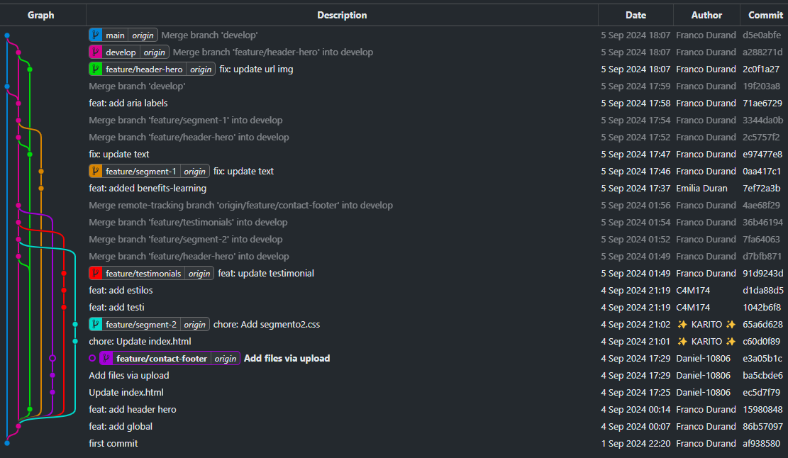

- 2: Ir a la configuración del repositorio, luego a la seccion *Pages* y seleccionar la rama *main* para el despliegue
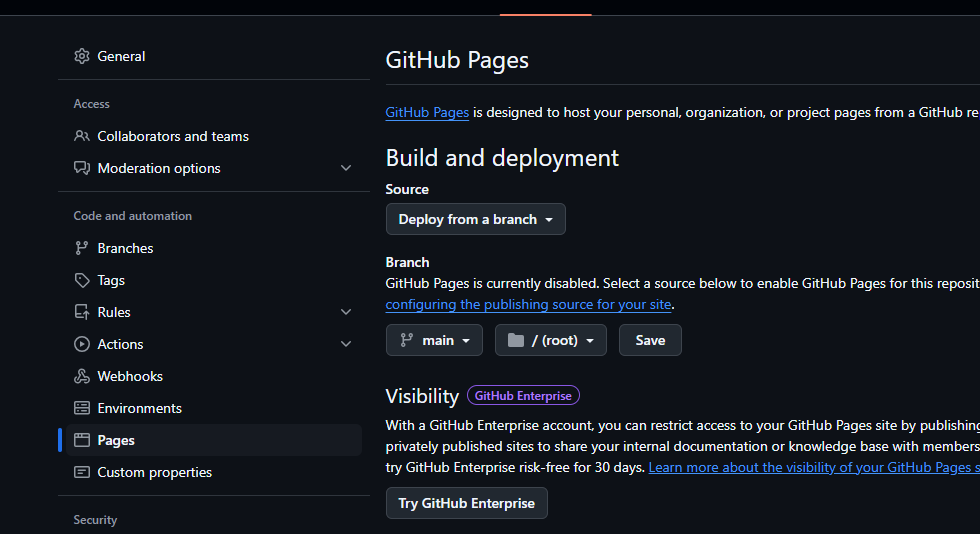

[Link Landing Page:](https://upc-pre-202402-si730-wx53-apple-web.github.io/Landing-Page/) https://upc-pre-202402-si730-wx53-apple-web.github.io/Landing-Page/ 

#### 5.2.1.8. Team Collaboration Insights during Sprint
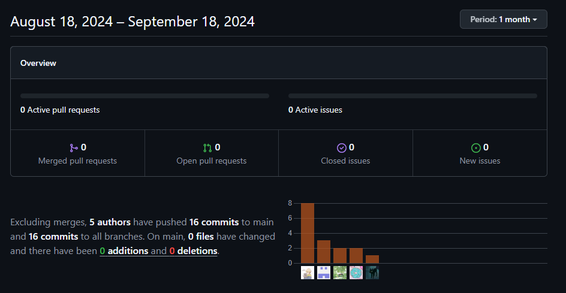

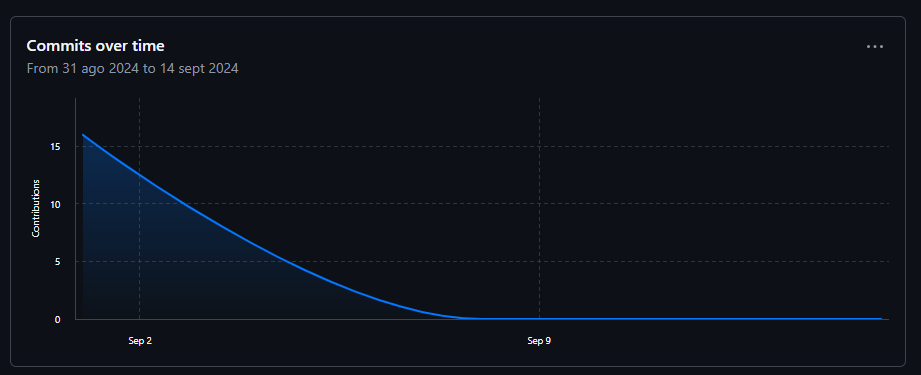

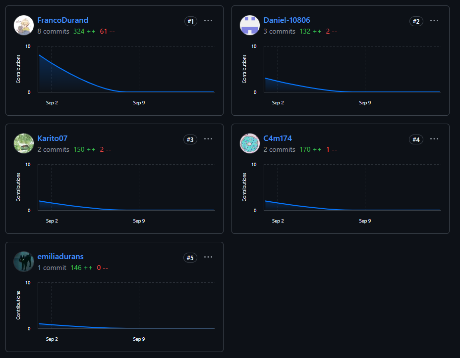

### 5.2.2. Sprint 2
Para este Sprint nos enfocaremos desarrollar una primera version del Frontend.

#### 5.2.2.1. Sprint Planning 2
| Sprint # | Sprint 2 |
| -------- | -------- |
|**Sprint Planning Background**|
| Date | 2024-09-18|
| Time | 09:00 PM |
| Location | Meet Virtual Meeting |
| Prepared By | Emilia Duran |
|Attendees (to planning meeting) | Camila Sanchez, Gianfranco Durand, Daniel Chávarri , Karito Medina, Emilia Duran
| Sprint n – 1 Review Summary | Se logro completar la landing page |
| Sprint n – 1 Retrospective Summary | Se tuvo que manejar mejor los tiempos para evitar inconvenientes en la entrega |
| **Sprint Goal & User Stories** | 
| Sprint 1 Goal | Realizar una primera version del Frontend. |
| Sprint 1 Velocity | 20 |
| Sum of Story Points | 20 | 

#### 5.2.2.2. Sprint Backlog 2
Durante el segundo sprint, el equipo tuvo como meta implementar el frontend de TaskLinker utilizando JavaScript, Vue. CSS y HTML. El enfoque se centró en desarrollar funcionalidades clave en varias páginas. Además, el equipo se enfocó en las historias de usuario relacionadas con este desarrollo, asegurando que cada nueva característica no solo fuera funcional, sino también alineada con las necesidades de los usuarios. Se utilizó Trello para organizar y distribuir las tareas, permitiendo que cada integrante del equipo se especializara en áreas que se correspondían con sus competencias, lo que facilitó un avance eficiente y coordinado hacia el objetivo del sprint.

 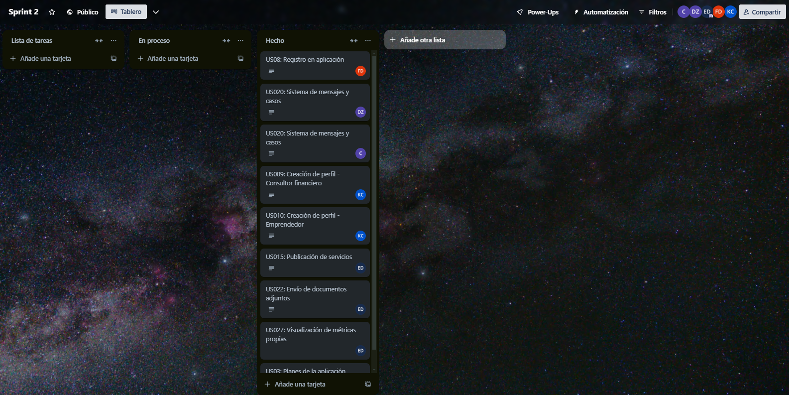

[Link Trello:](https://trello.com/b/ZCrrjFlj/sprint-2) https://trello.com/b/ZCrrjFlj/sprint-2

<table>
    <thead>
        <tr>
        <th colspan="7">Sprint 2</th>
        </tr>
    </thead>
    <tbody>
        <tr>
            <td colspan="2">User Story</td>
            <td colspan="6">Work-Item / Task</td>
        </tr>
        <tr>
            <td>Id</td>
            <td>Title</td>
            <td>Id</td>
            <td>Title</td>
            <td>Description</td>
            <td>Estimation (Hours)</td>
            <td>Assigned To</td>
            <td>Status (To-do/In-Process/To-Review/Done)</td>
        </tr>
        <tr>
            <td>US08</td>
            <td>Registro en aplicación</td>
            <td>UT06</td>
            <td>Formulario de registro</td>
            <td>Mostrar y redirigir al formulario de registro para nuevos usuarios desde la landing page.</td>
            <td>4</td>
            <td>Gianfranco Durand</td>
            <td>Done</td>
        </tr>
        <tr>
            <td>US020</td>
            <td>Sistema de mensajes y casos</td>
            <td>UT10</td>
            <td>Mensajes entre usuarios</td>
            <td>Desarrollar sistema de mensajería para consultas entre usuarios.</td>
            <td>4</td>
            <td>Daniel Chávarri</td>
            <td>Done</td>
        </tr>
        <tr>
            <td>US020</td>
            <td>Sistema de mensajes y casos</td>
            <td>UT1
            UT2
            UT3</td>
            <td>Implementación de Idioma
            Implementación de Notificaciones
            Implementación de Log out, Profile</td>
            <td>Crear la barra de herramientas (toolbar) para la navegación del sistema.</td>
            <td>4</td>
            <td>Camila Sanchez</td>
            <td>Done</td>
            <tr>
        <td>US009</td>
            <td>Creación de perfil - Consultor financiero</td>
            <td>UT1
            UT2
            UT3
            </td>
            <td>Completar información personal
            Agregar experiencia profesional
            Tipo de Plan
            </td>
            <td>Recolectar datos personales básicos (nombre, email, etc.).
            Permitir al consultor agregar
            Poder cambiar el tipo de Plan (Basico y Premium)
            </td>
            <td>3</td>
            <td>Karito Medina</td>
            <td>Done</td>
        </tr>
        <td>US010</td>
            <td>Creación de perfil - Emprendedor</td>
            <td>UT1
            UT2
            UT3
            </td>
            <td>Completar información personal
            Agregar experiencia profesional
            Tipo de Plan</td>
            <td>Recolectar datos personales básicos (nombre, email, etc.).
            Permitir al consultor agregar
            Poder cambiar el tipo de Plan (Basico y Premium)</td>
            <td>3</td>
            <td>Karito Medina</td>
            <td>Done</td>
        </tr>
        <td>US015</td>
            <td>Publicación de servicios</td>
            <td>UT1
            UT2
            UT3</td>
            <td>Crear nuevo servicio<br>
            Definir precios del servicio
            Agregar descripción del servicio</td>
            <td>Permitir al consultor crear un nuevo servicio a publicar
            Permitir al consultor definir el precio de su servicio. Permitir al consultor agregar una descripción detallada del servicio</td>
            <td>4</td>
            <td>Emilia Duran</td>
            <td>Done</td>
        </tr>
        <td>US022</td>
            <td>Envío de documentos adjuntos</td>
            <td>UT1
            UT2</td>
            <td>Adjuntar imágenes al servicio<br>
            Publicar servicio</td>
            <td>Permitir al consultor adjuntar imágenes que describan su servicio. Finalizar la publicación del servicio y ponerlo disponible para los usuarios</td>
            <td>5</td>
            <td>Emilia Duran</td>
            <td>Done</td>
        </tr>
        </tr>
        <td>US027</td>
            <td>Visualización de métricas propias</td>
            <td>UT1
            UT2 
            </td>
            <td>Ver métricas de ingresos<br>
            Ver evolución de métricas</td>
            <td>Mostrar los ingresos generados por los servicios prestados. 
            Mostrar gráficas con la evolución de las métricas a lo largo del tiempo</td>
            <td>6</td>
            <td>Emilia Duran</td>
            <td>Done</td>
        </tr>
         </tr>
        <td>US03</td>
            <td>Planes de la aplicación</td>
            <td>UT1
            UT2 
            </td>
            <td>Ver descripción de planes<br>
            Seleccionar plan preferente </td>
            <td>Se encuentra en el landing page cuando navega a la sección Plans entonces visualiza de modo comparativo los planes de suscripción</td>
            <td>1</td>
            <td>Camila Sanchez</td>
            <td>Done</td>
        </tr>
    </tbody>
</table>


#### 5.2.2.3. Development Evidence for Sprint Review
Link del repositorio: https://github.com/upc-pre-202402-si730-wx53-apple-web/Frontend-Web-Applications

| Branch | Commit Id | Commit Message | Commited on (Date) |
| ------ | --------- | -------------- | ------------------ |
| feature/fake-api | 5c5d7931 | feat: add id to db.json, update route |21/09/24|   
| feature/iam | 9c4d9322 | feat: add user model |24/09/24|   
| feature/iam | a386f446 | feat: add login component |24/09/24|
| feature/iam | 482e16ae | feat: add register component |24/09/24|
| feature/iam | ec93716c |feat: add authentication service |24/09/24|
| feature/iam | 883b586f |feat: add global styles |24/09/24|
| feature/public | 796ac959 |feat: add toolbar|24/09/24|
| feature/public | 1db5b029 |feat: add toolbar |27/09/24|
| feature/routes | 87057be1 |feat: add routes login, register, messages|24/09/24|
| feature/users | 42a1a805 |feat: Create Register.vue |24/09/24|
| feature/users | 333356ee |chore: Added UserProfile in App.vue |24/09/24|
| feature/users | 1375d4f0 |feat: update message panel |24/09/24|
| feature/workspace | 83ad4cff |feat: added services and metrics cards |24/09/24|
| feature/workspace | 8eb70039 |feat: added information panel |24/09/24|
| feature/workspace | dbea978e |feat: added workspace information component |24/09/24|
| feature/workspace | d3f2dfaf |feat: added metrics card & workspace view |24/09/24|

#### 5.2.2.4. Testing Suite Evidence for Sprint Review
#### 5.2.2.5. Execution Evidence for Sprint Review
- Login y register
  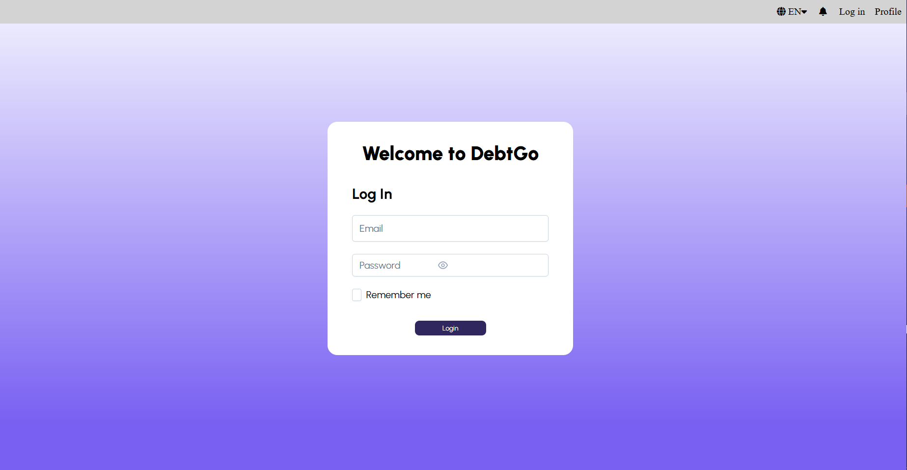
- Pasarela de pagos
  
- Mi perfil
  
- My Workspace
  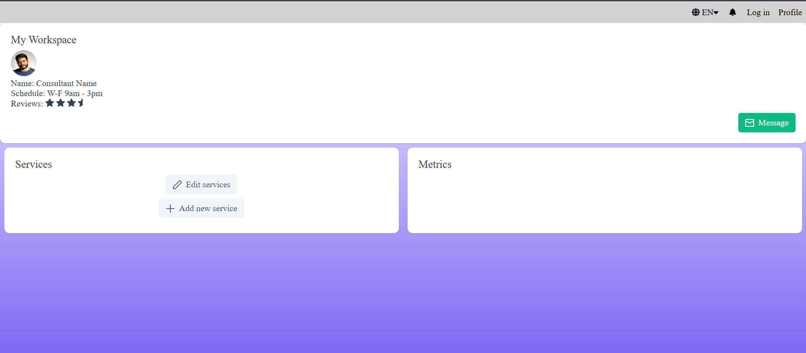
- Mensaje
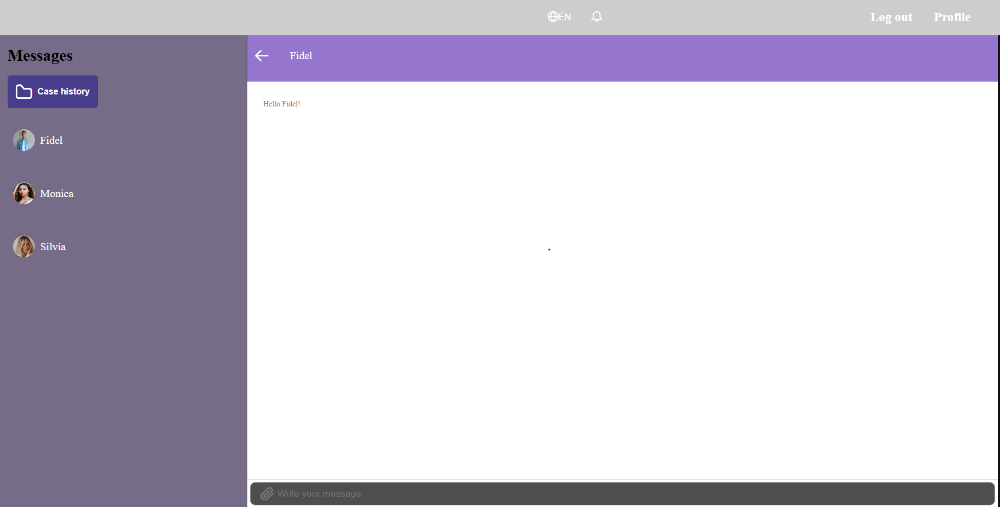

#### 5.2.2.6. Services Documentation Evidence for Sprint Review
No se implementaron servicios en este sprint 2
#### 5.2.2.7. Software Deployment Evidence for Sprint Review
Para realizar el despliegue del Frontend se realizaron lo siguientes pasos:

1: Hacer merges de las ramas feature en la rama develop y finalmente merge en la rama main

2: Ir a Netlify, seleccionar Add new site, seguidamente seleccionar Import an existing project

3: Seleccionar el repositorio del Frontend

4: Ingresar un nombre disponible para la página del frontend y seleccionar la rama main
#### 5.2.2.8. Team Collaboration Insights during Sprint

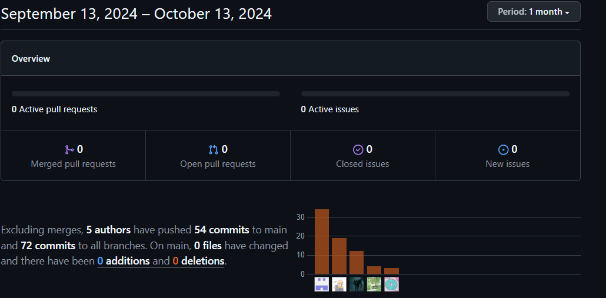
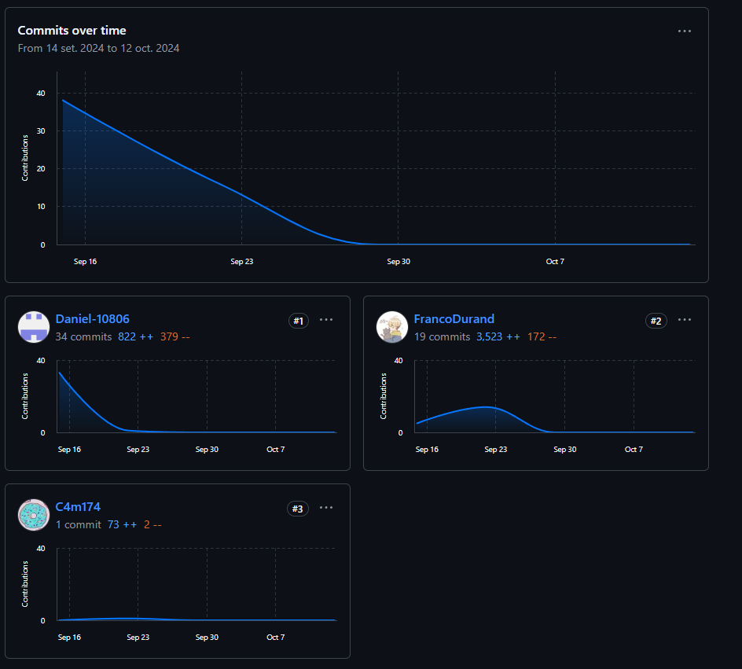

### 5.2.3. Sprint 3
Para este Sprint nos enfocaremos desarrollar una primera version del Web-Services

#### 5.2.3.1. Sprint Planning 3
| Sprint 3 | Sprint 3 |
| -------- | -------- |
|**Sprint Planning Background**|
| Date | 2024-08-29|
| Time | 07:00 PM |
| Location | Discord Virtual Meeting |
| Prepared By | Karito Medina, Gianfranco Durand |
|Attendees (to planning meeting) | Camila Sanchez, Gianfranco Durand, Daniel Chávarri , Karito Medina, Emilia Duran
| Sprint 2 Review Summary | En el sprint 2 se realizó el front-end |
| Sprint 2 Retrospective Summary | Logramos alcanzar la meta del sprint anterior de desplegar el front-end|
| **Sprint Goal & User Stories** | 
| Sprint 3 Goal | Implementar los web services a un 70% |
| Sprint 3 Velocity | 20 |
| Sum of Story Points | 20 | 

#### 5.2.3.2. Sprint Backlog 3
Para el Sprint #3 nos trazamos como objetivo desarrollar y desplegar la parte del back end de la aplicación web y completar las funcionalidades del front end.

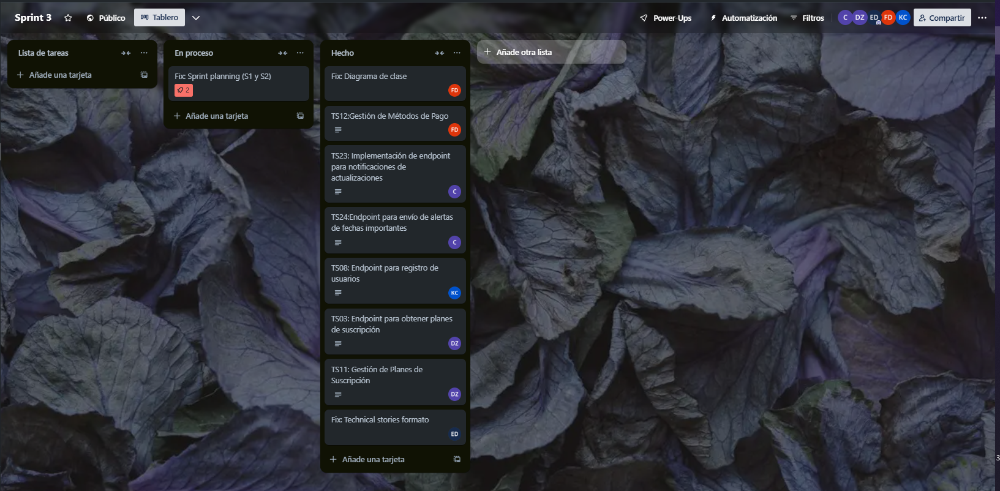

[Link Trello:](https://trello.com/b/z15MxWUY/sprint-3) https://trello.com/b/z15MxWUY/sprint-3

<table>
    <thead>
        <tr>
        <th colspan="7">Sprint 3</th>
        </tr>
    </thead>
    <tbody>
        <tr>
            <td colspan="2">User Story</td>
            <td colspan="6">Work-Item / Task</td>
        </tr>
        <tr>
            <td>Id</td>
            <td>Title</td>
            <td>Id</td>
            <td>Title</td>
            <td>Description</td>
            <td>Estimation (Hours)</td>
            <td>Assigned To</td>
            <td>Status (To-do/In-Process/To-Review/Done)</td>
        </tr>
        <tr>
            <td>TS12</td>
            <td>Gestión de Métodos de Pago</td>
            <td>UT01
            UT02
            UT03</td>
            <td>Implementar validación de métodos de pago soportados (tarjeta de crédito, débito, PayPal).
            <br>Crear endpoint para agregar método de pago.</br>
            Crear endpoint para eliminar método de pago.</td>
            <td>Permitir al usuario agregar, actualizar y eliminar métodos de pago en su cuenta de usuario.</td>
            <td>6</td>
            <td>Gianfranco Durand</td>
            <td>Done</td>
        </tr>
        <tr>
            <td>TS23</td>
            <td>Implementación de endpoint para notificaciones de actualizaciones</td>
            <td>UT01
            UT02
            UT03</td>
            <td>Crear endpoint para envío de notificaciones de actualizaciones.
            <br> Diseñar interfaz de usuario para activar/desactivar notificaciones.</br>
            Implementar sistema de preferencias de notificaciones por usuario.</td>
            <td>Desarrollar un endpoint que permita notificar a los usuarios sobre actualizaciones en la plataforma (nuevas funciones, mejoras de seguridad, etc.).</td>
            <td>6</td>
            <td>Camila Sanchez</td>
            <td>Done</td>
        </tr>
        <tr>
            <td>TS24</td>
            <td>Endpoint para envío de alertas de fechas importantes</td>
            <td>UT1
            UT2
            UT3</td>
            <td>Crear lógica para envío de alertas en diferentes formatos (email, push notification).
            Diseñar interfaz para visualización de alertas en la aplicación.
           Crear endpoint para alertas de vencimiento de suscripciones.</td>
            <td>Implementar un endpoint que permita enviar alertas sobre fechas importantes (vencimiento de suscripción, fechas de pago, publicacion nueva, etc.).</td>
            <td>6</td>
            <td>Camila Sanchez</td>
            <td>Done</td>
            <tr>
        <td>TS08</td>
            <td>Endpoint para registro de usuarios</td>
            <td>UT1
            UT2
            UT3
            </td>
            <td> Implementar verificación de correo electrónico.
            Diseñar interfaz para formulario de registro de usuario.
            Agregar lógica para contraseñas.
            </td>
            <td>Desarrollar un endpoint para permitir el registro de nuevos usuarios en la plataforma.
            </td>
            <td>6</td>
            <td>Karito Medina</td>
            <td>Done</td>
        </tr>
        <td>TS03</td>
            <td>Endpoint para obtener planes de suscripción</td>
            <td>UT1
            UT2
            </td>
            <td>Crear endpoint para consulta de planes de suscripción.
            Crear pruebas de integración para el endpoint de planes de suscripción.</td>
            <td>Crear un endpoint que permita obtener los diferentes planes de suscripción disponibles en la plataforma.</td>
            <td>6</td>
            <td>Daniel Chávarri </td>
            <td>Done</td>
        </tr>
        <td>TS11</td>
            <td>Gestión de Planes de Suscripción</td>
            <td>UT1
            UT2
            UT3</td>
            <td>Crear endpoint para actualizar el plan de suscripción del usuario.<br>
            Crear endpoint para cancelar suscripciones.
            Diseñar interfaz de usuario para gestión de planes en la app.</td>
            <td>Proporcionar funcionalidades para que los usuarios gestionen sus planes de suscripción (actualizar, cancelar, etc.).</td>
            <td>6</td>
            <td>Daniel Chávarri </td>
            <td>Done</td>
        </tr>
    </tbody>
</table>

#### 5.2.3.3. Development Evidence for Sprint Review
[Link del repositorio:](https://github.com/upc-pre-202402-si730-wx53-apple-web/Web-Services) https://github.com/upc-pre-202402-si730-wx53-apple-web/Web-Services

| Branch | Commit Id | Commit Message | Commited on (Date) |
| ------ | --------- | -------------- | ------------------ |
| feature/IAM | ac465252  | feat: implement user authentication endpoints                    | 30/10/24           |
| feature/IAM | 00cddbc6  | feat: add user command service and hashing functionality         | 30/10/24           |
| feature/IAM | 2320e3f2  | feat: add user model and commands                                | 30/10/24           |
| feature/shared | ada340de | feat: add base repository and unit of work interfaces |22/10/24|   
| feature/shared | b259c0e8 | feat: add DbContext configuration, ModelBuilder String extensions |22/10/24| 
| feature/shared | f79cf71f | feat: add base repository and unit of work implementations |22/10/24|
| feature/Notification-BC | 63ecd982 | feat: add base repository and unit of work interfaces|25/10/24| 
| feature/Notification-BC | 9b381fa8 | feat: add DbContext, Interfaces, Infrastructure  |25/10/24|
| feature/User-BC | 21d5a262 | feat(User): add value object  |29/10/24|
| feature/User-BC | 38c47b17 | feat(User): add command. |29/10/24|
| feature/User-BC | 2ab30c2f | feat(User): add queries. |29/10/24|
| feature/User-BC | fa502cab | feat(User): add aggregates. |29/10/24|
| feature/User-BC | 6f451265 | feat(User): add infrastructure. |29/10/24|
| feature/User-BC | 389f95be | feat(User): add IUserContextFacade.cs. |29/10/24|
| feature/User-BC | 763a7cd3 | feat(User): add UserContextFacade.cs. |29/10/24|
| feature/User-BC | 1f6c6949 | feat(User): add resources. |29/10/24|
| feature/User-BC | 850d2a9d | feat(User): add transforms. |29/10/24|
| feature/User-BC | 8f26bc53 | feat(User): add services. |29/10/24|
| feature/User-BC | f1e779fa | feat(User): add UsersController.cs. |29/10/24|
| feature/User-BC | 7ee3e664 | feat(User): add IUserRepository.cs. |29/10/24|
| feature/User-BC | 34668505 | feat(User): add UserCommandService.cs. |29/10/24|
| feature/Notification-BC | 1d71f6df | feat: add base repository Aplication and Domain  |30/10/24|


#### 5.2.3.4. Testing Suite Evidence for Sprint Review

#### 5.2.3.5. Execution Evidence for Sprint Review
La realización de estas tareas refleja un enfoque estructurado para el desarrollo de la aplicación web. Cada tarea aborda un componente crucial del producto, lo que asegura que se cubran tanto aspectos visuales como funcionales. Este enfoque modular permite no solo mantener un orden en el proceso de desarrollo, sino también garantizar que cada sección cumple con las funcionalidades.  

#### 5.2.3.6. Services Documentation Evidence for Sprint Review
Para este tercer sprint usamos la primera versión de nuestro servicio desarrollado en C#.

#### 5.2.3.7. Software Deployment Evidence for Sprint Review
Durante este sprint, se utilizó Azure como plataforma de despliegue para la aplicación web.

- 1. Crear un recurso de *Azure App Service*

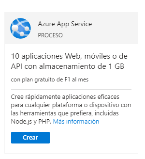

- 2. Escoger el entorno de **.NET 8** y configurar un nombre para el dominio

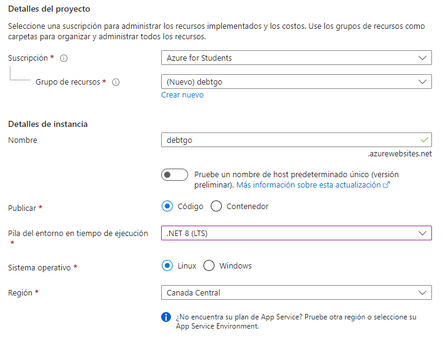

- 3. Actualizar la conexión a la base de datos

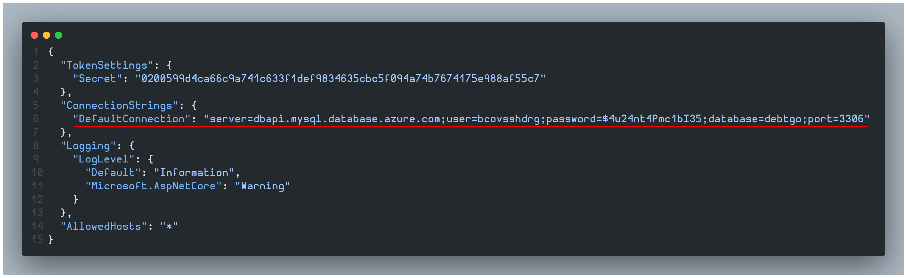

- 4. En el menú del recurso de Azure seleccionar *Deploy to Web App* 

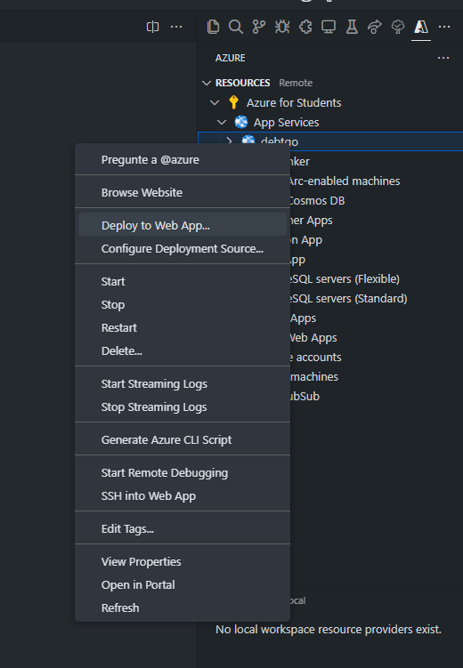


- 4. Verificar el funcionamiento de Swagger en el dominio del App Service

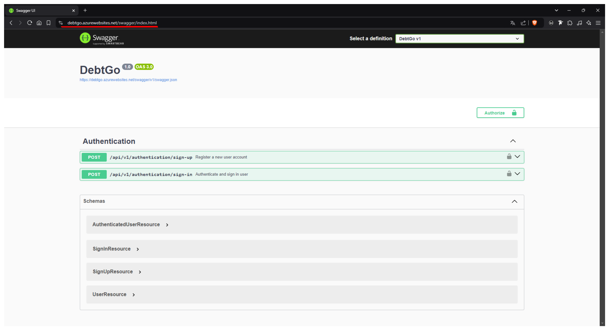

[Link:](https://debtgo.azurewebsites.net/swagger/index.html) https://debtgo.azurewebsites.net/swagger/index.html

#### 5.2.3.8. Team Collaboration Insights during Sprint

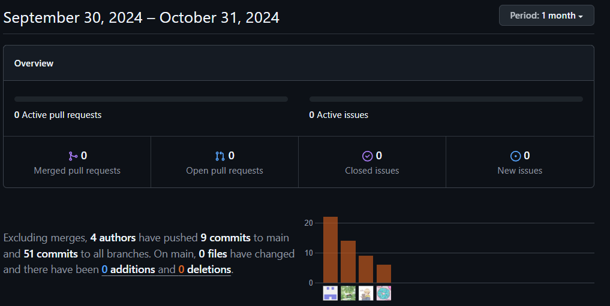


### 5.2.4. Sprint 4
En la siguiente sección, se presentará el sprint #4 con la versión de la aplicación web e implementación total del back-end, desarrollado en C#. Mostrando la organización, distribución y resultados de la aplicación web y los web services.
#### 5.2.4.1. Sprint Planning 4

En la siguiente sección, se presentará el sprint #4 con la versión de la aplicación web e implementación total del back-end, desarrollado en C#. Mostrando la organización, distribución y resultados de la aplicación web y los web services.

| Sprint 4 | Sprint 4 |
| -------- | -------- |
|**Sprint Planning Background**|
| Date | 2024-08-29|
| Time | 07:00 PM |
| Location | Discord Virtual Meeting |
| Prepared By | Karito Medina, Gianfranco Durand |
|Attendees (to planning meeting) | Camila Sanchez, Gianfranco Durand, Daniel Chávarri , Karito Medina, Emilia Duran
| Sprint n – 1 Review Summary | No hubo sprint anterior |
| Sprint n – 1 Retrospective Summary | No hubo sprint anterior |
| **Sprint Goal & User Stories** | 
| Sprint 1 Goal | Realizar la Landing Page |
| Sprint 1 Velocity | 20 |
| Sum of Story Points | 20 | 

#### 5.2.4.2. Sprint Backlog 4
Para el Sprint #4 nos trazamos como objetivo desarrollar y desplegar de manera total el back end de la aplicación web.


[Link Trello:](https://trello.com/b/z15MxWUY/sprint-3) https://trello.com/b/z15MxWUY/sprint-3

<table>
    <thead>
        <tr>
        <th colspan="7">Sprint 4</th>
        </tr>
    </thead>
    <tbody>
        <tr>
            <td colspan="2">User Story</td>
            <td colspan="6">Work-Item / Task</td>
        </tr>
        <tr>
            <td>Id</td>
            <td>Title</td>
            <td>Id</td>
            <td>Title</td>
            <td>Description</td>
            <td>Estimation (Hours)</td>
            <td>Assigned To</td>
            <td>Status (To-do/In-Process/To-Review/Done)</td>
        </tr>
        <tr>
            <td>TS12</td>
            <td>Gestión de Métodos de Pago</td>
            <td>UT01
            UT02
            UT03</td>
            <td>Implementar validación de métodos de pago soportados (tarjeta de crédito, débito, PayPal).
            <br>Crear endpoint para agregar método de pago.</br>
            Crear endpoint para eliminar método de pago.</td>
            <td>Permitir al usuario agregar, actualizar y eliminar métodos de pago en su cuenta de usuario.</td>
            <td>4</td>
            <td>Gianfranco Durand</td>
            <td>Done</td>
        </tr>
        <tr>
            <td>TS23</td>
            <td>Implementación de endpoint para notificaciones de actualizaciones</td>
            <td>UT01
            UT02
            UT03</td>
            <td>Crear endpoint para envío de notificaciones de actualizaciones.
            <br> Diseñar interfaz de usuario para activar/desactivar notificaciones.</br>
            Implementar sistema de preferencias de notificaciones por usuario.</td>
            <td>Desarrollar un endpoint que permita notificar a los usuarios sobre actualizaciones en la plataforma (nuevas funciones, mejoras de seguridad, etc.).</td>
            <td>4</td>
            <td>Camila Sanchez</td>
            <td>Done</td>
        </tr>
        <tr>
            <td>TS24</td>
            <td>Endpoint para envío de alertas de fechas importantes</td>
            <td>UT1
            UT2
            UT3</td>
            <td>Crear lógica para envío de alertas en diferentes formatos (email, push notification).
            Diseñar interfaz para visualización de alertas en la aplicación.
           Crear endpoint para alertas de vencimiento de suscripciones.</td>
            <td>Implementar un endpoint que permita enviar alertas sobre fechas importantes (vencimiento de suscripción, fechas de pago, publicacion nueva, etc.).</td>
            <td>4</td>
            <td>Camila Sanchez</td>
            <td>Done</td>
            <tr>
        <td>TS08</td>
            <td>Endpoint para registro de usuarios</td>
            <td>UT1
            UT2
            UT3
            </td>
            <td> Implementar verificación de correo electrónico.
            Diseñar interfaz para formulario de registro de usuario.
            Agregar lógica para contraseñas.
            </td>
            <td>Desarrollar un endpoint para permitir el registro de nuevos usuarios en la plataforma.
            </td>
            <td>4</td>
            <td>Karito Medina</td>
            <td>Done</td>
        </tr>
        <td>TS03</td>
            <td>Endpoint para obtener planes de suscripción</td>
            <td>UT1
            UT2
            </td>
            <td>Crear endpoint para consulta de planes de suscripción.
            Crear pruebas de integración para el endpoint de planes de suscripción.</td>
            <td>Crear un endpoint que permita obtener los diferentes planes de suscripción disponibles en la plataforma.</td>
            <td>4</td>
            <td>Daniel Chávarri </td>
            <td>Done</td>
        </tr>
        <td>TS11</td>
            <td>Gestión de Planes de Suscripción</td>
            <td>UT1
            UT2
            UT3</td>
            <td>Crear endpoint para actualizar el plan de suscripción del usuario.<br>
            Crear endpoint para cancelar suscripciones.
            Diseñar interfaz de usuario para gestión de planes en la app.</td>
            <td>Proporcionar funcionalidades para que los usuarios gestionen sus planes de suscripción (actualizar, cancelar, etc.).</td>
            <td>4</td>
            <td>Daniel Chávarri </td>
            <td>Done</td>
        </tr>
    </tbody>
</table>

#### 5.2.4.3. Development Evidence for Sprint Review

En este punto abarcaremos las funcionalidades y la evidencia de que pudimos completar exitosamente las tareas planteadas en el Sprint Planning 4:

| Branch | Commit Id | Commit Message | Commited on (Date) |
| ------ | --------- | -------------- | ------------------ |
| feature/IAM | 7396a842  | feat: allow Swagger UI in production environment  | 1/11/24           |
| feature/Subcription-BC | 2320e3f2  | feat: add Subscription       | 11/11/24           |
| feature/Notification-BC | 4a1c21b9  | feat: add Notification         | 14/11/24    |
| feature/Subcription-BC | d194d3fc  | chore(interfaces): add XML documentation   | 16/11/24           |

#### 5.2.4.4. Testing Suite Evidence for Sprint Review

#### 5.2.4.5. Execution Evidence for Sprint Review
La realización de estas tareas refleja un enfoque estructurado para el desarrollo de la aplicación web. Cada tarea aborda un componente crucial del producto, lo que asegura que se cubran tanto aspectos visuales como funcionales.

A continuación se mostrarán capturas de pantallas así como el vídeo de la ejecución el Web Service, ya que la Landing Page y la Aplicación web fueron terminadas en el anterior sprint:

Evidencia de Web Service:

Funciones de Subcription:
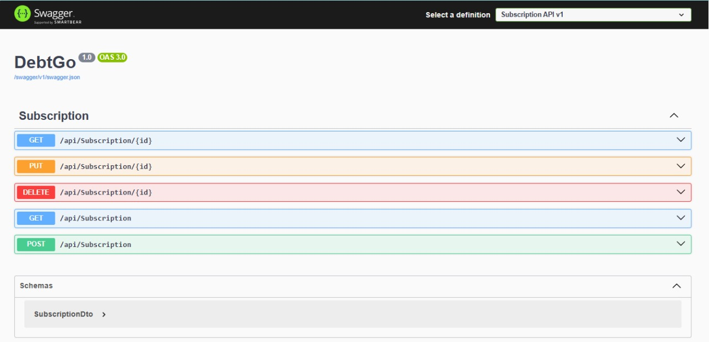

Método Get mediante id:
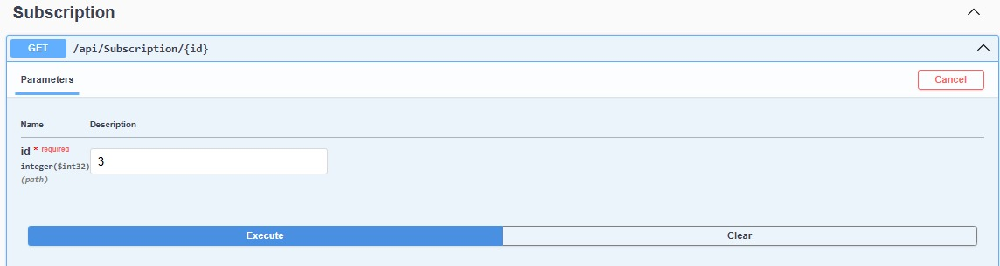
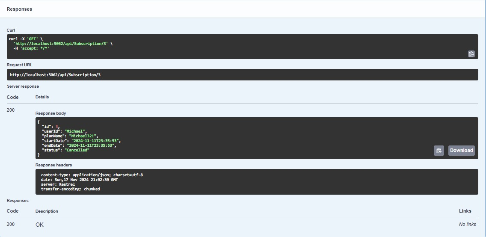

Base de Datos actualizada:
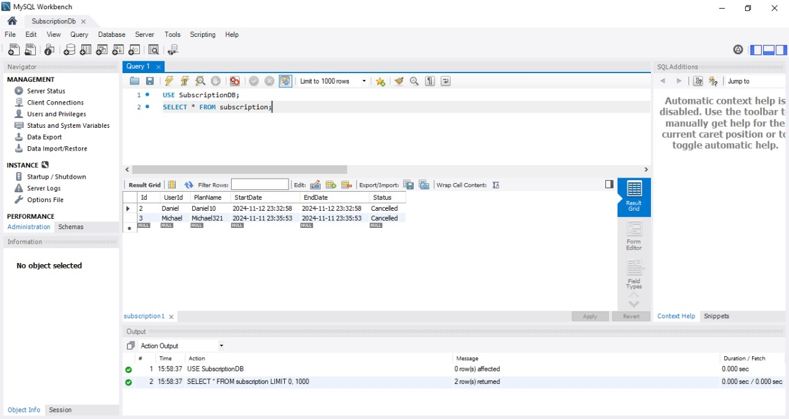

Método Put mediante id:
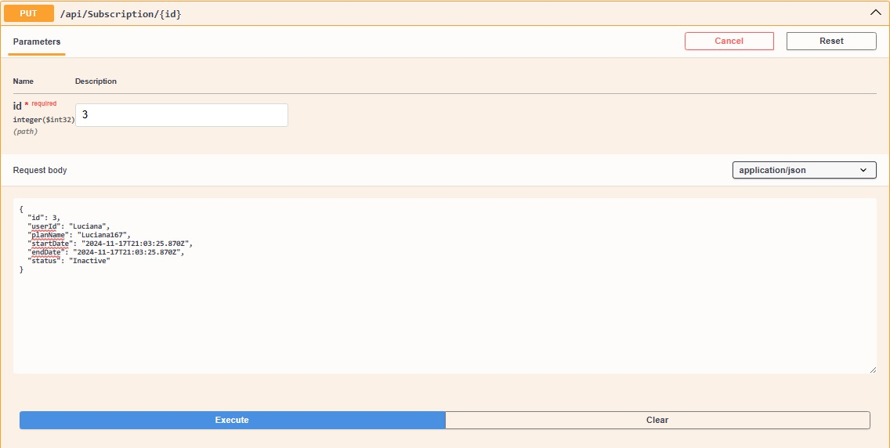
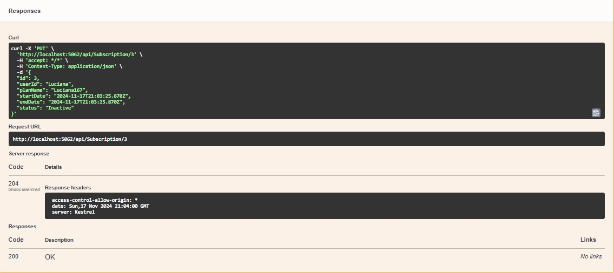
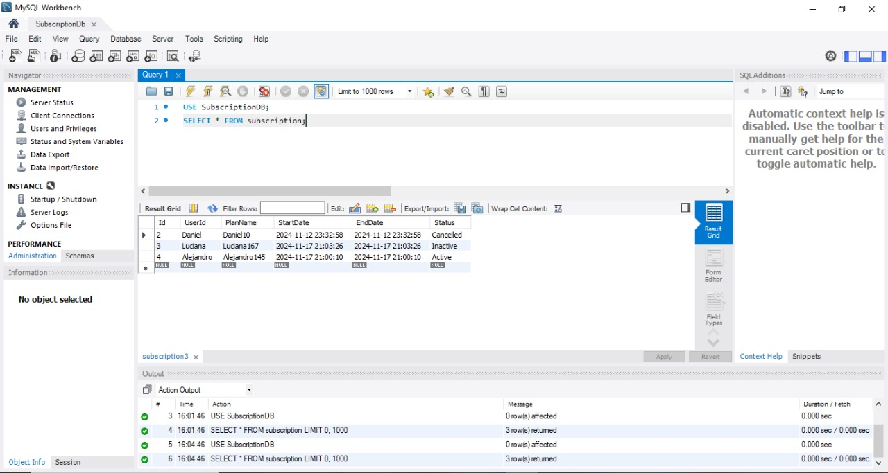

Método Delete:
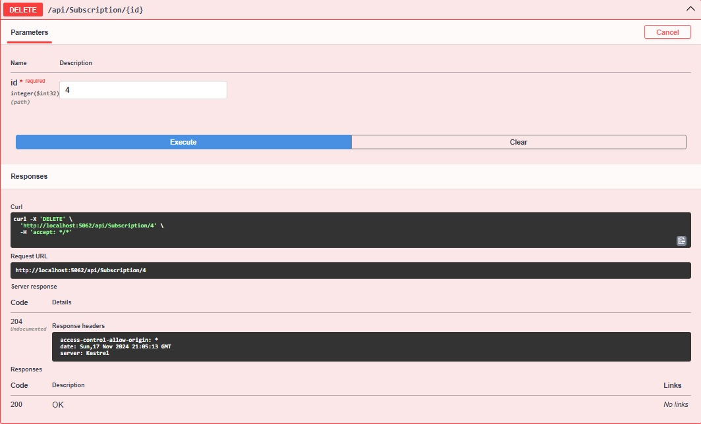
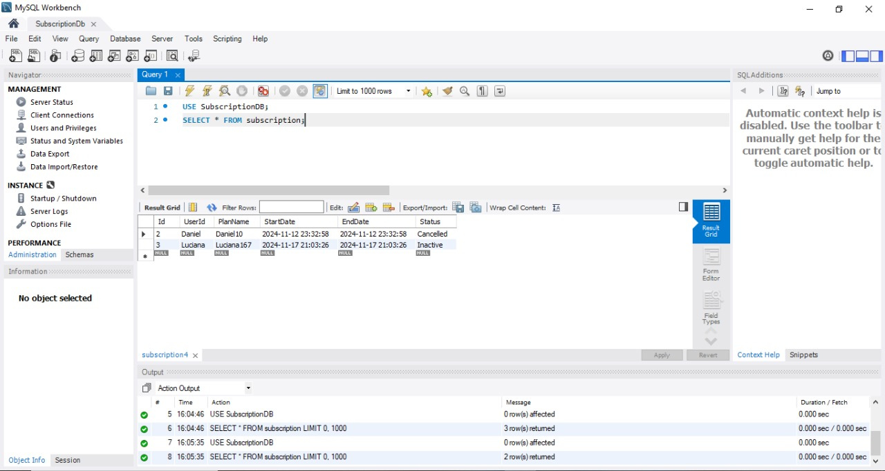

#### 5.2.4.6. Services Documentation Evidence for Sprint Review
Para este cuarto sprint usamos la versión de nuestro servicio desarrollado en c#.

| Endpoint | Details | 
| ------ | --------- | 
| Subcription | Se implementaron los métodos HTTP GET, POST, PUT y DELETE para el endpoint /api/Subcription. En el caso del método GET, se desarrollo para obtener los datos de un usuario específico mediante su id. El método PUT permite actualizar la información de un usuario mediante su id, mientras que el método POST se utiliza para crear un nuevo usuario a través de los datos proporcionados en el cuerpo de la solicitud (request body). Por último, el método DELETE permite eliminar un usuario específico mediante su id.  |
| Notification | Se implementaron los métodos HTTP GET, POST para el endpoint /api/Notification. En el caso del método GET, se desarrollo para obtener los datos de un usuario específico mediante su id, mientras que el método POST se utiliza para crear un nuevo mensaje  enviando los datos necesarios en el cuerpo de la solicitud (request body). |
| User | Se implementaron los métodos HTTP GET, POST, PUT y DELETE para el endpoint /api/User. En el caso del método GET, se desarrollo para obtener los datos de un usuario específico mediante su id. El método PUT permite actualizar la información de un usuario mediante su id, mientras que el método POST se utiliza para agregar un nuevo usuario enviando los datos correspondientes en el cuerpo de la solicitud (request body).Por último, el método DELETE permite eliminar un usuario específico mediante su id.  |
| IAM | Se implementaron los métodos HTTP GET, POST, PUT y DELETE para el endpoint /api/IAM. En el caso del método GET, se desarrollo para obtener los datos de un usuario específico mediante su id. El método PUT permite actualizar la información de un usuario mediante su id, mientras que el método POST se utiliza para crear un nuevo usuario a través de los datos proporcionados en el cuerpo de la solicitud (request body). Por último, el método DELETE permite eliminar un usuario específico mediante su id.  |


#### 5.2.4.7. Software Deployment Evidence for Sprint Review

#### 5.2.4.8. Team Collaboration Insights during Sprint

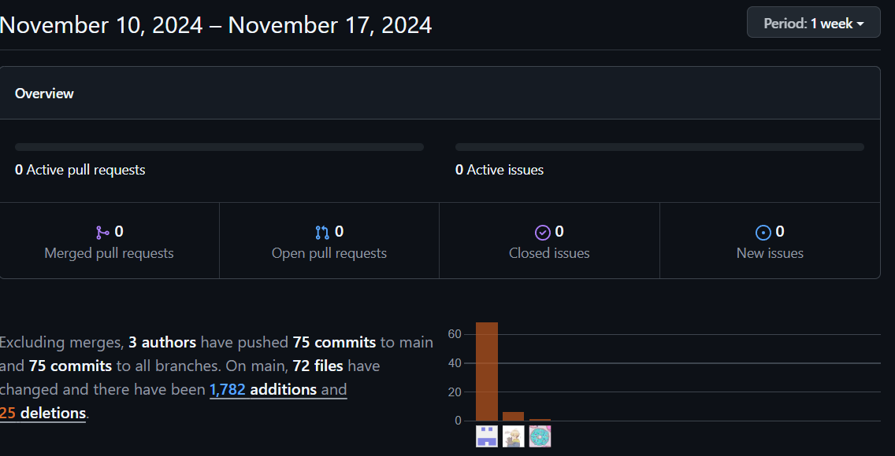
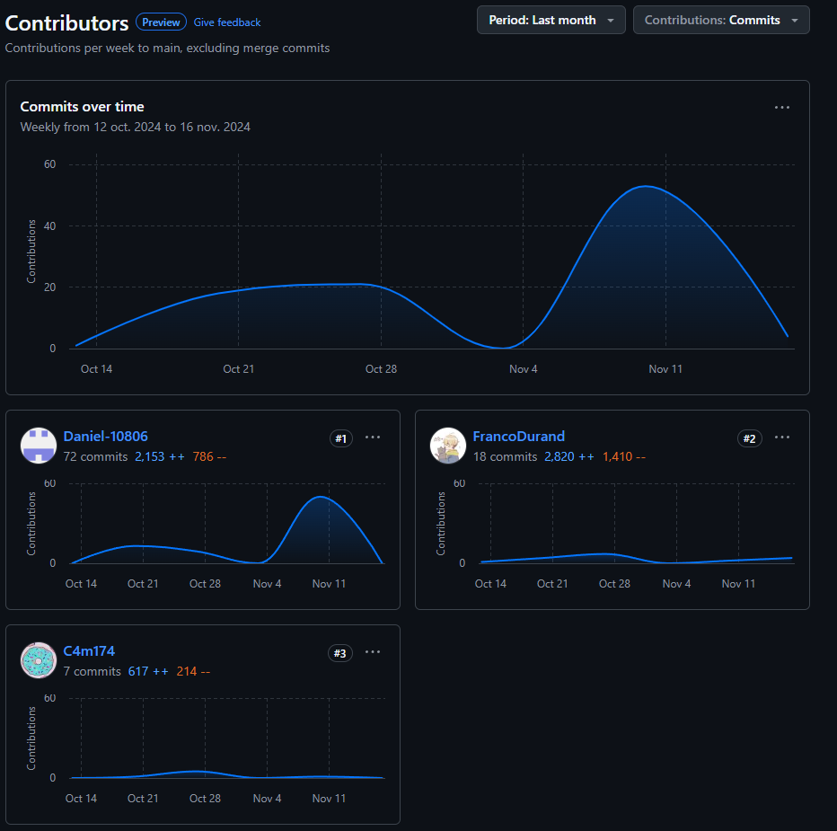


## 5.3. Validation Interviews
En esta sección se detalla el proceso de validación mediante entrevistas con usuarios y expertos. Estas entrevistas son cruciales para evaluar la usabilidad, funcionalidad y eficacia de la aplicación DebtGo, garantizando que cumple con las necesidades y expectativas de nuestros segmentos de mercado.

### 5.3.1. Diseño de Entrevistas
Se decribe la metodología utilizada para diseñar las entrevistas de validación, incluyendo la selección de participantes, la formulación de preguntas y el enfoque adaptaddo para obtener información relevante y precisa sobre la experiencia del usuario con la aplicación DebtGo.

### Segmento Objetivo 1: Consultores Financieros

- **Preguntas Generales**
  - ¿Cuál es su nombre?
  - ¿Cuál es su sexo?
  - ¿Cuántos años tiene?
  - ¿Cuál es su ocupación?
  
- **Preguntas Específicas**
  - Según lo visto, ¿qué te pareció la estructuración de la página?
  - ¿Cuáles son los puntos de mejora?
  - ¿Crees que la aplicación es intuitiva y fácil de usar?
  - ¿Hubo alguna sección de la aplicación que te resultó complicada?
  - ¿Cuáles son los aspectos positivos y negativos que destacarías de la aplicación?
  - ¿Qué funcionalidades consideras esenciales para tu trabajo como consultor financiero?
  - ¿La información presentada es relevante y útil para tu labor profesional?

### Segmento Objetivo 2: Emprendedores

- **Preguntas Generales**
  - ¿Cuál es su nombre?
  - ¿Cuál es su sexo?
  - ¿Cuántos años tiene?
  - ¿Cuál es su ocupación?
  
- **Preguntas Específicas**
  - Según lo visto, ¿qué te pareció la estructuración de la página?
  - ¿Cuáles son los puntos de mejora?
  - ¿Crees que la aplicación es intuitiva y fácil de usar?
  - ¿Hubo alguna sección de la aplicación que te resultó complicada?
  - ¿Cuáles son los aspectos positivos y negativos que destacarías de la aplicación?
  - ¿Qué características adicionales crees que serían útiles para emprendedores?
  - ¿Cómo la aplicación podría apoyarte en el crecimiento de tu negocio?


### 5.3.2. Registro de Entrevistas
Esta subsección presenta un registro detallado de las entrevistas realizadas, documentando las respuestas de los participantes, las observaciones clave y los comentarios obtenidos durante las sesiones de validación. Estos registros proporcionan una base sólida para el análisis y la mejora del producto.

**Segmento Objetivo 1: Consultores Financieros**
-------------------------------------------
**Entrevistado(a) #1:** Sebastian Silva<br>
**Sexo:** Hombre <br>
**Edad:** 20 años<br>
**Ocupación** Estudiante <br>
**Minuto de la entrevista:** 1:29 minutos <br>
**Enlace del video completo de las entrevistas:**<br>

[Link:](https://upcedupe-my.sharepoint.com/:v:/g/personal/u202210973_upc_edu_pe/EXkqBp4UFy1Hvppm25WnTwIBwqhzXX0XAEXct2jvd492pQ?nav=eyJyZWZlcnJhbEluZm8iOnsicmVmZXJyYWxBcHAiOiJTdHJlYW1XZWJBcHAiLCJyZWZlcnJhbFZpZXciOiJTaGFyZURpYWxvZy1MaW5rIiwicmVmZXJyYWxBcHBQbGF0Zm9ybSI6IldlYiIsInJlZmVycmFsTW9kZSI6InZpZXcifX0%3D&e=IWftYf
) https://upcedupe-my.sharepoint.com/:v:/g/personal/u202210973_upc_edu_pe/EXkqBp4UFy1Hvppm25WnTwIBwqhzXX0XAEXct2jvd492pQ?nav=eyJyZWZlcnJhbEluZm8iOnsicmVmZXJyYWxBcHAiOiJTdHJlYW1XZWJBcHAiLCJyZWZlcnJhbFZpZXciOiJTaGFyZURpYWxvZy1MaW5rIiwicmVmZXJyYWxBcHBQbGF0Zm9ybSI6IldlYiIsInJlZmVycmFsTW9kZSI6InZpZXcifX0%3D&e=IWftYf

<br>

**Resumen de la entrevista:**<br>
La entrevista realizada al emprendedor se centró en varios aspectos clave de su experiencia y el funcionamiento de su plataforma para emprendedores. El entrevistado destacó la utilidad del sistema de mensajes, que permite una comunicación directa y efectiva entre consultores y emprendedores. Sin embargo, sugirió que se podrían mejorar los estilos visuales de la interfaz. Se propuso la incorporación de un botón para grabar mensajes, lo que podría facilitar la comunicación y hacerla más accesible.
<br><br>

**Entrevistado(a) #3:** Marisol Ordoñez<br>
**Sexo:** Femenino <br>
**Edad:** 28 años<br>
**Ocupación** Economista <br>
**Minuto de la entrevista:** 6:01 minutos <br>
**Enlace del video completo de las entrevistas:**<br>

[Link:]([(https://youtu.be/VJdElwiLWJs)]) https://youtu.be/VJdElwiLWJs

<br>

**Resumen de la entrevista:**<br>
La entrevista realizada al consultor financiero resalta que DebtGo tiene un diseño centrado en el usuario, ideal para quienes desean mejorar su educación financiera y gestionar sus deudas. Sin embargo, se sugiere mejorar en áreas como la profundización de la información con ejemplos prácticos, la interactividad en los talleres en línea y la personalización de la interfaz. Aunque la aplicación es intuitiva, algunas secciones avanzadas podrían resultar complejas para usuarios sin experiencia financiera. Entre los aspectos positivos se destacan la personalización, el enfoque en el bienestar financiero y las herramientas de seguimiento, mientras que las áreas de mejora incluyen la falta de interactividad y la complejidad de ciertas funciones. En general, DebtGo tiene un gran potencial, pero se beneficiarían de ajustes en la experiencia de usuario.
<br><br>

**Segmento Objetivo 2: Emprendedores**
-------------------------------------------
**Entrevistado(a) #1:**<br>
**Sexo:**<br>
**Edad:** años<br>
**Ocupación**<br>
**Minuto de la entrevista:**<br>
**Enlace del video completo de las entrevistas:**<br>

<br>

**Resumen de la entrevista:**

<br><br>


### 5.3.3. Evaluación según heurísticas
Aquí se explican las evaluaciones realizadas utilizando principios heurísticos de usabilidad. Se analizan los resultados obtenidos y se identifican áreas de mejora en la interfaz y la funcionalidad de la aplicación, con el fin de optimizar la experiencia del usuario y asegurar la eficacia del producto.

**UX Heuristics & Principles Evaluation Usability - Inclusive Design - Information Architecture**

**Carrera:** Ingeniería de Software
**Curso:** Aplicaciones Web
**Sección:** WX53
**Profesores:** Todos
**Cliente(s):** Sebastian Silva, Marisol Ordoñez

**Site o App a Evaluar:** DebtGo

**Tareas a Evaluar:**
**Escala de Severidad:**
Los errores serán puntiados tomando en cuenta la siguiente escala de severidad

| Nivel | Descripción |
|-------|-------------|
|   1   | Problema superficial: puede ser fácilmente superado por el usuario ó ocurre con muy poco frecuencia. No necesita ser arreglado a no ser que exista disponibilidad de tiempo. |
|   2   | Problema menor: puede ocurrir un poco más frecuentemente o es un poco más difícil de superar para el usuario. Se le debería asignar una prioridad baja de cara resolverlo al siguiente release. |
|   3   | Problema mayor: ocurre frecuentemente o los usuarios no son capaces de resolverlos. Es importante que sean corregidos y se les debe asignar una prioridad alta. |
|   4   | Problema muy grave: un error de gran impacto que impide al usuario continuar con el uso de la herramienta. Es imperativo que sea corregido antes del lanzamiento. |

**Tabla Resumen:**

| # | Problema | Escala de Severidad | Heurística/Principio violada(o) |
|---|----------|---------------------|---------------------|
| 1 | La interfaz de la plataforma podría mejorarse visualmente. | 2 | Visibilidad del estado del sistema |
| 2 | El sistema de mensajería es útil, pero podría mejorarse con la opción de grabar mensajes. | 2 | Flexibilidad y eficiencia de uso |
| 3 | Algunas secciones avanzadas son complicadas para usuarios sin experiencia financiera. | 3 | Control y libertad del usuario |
| 4 | Falta de ejemplos prácticos y más interactividad en los talleres. | 3 | Prevención de errores |
| 5 | La personalización de la interfaz podría mejorar para una experiencia más adaptada al usuario. | 2 | Diseño centrado en el usuario |
| 6 | La complejidad de ciertas funciones puede resultar abrumadora para usuarios sin experiencia financiera. | 3 | Diseño intuitivo y simplificación de tareas |

----
<br>

**Descripción del Problemas:**

- **Problema #1: La interfaz de la plataforma podría mejorarse visualmente**
- **Severidad:** 2 
- **Heurística/Principio violado(a):** Visibilidad del estado del sistema
- **Problema:** El entrevistado menciona que la interfaz visual podría mejorar, lo que indica que hay problemas con la visibilidad y el diseño de los elementos dentro de la plataforma. Los usuarios podrían no entender fácilmente cómo interactuar con las herramientas debido a una presentación no tan clara o estética.
- **Recomendación:** 
  Rediseñar la interfaz para mejorar la claridad visual, asegurando que los elementos importantes sean más destacables y fáciles de identificar.

---

- **Problema #2: El sistema de mensajería es útil, pero podría mejorarse con la opción de grabar mensajes**
- **Severidad:** 2
- **Heurística/Principio violado(a):** Flexibilidad y eficiencia de uso
- **Problema:** La opción de mensajería es útil pero se podría mejorar añadiendo la opción de grabar mensajes. Esto facilitaría la comunicación, ya que no todos los usuarios pueden estar disponibles para escribir mensajes constantemente.
- **Recomendación:** 
  Incorporar un botón para grabar mensajes de voz en lugar de solo escribirlos, lo que agilizaría la interacción y haría el sistema más accesible.
---

- **Problema #3: Algunas secciones avanzadas son complicadas para usuarios sin experiencia financiera**
- **Severidad:** 3
- **Heurística/Principio violado(a):** Control y libertad del usuario
- **Problema:** Algunas secciones de la plataforma resultan complejas para usuarios sin experiencia financiera. Esto indica que el diseño no permite una navegación intuitiva y podría causar frustración.
- **Recomendación:** 
  Mejorar las secciones avanzadas de la plataforma proporcionando guías paso a paso o tutoriales interactivos para facilitar el entendimiento y la navegación por esas secciones.

---

- **Problema #4: Falta de ejemplos prácticos y más interactividad en los talleres**
- **Severidad:** 3
- **Heurística/Principio violado(a):** Prevención de errores
- **Problema:** Falta de ejemplos prácticos en los talleres. Sin ejemplos claros, los usuarios podrían cometer errores al intentar aplicar lo aprendido o no comprender completamente los conceptos.
- **Recomendación:** 
  Incluir ejemplos prácticos en los módulos de aprendizaje y ofrecer demostraciones de cómo aplicar la información en situaciones reales.

---

- **Problema #5: La personalización de la interfaz podría mejorar para una experiencia más adaptada al usuario**
- **Severidad:** 2
- **Heurística/Principio violado(a):** Diseño centrado en el usuario
- **Problema:** La falta de personalización de la interfaz podría dificultar la experiencia del usuario, especialmente si no está adaptada a sus necesidades específicas o preferencias.
- **Recomendación:** 
  Incorporar opciones de personalización en la interfaz de usuario, como la posibilidad de modificar el tema o las configuraciones para ajustarse mejor a las necesidades de cada usuario.

---

- **Problema #6: La complejidad de ciertas funciones puede resultar abrumadora para usuarios sin experiencia financiera**
- **Severidad:** 3
- **Heurística/Principio violado(a):** Diseño intuitivo y simplificación de tareas
- **Problema:** Algunas funciones son demasiado complejas para usuarios sin conocimientos financieros. Esto podría generar confusión y errores en el uso de la plataforma.
- **Recomendación:** 
  Simplificar las funciones avanzadas, ofreciendo más opciones de ayuda contextual o tutoriales guiados para asegurar que incluso los usuarios novatos puedan navegar por las herramientas de forma fácil y efectiva.
<br>

## 5.4. Video About-The-Product
En esta sección se presenta un video explicatiovo sobre la aplicación DebtGo. El video destaca las principales características y beneficios del producto, demostrando cómo satisface las necesidad de los clientes. Este recurso visual es esencial para comunicar de manera efectiva el valor de la apliación a potenciales usuarios e inversores.

Enlace al Video About-The-Product: [https://youtu.be/xg8zKvR-nrQ](https://youtu.be/m73QDqMx1vo)

# Conclusiones
## Conclusiones y recomendaciones

<strong>Conclusiones</strong> <br> <br>
<strong>Resultados frente a los Problem Statements</strong>
El equipo ha logrado abordar los desafíos definidos en los Problem Statements, logrando una comprensión profunda de las necesidades del usuario y los problemas subyacentes que afectan su experiencia. Los resultados obtenidos validan que el enfoque planteado desde el inicio es adecuado, aunque algunos ajustes deben ser considerados para mejorar aún más los resultados.

<strong>Assumptions frente al comportamiento real de los segmentos</strong>
Al comparar los assumptions iniciales con el comportamiento real de los segmentos de usuarios, se identificaron varias discrepancias. Esto fue fundamental para reajustar las estrategias y adaptar el producto a las necesidades reales de los usuarios, ya que permitió optimizar la experiencia y obtener una mayor aceptación.

<strong>Hypotheses Statements establecidos</strong>
Las hipótesis planteadas inicialmente fueron validadas en su mayoría, esto demuestra que la comprensión inicial de los problemas y necesidades era adecuada. Sin embargo, algunas hipótesis requirieron ajustes basados en las validaciones con usuarios, revelando oportunidades para iterar sobre el diseño y la funcionalidad del producto.

<strong>Criterios de éxito en el proceso de Lean UX</strong>
Los criterios de éxito establecidos en el proceso de Lean UX se cumplieron en gran medida, con métricas clave que indican mejoras significativas en la satisfacción del usuario y la usabilidad del producto. Sin embargo, algunas áreas aún necesitan mejoras adicionales para cumplir con los objetivos más ambiciosos de la organización.

<strong>Recomendaciones</strong>

Es crucial seguir ajustando los procesos de recolección de feedback para asegurarse de que reflejen de manera precisa las necesidades cambiantes de los usuarios. Esto permitirá que los futuros ciclos de desarrollo sean aún más alineados con el mercado.

Con base en los hallazgos obtenidos, se recomienda ajustar el roadmap de los productos digitales para priorizar características y funcionalidades que respondan a las nuevas necesidades identificadas durante las validaciones. También es importante tener en cuenta la implementación de mejoras continuas en áreas donde se encontraron deficiencias.

El equipo debe continuar adoptando un enfoque iterativo, incorporando los aprendizajes de las validaciones en cada ciclo de desarrollo. Esto asegurará que el producto continúe evolucionando de manera efectiva y se adapte a los cambios en el comportamiento y expectativas de los usuarios.

A medida que se avanza en el desarrollo, se recomienda aumentar la frecuencia de validaciones con usuarios reales. Esto ayudará a detectar posibles problemas de manera temprana y a iterar más rápido sobre las soluciones propuestas.

## Video About-the-Team
En esta sección se presenta un video introductorio sobre el equipo detrás de la aplicación DebtGo. El video muestra a los miembros clave del equipo, sus roles y cómo colaboran para hacer realidad el proyecto. Además, resalta las experiencias y habilidades de cada uno, proporcionando una visión clara de su compromiso con el éxito de la plataforma. Este recurso es clave para generar confianza entre los usuarios e inversores al conocer al equipo que respalda el desarrollo y crecimiento de la aplicación.

# Bibliografía

1. Conexión ESAN. (s. f.). 7 de cada 10 peruanos están endeudados y no pueden cubrir sus gastos: ¿Cuáles son los factores? Recuperado de: (https://www.esan.edu.pe/conexion-esan/7-de-cada-10-peruanos-estan-endeudados-y-no-pueden-cubrir-sus-gastos-cuales-son-los-factores)

2. Diario Oficial El Peruano. (s. f.). Peruanos tendrán más facilidades para pagar deudas por créditos. Recuperado de: (https://elperuano.pe/noticia/104634-peruanos-tendran-mas-facilidades-para-pagar-deudas-por-creditos)

3. El Comercio Perú. (2022, 26 de abril). InfoCorp: Consulte AQUÍ tu reporte de deudas solo con tu número de DNI. Recuperado de: (https://elcomercio.pe/economia/personal/infocorp-consulta-aqui-tu-reporte-de-deudas-solo-con-el-documento-nacional-de-identidad-como-saber-mi-estado-crediticio-como-salir-de-infocorp-rmmn-noticia/#google_vignette)

4. Infobae. (2022, 10 de octubre). Aumenta en más del 76% deuda morosa de los peruanos en los últimos tres años. Recuperado de: (https://www.infobae.com/america/peru/2022/10/10/aumenta-en-mas-del-76-deuda-morosa-de-los-peruanos-en-los-ultimos-tres-anos/)

5. Infobae. (2022, 25 de mayo). SBS: Deudas de peruanos son cuatro veces más altas que sus ingresos. Recuperado de: (https://www.infobae.com/america/peru/2022/05/25/sbs-deudas-de-peruanos-son-cuatro-veces-mas-altas-que-sus-ingresos/)
   
6. Periche-Delgado, G. S. (2020). La morosidad ante un confinamiento del Covid-19 en la Caja Rural de Ahorro y Crédito Raíz, Perú. Recuperado de: (https://www.redalyc.org/journal/5860/586066112004/html/)
   
7. RPP. (2018, 6 de junio). Endeudamiento de peruanos sube sostenidamente, advierte el Banco Central. Recuperado de: (https://rpp.pe/economia/economia/endeudamiento-de-peruanos-sube-sostenidamenteadvierte-el-banco-central-noticia-1127473?ref=rpp)
   
8. RPP. (2022, 18 de julio). Más de 7 de cada 10 peruanos no pueden cubrir todos sus gastos y tienen deudas. Recuperado de: (https://rpp.pe/economia/economia/mas-de-7-de-cada-10-peruanos-no-pueden-cubrir-todos-sus-gastos-y-tienen-deudas-noticia-1418691)
   
9. RPP. (2022, 22 de agosto). Deudas: ¿Cuántos peruanos presentan atraso en sus pagos a bancos y servicios? Recuperado de: (https://rpp.pe/economia/economia/deudas-cuanto-peruanos-presentan-atraso-en-sus-pagos-a-bancos-y-servicios-noticia-1425578?ref=rpp)

14. Terranova, J. (2023, 3 de enero). Economía familiar: 62% de peruanos se ha endeudado para cubrir gastos del hogar. Recuperado de: (https://gestion.pe/tu-dinero/economia-familiar-62-de-peruanos-se-ha-endeudado-paracubrir-gastos-del-hogar-noticia/)

# Anexos
