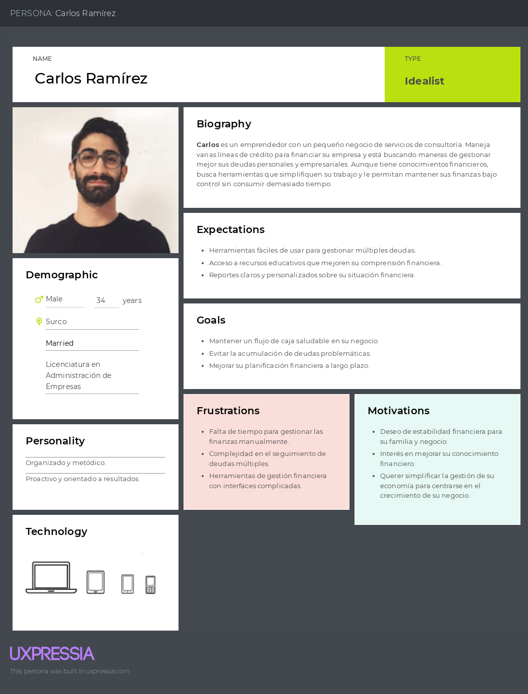
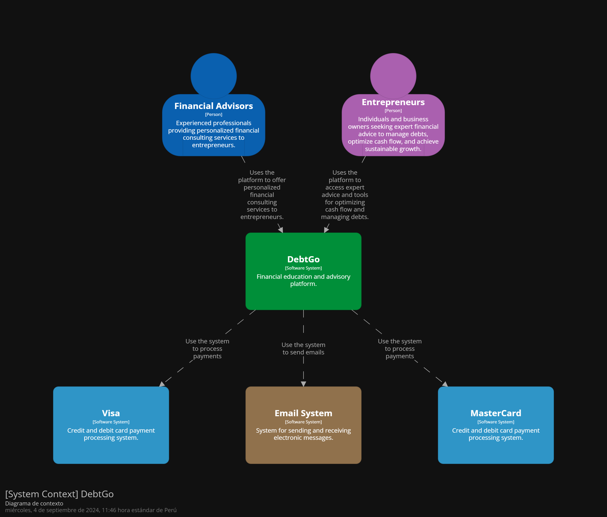
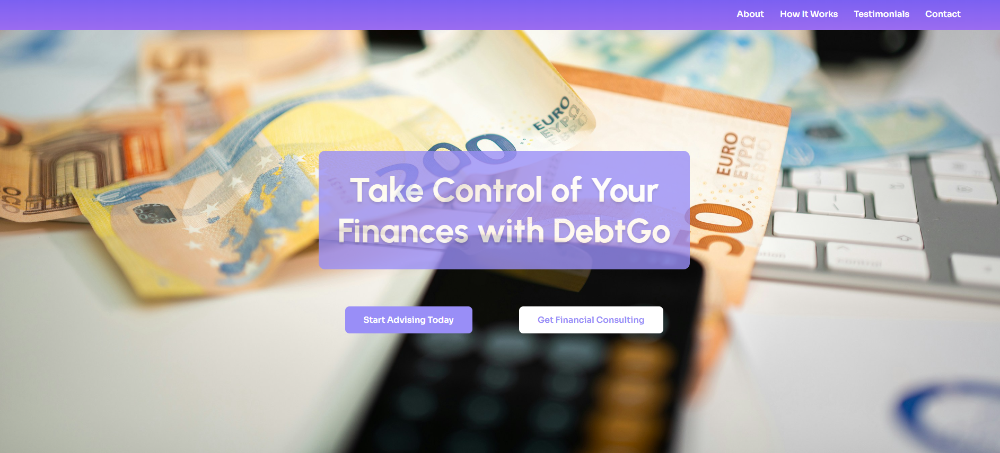
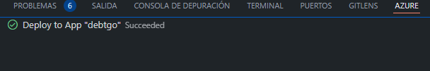

<hr>

# <center>COURSE PROJECT</center>

<p align="center">
    <strong>Universidad Peruana de Ciencias Aplicadas</strong><br>
    </img><br>
    <strong>Ingeniería de Software - 2024-2</strong><br>
    <strong>Aplicaciones Web - WX53</strong><br>
    <strong>Profesor: Alberto Wilmer Sanchez Seña</strong><br>
    <br>INFORME DE TRABAJO FINAL - TB1
</p>

</p>

<p align="center">
    <strong>Startup: Apple Web</strong><br>
    <strong>Producto: DebtGo</strong>
</p>

<div style="text-align:center;">
    <h3>Team Members:</h3>
    <table align="center">
        <tr>
            <th style="text-align:center;">Member</th>
            <th style="text-align:center;">Code</th>
        </tr>
        <tr>
            <td>Medina Chocce, Karito Dianeth</td>
            <td>U20221C769</td>
        </tr>
        <tr>
            <td>Sanchez Rios, Camila Cristina</td>
            <td>U202210973</td>
        </tr>
        <tr>
            <td>Durand Vera, Gianfranco Angel</td>
            <td>U20201F640</td>
        </tr>
        <tr>
            <td>Chávarri Zarzosa, Daniel Jhared </td>
            <td>U202211108</td>
        </tr>
         <tr>
            <td>Duran Santander, Emilia Mercedes </td>
            <td>U201914541</td>
         </tr>
    </table>
</div>

<p align="center">
    <strong>Agosto, 2024</strong>
</p>
<br>

<h1 align="center">Registro de versiones del Informe</h1>
</br>
<table>
        <thead>
            <tr>
                <th>Versión</th>
                <th>Fecha</th>
                <th>Autor</th>
                <th>Descripción de modificaciones</th>
            </tr>
        </thead>
        <tbody>
            <tr>
                <th>TB1</th>
                <td>20/08/2024</td>
                <td>
                    <ul>
          <li>Karito Medina</li>
          <li>Camila Sanchez</li>
          <li>Gianfranco Durand</li>
          <li>Daniel Chávarri</li>
          <li>Emilia Duran</li>
                    <ul>
           </td>
      <td>            
             <ul>
          <li>Capítulo I: Introducción</li>
          <li>Capítulo II: Requirements Elicitation & Analysis</li>
          <li>Capítulo III: Requirements Specification</li>
          <li>Capítulo IV: Product Design</li>
          <li>Avance del Capítulo V: Product Implementation, Validation & Deployment hasta el punto 5.2.1.8</li>
          <li>Avance de Conclusiones, Bibliografía y Anexos</li>
        </ul>
      </td>
  </tr>
</tbody>
</table>

# Project Report Collaboration Insights
Link del repositorio del reporte del TB1: https://github.com/upc-pre-202402-si730-wx53-apple-web 

Para el presente informe, se llevaron a cabo reuniones y se distribuyeron los puntos a elaborar para la entrega actual, correspondientes a los Capítulos I hasta el Capítulo V: Sprint 1. Quedando de la siguiente manera:
- Imágen de las Contribuciones del equipo:

<p></p>
<br><br>


# Contenido
[Student Outcome](#student-outcome)

[Capítulo I: Introducción](#capitulo-i-introducción)
- [1.1. Startup Profile](#11-startup-profile)
  - [1.1.1. Descripción de la Startup](#111-descripción-de-la-startup)
  - [1.1.2. Perfiles de integrantes del equipo](#112-perfiles-de-integrantes-del-equipo)
- [1.2. Solution Profile](#12-solution-profile)
  - [1.2.1 Antecedentes y problemática](#121-antecedentes-y-problemática)
  - [1.2.2 Lean UX Process](#122-lean-ux-process)
    - [1.2.2.1. Lean UX Problem Statements](#1221-lean-ux-problem-statements)
    - [1.2.2.2. Lean UX Assumptions](#1222-lean-ux-assumptions)
    - [1.2.2.3. Lean UX Hypothesis Statements](#1223-lean-ux-hypothesis-statements)
    - [1.2.2.4. Lean UX Canvas](#1224-lean-ux-canvas)
- [1.3. Segmentos objetivo](#13-segmentos-objetivo)

[Capítulo II: Requirements Elicitation & Analysis](#capítulo-ii-requirements-elicitation--analysis)
- [2.1. Competidores](#21-competidores)
  - [2.1.1. Análisis competitivo](#211-análisis-competitivo)
  - [2.1.2. Estrategias y tácticas frente a competidores](#212-estrategias-y-tácticas-frente-a-competidores)
- [2.2. Entrevistas](#22-entrevistas)
  - [2.2.1. Diseño de entrevistas](#221-diseño-de-entrevistas)
  - [2.2.2. Registro de entrevistas](#222-registro-de-entrevistas)
  - [2.2.3. Análisis de entrevistas](#223-análisis-de-entrevistas)
- [2.3. Needfinding](#23-needfinding)
  - [2.3.1. User Personas](#231-user-personas)
  - [2.3.2. User Task Matrix](#232-user-task-matrix)
  - [2.3.3. User Journey Mapping](#233-user-journey-mapping)
  - [2.3.4. Empathy Mapping](#234-empathy-mapping)
  - [2.3.5. As-is Scenario Mapping](#235-as-is-scenario-mapping)
- [2.4. Ubiquitous Language](#24-ubiquitous-language)

[Capítulo III: Requirements Specification](#capítulo-iii-requirements-specification)
- [3.1. To-Be Scenario Mapping](#31-to-be-scenario-mapping)
- [3.2. User Stories](#32-user-stories)
- [3.3. Impact Mapping](#33-impact-mapping)
- [3.4. Product Backlog](#34-product-backlog)

[Capítulo IV: Product Design](#capítulo-iv-product-design)
- [4.1. Style Guidelines](#41-style-guidelines)
  - [4.1.1. General Style Guidelines](#411-general-style-guidelines)
  - [4.1.2. Web Style Guidelines](#412-web-style-guidelines)
- [4.2. Information Architecture](#42-information-architecture)
  - [4.2.1. Organization Systems](#421-organization-systems)
  - [4.2.2. Labeling Systems](#422-labeling-systems)
  - [4.2.3. SEO Tags and Meta Tag](#423-seo-tags-and-meta-tag)
  - [4.2.4. Searching Systems](#424-searching-systems)
  - [4.2.5. Navigation Systems](#425-navigation-systems)
- [4.3. Landing Page UI Design](#43-landing-page-ui-design)
  - [4.3.1. Landing Page Wireframe](#431-landing-page-wireframe)
  - [4.3.2. Landing Page Mock-up](#432-landing-page-mock-up)
- [4.4. Web Applications UX/UI Design](#44-web-applications-uxui-design)
  - [4.4.1. Web Applications Wireframes](#411-general-style-guidelines)
  - [4.4.2. Web Applications Wireflow Diagrams](#442-web-applications-wireflow-diagrams)
  - [4.4.3. Web Applications Mock-ups](#443-web-applications-mock-ups)
  - [4.4.4. Web Applications User Flow Diagrams](#444-web-applications-user-flow-diagrams)
- [4.5. Web Applications Prototyping](#45-web-applications-prototyping)
- [4.6. Domain-Driven Software Architecture](#46-domain-driven-software-architecture)
  - [4.6.1. Software Architecture Context Diagram](#461-software-architecture-context-diagram)
  - [4.6.2. Software Architecture Container Diagrams](#462-software-architecture-container-diagrams)
  - [4.6.3. Software Architecture Components Diagrams](#463-software-architecture-components-diagrams)
- [4.7. Software Object-Oriented Design](#47-software-object-oriented-design)
  - [4.7.1. Class Diagrams](#471-class-diagrams)
  - [4.7.2. Class Dictionary](#472-class-dictionary)
- [4.8. Database Design](#48-database-design)
  - [4.8.1. Database Diagram](#481-database-diagram)

[Capítulo V: Product Implementation, Validation & Deployment](#capítulo-v-product-implementation-validation--deployment)
- [COURSE PROJECT](#course-project)
- [Project Report Collaboration Insights](#project-report-collaboration-insights)
- [Contenido](#contenido)
- [Student Outcome](#student-outcome)
- [Capítulo I: Introducción](#capítulo-i-introducción)
  - [1.1. Startup Profile](#11-startup-profile)
    - [1.1.1. Descripción de la Startup](#111-descripción-de-la-startup)
    - [1.1.2. Perfiles de integrantes del equipo](#112-perfiles-de-integrantes-del-equipo)
  - [1.2. Solution Profile](#12-solution-profile)
    - [1.2.1 Antecedentes y problemática](#121-antecedentes-y-problemática)
    - [1.2.2 Lean UX Process](#122-lean-ux-process)
      - [1.2.2.1. Lean UX Problem Statements](#1221-lean-ux-problem-statements)
      - [1.2.2.2. Lean UX Assumptions](#1222-lean-ux-assumptions)
      - [1.2.2.3. Lean UX Hypothesis Statements](#1223-lean-ux-hypothesis-statements)
      - [1.2.2.4. Lean UX Canvas](#1224-lean-ux-canvas)
  - [1.3. Segmentos objetivo](#13-segmentos-objetivo)
- [Capítulo II: Requirements Elicitation \& Analysis](#capítulo-ii-requirements-elicitation--analysis)
  - [2.1. Competidores](#21-competidores)
    - [2.1.1. Análisis competitivo](#211-análisis-competitivo)
    - [2.1.2. Estrategias y tácticas frente a competidores](#212-estrategias-y-tácticas-frente-a-competidores)
  - [2.2. Entrevistas](#22-entrevistas)
    - [2.2.1. Diseño de entrevistas](#221-diseño-de-entrevistas)
    - [2.2.2. Registro de entrevistas](#222-registro-de-entrevistas)
    - [2.2.3. Análisis de entrevistas](#223-análisis-de-entrevistas)
  - [2.3. Needfinding](#23-needfinding)
    - [2.3.1. User Personas](#231-user-personas)
    - [2.3.2. User Task Matrix](#232-user-task-matrix)
    - [2.3.3. User Journey Mapping](#233-user-journey-mapping)
    - [2.3.4. Empathy Mapping](#234-empathy-mapping)
    - [2.3.5. As-is Scenario Mapping](#235-as-is-scenario-mapping)
  - [2.4. Ubiquitous Language](#24-ubiquitous-language)
- [Capítulo III: Requirements Specification](#capítulo-iii-requirements-specification)
  - [3.1. To-Be Scenario Mapping](#31-to-be-scenario-mapping)
  - [3.2. User Stories](#32-user-stories)
  - [3.3. Impact Mapping](#33-impact-mapping)
  - [3.4. Product Backlog](#34-product-backlog)
- [Capítulo IV: Product Design](#capítulo-iv-product-design)
  - [4.1. Style Guidelines](#41-style-guidelines)
    - [4.1.1. General Style Guidelines](#411-general-style-guidelines)
    - [4.1.2. Web Style Guidelines](#412-web-style-guidelines)
  - [4.2. Information Architecture](#42-information-architecture)
    - [4.2.1. Organization Systems](#421-organization-systems)
    - [4.2.2. Labeling Systems](#422-labeling-systems)
    - [4.2.3. SEO Tags and Meta Tag](#423-seo-tags-and-meta-tag)
    - [4.2.4. Searching Systems](#424-searching-systems)
    - [4.2.5. Navigation Systems](#425-navigation-systems)
  - [4.3. Landing Page UI Design](#43-landing-page-ui-design)
    - [4.3.1. Landing Page Wireframe](#431-landing-page-wireframe)
    - [4.3.2. Landing Page Mock-up](#432-landing-page-mock-up)
  - [4.4. Web Applications UX/UI Design](#44-web-applications-uxui-design)
    - [4.4.1. Web Applications Wireframes](#441-web-applications-wireframes)
    - [4.4.2. Web Applications Wireflow Diagrams](#442-web-applications-wireflow-diagrams)
    - [4.4.3. Web Applications Mock-ups](#443-web-applications-mock-ups)
    - [4.4.4. Web Applications User Flow Diagrams](#444-web-applications-user-flow-diagrams)
  - [4.5. Web Applications Prototyping](#45-web-applications-prototyping)
  - [4.6. Domain-Driven Software Architecture](#46-domain-driven-software-architecture)
    - [4.6.1. Software Architecture Context Diagram](#461-software-architecture-context-diagram)
    - [4.6.2. Software Architecture Container Diagrams](#462-software-architecture-container-diagrams)
    - [4.6.3. Software Architecture Components Diagrams](#463-software-architecture-components-diagrams)
  - [4.7. Software Object-Oriented Design](#47-software-object-oriented-design)
    - [4.7.1. Class Diagrams](#471-class-diagrams)
    - [4.7.2. Class Dictionary](#472-class-dictionary)
  - [4.8. Database Design](#48-database-design)
  - [4.8.1. Database Diagram](#481-database-diagram)
- [Capítulo V: Product Implementation, Validation \& Deployment](#capítulo-v-product-implementation-validation--deployment)
  - [5.1. Software Configuration Management](#51-software-configuration-management)
    - [5.1.1. Software Development Environment Configuration](#511-software-development-environment-configuration)
    - [5.1.2. Source Code Management](#512-source-code-management)
    - [5.1.3. Source Code Style Guide \& Conventions](#513-source-code-style-guide--conventions)
    - [5.1.4. Software Deployment Configuration](#514-software-deployment-configuration)
  - [5.2. Landing Page, Services \& Applications Implementation](#52-landing-page-services--applications-implementation)
    - [5.2.1. Sprint 1](#521-sprint-1)
      - [5.2.1.1. Sprint Planning 1](#5211-sprint-planning-1)
      - [5.2.1.2. Sprint Backlog 1](#5212-sprint-backlog-1)
      - [5.2.1.3. Development Evidence for Sprint Review](#5213-development-evidence-for-sprint-review)
      - [5.2.1.4. Testing Suite Evidence for Sprint Review](#5214-testing-suite-evidence-for-sprint-review)
      - [5.2.1.5. Execution Evidence for Sprint Review](#5215-execution-evidence-for-sprint-review)
      - [5.2.1.6. Services Documentation Evidence for Sprint Review](#5216-services-documentation-evidence-for-sprint-review)
      - [5.2.1.7. Software Deployment Evidence for Sprint Review](#5217-software-deployment-evidence-for-sprint-review)
      - [5.2.1.8. Team Collaboration Insights during Sprint](#5218-team-collaboration-insights-during-sprint)
    - [5.2.2. Sprint 2](#522-sprint-2)
      - [5.2.2.1. Sprint Planning 2](#5221-sprint-planning-2)
      - [5.2.2.2. Sprint Backlog 2](#5222-sprint-backlog-2)
      - [5.2.2.3. Development Evidence for Sprint Review](#5223-development-evidence-for-sprint-review)
      - [5.2.2.4. Testing Suite Evidence for Sprint Review](#5224-testing-suite-evidence-for-sprint-review)
      - [5.2.2.5. Execution Evidence for Sprint Review](#5225-execution-evidence-for-sprint-review)
      - [5.2.2.6. Services Documentation Evidence for Sprint Review](#5226-services-documentation-evidence-for-sprint-review)
      - [5.2.2.7. Software Deployment Evidence for Sprint Review](#5227-software-deployment-evidence-for-sprint-review)
      - [5.2.2.8. Team Collaboration Insights during Sprint](#5228-team-collaboration-insights-during-sprint)
    - [5.2.3. Sprint 3](#523-sprint-3)
      - [5.2.3.1. Sprint Planning 3](#5231-sprint-planning-3)
      - [5.2.3.2. Sprint Backlog 3](#5232-sprint-backlog-3)
      - [5.2.3.3. Development Evidence for Sprint Review](#5233-development-evidence-for-sprint-review)
      - [5.2.3.4. Testing Suite Evidence for Sprint Review](#5234-testing-suite-evidence-for-sprint-review)
      - [5.2.3.5. Execution Evidence for Sprint Review](#5235-execution-evidence-for-sprint-review)
      - [5.2.3.6. Services Documentation Evidence for Sprint Review](#5236-services-documentation-evidence-for-sprint-review)
      - [5.2.3.7. Software Deployment Evidence for Sprint Review](#5237-software-deployment-evidence-for-sprint-review)
      - [5.2.3.8. Team Collaboration Insights during Sprint](#5238-team-collaboration-insights-during-sprint)
    - [5.2.4. Sprint 4](#524-sprint-4)
      - [5.2.4.1. Sprint Planning 4](#5241-sprint-planning-4)
      - [5.2.4.2. Sprint Backlog 4](#5242-sprint-backlog-4)
      - [5.2.4.3. Development Evidence for Sprint Review](#5243-development-evidence-for-sprint-review)
      - [5.2.4.4. Testing Suite Evidence for Sprint Review](#5244-testing-suite-evidence-for-sprint-review)
      - [5.2.4.5. Execution Evidence for Sprint Review](#5245-execution-evidence-for-sprint-review)
      - [5.2.4.6. Services Documentation Evidence for Sprint Review](#5246-services-documentation-evidence-for-sprint-review)
      - [5.2.4.7. Software Deployment Evidence for Sprint Review](#5247-software-deployment-evidence-for-sprint-review)
      - [5.2.4.8. Team Collaboration Insights during Sprint](#5248-team-collaboration-insights-during-sprint)
  - [5.3. Validation Interviews](#53-validation-interviews)
    - [5.3.1. Diseño de Entrevistas](#531-diseño-de-entrevistas)
    - [Segmento Objetivo 1: Consultores Financieros](#segmento-objetivo-1-consultores-financieros)
    - [Segmento Objetivo 2: Emprendedores](#segmento-objetivo-2-emprendedores)
    - [5.3.2. Registro de Entrevistas](#532-registro-de-entrevistas)
  - [**Segmento Objetivo 1: Consultores Financieros**](#segmento-objetivo-1-consultores-financieros-1)
  - [**Segmento Objetivo 2: Emprendedores**](#segmento-objetivo-2-emprendedores-1)
    - [5.3.3. Evaluación según heurísticas](#533-evaluación-según-heurísticas)
  - [Incorporar un botón para grabar mensajes de voz en lugar de solo escribirlos, lo que agilizaría la interacción y haría el sistema más accesible.](#incorporar-un-botón-para-grabar-mensajes-de-voz-en-lugar-de-solo-escribirlos-lo-que-agilizaría-la-interacción-y-haría-el-sistema-más-accesible)
  - [5.4. Video About-The-Product](#54-video-about-the-product)
- [Conclusiones](#conclusiones)
  - [Conclusiones y recomendaciones](#conclusiones-y-recomendaciones)
  - [Video About-the-Team](#video-about-the-team)
- [Bibliografía](#bibliografía)
- [Anexos](#anexos)

[Conclusiones](#conclusiones)
- [Conclusiones y recomendaciones](#conclusiones-y-recomendaciones)
- [Video About-the-Team](#video-about-the-team)

[Bibliografía](#bibliografía)

[Anexos](#anexos)

# Student Outcome
ABET – EAC - Student Outcome 5

Criterio: Capacidad de funcionar efectivamente en un equipo cuyos miembros juntos proporcionan liderazgo, crear un entorno de colaboración e inclusivo, establecen objetivos, planifican tareas y cumplen objetivos. 

<table>
  <tr>
    <td><b>Criterio específico</b></td>
    <td><b>Acciones realizadas</b></td>
    <td><b>Conclusiones</b></td>
  </tr>
    </thead>
  <tbody>
    <tr>
      <td><b>Trabaja en equipo para
proporcionar liderazgo en
forma conjunta</b></td>
      <td>
        <p><b>Medina Chocce, Dianeth Karito  </b></p>
        <p><b>TB1:</b></p>
        <p>En el TB1, colaboré con mi equipo para analizar a nuestros competidores, redactando un informe que detalla sus estrategias y tácticas. Además, realicé entrevistas y llevé a cabo un impact mapping, lo que nos permitió tener una visión más clara del mercado y fortalecer nuestro enfoque conjunto. Esta experiencia me ayudó a ejercer liderazgo y guiar al equipo en la toma de decisiones informadas.</p>
        <p><b>TP1:</b></p>
        <p>En el TP1, me enfoqué en corregir el reporte y desarrollar el frontend para la gestión de usuarios, específicamente en la carga de registro y perfil. Durante esta etapa, asumí un rol activo para coordinar tareas y guiar al equipo en la implementación de soluciones, lo que contribuyó a un trabajo conjunto efectivo y a la consecución de nuestros objetivos comunes.</p>
        <p><b>TB2:</b></p>
        <p>En la TB2, colaboré estrechamente con mi equipo para desarrollar el Capítulo 5, específicamente en las secciones 5.3 y 5.4. Durante este proceso, lideré discusiones sobre la estructura del contenido y la importancia de los usuarios backend, asegurando que cada miembro pudiera aportar sus ideas y perspectivas. Esta experiencia fortaleció mi capacidad de liderazgo al coordinar esfuerzos y promover un ambiente donde todos se sintieran motivados a contribuir, lo que resultó en un trabajo cohesivo y alineado con nuestros objetivos.</p>
        <p><b>TF:</b></p>
        <p>.</p>
        <p><b>Sanchez Rios, Camila Cristina</b></p>
       <p><b>TB1:</b></p>
        <p>Realicé el Capítulo II: Requirements Elicitation & Analysis; también realicé lo sieguiente del Capítulo IV: 4.1. Style Guidelines, General Style Guidelines, Web Style Guidelines, Landing Page UI Design, Landing Page Wireframe, Landing Page Mock-up, Web Applications UX/UI Design, Web Applications Wireframes, Web Applications Wireflow Diagrams, Web Applications Mock-ups, Web Applications User Flow Diagrams, Web Applications Prototyping.</p>
        <p><b>TP1:</b></p>
        <p>Colaboración en el proyecto cumpliendo con las indicaciones realizadas por el equipo para lograr lo esperado. </p>
        <p><b>TB2:</b></p>
        <p>Para esta entrega colabore con la parte del web Services Notification y la parte del Capitulo 5 - Sprint 3 con algunas correciones.</p>
        <p><b>TF:</b></p>
        <p>Para esta entrega colabore en el Capitulo 5 con la realizacion de entrevista y documentacion, tambien hacer el trello del sprint 4. Si hubo correciones para el backend o web services las realice.</p>
        <p><b>Durand Vera, Gianfranco Angel</b></p>
        <p><b>TB1:</b></p>
        <p>Capítulo IV: Product Design y User Stories <br>Coordiné y realicé la reunión inicial del proyecto, explicando claramente los objetivos y el plan de trabajo. Cree diferentes reuniones para clarificar los roles de cada integrante del equipo.      
        </p>
        <p><b>TP1:</b></p>
        <p>He planificado las actividades del
equipo, incluyendo la asignación de
presentaciones y tareas para la segunda fase
del proyecto, con el fin de lograr los
objetivos establecidos para este entregable.</p>
        <p><b>TB2:</b></p>
        <p>Realizacion del Backend IAM con el fin de lograr los objetivos establecidos para este entregable.</p>
        <p><b>TF:</b></p>
        <p>.</p>
        <p><b>Chávarri Zarzosa, Daniel Jhared</b></p>
       <p><b>TB1:</b></p>
        <p>Realicé todo el Capítulo I, para el Capítulo 2 hice el Ubiquitous Language y para el Capítulo 4 hice el Style Guidelines, General Style Guidelines, Web Style Guidelines, Information Architecture, Organization Systems, Labeling Systems, SEO Tags and Meta Tag, Searching Systems y Navigation Systems. También realicé la presentación del Canvas</p>
        <p><b>TP1:</b></p>
        <p>Para el tp1 hice la parte de Messaging del Front-end y el Register del usuario, también agregué a los User Stories los Technical Stories.</p>
        <p><b>TB2:</b></p>
        <p>Para esta parte, he aportado en la creación del back-end para el context SubscriptionBC.</p>
        <p><b>TF:</b></p>
        <p>Seguí mejorando el back-end de mi context Subscriptions-BC, agregando lo que había implementado el profesor durante todo el ciclo, también revisé los back-ends de mis compañeros para asegurarme que no haya errores, hice recordatorios de las actividades que faltaban por hacer para terminar el proyecto de manera satisfactoria.</p>
        <p><b>Durán Santander, Emilia Mercedes.</b></p>
       <p><b>TB1:</b></p>
        <p>Realicé el capítulo III: Requirements Specification, en concreto el To-Be Scenario, User Stories y Product Backlog, así cómo también los As-Is Scenarios y Sprint Backlog para esta entrega. Apoyé a mis compañeros y pedí su ayuda en distintas secciones del informe</p>
        <p><b>TP1:</b></p>
        <p>Realizamos las correcciones basadas en el feedback otorgado, reuniendonos inicialmente para ordenarlo en orden de prioridad y poder establecer metas realistas para la entrega</p>
        <p><b>TB2:</b></p>
        <p>.</p>
        <p><b>TF:</b></p>
        <p>.</p>
      </td>
      <td>
        <p><strong>TB1:</strong></p>
        <p>En conclusión, en esta primera entrega se logró una buena comunicación entre los miembros del equipo. Cada participante estuvo activo y presento sus ideas de manera que todos pudieran entenderse entre sí. Concluimos que aún hay pequeñas dificultades para expresarnos con todos, pero que se puede solucionar con tiempo.</p>
        <p><strong>TP1:</strong></p>
        <p>En resumen, en esta segunda entrega se logró mejorar la comunicación entre los miembros del equipo, especialmente en el trabajo relacionado con el frontend y la corrección de errores previos. Cada participante mostró un compromiso activo y presentó sus ideas de manera clara, facilitando la comprensión mutua. Aunque aún enfrentamos algunos desafíos menores en la expresión de nuestras opiniones, estamos seguros de que con tiempo podremos solucionarlos. .</p>
        <p><strong>TB2:</strong></p>
        <p>En resumen, en esta tercera entrega se logró una mejora significativa en la comunicación entre los miembros del equipo, centrándonos en el backend y la implementación de la estructura, así como en la corrección de errores de entregas anteriores. Cada participante estuvo comprometido y presentó sus ideas de manera clara, lo que facilitó la comprensión entre todos. Aunque todavía enfrentamos algunos desafíos menores en la expresión de nuestras opiniones, confiamos en que con tiempo podremos superarlos. </p>
        <p><strong>TF:</strong></p>
        <p>En conclusión, nos comunicamos de manera activa por medio de mensajes y la documentación, mejorando los errores que teníamos durante todo el ciclo, además, cada participante estuvo comprometido y presentó todas las actividades que se les ha asignado. Aunque hubo dificultades durante el proceso, pudimos superarlo como grupo para poder terminar el proyecto de manera satisfactoria.</p>
      </td>
    </tr>
    <tr>
      <td>Crea un entorno colaborativo e
inclusivo, establece metas,
planifica tareas y cumple
objetivos</td>
      <td>
        <p><b>Medina Chocce, Dianeth Karito</b></p>
        <p><b>TB1:</b></p>
        <p>En el TB1, trabajé en un análisis detallado de nuestros competidores, donde redacté un informe sobre sus estrategias y tácticas, realicé entrevistas y llevé a cabo un impact mapping. Este proceso no solo facilitó la colaboración entre los miembros del equipo, sino que también nos permitió establecer metas claras y planificar nuestras acciones de manera efectiva, creando un ambiente inclusivo que fomentó la participación de todos.</p>
        <p><b>TP1:</b></p>
        <p>En el TP1, realicé correcciones al reporte y trabajé en el desarrollo del frontend para la gestión de usuarios, específicamente en la carga de registro y perfil. A través de una planificación cuidadosa y el establecimiento de metas claras, promoví un ambiente inclusivo donde cada miembro del equipo pudo aportar y colaborar, asegurando que alcanzáramos nuestros objetivos de manera efectiva.</p>
        <p><b>TB2:</b></p>
        <p>En la TB2, colaboré estrechamente con mi equipo para desarrollar el Capítulo 5, específicamente en las secciones 5.3 y 5.4. Durante este proceso, lideré discusiones sobre la estructura del contenido y la importancia de los usuarios backend, asegurando que cada miembro pudiera aportar sus ideas y perspectivas. Esta experiencia fortaleció mi capacidad de liderazgo al coordinar esfuerzos y promover un ambiente donde todos se sintieran motivados a contribuir, lo que resultó en un trabajo cohesivo y alineado con nuestros objetivos.</p>
        <p><b>TF:</b></p>
        <p>.</p>
        <p><b>Sanchez Rios, Camila Cristina</b></p>
       <p><b>TB1:</b></p>
        <p>Realicé el Capítulo II: Requirements Elicitation & Analysis; también realicé lo sieguiente del Capítulo IV: 4.1. Style Guidelines, General Style Guidelines, Web Style Guidelines, Landing Page UI Design, Landing Page Wireframe, Landing Page Mock-up, Web Applications UX/UI Design, Web Applications Wireframes, Web Applications Wireflow Diagrams, Web Applications Mock-ups, Web Applications User Flow Diagrams, Web Applications Prototyping.</p>
        <p><b>TP1:</b></p>
        <p>Colaboración en el proyecto cumpliendo con las indicaciones realizadas por el equipo para lograr lo esperado.</p>
        <p><b>TB2:</b></p>
        <p>Para esta entrega colabore con la parte del web Services Notification y la parte del Capitulo 5 - Sprint 3 con algunas correciones.</p>
        <p><b>TF:</b></p>
        <p>Para esta entrega colabore en el Capitulo 5 con la realizacion de entrevista y documentacion, tambien hacer el trello del sprint 4. Si hubo correciones para el backend o web services las realice.</p>
        <p><b>Durand Vera, Gianfranco Angel</b></p>
        <p><b>TB1:</b></p>
        <p>Capítulo IV: Product Design y User Stories <br>Cree repositorios para almacenar nuestro informe con un registro de versiones constante, además de comenzar un registro de los puntos que nos falta completar.
        </p>
        <p><b>TP1:</b></p>
        <p>Cree el repositorio base para el desarrollo del Frontend, generando una plantilla y ramas base para que el equipo pueda empezar a realizar su trabajo.</p>
        <p><b>TB2:</b></p>
        <p>Realizacion del Backend IAM con el fin de lograr los objetivos establecidos para este entregable.</p>
        <p><b>TF:</b></p>
        <p>.</p>
        <p><b>Chávarri Zarzosa, Daniel Jhared</b></p>
       <p><b>TB1:</b></p>
        <p>Realicé todo el Capítulo I, para el Capítulo 2 hice el Ubiquitous Language y para el Capítulo 4 hice el Style Guidelines, General Style Guidelines, Web Style Guidelines, Information Architecture, Organization Systems, Labeling Systems, SEO Tags and Meta Tag, Searching Systems y Navigation Systems. También realicé la presentación del Canvas</p>
        <p><b>TP1:</b></p>
        <p>Para el tp1 hice la parte de Messaging del Front-end y el Register del usuario, también agregué a los User Stories los Technical Stories.</p>
        <p><b>TB2:</b></p>
        <p>Para esta parte, he aportado en la creación del back-end para el context SubscriptionBC.</p>
        <p><b>TF:</b></p>
        <p>Seguí mejorando el back-end de mi context Subscriptions-BC, agregando lo que había implementado el profesor durante todo el ciclo, también revisé los back-ends de mis compañeros para asegurarme que no haya errores, hice recordatorios de las actividades que faltaban por hacer para terminar el proyecto de manera satisfactoria.</p>
        <p><b>Durán Santander, Emilia Mercedes</b></p>
       <p><b>TB1:</b></p>
        <p>Realicé el capítulo III: Requirements Specification, detallado en el punto anterior. En reuniones de proyecto, dividí lo restante del proyecto en equipos para poder llegar a las metas establecidas anteriormente.</p>
        <p><b>TP1:</b></p>
        <p>Coordiné la reunión inicial para comenzar los avances de la entrega y la reunión subsecuente para mostrar los avances de la misma, con el propósito de cumplir las metas</p>
        <p><b>TB2:</b></p>
        <p>.</p>
        <p><b>TF:</b></p>
        <p>.</p>
      </td>
       <td>
        <p><strong>TB1:</strong></p>
        <p>Se participó equitativamente el informe. En conclusión, estamos en camino para desempeñarnos de manera equitativa en el trabajo.</p>
        <p><strong>TP1:</strong></p>
        <p>En resumen, en esta segunda entrega se logró mejorar la comunicación entre los miembros del equipo, especialmente en el trabajo relacionado con el frontend y la corrección de errores previos. Cada participante mostró un compromiso activo y presentó sus ideas de manera clara, facilitando la comprensión mutua. Aunque aún enfrentamos algunos desafíos menores en la expresión de nuestras opiniones, estamos seguros de que con tiempo podremos solucionarlos.</p>
        <p><strong>TB2:</strong></p>
        <p>En resumen, en esta tercera entrega se logró una mejora significativa en la comunicación entre los miembros del equipo, centrándonos en el backend y la implementación de la estructura, así como en la corrección de errores de entregas anteriores. Cada participante estuvo comprometido y presentó sus ideas de manera clara, lo que facilitó la comprensión entre todos. Aunque todavía enfrentamos algunos desafíos menores en la expresión de nuestras opiniones, confiamos en que con tiempo podremos superarlos.</p>
        <p><strong>TF:</strong></p>
        <p>En conclusión, nos comunicamos de manera activa por medio de mensajes y la documentación, mejorando los errores que teníamos durante todo el ciclo, además, cada participante estuvo comprometido y presentó todas las actividades que se les ha asignado. Aunque hubo dificultades durante el proceso, pudimos superarlo como grupo para poder terminar el proyecto de manera satisfactoria.</p>
      </td>
    </tr>
  </tbody>
</table>

# Capítulo I: Introducción
## 1.1. Startup Profile
### 1.1.1. Descripción de la Startup

DebtGo es una aplicación que revoluciona la manera en que las personas acceden a préstamos empresariales y manejan sus deudas personales. Esta startup impulsa la implementación de una aplicación intuitiva, brindando a los usuarios las herramientas necesarias para gestionar sus deudas de manera efectiva y mejorar su conocimiento financiero. La aplicación ofrece herramientas avanzadas para la gestión de deudas, seguimiento de ingresos y gastos, y el asesoramiento personalizado por parte de consultores financieros expertos.

Hoy en día las obligaciones económicas desde muy temprana edad son una realidad y DebtGo es el mejor aliado para ayudar tanto a jóvenes empresarios como a personas con deudas personales a gestionar sus finanzas y economía para gozar de un bienestar financiero.

Nuestro modelo de negocio digital se centra principalmente en ofrecer servicios de consultoría financiera personalizada y talleres en línea, que los usuarios pueden adquirir por una tarifa adicional. Estos servicios permiten a los usuarios recibir asesoramiento adaptado a sus necesidades específicas y participar en sesiones educativas especializadas. Además, ofrecemos un servicio de suscripción, donde los usuarios pagan una tarifa mensual o anual para acceder a características premium, como análisis financieros detallados, planes de pago personalizados, y contenido educativo exclusivo. Este enfoque diversificado garantiza que DebtGo sea independiente y sostenible, proporcionando un flujo de ingresos continuo mientras se centra en la creación de valor para el usuario.

DebtGo no se basa en el comercio electrónico ni en la publicidad, sino que permite mantener una experiencia de usuario limpia y enfocada en el bienestar financiero. Además, el componente innovador del modelo radica en la personalización avanzada de los presupuestos y recomendaciones financieras adaptadas a las necesidades y hábitos de gasto de los usuarios, lo que distingue DebtGo de otras aplicaciones en el mercado.

A manera de escalabilidad, proponemos introducir a futuro el uso de inteligencia artificial para personalizar aún más las recomendaciones financieras y proveer retroalimentación a los usuarios en su progreso educativo.

### 1.1.2. Perfiles de integrantes del equipo
<table>
  <tr>
    <th>
      
    </th>
    <td valign="top">
      <p><b>Durand Vera, Gianfranco Angel</b></p>
      <p>
        Soy estudiante de la carrera de Ingeniería de Software en la Universidad Peruana de Ciencias Aplicadas, actualmente me encuentro en el sexto ciclo, escogí esta carrera porque me 
        gusta mucho la programación. Tengo experiencia en lenguajes de programación como C++, C#, Python, Kotlin y JavaScript.
      </p>
    </td>
  </tr>
   <tr>
    <th>
      
    </th>
    <td valign="top">
      <p><b>Sanchez Rios, Camila Cristina</b></p>
      <p>
        Soy estudiante de la carrera de Ingeniería de Software en la Universidad Peruana de Ciencias Aplicadas, actualmente me encuentro en el cuarto ciclo. Me gusta escuchar música y 
        leer en los ratos libres y aprender más sobre la carrera.
      </p>
    </td>
  </tr>
     <tr>
    <th>
      
    </th>
    <td valign="top">
      <p><b>Medina Chocce, Karito Dianeth</b></p>
      <p>
        Hola, soy Karito Medina, actualmente estudio Ingeniería de Software en la Universidad de Ciencias Aplicadas (UPC). Me considero una persona responsable, respetuosa y con una 
        fuerte habilidad para trabajar en equipo. Me esfuerzo por contribuir positivamente a cada proyecto en el que participo, buscando siempre mejorar los resultados grupales y 
        alcanzar los objetivos comunes. Estoy entusiasmada por aplicar mis conocimientos y habilidades para enfrentar nuevos desafíos y seguir creciendo en el campo de la tecnología.
      </p>
    </td>
  </tr>
     <tr>
    <th>
      
    </th>
    <td valign="top">
      <p><b>Chávarri Zarzosa, Daniel Jhared</b></p>
      <p>
       Soy estudiante de la UPC, tengo 19 años. Estoy en la carrera de Ingeniería de Software, ya que, siempre me gustó la tecnología, los videojuegos, las páginas web, pero sobre todo 
       cómo crearlos. Estoy cursando el 5 ciclo de la carrera y mis habilidades son C++, Python, HTML y JavaScript. También soy bueno en ser responsable con cada curso y organizar mi 
       tiempo en ellos.
      </p>
    </td>
  </tr>
  <tr>
    <th>
      
    </th>
    <td valign="top">
      <p><b>Durán Santander, Emilia Mercedes</b></p>
      <p>
        Soy estudiante de la carrera de Ingeniería de Software, actualmente en el 6to ciclo en la Universidad Peruana de Ciencias Aplicadas. Cuento con conocimientos técnicos en C++, 
        HTML y Javascript. Mi experiencia en proyectos de múltiples iteraciones me ha ayudado a obtener mejores resultados.
      </p>
    </td>
  </tr>
</table>

## 1.2. Solution Profile
### 1.2.1 Antecedentes y problemática

Muchas personas enfrentan la falta de conocimiento y claridad en relación con el estado de sus finanzas, lo cual es un problema que afecta a una gran parte de la población. Esta situación no solo se debe a la falta de educación financiera, sino también a la complejidad con la que a menudo se presentan los términos y condiciones de los productos crediticios. Como resultado, muchas personas desconocen no solo las fuentes exactas de sus deudas, sino también los montos originales, los intereses acumulados, y las posibles penalidades por pagos tardíos o incumplimientos. Por otro lado, los emprendedores enfrentan el desafío de los préstamos bancarios, sus condiciones y lo que implica pagar estos préstamos de vuelta, o no pagarlos a tiempo.  

Esta falta de información clara y accesible puede llevar a situaciones en las que los individuos no recuerdan cuándo adquirieron una deuda específica, cómo se calcularon los intereses o qué entidad financiera está gestionando sus pagos. Además, la carencia de recordatorios efectivos o herramientas que faciliten la gestión de sus obligaciones financieras puede hacer que las personas pierdan de vista las fechas de vencimiento de los pagos, lo que a su vez incrementa el riesgo de caer en mora. Este desconocimiento no solo afecta su historial crediticio, sino que también puede generar estrés significativo, impactos negativos en su salud mental y dificultades en su vida cotidiana.

A medida que las deudas se acumulan y se vuelven más difíciles de manejar, muchas personas se encuentran atrapadas en un ciclo de endeudamiento, donde la falta de claridad y organización agrava su situación financiera. Esto puede llevar a tomar decisiones desesperadas, como adquirir nuevas deudas para pagar las existentes, lo que finalmente incrementa la carga financiera y perpetúa un círculo vicioso de deuda. Es fundamental abordar este problema mediante la educación financiera, la transparencia en la información proporcionada por las instituciones crediticias, y el desarrollo de herramientas que permitan a los usuarios gestionar y entender mejor sus deudas. Solo así se podrá reducir la incidencia de problemas financieros graves y mejorar la calidad de vida de las personas afectadas.

**5Ws y 2Hs:**

**Qué:** La falta de educación financiera en el público general conlleva a varios problemas en el futuro de las personas, y afecta sus prospectos al momento de adquirir préstamos - sean estos préstamos personales o empresariales. DebtGo es una aplicación innovadora que proporciona a los usuarios una plataforma para interactuar directamente con consultores financieros expertos, que ofrecen atención personalizada a los casos específicos de cada usuario. Adicionalmente, cuenta con herramientas avanzadas para comprender, monitorear y gestionar sus deudas de manera intuitiva, mientras fortalecen su educación financiera. Ofrece funcionalidades como la creación de presupuestos personalizados, seguimiento de ingresos y gastos, y acceso a contenido educativo.

**Quién:** Está dirigida a dos segmentos principales: consultores financieros, y emprendedores. El primer segmento está comprendido por jóvenes profesionales, entre 20-30 años, que están entrando en el mercado laboral en carreras de finanzas. El segundo segmento abarca a emprendedores que requieren soluciones efectivas para manejar la adquisición de préstamos, deudas y mejorar su flujo de efectivo.

**Dónde:** El problema nace de la falta de educación financiera, lo que afecta a las personas a largo plazo, y se observa más comúnmente en la creación de deudas por falta de pagos

**Cuándo:** Este problema se visualiza durante los procesos de obtención de préstamos y cancelación de deudas, lo que para varios de los afectados, ocurre una vez el problema ha existido por largo tiempo, y lo hace más difícil revertir.

**Por qué:** La falta de conocimiento financiero y la complejidad en la gestión de deudas lleva a muchas personas a enfrentar estrés y dificultades financieras debido a la falta de claridad en sus obligaciones crediticias, lo que puede llevar a decisiones financieras deficientes y un ciclo de endeudamiento. La aplicación ofrece una solución integral para mejorar el bienestar financiero.

**Cómo:** La falta de educación financiera lleva a las personas a tomar decisiones desinformadas, lo que a su vez afecta su bienestar económico. Algunas de las consecuencias más comunes son la acumulación de deudas y la pérdida de ahorros. Esta situación de inestabilidad financiera impide alcanzar oportunidades y beneficios futuros. Mejorar la educación financiera es clave para romper estos patrones.

**Cuánto:** Miles de personas enfrentan problemas financieros por falta de educación financiera todos los días. En Estados Unidos, por ejemplo, la deuda total de tarjetas de crédito supera el trillón de dólares, y el consumidor promedio tiene más de $6000 de deuda. Mejorar la educación financiera es crucial para minimizar la brecha creada por este problema.


### 1.2.2 Lean UX Process
#### 1.2.2.1. Lean UX Problem Statements

Nuestra aplicación, DebtGo, está diseñada para ofrecer a los usuarios una herramienta poderosa que les permita gestionar sus deudas de manera efectiva, al mismo tiempo que fortalece su educación financiera. DebtGo se presenta como una oportunidad para que los usuarios mejoren su situación financiera, adoptando hábitos saludables que les permitan alcanzar sus objetivos económicos y evitar el ciclo de endeudamiento.

Sin embargo, hemos identificado ciertos factores que podrían ser desafíos significativos para la adopción de nuestra aplicación. Uno de los principales retos es la desconfianza que algunos usuarios pueden tener hacia una nueva empresa tecnológica. Esta desconfianza podría surgir del temor a que la aplicación no cumpla con sus expectativas o que no proporcione los resultados prometidos.

Ante estos desafíos, es crucial que abordemos las siguientes preguntas:

¿Cómo podemos construir confianza y credibilidad entre nuestros usuarios potenciales? Es fundamental demostrar que DebtGo es una herramienta confiable, segura y efectiva para la gestión de deudas. Estrategias como testimonios de usuarios, demostraciones de resultados tangibles, y certificaciones pueden ser claves para eliminar esta desconfianza.

¿Qué tan esencial es una aplicación de educación financiera en el contexto actual? Considerando el aumento del endeudamiento y la falta de educación financiera en diversos segmentos de la población, es primordial mostrar cómo DebtGo no solo facilita la gestión de deudas, sino que también empodera a los usuarios mediante el conocimiento, ayudándoles a tomar decisiones financieras informadas.

¿Cómo podemos motivar a las personas a reconocer el valor de nuestra aplicación? Es necesario comunicar claramente los beneficios y el impacto positivo que DebtGo puede tener en la vida financiera de los usuarios. El uso de casos de éxito, la oferta de pruebas gratuitas, y la integración de contenido educativo relevante pueden motivar a los usuarios a probar y adoptar la aplicación como una herramienta esencial en su vida diaria.

Al abordar estas preguntas de manera proactiva, buscamos no solo atraer a usuarios a DebtGo, sino también convertirnos en un aliado confiable en su camino hacia la estabilidad y el bienestar financiero.

#### 1.2.2.2. Lean UX Assumptions

1. Nuestros clientes una aplicación que no solo les ayude a gestionar sus deudas de manera efectiva, sino que también les ofrezca herramientas y recursos educativos para mejorar su 
   conocimiento financiero. DebtGo está diseñada para facilitar este proceso, permitiendo a los usuarios tomar el control de su situación financiera con mayor confianza y seguridad.

2. La aplicación busca empoderar a los jóvenes adultos con las habilidades necesarias para gestionar sus deudas y mejorar su educación financiera. La aplicación no solo les 
   proporcionará las herramientas para administrar sus finanzas, sino que también los educará sobre conceptos clave que les ayudarán a evitar futuras dificultades financieras.

3. Los usuarios iniciales de DebtGo serán personas mayores de 18 años que buscan una solución intuitiva y educativa para gestionar sus deudas. Este grupo incluye tanto a jóvenes adultos 
   que recién están comenzando a asumir responsabilidades financieras como a personas que desean mejorar su control sobre sus finanzas personales.

4. DebtGo planea generar ingresos a través de un modelo premium, donde los usuarios pueden acceder a funciones avanzadas mediante una suscripción. Esto nos permitirá monetizar a medida 
   que crece la base de usuarios y estos reconocen el valor adicional de las funciones premium.

5. Adquiriremos la mayoría de nuestros clientes a través de alianzas estratégicas con instituciones educativas, universidades, y organizaciones sin fines de lucro que promueven la 
   educación financiera. Ofreceremos seminarios y talleres gratuitos sobre gestión de deudas y finanzas personales, integrando el uso de DebtGo como una herramienta clave en estos 
   programas. Además, lanzaremos campañas de sensibilización en comunidades y foros en línea especializados en finanzas personales, donde podremos interactuar
   directamente con nuestro público objetivo, ofreciendo demostraciones y acceso a recursos exclusivos dentro de la aplicación.

6. Nuestra competencia incluye otras aplicaciones de gestión de deudas y educación financiera que ya están establecidas en el mercado. Sin embargo, DebtGo se diferencia por su enfoque 
   en la simplicidad, la personalización, y la educación financiera continua, que juntas ofrecen una experiencia única y valiosa para los usuarios.

7. Superaremos a nuestra competencia ofreciendo una aplicación que es altamente intuitiva y eficiente, diseñada para ser accesible incluso para aquellos sin conocimientos tecnológicos 
   avanzados. Además, la personalización de los planes de pago y la oferta de contenido educativo relevante nos posicionarán como la opción preferida entre los usuarios.

8. El mayor riesgo para DebtGo radica en la fuerte competencia en el mercado, lo que podría afectar nuestra rentabilidad. Con tantas opciones disponibles, los usuarios pueden optar por 
   aplicaciones más conocidas, lo que dificultará nuestra penetración y crecimiento en el mercado.

9. Para mitigar los riesgos, realizaremos un análisis exhaustivo de las fortalezas y debilidades de nuestra aplicación en comparación con las de la competencia. Utilizaremos esta 
   información para mejorar continuamente DebtGo, enfocándonos en optimizar la experiencia del usuario, ampliar la funcionalidad, y fortalecer nuestra propuesta de valor, asegurando así 
   la calidad y rentabilidad de la aplicación.

#### 1.2.2.3. Lean UX Hypothesis Statements

Creemos que al implementar más herramientas de notificaciones en la aplicación DebtGo, brindaremos a los usuarios alertas más eficaces sobre sus pagos pendientes. Éxito: Sabremos que hemos tenido éxito cuando el 80% de las llamadas registradas no presenten deudas pendientes.

Creemos que al añadir un mecanismo de categorización que permita a los usuarios seleccionar si son empresas o particulares, y que ajuste las funcionalidades de la aplicación según esa selección, mejoraremos la experiencia del usuario. Éxito: Sabremos que hemos tenido éxito cuando el 100% de los usuarios y empresas estén registrados formalmente en la plataforma.

Creemos que al ofrecer recompensas a los usuarios que paguen sus deudas de forma anticipada y sin retrasos, incentivaremos un comportamiento de pago puntual. Éxito: Sabremos que hemos tenido éxito cuando el porcentaje de deudas hacia la empresa disminuya en un 35%.

Creemos que al registrar de manera precisa a los usuarios que pagan y a los que no, reduciremos las llamadas innecesarias y optimizaremos el uso del tiempo. Éxito: Sabremos que hemos tenido éxito cuando el registro de usuarios de las empresas aumente en un 65%.

Creemos que la falta de actualizaciones o implementaciones de software tempranas en la aplicación afectará negativamente la gestión de deudas. Fracaso: Sabremos que hemos fracasado cuando las deudas de las empresas aumenten en un 25%.

Creemos que al no contar con un sistema de seguridad actualizado y moderno en nuestra aplicación, seremos vulnerables a ataques cibernéticos o intentos de hackeo. Fracaso: Sabremos que hemos fracasado cuando los ataques cibernéticos al sistema DebtGo aumenten en un 48%.

#### 1.2.2.4. Lean UX Canvas

 

 *Imagen (N°1). Elaboración propia. Realizado en Canva*

## 1.3. Segmentos objetivo

<strong>1. Consultores financieros:</strong>

Descripción: Este segmento incluye a jóvenes jóvenes profesionales, que se encuentran entrando al mercado laboral, o que se encuentren en los últimos ciclos de la universidad para carreras de finanzas, economía y afines. (20-30 años). Estas personas van a estar interesadas en adquirir ganancias extras y adquirir experiencia relevante en el mercado laboral.

Necesidades Satisfechas: DebtGo les ofrece la oportunidad para comprartir sus conocimientos de manera flexible y conveniente, mientras adquieren experiencia en el sector de consultoría que pueden utilizar para ampliar sus experiencias y habilidades al momento de aplicar para otros empleos en el futuro.

<strong>2. Emprendedores</strong>
   
Descripción: Este segmento abarca a personas con emprendedimientos o propietarios de pequeñas empresas, y aquellos que necesitan préstamos para iniciar o expandir sus negocios. Estos individuos enfrentan situaciones financieras apremiantes y buscan soluciones rápidas y efectivas para gestionar sus negocios, sus deudas y mejorar su flujo de efectivo.

Necesidades Satisfechas: DebtGo les proporciona una plataforma centralizada para gestionar y consolidar sus deudas, crear planes de pago personalizados, y evitar el pago de intereses adicionales. Además, se ofrece el servicio de consultoría personalizada con consultores financieros expertos, que tienen experiencia en el rubro y la habilidad para ayudar a estos emprendedores a realizar sus objetivos.

# Capítulo II: Requirements Elicitation & Analysis 

## 2.1. Competidores

Comprender el panorama competitivo es crucial para el éxito de DebtGo. En esta sección, identificaremos y describiremos a nuestros principales competidores directos e indirectos que operan en el ámbito de la gestión de deudas y la educación financiera. Analizaremos sus modelos de negocio, estrategias de marketing, productos y servicios, y los canales de distribución que utilizan. Además, realizaremos un análisis comparativo detallado de sus fortalezas, debilidades, oportunidades y amenazas (SWOT) en relación con DebtGo. Este análisis nos permitirá entender mejor el entorno competitivo y ajustar nuestras estrategias para maximizar nuestra ventaja en el mercado.

1. Mint (Intuit): Mint es una aplicación popular para la gestión de finanzas personales que ofrece seguimiento de gastos, presupuestos y alertas financieras. Es conocida por su interfaz intuitiva y sus capacidades de agregación de datos financieros.

2. You Need a Budget (YNAB): YNAB se centra en la creación de presupuestos y la gestión de finanzas personales mediante un enfoque basado en la asignación de cada dólar a una tarea específica. Ofrece herramientas para planificar el gasto y gestionar las deudas.

3. Credit Karma: Credit Karma ofrece herramientas para el seguimiento del crédito, la gestión de deudas y la comparación de productos financieros. Aunque su enfoque principal es el monitoreo del crédito, también proporciona recomendaciones para la gestión de deudas.

## 2.1.1. Analisis competitivo

El análisis competitivo implica examinar detenidamente a nuestros competidores para identificar sus fortalezas, debilidades, oportunidades y amenazas. Esto nos proporcionará una visión clara de nuestro posicionamiento en el mercado y nos ayudará a desarrollar estrategias efectivas.

<table>
  <tr>
    <th colspan="7" valign="top"><b>Competitive Analysis Landscape</b></th>
  </tr>
  <tr>
    <td colspan="2" rowspan="2">¿Por qué llevar a cabo este análisis?</td>
    <td colspan="5">Escriba en el recuadro la pregunta que busca responder o el objetivo de este análisis.</td>
  </tr>
  <tr>
    <td colspan="5">El análisis competitivo es fundamental para entender el entorno en el que DebtGo opera, identificar las fortalezas y debilidades de los competidores, y descubrir oportunidades y amenazas en el mercado. Este análisis ayuda a posicionar mejor nuestra startup en relación con los competidores y a definir estrategias que maximicen nuestra ventaja competitiva.</td>
  </tr>
  <tr>
    <td colspan="3">Nombre y Logo</td>
    <td colspan="1" valign="top" style="font-weight: bold;">
        DebtGo
        <br>
        <div style="text-align: center; margin-top: 10px;">
                </img>
        </div>
    <td colspan="1" valign="top" style="font-weight: bold;">
    Mint
    <div style="text-align: center;">
                </img>
        </div>
    </td>
    <td colspan="1" valign="top" style="font-weight: bold;">
      YNAB
      <div style="text-align: center; margin-top: 20px;">
                </img>
            </div>
      </td>
    <td colspan="1" valign="top" style="font-weight: bold;" >
      Credit Karma
      <div style="text-align: center; margin-top: 10px;">
                </img>
            </div>
    </td>
  </tr>
  <tr>
    <td colspan="1" rowspan="2"><p>Perfil</p></td>
    <td colspan="2">Overview</td>
    <td colspan="1" valign="top">Aplicación para gestionar deudas y educación financiera. Ofrece herramientas para seguimiento de ingresos, gastos y presupuestos.</td>
    <td colspan="1" valign="top">Plataforma para gestión de finanzas personales con seguimiento de gastos y presupuestos.</td>
    <td colspan="1" valign="top">Herramienta enfocada en la creación de presupuestos y asignación de fondos.</td>
    <td colspan="1" valign="top">Servicio de monitoreo de crédito con herramientas de gestión de deudas y recomendaciones financieras.</td>
  </tr>
  <tr>
    <td colspan="2">Ventaja competitiva¿Qué valor ofrece a los clientes?</td>
    <td colspan="1" valign="top">Personalización avanzada de presupuestos y recomendaciones financieras.</td>
    <td colspan="1" valign="top">Amplia integración con cuentas bancarias y tarjetas.</td>
    <td colspan="1" valign="top">Enfoque en la metodología de presupuesto y planificación.</td>
    <td colspan="1" valign="top">Monitoreo de crédito gratuito y recomendaciones personalizadas.</td>
  </tr>
  <tr>
    <td colspan="1" rowspan="2"><p>Perfil de Marketing</p></td>
    <td colspan="2">Mercado objetivo</td>
    <td colspan="1" valign="top">Jóvenes y adultos que desean mejorar su educación financiera y gestionar sus deudas.</td>
    <td colspan="1" valign="top">Usuarios interesados en el seguimiento de gastos y la gestión financiera.</td>
    <td colspan="1" valign="top">Personas que buscan un enfoque riguroso en la creación y seguimiento de presupuestos.</td>
    <td colspan="1" valign="top">Usuarios que desean monitorear su crédito y gestionar deudas.</td>
  </tr>
  <tr>
    <td colspan="2">Estrategias de marketing</td>
    <td colspan="1" valign="top">Marketing digital dirigido a usuarios interesados en finanzas personales.</td>
    <td colspan="1" valign="top">Publicidad a través de canales digitales y colaboraciones con influencers financieros.</td>
    <td colspan="1" valign="top">Marketing basado en testimonios y demostraciones del enfoque de presupuesto.</td>
    <td colspan="1" valign="top">Publicidad a través de contenido educativo sobre crédito y finanzas personales.</td>
  </tr>
  <tr>
    <td colspan="1" rowspan="3"><p>Perfil de Producto</p></td>
    <td colspan="2">Productos & Servicios</td>
    <td colspan="1" valign="top">Aplicación móvil con suscripción para características premium y servicios de consultoría financiera personalizada.</td>
    <td colspan="1" valign="top">Aplicación gratuita con opciones premium para características avanzadas.</td>
    <td colspan="1" valign="top">Suscripción mensual para acceso a herramientas de presupuesto y planificación.</td>
    <td colspan="1" valign="top">Aplicación gratuita con características premium para monitoreo avanzado y recomendaciones.</td>
  </tr>
  <tr>
    <td colspan="2">Precios & Costos</td>
    <td colspan="1" valign="top">Tarifa mensual o anual para suscripción premium, tarifas adicionales para consultoría y talleres.</td>
    <td colspan="1" valign="top">Gratuita con opciones de pago para características adicionales.</td>
    <td colspan="1" valign="top">Suscripción mensual o anual.</td>
    <td colspan="1" valign="top">Gratuita con opciones de pago para características avanzadas.</td>
  </tr>
  <tr>
    <td colspan="2">Canales de distribución (Web y/o Móvil)</td>
    <td colspan="1" valign="top">Web y móvil (iOS y Android).</td>
    <td colspan="1" valign="top">Web y móvil (iOS y Android).</td>
    <td colspan="1" valign="top">Web y móvil (iOS y Android).</td>
    <td colspan="1" valign="top">Web y móvil (iOS y Android).</td>
  </tr>
  <tr>
    <td colspan="1" rowspan="5"><p>Análisis SWOT</p></td>
    <td colspan="6">Realice esto para su startup y sus competidores. Sus fortalezas deberían apoyar sus oportunidades y contribuir a lo que ustedes definen como su posible ventaja competitiva.</td>
  </tr>
  <tr>
    <td colspan="2">Fortalezas</td>
    <td colspan="1" valign="top">Innovación en personalización y enfoque en educación financiera.</td>
    <td colspan="1" valign="top">Amplia integración con bancos y tarjetas.</td>
    <td colspan="1" valign="top">Método comprobado de asignación de presupuesto.</td>
    <td colspan="1" valign="top">Monitoreo de crédito gratuito y recomendaciones personalizadas.</td>
  </tr>
  <tr>
    <td colspan="2">Debilidades</td>
    <td colspan="1" valign="top">Falta de reconocimiento de marca en comparación con competidores establecidos.</td>
    <td colspan="1" valign="top">Dependencia de ingresos por publicidad y promociones.</td>
    <td colspan="1" valign="top">Curva de aprendizaje en la metodología de presupuesto.</td>
    <td colspan="1" valign="top">Limitación en la profundidad del análisis de finanzas más allá del crédito.</td>
  </tr>
  <tr>
    <td colspan="2">Oportunidades</td>
    <td colspan="1" valign="top">Creciente interés en la educación financiera y gestión de deudas.</td>
    <td colspan="1" valign="top">Expansión en mercados internacionales.</td>
    <td colspan="1" valign="top">Integración de características adicionales basadas en IA.</td>
    <td colspan="1" valign="top">Expansión en servicios de planificación financiera.</td>
  </tr>
  <tr>
    <td colspan="2">Amenazas</td>
    <td colspan="1" valign="top">Competencia creciente y posibles cambios en regulaciones financieras.</td>
    <td colspan="1" valign="top">Competencia de aplicaciones de finanzas personales más integrales.</td>
    <td colspan="1" valign="top">Competencia de plataformas con características similares.</td>
    <td colspan="1" valign="top">Cambios en regulaciones de crédito y competencia de herramientas de gestión financiera.</td>
  </tr>
</table>

## 2.1.2. Estrategias y tácticas frente a competidores

Desarrollar estrategias y tácticas sólidas para enfrentar a nuestros competidores es fundamental para alcanzar una ventaja competitiva sostenible. En esta sección, exploraremos cómo podemos diferenciarnos y destacarnos en el mercado.

<strong>Estrategias y Tácticas Preliminares de DebtGo:</strong>

#1 Diferenciación a través de Persoanlización Avanzada:
- **Estrategia:** Posicionar a DebtGo como la opción más avanzada en personalización de presupuestos y recomendaciones financieras.
- **Táctica:** Desarrollar y promocionar funcionalidades de inteligencia artificial que ofrezcan recomendaciones financieras ultra-personalizadas. Realizar campañas de marketing que destaquen esta capacidad única y cómo se traduce en mejores resultados financieros para los usuarios.

#2 Enfoque en Educación Financiera:
- **Estrategia:** Aprovechar el interés creciente en la educación financiera para atraer usuarios que buscan mejorar su bienestar financiero a través de conocimientos prácticos y personalizados.
- **Táctica:** Ofrecer contenido educativo exclusivo y talleres interactivos como parte del paquete premium. Publicar estudios de caso y testimonios de usuarios que han logrado mejorar sus finanzas utilizando DebtGo.

#3 Optimización de la Experiencia de Usuario (UX):
- **Estrategia:** Garantizar que la experiencia de usuario sea superior y sin distracciones, en comparación con competidores que dependen de modelos basados en publicidad.
- **Táctica:** Implementar una interfaz de usuario intuitiva y realizar pruebas continuas para optimizar la navegación y la usabilidad. Recolectar y analizar feedback de usuarios para realizar mejoras continuas.

#4 Innovación Tecnológica:
- **Estrategia:** Utilizar la tecnología de vanguardia para mantener una ventaja competitiva y diferenciarse en el mercado.
- **Táctica:** Invertir en el desarrollo de tecnologías emergentes, como el aprendizaje automático y la inteligencia artificial, para ofrecer características innovadoras que los competidores aún no tienen. Lanzar nuevas funcionalidades en fases para mantener el interés y la retención de los usuarios.
 
#5 Vigilancia y Adaptación Continua:
- **Estrategia:** Monitorear continuamente el panorama competitivo para adaptar las estrategias y tácticas en función de las tendencias y cambios del mercado.
- **Tácticas:** Establecer un equipo dedicado a la investigación competitiva y al análisis del mercado. Ajustar las estrategias de marketing y producto basadas en la evolución de las ofertas de los competidores y las expectativas de los usuarios.

Estas estrategias y tácticas nos ayudarán a posicionar a DebtGo de manera efectiva en el mercado, aprovechando sus fortalezas y oportunidades mientras se enfrentan a las debilidades y amenazas que presentan los competidores.

## 2.2. Entrevistas
### 2.2.1. Diseño de entrevistas

**Segmento Objetivo: Consultores financieros:**

1. ¿Cuál es su nombre completo?
2. ¿Cuál es su edad?
3. ¿En qué distrito reside actualmente?
4. ¿Cuál es su ocupación/profesión y cuántos años de experiencia tiene en el campo de la economía o la consultoría financiera?
5. ¿Está familiarizado con el término "educación financiera"? ¿Cómo lo definiría en su propio contexto profesional?
6. ¿Qué dispositivos tecnológicos utiliza con mayor frecuencia en su trabajo diario? ¿Cuál considera más esencial para su actividad profesional?
7. ¿Qué redes sociales utiliza para mantenerse actualizado en temas financieros o económicos? ¿Cómo las utiliza en su práctica profesional?
8. ¿Ha visto algún tipo de anuncio o promoción relacionada con aplicaciones de gestión financiera en su dispositivo? ¿Cuál fue su impresión?
9. ¿En su rol actual, gestiona o asesora sobre responsabilidades económicas de empresas o individuos? ¿Podría darme un ejemplo?
10. ¿Conoce INFOCORP u otras bases de datos de informes crediticios? ¿Qué importancia les da en su práctica profesional?
11. ¿Qué desafíos ve en la gestión de finanzas personales de sus clientes o en su propia vida financiera?
12. ¿Ha utilizado o recomendado alguna aplicación para la gestión de finanzas personales o empresariales? ¿Qué características le parecen más útiles?
13. En su opinión, ¿cuál es la necesidad más importante en la educación financiera de las personas actuales? ¿Cómo cree que una app como DebtGo podría abordar esta necesidad?
14. ¿Considera que una aplicación de gestión financiera personalizada puede tener un impacto significativo en la mejora de las finanzas personales de los usuarios? ¿Por qué sí o por qué no?

**Segmento Objetivo: Gestores de Deudas y Emprendedores**

1. ¿Cuál es su nombre completo?
2. ¿Cuál es su edad?
3. ¿En qué distrito reside actualmente?
4. ¿Qué tipo de empresa estás interesado en iniciar?
5. ¿Cuál es tu nivel de conocimiento de finanzas? 
6. ¿Has trabajado con consultores financieros anteriormente? ¿Crees que deberían tener experiencia en tu rubro para poder asesorarte?
7. ¿Tienes alguna experiencia en la obtención de préstamos?
8. ¿Está familiarizado con términos financieros como crédito, interés, liquidez, etc.? 
9. ¿Qué pasos en el proceso de la obtención de préstamos resultan más confusos?
10. ¿Qué te preocupa más al momento de solicitar préstamos para tu negocio? (ie.  interés, condiciones, etc)
11. ¿A qué plataformas consideras acudir para adquirir préstamos? ¿Por qué?
12. ¿Qué criterios utilizas para identificar si una publicidad de préstamos es real, o si es un intento de estafa?
13. ¿Utilizas aplicaciones de banca móvil? ¿Cómo te sientes acerca del nivel de seguridad ofrecido por estas aplicaciones?
14. ¿A qué nivel estarías dispuesto a compartir tus datos financieros en una aplicación de consultas financieras?
15. ¿Qué condiciones o garantías lo harían sentir más seguro al momento de compartir información financiera?

### 2.2.2. Registro de entrevistas

**Segmento Objetivo: Consultores financieros:**

**Entrevista #1**

- Nombre: Jose Luza
- Edad: 19 años
- Distrito: Surquillo
-  Duración: 5:49 minutos


[Entrevista 1 - video](https://bit.ly/3Z6sFbM): https://bit.ly/3Z6sFbM

Resumen:

En la entrevista, José Adrián Luza, un joven de 19 años y estudiante de la carrera Ing. Software, comparte sus perspectivas sobre la educación financiera y el uso de tecnologías en la gestión económica personal. Aunque no tiene experiencia profesional en economía o consultoría financiera, se muestra familiarizado con conceptos básicos como el ahorro y la generación de ingresos, los cuales considera fundamentales en su carrera. José utiliza frecuentemente su teléfono y laptop para administrar sus finanzas personales y prefiere Twitter para mantenerse actualizado en temas económicos. Expresa críticas hacia algunas aplicaciones financieras que considera incompletas y destaca la importancia de Infocorp para el control crediticio. Además, subraya la necesidad de una buena educación financiera para evitar problemas económicos y cree que una aplicación personalizada podría tener un impacto positivo en la gestión de las finanzas personales.

**Entrevista #2**
- Nombre: Rafael Palomino
- Edad:  19 años
- Distrito: Molina
- Duración: 7:55 minutos


[Entrevista 2 - video](https://bit.ly/4cTGdur): https://bit.ly/4cTGdur

Resumen: 

Rafael, un joven de 19 años estudiante de comunicación y marketing, comparte sus opiniones sobre la educación financiera y el uso de la tecnología en la gestión personal de finanzas. Aunque no tiene experiencia directa en economía o consultoría financiera, ha estado interesado en el tema durante el último año y lo considera crucial para su futuro. Rafael utiliza con frecuencia su celular y laptop para buscar información financiera y sigue a referentes en Instagram y Youtube. Si bien no ha encontrado una aplicación financiera que considere completamente adecuada, destaca la relevancia de Infocorp para el control de deudas y la importancia de educarse financieramente, algo que no se enseña en colegios ni universidades. Además, cree que una aplicación bien estructurada podría tener un impacto positivo en la gestión de las finanzas personales y ayudar a las personas a manejar mejor su economía.

**Entrevista #3**
- Nombre: Marisol Ordoñez
- Edad: 28 años
- Distrito: San Juan de Lurigancho
- Duración: 7:33 minutos


[Entrevista 3 - video](https://shorturl.at/2eBIT): https://shorturl.at/2eBIT

Resumen: 

Marisol, economista y consultora financiera de 28 años con 5 años de experiencia, considera esencial la educación financiera para gestionar adecuadamente las finanzas personales y empresariales. Define la educación financiera como el proceso de adquirir conocimientos sobre ahorro, inversión, crédito y planificación a largo plazo. Utiliza su laptop y teléfono para su trabajo, destacando la laptop como la herramienta más importante. Para mantenerse actualizada, sigue a profesionales e instituciones en LinkedIn y a economistas en Twitter. Aunque ve anuncios de aplicaciones de gestión financiera, opina que deben ofrecer herramientas robustas para ser realmente útiles. 
En su rol, asesora a empresas e individuos, y valora Infocorp y otras bases de datos para evaluar la solvencia crediticia. Señala la falta de planificación a largo plazo y el desconocimiento sobre el crédito como desafíos comunes. Recomienda aplicaciones que permiten el seguimiento automático de gastos y la creación de presupuestos personalizados. 
Sobre DebtGo, Marisol cree que una aplicación que ayude a gestionar y reducir deudas puede ser muy beneficiosa, y que una herramienta personalizada puede mejorar significativamente la gestión financiera personal al ofrecer recomendaciones ajustadas a los hábitos y objetivos de los usuarios.

**Segmento Objetivo: Gestores de Deudas y Emprendedores**

**Entrevista #1**

- Nombre: Emilio Chávarri
- Edad: 54 años
- Distrito: San Juan de Lurigancho 
- Duración: 4:38 minutos


[Entrevista 1 - video](https://upcedupe-my.sharepoint.com/:v:/g/personal/u202211108_upc_edu_pe/EYsHot_bR4FLtZs1tok9abIBf1ZfOJsBVIy0KEwKFc6AEA?e=bER0c8&nav=eyJyZWZlcnJhbEluZm8iOnsicmVmZXJyYWxBcHAiOiJTdHJlYW1XZWJBcHAiLCJyZWZlcnJhbFZpZXciOiJTaGFyZURpYWxvZy1MaW5rIiwicmVmZXJyYWxBcHBQbGF0Zm9ybSI6IldlYiIsInJlZmVycmFsTW9kZSI6InZpZXcifSwicGxheWJhY2tPcHRpb25zIjp7InN0YXJ0VGltZUluU2Vjb25kcyI6Mi40OH19): https://shorturl.at/M76Qv

Resumen:

Emilio Chávarri, de 54 años, es una persona que quiere emprender en el rubro de comunicaciones, tiene experiencia en la obtención de préstamos a entidades bancarias pero presenta dificultades en cuanto a firma de documentos de préstamos, ya que hay muchos términos que se tiene que leer y entender. Lo que más le preocupa de solicitar préstamos es el interés que va a pagar por el mismo. El criterio que utiliza para identificar si una publicidad de préstamo es real, primeramente ve qué empresa es la que está publicitando, y luego por medio del internet va al mercado de valores para ver la condición financiera de la empresa. También utiliza ciertas aplicaciones de banca móvil y a su vez, siente que es muy segura y que conforme pasa el tiempo los bancos van mejorando en cuestión de seguridad. Finalmente, las condiciones con las que se sentiría seguro al momento de compartir información financiera es la seguridad de la misma aplicación, ver cuántas restricciones tiene para acceder a su información, conocer más a la empresa, su ubicación, el software que está utilizando, que tan fácil es usarlo.

**Entrevista #2** 
- Nombre: Estrella Ticona
- Edad: 19 años
- Distrito: Chorrillos
- Duración: 4:40 minutos


[Entrevista 2 - video](https://shorturl.at/JQK2Y): https://shorturl.at/JQK2Y

Resumen:

Estrella, de 19 años, está interesada en iniciar una empresa tecnológica centrada en el desarrollo de software y soluciones basadas en inteligencia artificial. Aunque no tiene experiencia profesional en economía o consultoría financiera, posee un alto nivel de conocimiento en finanzas, desde conceptos básicos hasta estrategias avanzadas. A pesar de no haber trabajado con consultores financieros, cree que la experiencia en el rubro es importante para ofrecer asesoría efectiva. Al momento de obtener un préstamo se preocupa principalmente por la claridad y transparencia de las condiciones, así como por las tasas de interés. Considera que la revelación de las tasas y las cláusulas del contrato son aspectos confusos. Prefiere plataformas como bancos móviles y fintechs reconocidos por su seguridad y transparencia. Utiliza la app del BCP para su banca móvil y se siente segura gracias a las medidas de seguridad, como la autenticación de dos factores. Está dispuesta a compartir sus datos financieros solo con aplicaciones que ofrezcan altos estándares de seguridad y políticas claras de privacidad.

**Entrevista #3**
- Nombre: Sebastian Silva
- Edad:  19 años
- Distrito: San Luis
- Duración:  6:35 minutos


[Entrevista 3 - video](https://bit.ly/4efz7Sn): https://bit.ly/4efz7Sn 

Resumen: 

### 2.2.3. Análisis de entrevistas

**Segmento Objetivo: Consultores financieros:**

*Perfil Profesional y Uso de Herramientas:*

- Marisol, como consultora financiera con 5 años de experiencia, destaca el valor de la educación financiera y el uso de herramientas digitales (laptop y móvil) para su trabajo, similar a José Adrián y Rafael, quienes también priorizan el uso de tecnología (laptop y móvil) en la gestión de sus finanzas personales.
- Todos los entrevistados utilizan dispositivos electrónicos para estar al día y realizar gestiones financieras, subrayando la importancia de crear aplicaciones optimizadas para diferentes plataformas (especialmente móviles y laptops).

*Educación Financiera y Retos:*

- Marisol ve la educación financiera como clave para evitar problemas financieros, un punto también mencionado por Rafael y José Adrián, quienes reconocen la falta de educación formal en finanzas personales, tanto en universidades como colegios.
- Desconocimiento del crédito y la falta de planificación a largo plazo son desafíos comunes que Marisol observa en sus clientes. Esta carencia de conocimientos es igualmente resaltada por los otros entrevistados, lo que refleja una necesidad clara de más educación en este tema.

*Percepción de Aplicaciones Financieras:*

- Marisol critica las aplicaciones financieras que no ofrecen herramientas robustas para la gestión de deudas y presupuesto, una preocupación también reflejada por José Adrián, quien señala que las aplicaciones actuales son incompletas.

*Uso de Infocorp y Control Crediticio:*

- Todos los entrevistados, valoran el uso de Infocorp para el control de deudas y la evaluación crediticia. Esto demuestra la importancia de integrar herramientas para el control de créditos dentro de la aplicación que propone la startup.

*Tecnología y Redes Sociales:*

- Marisol utiliza LinkedIn y Twitter para mantenerse actualizada en temas financieros, lo que coincide con José Adrián, quien también prefiere Twitter para seguir tendencias económicas. Rafael, en cambio, opta por Instagram y YouTube. Esto indica que la educación financiera a través de redes sociales y formatos multimedia es clave para captar a diferentes grupos de usuarios.

*Potencial de DebtGo:*

- Todos coinciden en que una aplicación que ayude a gestionar y reducir deudas podría tener un impacto positivo. Marisol resalta el valor de una herramienta personalizada para mejorar la gestión financiera, una idea que también es respaldada por Rafael y José Adrián, quienes buscan soluciones prácticas y accesibles para jóvenes y profesionales.


**Segmento Objetivo: Gestores de Deudas y Emprendedores**

1. Conocimiento y Experiencia Financiera

Todos los entrevistados reconocen la importancia de tener asesores financieros con experiencia, y aunque algunos tienen un nivel básico de conocimiento, también muestran inseguridad y confusión, especialmente en temas como intereses y condiciones de préstamos.

2. Preocupaciones al Solicitar Préstamos

El interés y las condiciones del préstamo son factores clave para todos los entrevistados. Hay una necesidad de mayor claridad y seguridad en estos aspectos para reducir el miedo a incumplir o ser engañados.

3. Confianza en Plataformas y Aplicaciones Bancarias: 

Todos los entrevistados utilizan banca móvil y confían en su seguridad, especialmente con el uso de huellas digitales o sistemas de autenticación robustos. Aunque confían en la seguridad de las aplicaciones bancarias, hay una cierta desconfianza hacia plataformas nuevas o no tradicionales para la obtención de préstamos. Es importante ofrecer un nivel de transparencia y garantías de seguridad adicional en cualquier aplicación de asesoría financiera.

4. Disponibilidad para Compartir Datos Financieros

La privacidad y el control sobre los datos financieros son importantes para todos. Para fomentar la confianza en la plataforma, sería esencial ofrecer medidas de seguridad robustas y garantías de control sobre el tiempo que la información estará disponible.

5. Percepciones sobre Publicidad y Estafas

Los tres entrevistados adoptan un enfoque prudente para evitar estafas. La plataforma de asesoría financiera debe ofrecer transparencia en cuanto a sus políticas y contar con testimonios de clientes reales para aumentar la confianza.

## 2.3. Needfinding
### 2.3.1. User Personas

Para esta sección se han creado personajes ficticios, cada uno diseñado para representar a un segmento específico de usuarios. La información utilizada para desarrollar estos "User personas" proviene de entrevistas previas realizadas a cada segmento objetivo. Estas entrevistas tenían como objetivo comprender mejor a las personas a las que se dirige la aplicación. Se consideraron datos demográficos, metas, motivaciones frustraciones, marcas relacionadas con el tema de la aplicación canales digitales más utilizados, entre otros. La creación de esta sección se llevó a cabo utilizando la plataforma UXPressia.

**Segmento Objetivo: Consultores financieros:**

#### User Persona 1: 


*Imagen (N°2). Elaboración propia. Realizado en UXPRESSIA*

**Segmento Objetivo: Gestores de Deudas y Emprendedores**

#### User Persona 2:


*Imagen (N°3). Elaboración propia. Realizado en UXPRESSIA*

<!-- 
*Imagen (N°). Elaboración propia. Realizado en UXPRESSIA* -->

### 2.3.2. User Task Matrix
En esta sección se presenta el user task matrix, herramienta centrada en los segmentos objetivos, que nos permitirá identificar las tareas y objetivos claves de los usuarios. Además, nos permitirá priorizar características y funcionalidades al momento de realizar el product backlog. Para la frecuencia se han considerado cinco opciones:nunca ,casi nunca, a veces, a menudo ,siempre; y para la importancia tres opciones: bajo, medio, alto". En relación con la matriz de tareas de los usuarios, podemos identificar tanto las tareas de mayor frecuencia como las de mayor importancia, así como las diferencias y similitudes entre los diferentes tipos de usuarios.

<table>
<tr><th rowspan="2" valign="top">
<b><i>User task Matrix</i></b></th>
<th colspan="2" valign="top">
<b><i>Segmento 1</i></b></th>
<th colspan="2" valign="top"><p>
<b><i>Segmento 2</i></b>
 <p><p><b><i></i></b></p>
 </th></tr>
<tr><td valign="top"><b><i>Frecuencia</i></b> </td>
<td valign="top"><b><i>Importancia</i></b></td>
<td valign="top"><b><i>Frecuencia</i></b> </td>
<td valign="top"><b><i>Importancia</i></b></td>
</tr>
<tr><td>Registrarse en la plataforma </td>
<td><b><i>A menudo</i></b></td>
<td><b><i>Alta</i></b></td>
<td><b><i>A menudo</i></b></td>
<td><b><i>Medio</i></b></td>
</tr>
<tr><td>Completar perfil de usuario</td>
<td><b><i>Amenudo</i></b></td>
<td><b><i>Alta</i></b></td>
<td><b><i>A menudo</i></b></td>
<td><b><i>Medio</i></b></td>
</tr>
<tr><td>Indicar nivel de experiencia en gestión financiera</td>
<td><b><i>A menudo</i></b></td>
<td><b><i>Muy alta</i></b></td>
<td><b><i>A menudo</i></b></td>
<td><b><i>Muy alta</i></b></td></tr>
<tr><td>Consultar deudas pendientes</td>
<td><b><i>Alta</i></b></td>
<td><b><i>Medio</i></b></td>
<td><b><i>Siempre</i></b></td>
<td><b><i>Alta</i></b></td>
</tr>
<tr><td>Elegir opción entre gestión de deudas o gastos personales </td>
<td><b><i>Alta</i></b></td>
<td><b><i>Alta</i></b></td>
<td><b><i>A menudo</i></b></td>
<td><b><i>Alta</i></b></td>
</tr>
<tr><td>Interactuar con un asesor financiero online</td>
<td><b><i>Casi nunca</i></b></td>
<td><b><i>Baja</i></b></td>
<td><b><i>Casi nunca</i></b></td>
<td><b><i>Baja</i></b></td>
</tr>
<tr><td>Seleccionar servicios</td>
<td><b><i>Alta</i></b></td>
<td><b><i>Alta</i></b></td>
<td><b><i>A menudo</i></b></td>
<td><b><i>Alta</i></b></td>
</tr>
<tr><td>Explorar artículos</td>
<td><b><i>A menudo</i></b></td>
<td><b><i>Alta</i></b></td>
<td><b><i>A menudo</i></b></td>
<td><b><i>Alta</i></b></td>
</tr>
</table>

### 2.3.3. User Journey Mapping
En esta sección, explicaremos en detalle los user journey mapping para dos tipos de usuarios distintos: Consultores Financieros/Economistas y Gestores de Deudas y Emprendedores. Estos mapas proporcionarán una visión exhaustiva de cómo cada segmento de usuario interactúa con la plataforma, desde su primer contacto hasta su uso continuo y el análisis de resultados. Mejoraremos la presentación de estos mapas, destacando las etapas clave y las necesidades específicas de cada usuario para garantizar una comprensión clara y concisa de su experiencia a lo largo de su viaje:

**Segmento Objetivo: Consultores financieros:**


*Imagen (N°4). Elaboración propia. Realizado en UXPRESSIA* 

**Segmento Objetivo: Gestores de Deudas y Emprendedores**


*Imagen (N°5). Elaboración propia. Realizado en UXPRESSIA.*

<!-- 

*Imagen (N°). Elaboración propia. Realizado en UXPRESSIA. -->

### 2.3.4. Empathy Mapping

**Segmento objetivo: Consultores financieros**


*Imagen (N°6). Elaboración propia. Realizado en UXPRESSIA.*

**Segmento objetivo: Emprendedores**


*Imagen (N°7). Elaboración propia. Realizado en UXPRESSIA.*

### 2.3.5. As-is Scenario Mapping

**Segmento objetivo: Consultores financieros**

*Imagen (N°8). Elaboración propia. Realizado en [Miro](https://miro.com/app/board/uXjVKilDDEs=/?share_link_id=237055566961).*


**Segmento objetivo: Emprendedores**

*Imagen (N°9). Elaboración propia. Realizado en [Miro](https://miro.com/app/board/uXjVKilDDEs=/?share_link_id=237055566961).*

<!-- 
*Imagen (N°). Elaboración propia. Realizado en [Miro](https://miro.com/app/board/uXjVKisf19Y=/).*
 -->
## 2.4. Ubiquitous Language

<strong>1. Debt Management (Gestión de Deudas):</strong> Proceso mediante el cual los usuarios monitorean, controlan y organizan el pago de sus deudas personales o empresariales para evitar caer en mora o aumentar los intereses acumulados.

<strong>2. Financial Literacy (Educación Financiera):</strong> Nivel de conocimiento que los usuarios tienen sobre conceptos financieros básicos, como cómo funcionan los préstamos, los intereses y cómo se gestionan las deudas de manera efectiva.

<strong>3. Custom Payment Plans (Planes de Pago Personalizados):</strong> Soluciones de pago que DebtGo ofrece a los usuarios, adaptadas a sus necesidades financieras específicas, con el fin de ayudarlos a saldar sus deudas de manera eficiente y estructurada.

<strong>4. Income and Expense Tracking (Seguimiento de Ingresos y Gastos):</strong> Funcionalidad de DebtGo que permite a los usuarios registrar y monitorear sus ingresos y gastos diarios para obtener una visión clara de su situación financiera.

<strong>5. Financial Consultants (Consultores Financieros):</strong> Profesionales especializados que proporcionan asesoramiento personalizado a los usuarios de DebtGo para ayudarlos a mejorar su gestión de deudas y finanzas personales.

<strong>6. Personalized Budgeting (Presupuestación Personalizada):</strong> Herramienta que permite a los usuarios crear presupuestos ajustados a su realidad económica, ayudándoles a manejar sus ingresos, gastos y deudas de forma organizada.

<strong>7. Financial Workshops (Talleres Financieros):</strong> Sesiones educativas en línea ofrecidas por DebtGo para mejorar el conocimiento financiero de los usuarios, capacitándolos en la gestión de deudas y en la toma de decisiones financieras informadas.

<strong>8. Debt Cycle (Ciclo de Endeudamiento):</strong> Situación en la que los usuarios adquieren nuevas deudas para pagar deudas anteriores, lo que incrementa su carga financiera y perpetúa el problema de la deuda.

<strong>9. Interest Accumulation (Acumulación de Intereses):</strong> Proceso por el cual los intereses sobre una deuda se incrementan con el tiempo si los pagos no se realizan puntualmente.

<strong>10. Debt Reminders (Recordatorios de Deuda):</strong> Notificaciones automáticas que DebtGo envía a los usuarios para recordarles las fechas de vencimiento de los pagos de sus deudas y evitar penalidades por retraso.

<strong>11. Financial Stress (Estrés Financiero):</strong> Estado emocional negativo que experimentan los usuarios debido a la incapacidad de gestionar sus deudas de manera efectiva, lo que puede tener consecuencias graves en su bienestar personal y salud mental.

<strong>12. Debt Consolidation (Consolidación de Deudas):</strong> Estrategia de gestión de deudas que permite a los usuarios combinar múltiples deudas en una sola, con condiciones de pago más favorables.

<strong>13. Subscription Model (Modelo de Suscripción):</strong> Estructura de pago en la que los usuarios de DebtGo pueden acceder a características premium, como análisis financieros avanzados y contenido educativo exclusivo, mediante una tarifa mensual o anual.

<strong>14. Financial Advisory (Asesoría Financiera):</strong> Servicio ofrecido por DebtGo que proporciona recomendaciones y planes personalizados a los usuarios para ayudarles a tomar decisiones financieras informadas.

<strong>15. Credit Score (Historial Crediticio):</strong> Registro de la capacidad de un usuario para pagar sus deudas, que influye en su elegibilidad para obtener futuros créditos o préstamos.

<strong>16. Debt Accumulation (Acumulación de Deudas):</strong> Proceso mediante el cual los usuarios incrementan la cantidad total de sus deudas debido a la falta de pagos o al uso constante de crédito sin una gestión adecuada.

<strong>17. Default Risk (Riesgo de Mora):</strong> Posibilidad de que los usuarios no puedan cumplir con sus obligaciones financieras, lo que puede resultar en penalidades o acciones legales.

<strong>18. Artificial Intelligence (Inteligencia Artificial):</strong> Tecnología que DebtGo planea integrar para personalizar aún más las recomendaciones financieras y mejorar la experiencia del usuario mediante el análisis avanzado de su comportamiento financiero.

# Capítulo III: Requirements Specification
## 3.1. To-Be Scenario Mapping

**Segmento objetivo: Consultores financieros**

*Imagen (N°10). Elaboración propia. Realizado en [Miro](https://miro.com/app/board/uXjVKilDDEs=/?share_link_id=237055566961).*

**Segmento objetivo: Emprendedores**

*Imagen (N°11). Elaboración propia. Realizado en [Miro](https://miro.com/app/board/uXjVKilDDEs=/?share_link_id=237055566961).*

## 3.2. User Stories

### EPICS

  <div style="text-align:center;">
    <table align="center" border="1" cellpadding="10" cellspacing="0">
        <tr>
            <td style="text-align:center;" colspan="1">EPIC ID</td>
            <td style="text-align:center;" colspan="1">TÍTULO</td>
           <td style="text-align:center;" colspan ="1"> DESCRIPCIÓN</td>
        </tr>
        <tr>
            <td>EP01</td> 
            <td>Visita a landing page</td>
            <td><b>Como</b> visitante <b>deseo</b> visualizar los distintos beneficios y oportunidades de la aplicación <b>para</b> entender el propósito del producto y si este se adecúa a mis necesidades </td>
        </tr>
        <tr>
            <td>EP02</td> 
            <td>Normas de seguridad y registro</td>
            <td><b>Como</b> visitante <b>deseo</b> comprender las medidas de seguridad <b>para</b> decidir si compartiré mis datos personales y financieros </td>
        </tr>
        <tr>
            <td>EP03</td> 
            <td>Registro en aplicación y gestión de cuenta</td>
            <td><b>Como</b> usuario <b>deseo</b> registrarme y gestionar mi cuenta <b>para</b> interactuar con la aplicación</td>
        </tr>
        <tr>
            <td>EP04</td> 
            <td>Opciones de servicio</td>
            <td><b>Como</b> usuario <b>deseo</b> visualizar todas las opciones de servicio <b>para</b> elegir el asesoramiento más adecuado</td>
        </tr>
        <tr>
            <td>EP05</td> 
            <td>Creación y seguimiento de casos</td>
            <td><b>Como</b> usuario <b>deseo</b> crear, modificar y cerrar casos <b>para</b> lograr mis propósitos en la aplicación</td>
        </tr>
        <tr>
            <td>EP06</td> 
            <td>Evaluación de servicios</td>
            <td><b>Como</b> usuario <b>deseo</b> evaluar los servicios ofrecidos <b>para</b> mejorar el servicio en general ofrecido en la aplicación</td>
        </tr>
        <tr>
            <td>EP07</td> 
            <td>Funcionalidades adicionales</td>
            <td><b>Como</b> usuario <b>deseo</b> contar con herramientas adicionales y de educación <b>para</b> incrementar el conocimiento financiero</td>
        </tr>
       </table>
</div>

### USER STORIES

| Story ID | Titulo | Descripción | Criterios de Aceptación | Relacionado con (Epic ID) | 
|---|---|------|------|---|
|US01|Demostración de la aplicación|**Como** visitante, **deseo** ver una demostración de la aplicación **para** entender rápidamente lo que ofrece|**Dado que** el visitante se encuentra en el landing page **Cuando** navega a la sección About-the-Product **Entonces** encuentra un video informativo del producto|EP01| 
|US02|Reseñas de la aplicación|**Como** visitante, **deseo** visualizar reseñas de la aplicación **para** decidir si quiero utilizarla|**Dado que** el visitante se encuentra en el landing page **cuando** navega a la sección Reviews **entonces** visualiza las reseñas realizadas por usuarios|EP01|
|US03|Planes de la aplicación |**Como** visitante, **deseo** visualizar los planes de suscripción **para** decidir el más adecuado a mis necesidades|**Dado que** el visitante se encuentra en el landing page **cuando** navega a la sección Plans **entonces** visualiza de modo comparativo los planes de suscripción|EP01|
|US04|Soporte de la aplicación|**Como** visitante, **deseo** poder contactarme con equipo de soporte **para** resolver cualquier duda o acceder a información adicional|**Dado que** el visitante se encuentra en el landing page **cuando** navega a la sección Contact **entonces** ingresa su correo para recibir mayor información|EP01|
|US05|Información de servicios|**Como** visitante del segmento consultor financiero, **deseo** ofrecer mis servicios **para** tener una fuente adicional de dinero | **Dado que** el visitante de segmento consultor financiero se encuentra en el landing page **cuando** ingresa a la sección Offer-Services **entonces** visualiza la explicación de los servicios ofrecidos|EP01|
|US06|Normas de privacidad|**Como** visitante del segmento emprendedor, **deseo** conocer las normas de privacidad **para** contar con la seguridad que mis datos serán protegidos |**Dado que** el visitante de segmento emprendedor se encuentra en el landing page **cuando** ingresa a la sección Benefits **entonces** visualiza las normas de privacidad |EP02|
|US07|Pago por servicios|**Como** visitante del segmento consultor financiero, **deseo** visualizar una explicación del sistema de pago a consultores **para** entender el proceso antes de ofrecer mis servicios|**Dado que** el visitante de segmento consultor financiero se encuentra en el landing page **cuando** ingresa a la sección Offer-Services **entonces** visualiza la explicación de sistema de pago|EP02|
|US08|Registro en aplicación|**Como** visitante, **deseo** registrarme en la aplicación **para** utilizar las funcionalidades ofrecidas|**Escenario 1: Ingreso desde landing page** <br/> **Dado que** el visitante se encuentra en la landing page **cuando** ingresa a la sección Start-Now **entonces** será redirigido a la página de login de la aplicación **e** ingresa su rol e información de registro <br/><br/> **Escenario 2: Ingreso desde landing page** <br/> **Dado que** el visitante se encuentra en la página principal de la aplicación **cuando** hace click en "Sign-in" **entonces** es redirigido a la página de login de la aplicación **e** ingresa su rol e información de registro|EP03|
|US09|Creación de perfil - Consultor financiero|**Como** consultor financiero, **deseo** ingresar mi experiencia e información relevante **para** atraer posibles clientes|**Dado que** el consultor está registrado exitosamente con rol consultor **cuando** accede por primera vez **entonces** la aplicación pide ingresar información para su perfil |EP03|
|US10|Creación de perfil - Emprendedor|**Como** emprendedor, **deseo** registrar mi emprendimiento y mis necesidades **para** empezar a utilizar la aplicación|**Dado que** el emprendedor está registrado exitosamente con rol emprendedor **cuando** accede por primera vez **entonces** la aplicación pide ingresar información para su perfil|EP03|
|US11|Elección y actualización de plan|**Como** emprendedor **deseo** registrar y/o modificar mi plan de suscripción **para** que se adecúe a mis necesidades| **Escenario 01: Ingreso de plan** <br/> **Dado que** el emprendedor está registrado exitosamente con rol emprendedor **cuando** accede por primera vez **entonces** la aplicación le pide elegir su plan de suscripción <br/><br/>  **Escenario 02: Modificación de plan** **Dado que** el emprendedor ingresa a la aplicación con rol emprendedor **cuando** ingresa a sección "Settings" Y a sección "Subscription-Plan" **entonces** modifica el plan actual de acuerdo a su preferencia|EP03|
|US12|Elección de pagos por servicios|**Como** consultor financiero, **deseo** ingresar el método de pago de servicios **para** recibir el pago de los mismos|**Escenario 01: Ingreso de datos de pago** <br/>**Dado que** el consultor está registrado exitosamente con rol consultor **cuando** accede por primera vez **entonces** la aplicación le pide ingresar sus datos de pago<br/><br/>**Escenario 02: Modificación de datos de pago** <br/> **Dado que** el consultor ingresa a la aplicación con rol consultor **cuando** ingresa a sección "Settings" Y a sección "Payment-Method" **entonces** modifica los datos actuales de acuerdo a su preferencia|EP03|
|US13|Búsqueda de consultores|**Como** emprendedor, **deseo** encontrar a un consultor que tenga experiencia en mi rubro **para** que comprenda mis necesidades|**Dado que** el emprendedor accede con rol emprendedor **cuando** utiliza la funcionalidad de filtrado por rubro de experiencia **entonces** visualiza  consultores especializados|EP04|
|US14|Lista de servicios guardados|**Como** emprendedor, **deseo** poder comparar los servicios de distintos consultores **para** elegir el más adecuado|**Escenario 1: Adición de servicios a lista** <br/>**Dado que** el emprendedor se encuentra en la búsqueda de servicios **cuando** visualiza ofertas que le atraen **entonces** las agrega a una lista privada<br/><br/> **Escenario 2: Visualización de servicios en lista** <br/>**Dado que** el emprendedor cuenta con una lista de servicios **cuando** ingresa a su perfil **entonces** puede visualizar la lista privada de servicios guardados|EP04|
|US15|Publicación de servicios|**Como** consultor financiero, **deseo** publicar distintos servicios y los precios correspondientes **para** ofrecer varias opciones dependiendo de la necesidad del cliente|**Dado que** el consultor financiero accede con rol consultor **cuando** ingresa a su perfil de consultor **entonces** puede agregar y editar sus servicios disponibles|EP04|
|US16|Establecimiento de horario|**Como** consultor financiero, **deseo** establecer mis horas de trabajo **para** no recibir notificaciones fuera de mi horario laboral|**Dado que** el consultor financiero accede con rol consultor **cuando** ingresa a su perfil de consultor **entonces** hace click en Editar y agrega sus horarios de trabajo|EP04|
|US17|Inicio de caso|**Como** emprendedor, **deseo** tener acceso a asesoramiento personalizado **para** poder acceder a préstamos que se adecuen a mis necesidades|**Dado que** el emprendedor accede a la aplicación con rol emprendedor **cuando** elige un consultor e inicia el ticket del caso **entonces** explica su caso y sus necesidades|EP04|
|US18|Aceptación de caso |**Como** consultor financiero, **deseo** hablar con el emprendedor antes de aceptar el caso **para** entender sus necesidades|**Dado que** el consultor recibe nuevos casos **cuando** lee los detalles del caso **entonces** elige si aceptar o denegar el caso|EP04|
|US19|Visualización de servicios|**Como** consultor financiero, **deseo** visualizar todas las ofertas de servicios de otros consultores **para** poder comparar mis servicios|**Dado que** el consultor financiero accede con rol consultor **cuando** ingresa a la sección servicios **entonces** puede visualizar servicios de otros consultores|EP04|
|US20|Sistema de mensajes y casos|**Como** consultor financiero, **deseo** comunicarme directamente con los clientes **para** ofrecer asesoramiento adecuado|**Escenario 1: Ingreso a mensajes por bandeja** <br/>**Dado que** el consultor accede a la plataforma **cuando** ingresa a la sección Bandeja **entonces** revisa sus mensajes con los clientes<br/><br/>**Escenario 2: Ingreso a mensajes por perfil** <br/>**Dado que** el consultor accede a la plataforma **cuando** ingresa al perfil de un cliente **entonces** puede entrar a los mensajes con el cliente|EP05|
|US21|Historial de casos|**Como** consultor financiero, **deseo** ver el historial de mensajes **para** hacer seguimiento al caso|**Escenario 1: Ingreso a casos por sección Casos**<br/>**Dado que** el consultor ingresa a la aplicación **cuando** ingresa a la sección Casos **entonces** puede revisar sus casos activos y archivados<br/><br/>**Escenario 2: Ingreso a casos por perfil de cliente**<br/>**Dado que** el consultor se encuentra en el perfil del cliente **cuando** ingresa a la sección mensajes **entonces** visualiza todos los mensajes |EP05|
|US22|Envío de documentos adjuntos |**Como** consultor financiero, **deseo** poder enviar documentos a través de la aplicación **para** apoyar al cliente y darle información necesaria|**Dado que** el consultor necesita enviar información relevante **cuando** ingresa al Caso con el cliente **entonces** adjunta el/los documentos a través de la aplicación|EP05|
|US23|Actualizaciones de solicitudes|**Como** emprendedor, *deseo* recibir actualizaciones de mis solicitudes **para** estar al tanto del progreso de las mismas|**Dado que** el emprendedor activa las notificaciones **cuando** el consultor responde al caso **entonces** el emprendedor recibe una notificación|EP05|
|US24|Alertas de fechas importantes|**Como** emprendedor, **deseo** recibir alertas sobre fechas importantes **para** poder cumplir con los requisitos a tiempo|**Dado que** el emprendedor acepta una solución del caso **cuando** se acerca una fecha importante **entonces** la aplicación envía una notificación|EP05|
|US25|Pedidos de reseñas|**Como** consultor financiero, **deseo** recibir reseñas de mis servicios **para** atraer a clientes|**Dado que** el consultor financiero provee una solución final **cuando** cierra el caso **entonces** indica que desea una reseña del caso|EP06|
|US26|Reseñas de servicios realizados|**Como** emprendedor, **deseo** calificar a los consultores **para** ayudar a otros emprendedores a tomar decisiones informadas|**Escenario 1: Reseña desde cierre de caso** <br>**Dado que** el emprendedor ha aceptado la solución del caso **cuando** aprueba el cierre del mismo **entonces** el sistema muestra una pantalla de reseña de servicios<br><br>**Escenario 2: Reseñas desde sección Casos** <br>**Dado que** el emprendedor cuenta con varios casos cerrados **cuando** ingresa a la sección Casos y a Casos-Archivados **entonces** hace click en Dejar-Reseña|EP06|
|US27|Visualización de métricas propias|**Como** consultor financiero, **deseo** visualizar métricas de mi desempeño **para** mejorar mis servicios|**Dado que** el consultor ha trabajado por más de 1 mes **cuando** ingresa la sección Métricas en su perfil **entonces** visualiza las métricas del último mes|EP06|
|US28|Terminación de contrato - consultor financiero|**Como** consultor financiero, **deseo** poder terminar el contrato si el cliente no sigue las recomendaciones indicadas **para** no ver mis métricas afectadas |**Dado que** el consultor ha provisto una solución que fue rechazada **cuando** se rechaza una segunda solución **entonces** el consultor apela al Cancelamiento-por-Incumplimiento|EP06|
|US29|Terminación de contrato - emprendedor|**Como** emprendedor, **deseo** poder cancelar el contrato si el consultor no cumple las estipulaciones **para** no verme afectado|**Dado que** el emprendedor no recibe respuesta por más de 7 días **cuando** ingresa al Caso, y a Más Opciones **entonces** apela al Cancelamiento-por-Incumplimiento|EP06|
|US30|Articulos financieros|**Como** emprendedor, **deseo** tener acceso a artículos relacionados **para** incrementar mi conocimiento del tema|**Dado que** el emprendedor no tiene casos activos **cuando** ingresa a la sección Explorar **entonces** visualiza artículos relacionados a su rubro|EP07|
|US31|Herramientas de simulación|**Como** emprendedor, **deseo** tener acceso a simuladores de pagos y cuotas **para** estimar los pagos de mis deudas|**Dado que** el emprendedor adquiere una suscripción premium **cuando** ingresa a la sección Herramientas **entonces** utiliza los simuladores de pago|EP07|
|US32|Talleres gratuitos|**Como** consultor financiero, **deseo** otorgar talleres financieras gratuitos **para** atraer a posibles clientes|**Dado que** el consultor financiero desea proveer el servicio de talleres gratuitos **cuando** ingresa a su perfil de consultor **entonces** agrega el servicio "Talleres Gratuitos"|EP07|
|US33|Seguimiento de Ingresos y Gastos|**Como** emprendedor, **deseo** una herramienta que me permita rastrear mis ingresos y gastos de manera eficiente, **para** tener una visión clara de mi situación financiera y poder tomar decisiones informadas|**Dado que** el emprendedor quiere hacer seguimiento a sus gastos, **cuando** ingresa a la sección Herramienta y a Tracker, **entonces** utiliza la herramienta para ingresar entradas y salidas de dinero|EP07|
|US34|Creación de presupuestos|**Como** emprendedor, **deseo** poder crear presupuestos personalizados basados en mis ingresos y gastos, **para** administrar mejor mi dinero y evitar el endeudamiento excesivo|**Dado que** el emprendedor tiene subscripción premium **cuando** utiliz la aplicación por más de un mes **entonces** visualiza planes de presupuesto|EP07|

### Technical Stories

#### US01 - Demostración de la aplicación
| Story ID | Titulo | Descripción | Criterios de Aceptación | Relacionado con (Epic ID) | 
|---|---|------|------|---|
|TS01|Endpoint para video de demostración|**Como** developer, **deseo** implementar un endpoint en el RESTful API que gestione la entrega del video de demostración **para** la sección About-the-Product|Escenario 1: Successful video request <br> **Dado que** el visitante realiza un GET request al endpoint /api/demo-video **cuando** el request es exitoso **entonces** el API devuelve un response con status 200 OK y el link del video en formato compatible (.mp4) <br>Escenario 2: Video no encontrado <br>**Dado que** el visitante realiza un GET request al endpoint /api/demo-video **cuando** el video no está disponible **entonces** el API devuelve un response con status 404 Not Found|EP01|
|TS02|Endpoint para obtener reseñas de usuarios|**Como** developer **deseo** crear un endpoint **para** obtener las reseñas de los usuarios y mostrarlas en la sección Reviews de la aplicación|**Escenario 1:** Fetch reviews successfully <br> **Dado que** el visitante realiza un GET request al endpoint /api/reviews **cuando** el request es exitoso **entonces** el API devuelve un response con status 200 OK y una lista de reseñas en formato JSON <br> **Escenario 2:** No reviews available <br> **Dado que** el visitante realiza un GET request al endpoint /api/reviews **cuando** no existen reseñas en la base de datos **entonces** el API devuelve un response con status 204 No Content.| EP01|
|TS03|Endpoint para obtener planes de suscripción|**Como** developer **deseo** implementar un endpoint **para** gestionar la entrega de los planes de suscripción|**Escenario 1:** Fetch subscription plans successfully <br> **Dado que** el visitante realiza un GET request al endpoint /api/plans **cuando** el request es exitoso **entonces** el API devuelve un response con status 200 OK y una lista de planes de suscripción en formato JSON <br> **Escenario 2:** No subscription plans available <br> **Dado que** el visitante realiza un GET request al endpoint /api/plans **cuando** no existen planes de suscripción **entonces** el API devuelve un response con status 204 No Content|EP01|
|TS04|Endpoint para solicitud de contacto con soporte|**Como** developer **deseo** crear un endpoint **para** enviar las solicitudes de contacto al equipo de soporte|**Escenario 1:** Contact request sent successfully <br> **Dado que** el visitante realiza un POST request al endpoint /api/contact con su correo electrónico **cuando** el request es válido **entonces** el API devuelve un response con status 200 OK y un mensaje de confirmación de que el soporte ha sido notificado.<br>**Escenario 2:** Invalid email format <br> **Dado que** el visitante realiza un POST request al endpoint /api/contact con un formato de correo inválido **cuando** el formato de correo es incorrecto **entonces** el API devuelve un response con status 400 Bad Request y un mensaje de error especificando que el correo no es válido|EP01|
|TS05|Endpoint para información de servicios ofrecidos|**Como** Developer **deseo** crear un endpoint **para** mostrar la información de los servicios financieros que pueden ofrecerse a través de la plataforma| **Escenario 1:** Fetch services information successfully<br>**Dado que** el visitante realiza un GET request al endpoint /api/services **cuando** el request es exitoso **entonces** el API devuelve un response con status 200 OK y una lista de servicios en formato JSON.<br>**Escenario 2:** No services available<br>**Dado que** el visitante realiza un GET request al endpoint /api/services **cuando** no existen servicios en la base de datos **entonces** el API devuelve un response con status 204 No Content.|EP01|
|TS06|Endpoint para normas de privacidad|**Como** Developer **deseo** implementar un endpoint **para** gestionar la entrega de las normas de privacidad|**Escenario 1:** Fetch privacy policies successfully<br>**Dado que** el visitante realiza un GET request al endpoint api/privacy-policies **cuando** el request es exitoso **entonces** el API devuelve un response con status 200 OK y las normas de privacidad en formato JSON.<br>**Escenario 2:** Privacy policies not found<br>**Dado que** el visitante realiza un GET request al endpoint api/privacy-policies **cuando** no existen normas de privacidad en la base de datos **entonces** el API devuelve un response con status 404 Not Found.|EP02|
|TS07|Endpoint para obtener información del sistema de pago|**Como** Developer **deseo** implementar un endpoint **para** obtener la información del sistema de pago a consultores financieros.|**Escenario 1:** Fetch payment system information successfully<br>**Dado que** el visitante realiza un GET request al endpoint /api/payment-system **cuando** el request es exitoso **entonces** el API devuelve un response con status 200 OK y la información del sistema de pago en formato JSON.<br>**Escenario 2:** Payment system information not found<br>**Dado que** el visitante realiza un GET request al endpoint /api/payment-system **cuando** no hay información del sistema de pago disponible **entonces** el API devuelve un response con status 404 Not Found.|EP02|
|TS08|Endpoint para registro de usuarios|**Como** Developer **deseo** implementar un endpoint **para** registrar nuevos usuarios, capturando su rol y la información de registro.|**Escenario 1:** User registration successful<br> **Dado que** el visitante realiza un POST request al endpoint /api/register con su información de registro **cuando** el request es válido **entonces** el API devuelve un response con status 201 Created y el usuario es registrado exitosamente.<br>**Escenario 2:** User registration fails due to missing data<br> **Dado que** el visitante realiza un POST request al endpoint /api/register con información incompleta **cuando** falta información requerida **entonces** el API devuelve un response con status 400 Bad Request especificando los campos faltantes.|EP03|
|TS09|Endpoint para creación de perfil de consultor financiero|**Como** Developer **deseo** crear un endpoint **para** permitir al consultor financiero ingresar su experiencia y otra información relevante para su perfil.|**Escenario 1:** Consultant profile created successfully<br> **Dado que** el consultor realiza un POST request al endpoint /api/profile/consultant con su experiencia e información relevante **cuando** el request es válido **entonces** el API devuelve un response con status 201 Created y el perfil del consultor se crea exitosamente.<br> **Escenario 2:** Consultant profile creation fails<br> **Dado que** el consultor realiza un POST request al endpoint /api/profile/consultant **cuando** la información proporcionada es incompleta o incorrecta **entonces** el API devuelve un response con status 400 Bad Request indicando los errores.|EP03|
|TS10|Endpoint para creación de perfil de emprendedor|**Como** Developer **deseo** crear un endpoint **para** permitir al emprendedor registrar su emprendimiento y necesidades para crear su perfil.|**Escenario 1:** Entrepreneur profile created successfully<br>**Dado que** el emprendedor realiza un POST request al endpoint /api/profile/entrepreneur con la información de su emprendimiento **cuando** el request es válido **entonces** el API devuelve un response con status 201 Created y el perfil del emprendedor se crea exitosamente.<br>**Escenario 2:** Entrepreneur profile creation fails<br>**Dado que** el emprendedor realiza un POST request al endpoint /api/profile/entrepreneur **cuando** la información proporcionada es incompleta o incorrecta **entonces** el API devuelve un response con status 400 Bad Request indicando los errores|EP03|
|TS11|Gestión de Planes de Suscripción|**Como** Developer **deseo** implementar la funcionalidad **para** que los emprendedores puedan elegir o modificar su plan de suscripción mediante la API REST, asegurando la correcta validación y actualización de datos.|**Escenario 1:** Ingreso de un nuevo plan de suscripción<br>**Dado que** que el usuario está autenticado con rol de emprendedor, **cuando** envía una solicitud POST /subscription con los datos del plan, **entonces** la API debe registrar el nuevo plan asociado al user_id del emprendedor **y** devolver un código de estado 201 con el mensaje "Plan registrado exitosamente"<br>**Escenario 2:** Modificación de un plan existente<br>**Dado que** que el emprendedor está autenticado, **cuando** envía una solicitud PUT /subscription con los datos actualizados **entonces** la API debe actualizar los detalles del plan asociado al user_id **y** devolver un código de estado 200 con el mensaje "Plan actualizado exitosamente".|EP03|
|TS12|Gestión de Métodos de Pago|**Como** Developer **deseo** implementar la funcionalidad **para** que los consultores puedan registrar y modificar sus métodos de pago mediante la API REST, asegurando la correcta validación y cifrado de los datos.|**Escenario 1:** Ingreso de un nuevo método de pago<br>**Dado que** que el usuario está autenticado como consultor, **cuando** envía una solicitud POST /payment-method con los detalles del método de pago (número de tarjeta, vencimiento, etc.), **entonces** la API debe registrar el método de pago asociado al user_id del consultor **y** devolver un código de estado 201 con el mensaje "Método de pago registrado exitosamente"<br>**Escenario 2:** Modificación de un método de pago existente<br>**Dado que** que el consultor está autenticado, **cuando** envía una solicitud PUT /payment-method con los datos actualizados del método de pago,**entonces** la API debe actualizar los detalles del método de pago existente, **y** devolver un código de estado 200 con el mensaje "Método de pago actualizado exitosamente".|EP03|
|TS13|Búsqueda y Filtrado de Consultores|**Como** Developer **deseo** implementar la funcionalidad de búsqueda de consultores en la API, **para** filtrar los resultados por su rubro de experiencia.|**Escenario 1:** Búsqueda de consultores por rubro de experiencia<br>**Dado que** que el emprendedor está autenticado **cuando** envía una solicitud GET /consultants?experience={rubro} **entonces** la API debe devolver una lista de consultores que coinciden con el rubro especificado, **y** devolver un código de estado 200 con los resultados filtrados.<br>**Escenario 2:** No hay consultores que coincidan con el filtro<br> **Dado que** que el emprendedor está autenticado, **cuando** envía una solicitud GET /consultants?experience={rubro} con un rubro inexistente, **entonces** la API debe devolver un código de estado 404 con el mensaje "No se encontraron consultores"|EP04|
|TS14|Gestión de Lista de Servicios Guardados|**Como** Developer **deseo** implementar la funcionalidad de agregar y visualizar servicios guardados por el emprendedor en la API REST, **para** asegurar que solo el usuario pueda acceder a su lista privada.|**Escenario 1:** Agregar un servicio a la lista de servicios guardados<br>**Dado que** que el emprendedor está autenticado, **cuando** envía una solicitud POST /saved-services con el service_id, **entonces** la API debe agregar el servicio a la lista privada del emprendedor, **y** devolver un código de estado 201 con el mensaje "Servicio guardado exitosamente".<br>**Escenario 2:** Visualizar lista de servicios guardados<br>**Dado que** que el emprendedor está autenticado, **cuando** envía una solicitud GET /saved-services, **entonces** la API debe devolver la lista de servicios guardados por el usuario,**y** devolver un código de estado 200 con los resultados.|EP04|
|TS15|Publicación de servicios en RESTful API|**Como** Developer **deseo** implementar un endpoint que permita a los consultores financieros publicar y editar sus servicios en el sistema **para** que los consultores puedan ofrecer varias opciones según las necesidades del cliente. |**Escenario 1:** Publicación de un nuevo servicio<br>**Dado que** el consultor financiero ha ingresado a su perfil **cuando** envía una solicitud POST al endpoint /api/services con los detalles del servicio **entonces** el sistema debe almacenar los detalles del servicio en la base de datos y devolver un código 201 con la información del servicio publicado.<br>**Escenario 2:** Modificación de un servicio existente<br>**Dado que** el consultor financiero ha ingresado a su perfil **cuando** envía una solicitud PUT al endpoint /api/services/{serviceId} con los detalles actualizados **entonces** el sistema debe actualizar los detalles del servicio en la base de datos y devolver un código 200 con la información actualizada.|EP04|
|TS16|Establecimiento de horario en RESTful API|**Como** Developer **deseo** crear un endpoint que permita a los consultores financieros configurar sus horarios laborales **para** que puedan establecer sus horas de trabajo y no recibir notificaciones fuera de esas horas.|**Escenario 1:** Configuración inicial de horario laboral<br>**Dado que** el consultor financiero está en su perfil **cuando** envía una solicitud POST al endpoint /api/work-schedule con los detalles de su horario **entonces** el sistema debe guardar el horario laboral en la base de datos y devolver un código 201 con la confirmación del horario registrado.<br>**Escenario 2:** Actualización del horario laboral<br>**Dado que** el consultor financiero necesita modificar su horario **cuando** envía una solicitud PUT al endpoint /api/work-schedule/{consultantId} con el nuevo horario **entonces** el sistema debe actualizar el horario en la base de datos y devolver un código 200 con la confirmación del horario actualizado.|EP04|
|TS17|Inicio de caso en RESTful API|**Como** Developer **deseo** implementar un endpoint que permita a los emprendedores iniciar casos con los consultores financieros **para** que puedan recibir asesoramiento personalizado para acceder a préstamos.|**Escenario 1:** Creación de un nuevo caso<br>**Dado que** el emprendedor ha seleccionado un consultor **cuando** envía una solicitud POST al endpoint /api/cases con los detalles del caso **entonces** el sistema debe crear el caso en la base de datos y devolver un código 201 con la información del caso creado.<br>**Escenario 2:** Visualización del caso creado<br>**Dado que** el emprendedor quiere ver los detalles del caso **cuando** envía una solicitud GET al endpoint /api/cases/{caseId} **entonces** el sistema debe devolver la información del caso con un código 200.|EP04|
|TS18|Aceptación de caso en RESTful API|**Como** Developer **deseo** implementar un endpoint que permita a los consultores financieros aceptar o rechazar los casos iniciados por los emprendedores **para** que puedan entender las necesidades del cliente antes de aceptar el caso.|**Escenario 1:** Aceptación del caso<br>**Dado que** el consultor financiero revisa un nuevo caso **cuando** envía una solicitud PUT al endpoint /api/cases/{caseId}/accept **entonces** el sistema debe actualizar el estado del caso a "aceptado" en la base de datos y devolver un código 200 con la confirmación.<br>**Escenario 2:** Rechazo del caso<br>**Dado que** el consultor financiero revisa un nuevo caso **cuando** envía una solicitud PUT al endpoint /api/cases/{caseId}/reject **entonces** el sistema debe actualizar el estado del caso a "rechazado" en la base de datos y devolver un código 200 con la confirmación.|EP04|
|TS19|Visualización de servicios en RESTful API|**Como** Developer **deseo** implementar un endpoint que permita a los consultores visualizar los servicios publicados por otros consultores **para** que puedan comparar sus servicios con los de los demás|**Escenario:** Visualización de servicios<br>**Dado que** el consultor financiero accede a la sección de servicios **cuando** envía una solicitud GET al endpoint /api/services **entonces** el sistema debe devolver una lista de servicios de otros consultores con un código 200|EP04|
|TS20|Sistema de mensajes en RESTful API|**Como** Developer **deseo** crear endpoints que permita enviar y recibir mensajes entre consultores y emprendedores **para** que puedan comunicarse directamente a través de la aplicación.|**Escenario 1:** Enviar mensaje<br>**Dado que** el consultor financiero necesita comunicarse con un emprendedor **cuando** envía una solicitud POST al endpoint /api/messages con los detalles del mensaje **entonces** el sistema debe guardar el mensaje en la base de datos y devolver un código 201 con la confirmación.<br>**Escenario 2:** Visualización de mensajes<br>**Dado que** el consultor financiero necesita revisar sus mensajes **cuando** envía una solicitud GET al endpoint /api/messages?consultantId={id} **entonces** el sistema debe devolver una lista de mensajes relacionados con el consultor con un código 200.|EP05|
|TS21|Historial de casos en RESTful API|**Como** Developer **deseo** implementar un endpoint que permita a los consultores visualizar el historial de casos y mensajes **para** que puedan dar seguimiento a sus interacciones con los emprendedores.|**Escenario:** Visualización del historial de casos<br>**Dado que** el consultor financiero necesita revisar su historial de casos **cuando** envía una solicitud GET al endpoint /api/cases/history?consultantId={id} **entonces** el sistema debe devolver una lista de casos anteriores con un código 200.|EP05|
|TS22|Envío de documentos adjuntos en RESTful API|**Como** Developer **deseo** crear un endpoint que permita a los consultores enviar documentos adjuntos a través de la plataforma **para** que puedan proporcionar información adicional a sus clientes.|**Escenario:** Envío de documento<br>**Dado que** el consultor financiero necesita enviar un documento a un cliente **cuando** envía una solicitud POST al endpoint /api/documents con el archivo adjunto **entonces** el sistema debe guardar el documento y devolver un código 201 con la confirmación del envío|EP05|
|TS23|Implementación de endpoint para notificaciones de actualizaciones|**Como** Developer **deseo** implementar un endpoint en la API **para** enviar notificaciones de actualizaciones de solicitudes cuando el consultor responde.|**Escenario:** Enviar notificación de actualización de solicitud<br>**Dado que** el consultor responde a una solicitud **cuando** la respuesta es almacenada en la base de datos **entonces** se envía una notificación al emprendedor asociado a la solicitud **y** el emprendedor recibe el mensaje de actualización|EP04|
|TS24|Endpoint para envío de alertas de fechas importantes|**Como** Developer **deseo** crear un endpoint **para** que gestione el envío de alertas de fechas importantes cuando el plazo se acerque.|**Escenario:** Enviar alerta por fecha límite cercana<br>**Dado que** el emprendedor tiene una fecha límite asociada a una solicitud **cuando** la fecha límite está a 3 días de distancia **entonces** el sistema envía una alerta de fecha al emprendedor **y** el emprendedor recibe la notificación.|EP05|
|TS25|Endpoint para solicitud de reseñas al cerrar un caso|**Como** Developer **deseo** implementar un endpoint **para** que los consultores puedan solicitar reseñas al cerrar un caso.|**Escenario:** Solicitar reseña tras cerrar un caso<br>**Dado que** el consultor ha cerrado un caso **cuando** el caso se marca como "Cerrado" en la base de datos **entonces** se envía una solicitud de reseña al emprendedor asociado **y** el consultor puede ver la reseña una vez completada|EP06|
|TS26|Endpoint para envío y almacenamiento de reseñas|**Como** Developer **deseo** crear un endpoint que permita a  los emprendedores enviar y almacenar reseñas de los consultores tras el cierre de un caso o desde la sección de Casos Archivados|**Escenario 1:** Enviar reseña tras cierre de caso<br>**Dado que** el emprendedor ha aceptado la solución del caso **cuando** el caso se cierra **entonces** el sistema muestra un formulario de reseña **y** el emprendedor envía su reseña sobre el consultor<br>**Escenario 2:** Enviar reseña desde Casos Archivados<br>**Dado que** el emprendedor tiene casos cerrados **cuando** ingresa a la sección Casos Archivados **entonces** puede seleccionar un caso y hacer click en Dejar Reseña **y** el sistema permite enviar la reseña.|EP06|
|TS27|Endpoint para consulta de métricas del consultor|**Como** Developer **deseo** crear un endpoint **para** que los consultores puedan visualizar sus métricas de desempeño de los últimos 30 días.|**Escenario:** Consultar métricas del último mes<br> **Dado que** el consultor ha trabajado por más de un mes **cuando** ingresa a la sección de Métricas en su perfil **entonces** el sistema consulta y devuelve las métricas del último mes **y** las métricas son visibles en la interfaz del consultor.|EP06|
|TS28|Endpoint para terminación de contrato por parte del consultor|**Como** Developer **deseo** crear un endpoint **para** que los consultores puedan terminar el contrato cuando el cliente no siga las recomendaciones.|**Escenario:** Terminar contrato por incumplimiento<br>**Dado que** el consultor ha enviado dos soluciones rechazadas **cuando** el consultor desea finalizar el contrato **entonces** puede apelar al "Cancelamiento por Incumplimiento" **y** el contrato se termina en el sistema. |EP06|
|TS29|Endpoint para terminación de contrato por parte del emprendedor|**Como** Developer **deseo** implementar un endpoint **para** que los emprendedores puedan cancelar el contrato si el consultor no responde en más de 7 días.|**Escenario:** Cancelar contrato por falta de respuesta<br>**Dado que** el emprendedor no ha recibido respuesta del consultor por 7 días  **cuando** ingresa a la sección "Más Opciones" del caso **entonces** puede seleccionar la opción de "Cancelamiento por Incumplimiento" **y** el contrato se cancela en el sistema.|EP06|
|TS30|Endpoint para consulta y visualización de artículos financieros|**Como** Developer **deseo** crear un endpoint **para** poder consultar y visualizar artículos financieros relacionados cuando no hay casos activos.|**Escenario:** Visualizar artículos financieros relacionados <br> **Dado que** el emprendedor no tiene casos activos **cuando** ingresa a la sección Explorar **entonces** el sistema consulta artículos relacionados a su rubro **y** los artículos son visibles en la interfaz.|EP07|
|TS31|Endpoint para acceso a herramientas de simulación de pagos|**Como** Developer **deseo** crear un endpoint **para** que tenga el acceso a simuladores de pagos cuando el emprendedor tiene una suscripción premium.|**Escenario:** Acceso a simuladores de pagos <br> **Dado que** el emprendedor tiene una suscripción premium **cuando** ingresa a la sección Herramientas **entonces** puede acceder a los simuladores de pagos y cuotas **y** puede calcular los pagos de sus deudas.|EP07|
|TS32|Endpoint para generación y envío de resúmenes financieros semanales|**Como** Developer **deseo** implementar un endpoint **para** que genere y envíe resúmenes financieros semanales a los emprendedores con casos activos.|**Escenario:** Enviar resumen semanal de casos activos <br> **Dado que** el emprendedor tiene casos activos **cuando** comienza una nueva semana **entonces** el sistema genera un resumen de los avances de sus casos **y** el resumen se envía al emprendedor.|EP07|
|TS33|Implementación de herramienta de seguimiento de ingresos y gastos|**Como** Developer **deseo** crear una herramienta dentro de la aplicación que permita a los emprendedores rastrear sus ingresos y gastos de manera eficiente **para** que puedan gestionar sus finanzas.|**Escenario:** Rastreo de ingresos y gastos <br>**Dado que** el emprendedor accede a la sección Herramienta **y** selecciona la opción Tracker **cuando** el emprendedor ingresa una nueva entrada o salida de dinero **entonces** el sistema almacena la información financiera **y** el emprendedor puede visualizar un resumen de sus ingresos y gastos.|EP07|
|TS34|Creación de herramienta para generar presupuestos personalizados|**Como** Developer **deseo** implementar una herramienta que permita a los emprendedores con suscripción premium crear presupuestos personalizados basados en sus ingresos y gastos **para** ayudarlos a administrar su dinero de manera efectiva.|**Escenario:** Crear presupuesto personalizado <br> **Dado que** el emprendedor tiene una suscripción premium **y** ha utilizado la aplicación por más de un mes **cuando** accede a la herramienta de presupuestos **entonces** el sistema genera planes de presupuesto basados en los datos de ingresos y gastos del emprendedor **y** el emprendedor puede ajustar los presupuestos según sus necesidades.|EP07|

## 3.3. Impact Mapping

En esta sección, se presenta el Impact Mapping elaborado para DebtGo, que busca alcanzar el objetivo de aumentar la base de usuarios activos a 10,000 en los próximos 12 meses, con al menos un 30% suscritos a la tarifa mensual premium. El Impact Mapping se ha desglosado en función de dos segmentos de usuarios clave: Consultores Financieros y Gestores de Deudas y Emprendedores. Para cada segmento, se han identificado impactos específicos que contribuyen al logro del objetivo, junto con entregables necesarios para provocar dichos impactos. Además, se han definido historias de usuario que guiarán el desarrollo de las características y funcionalidades requeridas. Este enfoque asegura que DebtGo pueda proporcionar valor y cumplir con las expectativas de sus diversos usuarios, facilitando su crecimiento y sostenibilidad en el mercado. Esta sección se llevó a cabo utilizando la plataforma UXPressia.

**Segmento Objetivo: Consultores financieros:**

#### Impact Mapping 1: 


*Imagen (N°12). Elaboración propia. Realizado en UXPRESSIA*

**Segmento Objetivo: Gestores de Deudas y Emprendedores**

#### Impact Mapping 2: 


*Imagen (N°13). Elaboración propia. Realizado en UXPRESSIA*


## 3.4. Product Backlog

|# Orden|User Story ID|Título|Descripción|Story Points (1 / 2 / 3 / 5 / 8)|
|---|---|------|------|----|
|01|US13|Búsqueda de consultores|**Como** emprendedor, **deseo** encontrar a un consultor que tenga experiencia en mi rubro **para** que comprenda mis necesidades|5|
|02|US17|Inicio de caso|**Como** emprendedor, **deseo** tener acceso a asesoramiento personalizado **para** poder acceder a préstamos que se adecuen a mis necesidades|3|
|03|US20|Sistema de mensajes y casos|**Como** consultor financiero, **deseo** comunicarme directamente con los clientes **para** ofrecer asesoramiento adecuado	|5|
|04|US15|Publicación de servicios|**Como** consultor financiero, **deseo** publicar distintos servicios y los precios correspondientes **para** ofrecer varias opciones dependiendo de la necesidad del cliente	|2|
|05|US31|Herramientas de simulación|**Como** emprendedor, **deseo** tener acceso a simuladores de pagos y cuotas **para** estimar los pagos de mis deudas|5|
|06|US06|Normas de privacidad|**Como** visitante del segmento emprendedor, **deseo** conocer las normas de privacidad **para** contar con la seguridad que mis datos serán protegidos|2|
|07|US14|Lista de servicios guardados|**Como** emprendedor, **deseo** poder comparar los servicios de distintos consultores **para** elegir el más adecuado|3|
|08|US22|Envío de documentos adjuntos|**Como** consultor financiero, **deseo** poder enviar documentos a través de la aplicación **para** apoyar al cliente y darle información necesaria|5|
|09|US18|Aceptación de caso|**Como** consultor financiero, **deseo** hablar con el emprendedor antes de aceptar el caso **para** entender sus necesidades|2|
|10|US08|Registro en aplicación|**Como** visitante, **deseo** registrarme en la aplicación **para** utilizar las funcionalidades ofrecidas|3|
|11|US26|Reseñas de servicios realizados|**Como** emprendedor, **deseo** calificar a los consultores **para** ayudar a otros emprendedores a tomar decisiones informadas|2|
|12|US09|Creación de perfil - Consultor financiero|**Como** consultor financiero, **deseo** ingresar mi experiencia e información relevante **para** atraer posibles clientes|3|
|13|US10|Creación de perfil - Emprendedor	|**Como** emprendedor, **deseo** registrar mi emprendimiento y mis necesidades **para** empezar a utilizar la aplicación|3|
|14|US05|Información de servicios|**Como** visitante del segmento consultor financiero, **deseo** ofrecer mis servicios **para** tener una fuente adicional de dinero|2|
|15|US02|Reseñas de la aplicación|**Como** visitante, **deseo** visualizar reseñas de la aplicación **para** decidir si quiero utilizarla|1|
|16|US03|Planes de la aplicación|**Como** visitante, **deseo** visualizar los planes de suscripción **para** decidir el más adecuado a mis necesidades|2|
|17|US28|Terminación de contrato - consultor financiero	|**Como** consultor financiero, **deseo** poder terminar el contrato si el cliente no sigue las recomendaciones indicadas **para** no ver mis métricas afectadas|2|
|18|US29|Terminación de contrato - emprendedor|**Como** emprendedor, **deseo** poder cancelar el contrato si el consultor no cumple las estipulaciones **para** no verme afectado|2|
|19|US12|Elección de pagos por servicios|**Como** consultor financiero, **deseo** ingresar el método de pago de servicios **para** recibir el pago de los mismos|3|
|20|US11|Elección y actualización de plan|**Como** emprendedor **deseo** registrar y/o modificar mi plan de suscripción **para** que se adecúe a mis necesidades|
|21|US32|Talleres gratuitos|**Como** consultor financiero, **deseo** otorgar talleres financieras gratuitos **para** atraer a posibles clientes	|5|
|22|US30|Articulos financieros|**Como** emprendedor, **deseo** tener acceso a artículos relacionados **para** incrementar mi conocimiento del tema|2|
|23|US01|Demostración de la aplicación|**Como** visitante, **deseo** ver una demostración de la aplicación **para** entender rápidamente lo que ofrece|3|

# Capítulo IV: Product Design
## 4.1. Style Guidelines

Un Style Guidelines, o Guía de Estilo, es un documento que proporciona directrices claras y coherentes sobre la apariencia visual, la comunicación y la identidad de una marca o producto. Esta guía asegura que todos los elementos relacionados con la marca, como tipografía, colores, logotipos y tono de voz, se mantengan uniformes en todas las aplicaciones y plataformas, lo que ayuda a reforzar la identidad de la marca y garantiza una experiencia de usuario consistente y reconocible.

### 4.1.1. General Style Guidelines

**Branding:** 

La identidad visual de una marca, que incluye su logotipo, colores, tipografía y otros elementos visuales.La identidad de marca de DebtGo se basa en la misión de proporcionar educación financiera y ayudar a las personas a manejar sus deudas de manera efectiva. Valores clave incluyen la transparencia, la confianza y la accesibilidad. DebtGo debe proyectar una personalidad amigable, confiable y educativa, para que los usuarios sientan que están recibiendo orientación de un amigo de confianza.

**Logo**

El logo principal de DebtGo debe ser limpio y moderno, con un énfasis en la simplicidad y la claridad. Puede incorporar elementos que evocan finanzas, como gráficos de barras estilizados o un gráfico de línea ascendente para simbolizar el crecimiento financiero. Se pueden crear variaciones del logotipo para adaptarse a diferentes tamaños y plataformas, pero la esencia y los colores deben mantenerse coherentes.

<center>  </center>
<br>

**Tipografía:**

La elección tipográfica para DebtGo es un componente esencial que complementa la identidad visual de la marca. Se han seleccionado tres familias tipográficas para la marca: Urbanist, Merriweather Sans y Sora. Siendo la principal **Urbanist**.

<center>  </center>
<br>

**Colores:** 

La paleta de colores de DebtGo ha sido cuidadosamente seleccionada para transmitir profesionalismo, confianza y accesibilidad. Cada color tiene un propósito específico y se utilizará de manera consistente en toda la identidad visual de la marca.

<center>  </center>
<br>

- #998EF7 (Lavanda suave): Este color se utilizará como el tono principal, predominando en el logotipo, encabezados y elementos clave de la interfaz como las llamadas a la acción (CTA), botones y elementos interactivos.

- #9B6CF0 (Lavanda): Se utilizará para fondos oscuros permitiendo resaltar los elementos claves con el tono principal.

- #7960F2 (Lavanda profunda): Este tono servirá para complementar al contraste de los elementos principales.

- #000000 (Negro): Utilizado para títulos en fondos claros.

- #FFFFFF (Blanco): Utilizado para títulos en fondos con las tonalidades principales.

- #F3F3FF (Gris suave): Para subtítulos en fondos con las tonalidades principales.

- #939393 (Gris medio): Se utilizará para cuerpo y textos de menor jerarquía.

- #3D3D3D (Gris oscuro): Este color será empleado en subtítulos con fondos claros.

**Tono de comunicación y lenguaje aplicado:**

 El estilo de comunicación que se utiliza en el diseño, que puede ser divertido/serio, formal/casual, respetuoso/irreverente o entusiasta/sereno.

 - Memorable y reconocible: La identidad de marca debe ser única y fácilmente identificable. Esto ayudará a que la empresa se destaque de la competencia y sea recordada por los clientes.
- Confiable y profesional: La identidad de marca debe transmitir la idea de que la empresa es confiable y profesional. Esto ayudará a que los clientes se sientan seguros de confiar en la empresa con sus finanzas.
- Atractiva y llamativa: La identidad de marca debe ser atractiva y llamativa. Esto ayudará a captar la atención de los clientes y a atraerlos a la empresa.

**Lenguaje aplicado:**

 El lenguaje que se utiliza en el diseño, que debe ser claro, conciso y fácil de entender.

**Marca** 

El nombre de la empresa, "DebtGo", es un juego de palabras con la palabra "Debt" (deuda en inglés). El uso de la letra "g" en lugar de la "d" crea un sonido similar, pero también sugiere una acción, como "go" (ir). Esto transmite la idea de que la empresa puede ayudarte a eliminar tus deudas.

**Spacing** 

El espaciado entre los elementos del logotipo es uniforme y equilibrado. Esto crea una sensación de orden y armonía. El espaciado entre las letras del nombre de la empresa es lo suficientemente amplio para que sean legibles, pero no tanto como para que se vean demasiado separadas.

### 4.1.2. Web Style Guidelines

 Es un documento creado para establecer un conjunto de reglas y recomendaciones de diseño, contenido y comportamiento para un sitio web específico. El propósito principal de un Web Style Guidelines es mantener una apariencia y consistencia visual en todo el sitio web. Proporciona pautas claras sobre cómo deben ser el diseño, la tipografía, los colores, las imágenes, los iconos y otros elementos visuales. También incluye recomendaciones sobre cómo debe ser el tono y estilo del contenido escrito, así como las pautas para el comportamiento y la interacción del usuario.

**Algunos objetivos de un Web Style Guidelines incluyen:**

- Consistencia: Un sitio web coherente y unificado esencial para crear una buena experiencia del usuario. La guía de estilo asegura que todos los elementos visuales y de contenido se mantengan consistentes en todo el sitio.
- Identidad de marca: La guía de estilo establece los elementos visuales y de contenido que representan la identidad de la marca, como el logotipo, los colores corporativos y el tono de voz. Esto ayuda a fortalecer la imagen de marca y a transmitir una imagen coherente.
- Eficiencia y ahorro de tiempo: Al tener pautas predefinidas, los diseñadores y desarrolladores pueden ahorrar tiempo y esfuerzo al seguir un conjunto de reglas ya establecidas en lugar de comenzar desde cero en cada proyecto.
- Experiencia del usuario: El objetivo final de un Web Style Guidelines es ofrecer una excelente experiencia del usuario. Al mantener una apariencia consistente y una estructura de contenido clara, los usuarios pueden navegar fácilmente por el sitio y encontrar la información que necesitan.

**Paleta de Colores**

Se utiliza la paleta de colores de DebtGo para todos los elementos de la web, asegurando consistencia y coherencia visual.

**Primarios:**

- #FFFFFF (Blanco puro): Usado como fondo principal.
- #9B6CF0 (Lavanda): Para para destacar secciones clave.
- #998EF7 (Lavanda suave): Color primario para botones importantes, enlaces y elementos interactivos, asegurando que las acciones clave sean claras y atractivas.
- #F3F3FF (Gris suave): Para subtítulos en fondos del color principal.

**Secundarios:**

- #939393 (Gris medio): Aplicado en títulos en fondos claros.
- #3D3D3D (Gris oscuro): Utilizado para el texto secundario en fondos claros, garantizando una excelente legibilidad sin recurrir al negro puro.
- #000000 (Negro): Para títulos dentro de fondos claros.

**Fuentes:**

**Urbanist:** Fuente principal, utilizado en títulos y elementos de mayor jerarquía.

**Merriweather Sans :** Utilizado para el cuerpo de texto y subtítulos en toda la plataforma.

**Sora:** Para elementos interactivos como CTA y enlaces.

## 4.2. Information Architecture

La Arquitectura de la Información (AI, por sus siglas en inglés) es una disciplina y una práctica de diseño que se ocupa de optimizar la forma en que se organiza, estructura, etiqueta y conecta la información en entornos digitales. Esta arquitectura es esencialmente una especie de ‘mapa’ que se usa para ayudar a los usuarios a comprender dónde se encuentran en un entorno digital, cómo llegaron allí y cómo pueden continuar hacia otras secciones relacionadas o importantes.

El objetivo clave de la Arquitectura de la Información es lograr un equilibrio entre las necesidades y las capacidades del usuario y los objetivos del negocio. Facilita la navegación eficiente y efectiva a través de la complejidad de la información que encontramos en las aplicaciones de software, sitios web, intranets, plataformas en línea, etc. Por tanto, su propósito principal es diseñar una estructura de información coherente, comprensible y utilizable, que permita a los usuarios alcanzar sus objetivos de manera fácil y rápida.

Además, la Arquitectura de la Información también es relevante para hacer que la información sea más entendible y utilizable. Esto se logra simplificando su estructura y su contenido, lo que ayuda a los usuarios a interpretar la información presentada, a tomar decisiones informadas y finalmente a interactuar con el sistema de una manera más efectiva e intuitiva.

Por lo tanto, una buena Arquitectura de la Información puede mejorar significativamente la experiencia del usuario, y puede jugar un papel vital en el éxito de cualquier producto o servicio digital.

### 4.2.1. Organization Systems

Los sistemas de organización se encargan de la estructura y los procesos que se implementan en una empresa u organización para mejorar la eficiencia y la productividad.

El objetivo principal del sistema de organización es establecer métodos y procedimientos claros para gestionar los recursos disponibles, tanto humanos como materiales, de manera eficiente. Esto implica organizar tareas, establecer responsabilidades, distribuir recursos y coordinar actividades para lograr los objetivos de la organización de manera efectiva.

**Algunos de los beneficios de implementar un sistema de organización incluyen:**

- Eficiencia: Un sistema de organización ayuda a optimizar el uso de los recursos disponibles, lo que se traduce en una mayor eficiencia en el trabajo realizado. Al establecer tareas y roles claros, se evita la duplicación de esfuerzos y se minimizan los errores.
- Productividad: Al contar con un sistema de organización efectivo, se establecen rutinas y procesos que permiten esfuerzos más enfocados y una mayor productividad en el cumplimiento de metas y objetivos.
- Coordinación: Un sistema de organización facilita la coordinación entre diferentes miembros de la organización. Al establecer una estructura clara de comunicación y responsabilidades, se asegura una sincronización adecuada de las actividades en equipo.
- Planificación estratégica: Los sistemas de organización ayudan a establecer metas y objetivos claros, y permiten una planificación estratégica efectiva. Esto implica definir la visión y los valores de la organización, así como establecer planes y acciones específicas para alcanzar esos objetivos.
- Control: Los sistemas de organización facilitan el seguimiento y control de las actividades y el rendimiento de la organización. Esto permite identificar áreas de mejora, corregir desviaciones y asegurar la conformidad con los estándares establecidos.

Los sistemas de organización son fundamentales para establecer procesos eficientes y coordinados en una organización, lo que resulta en una mayor productividad y logro de objetivos. Ayudan a definir roles y responsabilidades, optimizar el uso de recursos, establecer una estructura de comunicación clara y permiten una planificación estratégica efectiva.

### 4.2.2. Labeling Systems

Un Labelling System o sistema de etiquetado, se enfoca en un conjunto de técnicas y herramientas utilizadas para identificar y clasificar datos o elementos. El objetivo principal de un Labelling System es asignar etiquetas descriptivas a los datos, lo que facilita su organización búsqueda y procesamiento posterior.

Los Labelling Systems son comúnmente utilizados en diferentes industrias y aplicaciones, como la clasificación de productos, el etiquetado de información en bases de datos, el marcado de imágenes o el análisis de texto. Algunas de las áreas en las que se utilizan con frecuencia son:

- Aprendizaje automático (Machine Learning): En el campo del aprendizaje automático, los Labelling Systems son utilizados para etiquetar conjuntos de datos que serán utilizados para entrenar modelos de machine learning. Esto implica asignar etiquetas a los datos de entrenamiento para que el sistema pueda aprender a reconocer patrones y realizar predicciones precisas.

- Clasificación de productos: En el comercio electrónico y la logística, los Labelling Systems se utilizan para etiquetar productos con información como códigos de barras, números de lote, fechas de caducidad, etc. Esto facilita su identificación y seguimiento a lo largo de la cadena de suministro.

- Organización de archivos y documentos: Los Labelling Systems también son útiles para etiquetar archivos y documentos electrónicos, facilitando su organización y búsqueda rápida. Las etiquetas pueden incluir información como el tema, la fecha, el remitente, entre otros.

- Anotación de imágenes y videos: En el campo de la visión por computadora, los Labelling Systems se utilizan para etiquetar y anotar imágenes y videos para tareas como reconocimiento de objetos, segmentación de imágenes, detección de rostros, entre otros. Estas etiquetas proporcionan información descriptiva sobre los elementos presentes en las imágenes y facilitan el entrenamiento y la evaluación de algoritmos.

Los Labelling Systems son sistemas o técnicas de etiquetado utilizadas para clasificar y organizar datos, productos o elementos. Su objetivo principal es asignar etiquetas descriptivas que faciliten la organización, búsqueda y procesamiento posterior.

### 4.2.3. SEO Tags and Meta Tag

**SEO Tags**

SEO (Search Engine Optimization) Tags son elementos de HTML que ayudan a los motores de búsqueda a entender el contenido y la estructura de una página web. Estos tags influyen en cómo los motores de búsqueda indexan y clasifican tu sitio en los resultados de búsqueda. 

**Algunos ejemplos importantes de SEO Tags incluyen:**

**Title Tag:**

Es el título de la página web que aparece en la pestaña del navegador y como el título del enlace en los resultados de búsqueda. Importancia: Es crucial porque es uno de los factores más influyentes en el ranking de la página. Debe ser relevante, contener palabras clave, y tener una longitud de entre 50 y 60 caracteres. 

*Ejemplo:* 
``` html
<title>Compra Ropa de Moda Online - Tienda XYZ</title>
``` 


**Header Tags (H1, H2, H3, etc.):** 

Son etiquetas utilizadas para definir los encabezados y subencabezados dentro del contenido de la página. El H1 es el encabezado principal y es el más importante en términos de SEO. Importancia: Ayudan a organizar el contenido y permiten a los motores de búsqueda comprender la jerarquía y el tema principal de la página. 

*Ejemplo:*
```html
<h1>Las Mejores Ofertas en Ropa de Moda</h1>
```

**Alt Tags:**

Son atributos utilizados en imágenes para describir su contenido. Aunque los usuarios no pueden ver este texto directamente, los motores de búsqueda lo utilizan para entender el contenido de la imagen. Importancia: Mejoran la accesibilidad y también son importantes para el SEO, especialmente en la búsqueda de imágenes.

**Meta Tags**

Los Meta Tags son fragmentos de texto que describen el contenido de la página; no aparecen en la página misma, pero se encuentran en el código HTML de la página. Los motores de búsqueda y los navegadores utilizan estos tags para obtener información adicional sobre la página. Algunos de los Meta Tags más relevantes para SEO son:

**Meta Description Tag:**

Proporciona un resumen breve del contenido de la página. Aunque no afecta directamente al ranking de búsqueda, es importante porque aparece en los resultados de búsqueda bajo el título de la página. Importancia: Una meta descripción atractiva puede aumentar la tasa de clics (CTR) desde los motores de búsqueda. 

Originalmente, se utilizaba para listar palabras clave relevantes para la página. Sin embargo, hoy en día, la mayoría de los motores de búsqueda ya no utilizan este tag para el ranking. Importancia: Es menos relevante en la actualidad, pero puede ser utilizado por algunos motores de búsqueda secundarios. 

**Meta Robots Tag:**

Indica a los motores de búsqueda cómo deben indexar o seguir los enlaces en la página. Importancia: Se utiliza para controlar la indexación de la página. Por ejemplo, si no quieres que una página específica sea indexada, puedes usar este tag. 

*Ejemplo:*
```
 Viewport Tag
```
 Especifica cómo se ajustará la página a la pantalla del dispositivo (especialmente importante para dispositivos móviles). 
 
 Importancia: Crucial para la optimización móvil, ya que garantiza que el sitio web se visualice correctamente en dispositivos de diferentes tamaños.

### 4.2.4. Searching Systems

Un Searching Systems, también conocido como sistema de búsqueda o motor de búsqueda, es una aplicación automática diseñada para buscar y recuperar información almacenada en una base de datos o en internet. Su principal objetivo es encontrar y mostrar resultados relevantes que coincidan con las palabras clave o términos de búsqueda ingresados por el usuario.

El funcionamiento básico de un Searching System consiste en rastrear y analizar grandes cantidades de contenido o información estructurada, como páginas web, documentos, imágenes, videos, etc. Luego, utilizando algoritmos y técnicas de indexación, organiza esta información de manera que pueda ser rápida y fácilmente accesible cuando un usuario realiza una consulta de búsqueda.

El objetivo principal de un Searching System es brindar respuestas relevantes y precisas a las consultas de los usuarios. Para lograr esto, utilizan algoritmos de ranking que evalúan la relevancia y la calidad de los resultados en función de varios factores, como la coincidencia de palabras clave, la autoridad de la fuente, la popularidad del contenido, entre otros.

Los Searching Systems, se utilizan en una amplia variedad de aplicaciones y servicios en línea, como motores de búsqueda web (como Google, Bing, Yahoo), motores de búsqueda de sitios web internos, directorios de archivos locales, sistemas de recuperación de información, entre otros. También se utilizan en diferentes industrias, como el comercio electrónico, la investigación académica, la búsqueda y recuperación de documentos legales, la búsqueda de imágenes, entre muchos otros casos de uso.

Uns Searching System es una herramienta informática que permite buscar y recuperar información relevante almacenada en una base de datos o en internet. Su objetivo es proporcionar respuestas precisas y relevantes a las consultas de los usuarios.

### 4.2.5. Navigation Systems

Un sistema de navegación, también conocido como sistema de posicionamiento y navegación, es una tecnología utilizada para determinar la ubicación, la dirección y la ruta más adecuada para llegar a un destino específico. Su objetivo principal es ayudar a las personas a navegar de manera eficiente y precisa, ya sea en vehículos, aviones, barcos u otros medios de transporte.
El sistema de navegación utiliza una variedad de tecnologías como el GPS (Sistema de Posicionamiento Global), sensores inerciales y otros sistemas de comunicación para obtener información sobre la posición del vehículo en tiempo real. Estos datos se utilizan para calcular la ruta óptima hacia el sistema solicitado.

Además de proporcionar indicaciones de manejo paso a paso, los sistemas de navegación también pueden ofrecer información adicional, como el estado del tráfico, el tiempo estimado de llegada, la presencia de puntos de interés cercanos y la información actualizada del mapa.

El objetivo principal de un sistema de navegación es facilitar la navegación y mejorar la experiencia del usuario al proporcionar una guía precisa y confiable en el proceso de desplazarse de un lugar a otro. Esto ayuda a ahorrar tiempo, evitar posibles desvíos o atascos de tráfico, y proporcionar una sensación de seguridad al conocer la ruta y la ubicación en todo momento.

Un sistema de navegación es una herramienta tecnológica que utiliza varios sistemas para proporcionar información y guía para llegar a un destino específico de la manera más eficiente posible. Su objetivo es mejorar la experiencia de navegación al ofrecer indicaciones precisas y actualizadas, así como otros datos útiles relacionados con la ruta.

## 4.3. Landing Page UI Design
### 4.3.1. Landing Page Wireframe
El prototipado de la landing page cuenta diversas secciones:
- Header: Incluye botones para facilitar la navegación
- Hero: Con 2 CTA, uno para cada segmento objetivo, un título y una imagen de fondo.
- Segmentos y beneficios: Para cada segmento se tiene un título, una breve descripción, un CTA y una imagen. Debajo de cada sección se detallan los beneficios que se ofrecen.
- Testimonios: Consta de un título y subtítulo, así como de unos testimonios de usuarios de cada segmento, lo que aumenta la confianza en los potenciales clientes.
- Contacto: Tiene un título y subtítulo, un pequeño input para la introducción de un email y un botón para el envio del correo.
- Footer: Sección que da fin a la landing page, cuenta con las redes sociales de la plataforma.

**Wireframe Destkop**


*Imagen(N°14). Elaboración propia. Realizado en figma*

**Wireframe Mobile** <br>
En la versión mobile el navbar se reemplaza por un menu desplegable.

<div align="center">


*Imagen(N°15). Elaboración propia. Realizado en figma*
</div>

### 4.3.2. Landing Page Mock-up
Siguiendo los wireframes de la landing page se realizaron los mockups:
- Header y Segmentos: Se utilizan los colores primarios de la plataforma especificados.
- Hero: Cuenta con una imagen relacionada a la plataforma, además se tiene dos CTA en versiones alternativas para la diferenciación.
- Beneficios: Incluye iconos relacionados con los beneficios ofrecidos y con el color principal, además el fondo es claro alternando con la sección de Segmentos para una mejor separación.
- Testimonios: Con un fondo de color principal para constrastar con las tarjetas de cada testimonio.
- Contacto: Se tiene un CTA en color primario, siendo notorio al estar en un fondo claro.
- Footer: Al igual que el header, utiliza los colores primarios de la plataforma para dar un fin estético a la página.

**Mock-up Destkop**


*Imagen(N°16). Elaboración propia. Realizado en figma*

**Mock-up Mobile** <br>
En la versión mobile el navbar se reemplaza por un menu desplegable.

<div align="center">


*Imagen(N°17). Elaboración propia. Realizado en figma*
</div>

## 4.4. Web Applications UX/UI Design
El diseño UX/UI para aplicaciones web se centra en crear interfaces intuitivas y experiencias de usuario fluidas que maximicen la satisfacción y eficiencia al interactuar con una plataforma. Este enfoque combina la funcionalidad con la estética, asegurando que cada elemento visual no solo sea atractivo, sino que también facilite la navegación y el cumplimiento de los objetivos del usuario. En un entorno digital competitivo, un diseño UX/UI bien ejecutado es crucial para captar y retener usuarios, mejorando tanto la usabilidad como la percepción general de la aplicación.

Para los wireframes en Genentech usamos algunos de los principios Heurísticos:

1. Visibilidad del estado del sistema: los usuarios sabrán en qué parte de la aplicación se encuentran y cómo pueden utilizarla para traducir el lenguaje de señas. Esto podría
implicar el uso de indicadores claros de estado y progreso.
2. Coincidencia entre el sistema y el mundo real: Diseña los elementos de la interfaz de usuario de manera que se asemejan a los gestos y movimientos reales del lenguaje de señas. Esto facilitará la comprensión y la interacción de los usuarios.
3. Control y libertad del usuario: Proporciona a los usuarios la capacidad de desplazarse fácilmente por la aplicación y de volver atrás si cometen errores. Los usuarios de lenguaje de señas deben sentir que tienen el control total de la traducción.
4. Consistencia y estándares: los gestos y controles utilizados en la aplicación deben ser coherentes y que sigan estándares reconocidos en el lenguaje de señas.
5. Prevención de errores: Implementa características que ayudan a prevenir errores comunes, como la selección incorrecta de gestos o la entrada de datos erróneos.
6. Reconocimiento en lugar de recuerdo: Diseñar la aplicación de manera que los usuarios no tengan que recordar cómo realizar ciertas acciones o gestos. Debe ser intuitiva y fácil de usar.
7. Flexibilidad y eficiencia de uso: los usuarios pueden personalizar la aplicación para adaptarla a sus necesidades específicas en el uso del lenguaje de señas. Además, optimiza la velocidad y la eficiencia de las traducciones.
8. Diseño estético y minimalista: El diseño de la interfaz debe ser limpio y atractivo, pero no abrumador. Evitar la sobrecarga de información y priorizar la usabilidad sobre la estética.
9. Ayuda y documentación: Proporciona recursos de ayuda y documentación accesibles para los usuarios, como tutoriales o guías para aprender a usar la aplicación de traducción de lenguaje de señas.
10.  Feedback al usuario: Asegúrate de que los usuarios reciban retroalimentación clara y rápida sobre el progreso de la traducción y cualquier acción que realicen en la aplicación.

### 4.4.1. Web Applications Wireframes
Los wireframes ayudan a los diseñadores y desarrolladores a planificar la arquitectura y la funcionalidad de la aplicación, permitiendo visualizar cómo los usuarios interactuarán con ella. Son esenciales en las primeras etapas de desarrollo, ya que facilitan la comunicación de ideas, la identificación de problemas potenciales y la alineación de todos los involucrados en el proyecto antes de pasar al diseño detallado y la programación.

**Iniciar sesión**

La siguiente imagen evidencia el wireframe de la sección de “inicio de sesión” desde la vista desktop web browser. En ella, los usuarios deberán ingresar las credenciales necesarias para poder acceder a la aplicación, siempre y cuando posean con una cuenta previamente creada. 


*Imagen(N°18). Elaboración propia. Realizado en figma*

**Crear cuenta**

La siguiente imagen presenta la sección de “registro de usuario”, a través de la cual los administradores podrán remitir a la aplicación la información necesaria para crear una cuenta. 


*Imagen(N°19). Elaboración propia. Realizado en figma*

**Elegir plan de pago**

La siguiente imagen presenta la sección “Elegir plan de pago”, la cual despliega las categorías de planes disponibles en la plataforma. Los dos planes están diseñados para adaptarse a las necesidades de los emprendedores acorde a las necesidades.


*Imagen(N°20). Elaboración propia. Realizado en figma*

**Pasarela de pagos**

La siguiente imagen corresponde a la sección “Pasarela de pagos” donde las empresas son dirigidas a un formulario para seleccionar y registrar su método de pago. Esta sección también muestra el monto correspondiente al plan elegido. Una vez que el proceso de pago es completado exitosamente, se notifica al usuario con un mensaje confirmando la suscripción y fecha de registro. 


*Imagen(N°21). Elaboración propia. Realizado en figma*

**Mi perfil**

La sección titulada “Mi perfil” solicita al usuario que complete información en cinco categorías para registrar sus datos. Adicionalmente, la categoría cuenta no requiere ingresar información, en su lugar, ofrece la opción de eliminar cuenta en caso el usuario desee abandonar la plataforma. 

*Perfil Consultor*


*Imagen(N°22). Elaboración propia. Realizado en figma*

*Perfil Emprendedor*


*Imagen(N°23). Elaboración propia. Realizado en figma*

**My Workspace**

En la seccion "My Workspace" para el Consultor muestra un perfil con vista al usuario donde mostrara su nombre, establecer su horario, visualizar sus reseña, botón de bandeja de entrada y 2 categorías. 


*Imagen(N°24). Elaboración propia. Realizado en figma*

**Categoría Metricas**

Dado que el consultor ha trabajado por más de 1 mes cuando ingresa la sección Métricas en su perfil entonces visualiza las métricas del último mes.

**Categoría Servicios**

El consultor prodra Editar y Publicar sus servicios.


*Imagen(N°25). Elaboración propia. Realizado en figma*


*Imagen(N°26). Elaboración propia. Realizado en figma*

**Mensaje**

En esta sección "Bandeja" ambas partes podran comunicarme directamente. El consultor podra enviar archivos para apoyar al cliente y darle información necesaria y tambien ofrecer asesoramiento adecuado. La aplicación ofercera un botón para ver el "Historial de casos",  entonces puede revisar sus casos activos y archivados. 


*Imagen(N°27). Elaboración propia. Realizado en figma*

**Perfil Emprendedor**

Para el perfil de Emprendedor podra visualizar un resumen del perfil y acceder a la bandeja de entrada como a una "Herramientas de simulación". 

**Herramienta simulación**

Dado que el emprendedor adquiere una suscripción premium cuando ingresa a la sección Herramientas entonces utiliza los simuladores de pago.


*Imagen(N°28). Elaboración propia. Realizado en figma*


### 4.4.2. Web Applications Wireflow Diagrams
Los Web Applications Wireflow Diagrams son una combinación de wireframes y flujos de usuario (user flows) que ilustran no solo la estructura y disposición de las páginas de una aplicación web, sino también cómo los usuarios navegarán entre ellas. Estos diagramas proporcionan una visión detallada del recorrido del usuario, mostrando las interacciones clave y las transiciones de una página a otra dentro de la aplicación.

Los wireflow diagrams son fundamentales en el proceso de diseño, ya que permiten a los equipos de desarrollo y diseño evaluar la lógica de navegación y la experiencia del usuario antes de la implementación completa. Al representar visualmente tanto la estructura como el flujo, estos diagramas aseguran que todos los involucrados tengan una comprensión clara del comportamiento de la aplicación y pueden ayudar a identificar y resolver problemas de usabilidad tempranamente.

**User Goal: Registrar**

*Imagen(N°). Elaboración propia. Realizado en figma*

**User Goal: Iniciar sesión**

*Imagen(N°). Elaboración propia. Realizado en figma*

**User Goal: Navegar por el dashboard**

*Imagen(N°). Elaboración propia. Realizado en figma*


### 4.4.3. Web Applications Mock-ups
Los Web Applications Mock-ups son representaciones visuales detalladas y de alta fidelidad del diseño de una aplicación web. A diferencia de los wireframes, que son más esquemáticos, los mock-ups incorporan colores, tipografías, imágenes y otros elementos de diseño, ofreciéndonos una vista previa realista de cómo se verá la interfaz de usuario final.

Al crear mock-ups, tenemos la oportunidad de visualizar y evaluar la apariencia y la funcionalidad del producto antes de la codificación. Esto nos permite realizar ajustes en el diseño, asegurar la coherencia visual y comunicar la visión final de nuestro brand. 

**Web Application para Desktop Web Browser**

**Iniciar sesión**


*Imagen(N°). Elaboración propia. Realizado en figma*

**Crear cuenta**

*Imagen(N°). Elaboración propia. Realizado en figma*

**Elegir plan de pago**

*Imagen(N°). Elaboración propia. Realizado en figma*

**Pasarela de pagos**

*Imagen(N°). Elaboración propia. Realizado en figma*

**Mi perfil**

*Imagen(N°). Elaboración propia. Realizado en figma*

**My Workspace**

*Imagen(N°). Elaboración propia. Realizado en figma*

**Categoría Servicios**

*Imagen(N°). Elaboración propia. Realizado en figma*


*Imagen(N°). Elaboración propia. Realizado en figma*

**Mensaje**

*Imagen(N°). Elaboración propia. Realizado en figma*

**Perfil Emprendedor**

*Imagen(N°). Elaboración propia. Realizado en figma*

**Herramienta simulación**

*Imagen(N°). Elaboración propia. Realizado en figma*

### 4.4.4. Web Applications User Flow Diagrams
Los Web Applications User Flow Diagrams son diagramas que mapean el recorrido que un usuario sigue al interactuar con una aplicación web, desde el punto de entrada hasta la secuencia de una tarea específica. Estos diagramas permiten visualizar cada paso que toma el usuario, ayudándo a entender cómo navegan por la aplicación y cómo interactúan con las diferentes páginas y funciones.

Al diseñar user flow diagrams, puedo identificar posibles puntos de fricción o áreas donde la experiencia del usuario podría mejorarse. Al comprender el flujo completo, puedo optimizar el diseño y la estructura de la aplicación, garantizando una experiencia de usuario fluida y coherente. 

**User Goal: Registrar**

*Imagen(N°). Elaboración propia. Realizado en figma*

**User Goal: Iniciar sesión**

*Imagen(N°). Elaboración propia. Realizado en figma*

**User Goal: Navegar por el dashboard**

*Imagen(N°). Elaboración propia. Realizado en figma*


## 4.5. Web Applications Prototyping

## 4.6. Domain-Driven Software Architecture


### 4.6.1. Software Architecture Context Diagram


### 4.6.2. Software Architecture Container Diagrams


### 4.6.3. Software Architecture Components Diagrams


#### Subscription BC


#### Consulting BC


#### Financial Education BC


#### User BC


#### Payment BC


#### Notification BC


## 4.7. Software Object-Oriented Design
### 4.7.1. Class Diagrams


### 4.7.2. Class Dictionary
**Class User**

| Attribute       | Type          | Description                  |
|-----------------|---------------|------------------------------|
| id              | int           | Unique identifier for the user |
| name            | string        | Name of the user             |
| email           | string        | Email address of the user    |
| password        | string        | Password for user authentication |
| role            | RoleType      | Role of the user |
| subscriptionId  | int           | Identifier for the subscription |
| paymentCard     | PaymentCard   | Details of the payment card used |


**Class Entrepreneur**

| Attribute       | Type          | Description                                      |
|-----------------|---------------|--------------------------------------------------|
| businessName    | string        | The name of the business                        |
| industry        | string        | The industry in which the business operates     |
| financialGoals  | string[]      | A list of financial goals for the business       |
| viewedCourses   | int[]         | A list of IDs for the courses that have been viewed |

**Class Advisor**

| Attribute       | Type          | Description                                      |
|-----------------|---------------|--------------------------------------------------|
| expertise       | string[]      | A list of areas of expertise of the advisor     |
| experienceYears | int           | Number of years of experience the advisor has   |
| reviews         | Review[]      | An array of reviews given to the advisor        |

**Class Course**

| Attribute      | Type           | Description                                    |
|----------------|----------------|------------------------------------------------|
| id             | int            | Unique identifier for the course               |
| title          | string         | Title of the course                            |
| description    | string         | Description of the course                      |
| duration       | int            | Duration of the course in hours                |
| level          | CourseLevelType| Difficulty level of the course                 |
| comments       | Comment[]      | Array of comments related to the course        |

**Class Comment**

| Attribute       | Type          | Description                              |
|-----------------|---------------|------------------------------------------|
| id              | int           | Unique identifier for the comment        |
| entrepreneurId  | int           | Identifier of the entrepreneur who made the comment |
| comment         | string        | The content of the comment               |

**Class AdviceSession**

| Attribute       | Type                    | Description                                     |
|-----------------|-------------------------|-------------------------------------------------|
| id              | int                     | Unique identifier for the advice session       |
| entrepreneurId  | int                     | Identifier of the entrepreneur participating in the session |
| advisorId       | int                     | Identifier of the advisor conducting the session |
| scheduledDate   | string                  | Date and time when the session is scheduled    |
| status          | AdviceSessionStatusType | Current status of the advice session           |

**Class Review**

| Attribute       | Type          | Description                                      |
|-----------------|---------------|--------------------------------------------------|
| id              | int           | Unique identifier for the review                |
| entrepreneurId  | int           | Identifier of the entrepreneur who received the review |
| comment         | string        | The content of the review                       |
| score           | int           | Score given in the review |


**Class PaymentCard**

| Attribute       | Type          | Description                                      |
|-----------------|---------------|--------------------------------------------------|
| id              | int           | Unique identifier for the payment card          |
| cardNumber      | int           | Credit or debit card number                     |
| expirationDate  | string        | Expiration date of the payment card             |
| securityCode    | int           | Security code (CVV) of the payment card         |

**Class Subscription**

| Attribute    | Type                    | Description                                    |
|--------------|-------------------------|------------------------------------------------|
| id           | int                     | Unique identifier for the subscription         |
| userId       | int                     | Identifier of the user associated with the subscription |
| planId       | int                     | Identifier of the subscription plan            |
| status       | SubscriptionStatusType | Current status of the subscription             |

**Class Plan**

| Attribute    | Type   | Description                          |
|--------------|--------|--------------------------------------|
| id           | int    | Unique identifier for the plan       |
| name         | string | Name of the plan                     |
| description  | string | Description of the plan              |
| price        | float  | Price of the plan                    |

**Class Payment**

| Attribute       | Type   | Description                                 |
|-----------------|--------|---------------------------------------------|
| id              | int    | Unique identifier for the payment           |
| subscriptionId  | int    | Identifier of the associated subscription   |
| paymentCardId   | int    | Identifier of the payment card used         |
| paymentDate     | string | Date of the payment                         |


## 4.8. Database Design
Para el presente proyecto se ha seleccionado el motor de base de datos MySQL por ser una plataforma escalable con una
interfaz sencilla y fácil de usar.
## 4.8.1. Database Diagram


# Capítulo V: Product Implementation, Validation & Deployment
## 5.1. Software Configuration Management
### 5.1.1. Software Development Environment Configuration
En la siguiente sección se describe la ruta de referencia de cada uno de los productos de software para
que cualquier miembro del equipo pueda desarrollar cada punto del trabajo.

- **UXPressia:** Plataforma colaborativa que nos permitirá crear user personas e integrados con los
múltiples mapas para evaluar sus prioridades.
- **Figma:** Herramienta colaborativa que nos permitirá desarrollar wireframes y mockups.
- **Vertabelo:** Plataforma colaborativa que nos permitirá crear nuestro diagrama de base de datos.
- **LucidChart:** Aplicación web destinada a la elaboración de Wireflows, Users Flows y diagramas
de clases.
- **WebStorm:** IDE que utilizaremos para trabajar con javascript y desarrollar la landing page y web
application.

### 5.1.2. Source Code Management
El proyecto seguirá las convenciones de flujo de trabajo establecidas por el modelo GitFlow para el control de versiones, utilizando GitHub como plataforma y sistema de control de versiones. A continuación, se detallará cómo se implementará GitFlow como Workflow de control de versiones, además de proporcionar los URL de los repositorios de GitHub para cada producto: Landing Page, Web Services y Frontend Web Applications.

-  [**Repositorio Landing Page:**](https://github.com/upc-pre-202402-si730-wx53-apple-web/Landing-Page)  https://github.com/upc-pre-202402-si730-wx53-apple-web/Landing-Page
-  [**Repositorio Web Services:**](https://github.com/upc-pre-202402-si730-wx53-apple-web/Web-Services) https://github.com/upc-pre-202402-si730-wx53-apple-web/Web-Services
-  [**Repositorio Frontend Web Applications:**](https://github.com/upc-pre-202402-si730-wx53-apple-web/Frontend-Web-Applications) https://github.com/upc-pre-202402-si730-wx53-apple-web/Frontend-Web-Applications

**GitFlow**

Estructura de branches (Ramas):

**1. Master branch (Rama principal):** Esta rama será considerada como la principal para la aplicación, y contendrá versiones
estables y finales del desarrollo. Solo se permitirán cambios que hayan sido previamente probados y verificados en otras
ramas de prueba.

**2. Develop branch (Rama de desarrollo):** El propósito de esta rama es llevar a cabo los avances del proyecto en equipo y
de mantener los archivos centrales del desarrollo continuo.

**3. Feature branches (Ramas de funcionalidad):** Cada funcionalidad desarrollada por el equipo o separada del enfoque
actual del desarrollo tendrá su propia rama. Una vez que una funcionalidad esté completamente trabajada, se fusionará
con la rama de desarrollo del proyecto. Las convenciones para nombrar las ramas de funcionalidad seguirán un patrón
descriptivo y único, por ejemplo, "feature/nombre-de-la-funcionalidad".

**4. Release branches (Ramas de lanzamiento):** Estas ramas se utilizarán para mantener una instancia de la rama develop
que esté próxima a ser incluida en la rama principal. Se seguirá el sistema de versionamiento semántico (Semantic
Versioning) para nombrar las Releases.

**5. Hotfix branches (Ramas de corrección):** Se crearán para abordar de manera puntual y eficiente la corrección de errores
identificados en la rama principal que afecten significativamente la experiencia de los usuarios.

**Versionamiento Semántico:** Para nombrar las Releases, se aplicará el sistema de versionamiento semántico (Semantic
Versioning 2.0.0).

**Convenciones de Commits:** Para los mensajes de los commits realizados, se utilizará la especificación Conventional Commits
basada en Angular Commit Guidelines. La estructura a seguir será la siguiente:


```bash
git commit -m "<type>[optional scope]:<title>" -m"<description>"
```

### 5.1.3. Source Code Style Guide & Conventions

**HTML:** Algunas de las prácticas que deben de seguirse para alcanzar un código coherente, sostenible y ordenado son las
siguientes:
1. Cerrar todos los elementos HTML. Por ejemplo:
``` html
<p>Esto es un párrafo.</p>
```

2. A pesar de que HTML permite combinar mayúsculas y minúsculas en los nombrs de los elementos y atributos, se limitará
al uso de minúsculas para mantener el orden y garantizar la legibilidad.

3. Utilizar comillas en caso de que los atributos contengan espacios entre sí.

4. Procurar especificar el texto alt y las dimensiones width y height de las imágenes, ya que de esta manera se facilitará la
disponibilidad del contenido. Por ejemplo:
``` html
 
```

**CSS:** Entre las prácticas empleadas se mencionan:

1. Los nombres de las clases deben de ser breves y autodescriptivos.

2. Separar los nombres de las clases y ID con un guión. Por ejemplo:
```css
#video-id .hero-shadow
```

3. Evitar especificar la unidad de medida luego de usar el valor 0.

4. Separar las declaraciones y selectores en nuevas líneas para agilizar la legibilidad.

**Gherkin:** Es un lenguaje de dominio específico, el cual busca solucionar un problema concreto, la comunicación entre los
negocios y la parte técnica al trabajar con Behavior Driven Development, abreviado por sus siglas en ingles como BBD. En busca
de una buena práctica, se ocuparon los saltos de línea para mejorar el orden de los diversos tipos de escenarios y diferenciarlos
de forma más óptima. Adicionalmente, se utilizaron las palabras clave "Given", "When", "Then" y "And" para estructurar los
escenarios.

### 5.1.4. Software Deployment Configuration

**Landing Page**

Para poder desplegar la Landing Page resulta necesario contar con una serie de requisitos, entre ellos, es necesario contar con
una cuenta personal, una organización y un repositorio al cual cargar los documentos. A partir de lo anterior, es posible
comenzar el despliegue de la landing page. A continuación se enuncian los pasos a seguir:

1. Crear un repositorio para alojar el Landing Page.

2. Asegurarse de que los archivos sigan las nomenclaturas "index.html", para el contenido de la landing page; "style.css" para los estilos. Se tendra una carpeta "assets" y dentro estaran las carpetas "styles" y "img".

3. Cargar los archivos al repositorio mediante un commit.

4. Dirigirse a Settings > Pages y seleccionar la branch correspondiente dentro de la cual se encuentra el proyecto,
generalmente se trata de "main" o "master".

5. Esperar a que GitHub realice las comprobaciones necesarias. Una vez culminado el proceso, se obtendrá un enlace que
llevará al Landing Page desplegado.

## 5.2. Landing Page, Services & Applications Implementation
### 5.2.1. Sprint 1
Para este Sprint nos enfocaremos en los task para la elaboración de la landing page. Nos dividiremos entre nosotros cada una de las tareas identificadas para el sprint.
#### 5.2.1.1. Sprint Planning 1
| Sprint # | Sprint 1 |
| -------- | -------- |
|**Sprint Planning Background**|
| Date | 2024-08-29|
| Time | 07:00 PM |
| Location | Discord Virtual Meeting |
| Prepared By | Camila Sanchez, Gianfranco Durand |
|Attendees (to planning meeting) | Camila Sanchez, Gianfranco Durand, Daniel Chávarri , Karito Medina, Emilia Duran
| Sprint n – 1 Review Summary | No hubo sprint anterior |
| Sprint n – 1 Retrospective Summary | No hubo sprint anterior |
| **Sprint Goal & User Stories** | 
| Sprint 1 Goal | Realizar la Landing Page |
| Sprint 1 Velocity | 20 |
| Sum of Story Points | 20 | 

#### 5.2.1.2. Sprint Backlog 1


[Link Trello:](https://trello.com/b/cVhofK92/sprint-1) https://trello.com/b/cVhofK92/sprint-1

<table>
    <thead>
        <tr>
        <th>Sprint #</th>
        <th colspan="7">Sprint 1</th>
        </tr>
    </thead>
    <tbody>
        <tr>
            <td colspan="2">User Story</td>
            <td colspan="6">Work-Item / Task</td>
        </tr>
        <tr>
            <td>Id</td>
            <td>Title</td>
            <td>Id</td>
            <td>Title</td>
            <td>Description</td>
            <td>Estimation (Hours)</td>
            <td>Assigned To</td>
            <td>Status (To-do/In-Process/To-Review/Done)</td>
        </tr>
        <tr>
            <td>US03</td>
            <td>Planes de la aplicación</td>
            <td>UT01</td>
            <td>Mostrar planes</td>
            <td>Mostrar los planes de suscripción y sus descripciones</td>
            <td>4</td>
            <td>Karito Medina</td>
            <td>Done</td>
        </tr>
        <tr>
            <td>US02</td>
            <td>Reseñas de la aplicación</td>
            <td>UT02</td>
            <td>Mostrar reseñas</td>
            <td>Mostrar reseñas verificadas por segmento </td>
            <td>4</td>
            <td>Camila Sanchez</td>
            <td>Done</td>
        </tr>
        <tr>
            <td>US05</td>
            <td>Información de servicios</td>
            <td>UT03</td>
            <td>Mostrar información</td>
            <td>Mostrar más información y beneficios</td>
            <td>4</td>
            <td>Emilia Durán</td>
            <td>Done</td>
        </tr>
        <tr>
            <td>US04</td>
            <td>Soporte de la aplicación</td>
            <td>UT04</td>
            <td>Mostrar formulario de consultas</td>
            <td>Mostrar formulario para recibir consultas, con cuerpo de mensaje y correo para retornar respuesta</td>
            <td>4</td>
            <td>Daniel Chávarri</td>
            <td>Done</td>
        </tr>
        <tr>
            <td>US06</td>
            <td>Normas de privacidad</td>
            <td>UT05</td>
            <td>Mostrar información de privacidad</td>
            <td>Mostrar información de seguridad, privacidad, y de tratamiento de datos</td>
            <td>4</td>
            <td>Gianfranco Durand</td>
            <td>Done</td>
        </tr>
        <tr>
            <td>US08</td>
            <td>Registro en aplicación</td>
            <td>UT06</td>
            <td>Formulario de registro</td>
            <td>Mostrar y redirigir al formulario de registro para nuevos usuarios desde landing page.</td>
            <td>4</td>
            <td>Gianfranco Durand</td>
            <td>Done</td>
        </tr>
    </tbody>
</table>

#### 5.2.1.3. Development Evidence for Sprint Review
 [Link del repositorio:](https://github.com/upc-pre-202402-si730-wx53-apple-web/Landing-Page) https://github.com/upc-pre-202402-si730-wx53-apple-web/Landing-Page

| Branch | Commit Id | Commit Message | Commited on (Date) |
| ------ | ----------| -------------- | ------------------ |
|feature/header-hero|15980848|feat: add header hero|4/9/24|
|feature/segment-1|7ef72a3b|feat: added benefits-learning|5/9/24|
|feature/segment-2|c60d0f89|chore: Update index.html|4/9/24|
|feature/segment-2|65a6d628|chore: Add segmento2.css|4/9/24|
|feature/testimonials|1042b6f87b5|feat: add testimonials|4/9/24|
|feature/testimonials|d1da88d5220|feat: add estilos|4/9/24|
|feature/contact-footer|ec5d7f793bc|Update index.html|4/9/24|


#### 5.2.1.4. Testing Suite Evidence for Sprint Review
[Link del repositorio:](https://github.com/upc-pre-202402-si730-wx53-apple-web/acceptance-testing) https://github.com/upc-pre-202402-si730-wx53-apple-web/acceptance-testing


| Branch | Commit Id | Commit Message             | Commited on (Date) |
|--------|-----------|----------------------------|--------------------|
| main   | 85b6471   | feat: add feature us08      | 13/10/24           |
| main   | fc74b61   | feat: add feature us06      | 13/10/24           |
| main   | 6d20901   | feat: add feature us05      | 13/10/24           |
| main   | 159b90f   | feat: add feature us04      | 13/10/24           |
| main   | 23733b8   | feat: add feature us03      | 13/10/24           |
| main   | 21e8475   | feat: add feature us02      | 13/10/24           |


#### 5.2.1.5. Execution Evidence for Sprint Review
Durante este Sprint, completamos la implementación de la Landing Page de DebtGo, enfocándonos en un diseño atractivo y responsivo que mejora la experiencia del usuario. A continuación, se muestran capturas de las principales vistas que ilustra la visualización y navegación logradas.

Hero y navbar


Sección para el segmento 1


Sección para el segmento 2


Sección sobre comentarios de nuestros usuarios


Sección para contactar con nosotros


#### 5.2.1.6. Services Documentation Evidence for Sprint Review
No se implementaron servicios en este sprint 1

#### 5.2.1.7. Software Deployment Evidence for Sprint Review
Para realizar el despliegue de la Landing Page se realizaron lo siguientes pasos:

- 1: Hacer merges de las ramas *feature* en la rama *develop* y finalmente merge en la rama *main*


- 2: Ir a la configuración del repositorio, luego a la seccion *Pages* y seleccionar la rama *main* para el despliegue


[Link Landing Page:](https://upc-pre-202402-si730-wx53-apple-web.github.io/Landing-Page/) https://upc-pre-202402-si730-wx53-apple-web.github.io/Landing-Page/ 

#### 5.2.1.8. Team Collaboration Insights during Sprint


### 5.2.2. Sprint 2
Para este Sprint nos enfocaremos desarrollar una primera version del Frontend.

#### 5.2.2.1. Sprint Planning 2
| Sprint # | Sprint 2 |
| -------- | -------- |
|**Sprint Planning Background**|
| Date | 2024-09-18|
| Time | 09:00 PM |
| Location | Meet Virtual Meeting |
| Prepared By | Emilia Duran |
|Attendees (to planning meeting) | Camila Sanchez, Gianfranco Durand, Daniel Chávarri , Karito Medina, Emilia Duran
| Sprint n – 1 Review Summary | Se logro completar la landing page |
| Sprint n – 1 Retrospective Summary | Se tuvo que manejar mejor los tiempos para evitar inconvenientes en la entrega |
| **Sprint Goal & User Stories** | 
| Sprint 1 Goal | Realizar una primera version del Frontend. |
| Sprint 1 Velocity | 20 |
| Sum of Story Points | 20 | 

#### 5.2.2.2. Sprint Backlog 2
Durante el segundo sprint, el equipo tuvo como meta implementar el frontend de TaskLinker utilizando JavaScript, Vue. CSS y HTML. El enfoque se centró en desarrollar funcionalidades clave en varias páginas. Además, el equipo se enfocó en las historias de usuario relacionadas con este desarrollo, asegurando que cada nueva característica no solo fuera funcional, sino también alineada con las necesidades de los usuarios. Se utilizó Trello para organizar y distribuir las tareas, permitiendo que cada integrante del equipo se especializara en áreas que se correspondían con sus competencias, lo que facilitó un avance eficiente y coordinado hacia el objetivo del sprint.

 

[Link Trello:](https://trello.com/b/ZCrrjFlj/sprint-2) https://trello.com/b/ZCrrjFlj/sprint-2

<table>
    <thead>
        <tr>
        <th colspan="7">Sprint 2</th>
        </tr>
    </thead>
    <tbody>
        <tr>
            <td colspan="2">User Story</td>
            <td colspan="6">Work-Item / Task</td>
        </tr>
        <tr>
            <td>Id</td>
            <td>Title</td>
            <td>Id</td>
            <td>Title</td>
            <td>Description</td>
            <td>Estimation (Hours)</td>
            <td>Assigned To</td>
            <td>Status (To-do/In-Process/To-Review/Done)</td>
        </tr>
        <tr>
            <td>US08</td>
            <td>Registro en aplicación</td>
            <td>UT01</td>
            <td>Formulario de registro</td>
            <td>Mostrar y redirigir al formulario de registro para nuevos usuarios desde la landing page.</td>
            <td>4</td>
            <td>Gianfranco Durand</td>
            <td>Done</td>
        </tr>
        <tr>
            <td>US020</td>
            <td>Sistema de mensajes y casos</td>
            <td>UT2</td>
            <td>Mensajes entre usuarios</td>
            <td>Desarrollar sistema de mensajería para consultas entre usuarios.</td>
            <td>4</td>
            <td>Daniel Chávarri</td>
            <td>Done</td>
        </tr>
        <tr>
            <td>US020</td>
            <td>Sistema de mensajes y casos</td>
            <td>UT3</td>
            <td>Implementación de Idioma
            Implementación de Notificaciones
            Implementación de Log out, Profile</td>
            <td>Crear la barra de herramientas (toolbar) para la navegación del sistema.</td>
            <td>4</td>
            <td>Camila Sanchez</td>
            <td>Done</td>
            <tr>
        <td>US009</td>
            <td>Creación de perfil - Consultor financiero</td>
            <td>UT4
            </td>
            <td>Completar información personal
            Agregar experiencia profesional
            Tipo de Plan
            </td>
            <td>Recolectar datos personales básicos (nombre, email, etc.).
            Permitir al consultor agregar
            Poder cambiar el tipo de Plan (Basico y Premium)
            </td>
            <td>3</td>
            <td>Karito Medina</td>
            <td>Done</td>
        </tr>
        <td>US010</td>
            <td>Creación de perfil - Emprendedor</td>
            <td>UT5
            </td>
            <td>Completar información personal
            Agregar experiencia profesional
            Tipo de Plan</td>
            <td>Recolectar datos personales básicos (nombre, email, etc.).
            Permitir al consultor agregar
            Poder cambiar el tipo de Plan (Basico y Premium)</td>
            <td>3</td>
            <td>Karito Medina</td>
            <td>Done</td>
        </tr>
        <td>US015</td>
            <td>Publicación de servicios</td>
            <td>UT6</td>
            <td>Crear nuevo servicio<br>
            Definir precios del servicio
            Agregar descripción del servicio</td>
            <td>Permitir al consultor crear un nuevo servicio a publicar
            Permitir al consultor definir el precio de su servicio. Permitir al consultor agregar una descripción detallada del servicio</td>
            <td>4</td>
            <td>Emilia Duran</td>
            <td>Done</td>
        </tr>
        <td>US022</td>
            <td>Envío de documentos adjuntos</td>
            <td>UT7</td>
            <td>Adjuntar imágenes al servicio<br>
            Publicar servicio</td>
            <td>Permitir al consultor adjuntar imágenes que describan su servicio. Finalizar la publicación del servicio y ponerlo disponible para los usuarios</td>
            <td>5</td>
            <td>Emilia Duran</td>
            <td>Done</td>
        </tr>
        </tr>
        <td>US027</td>
            <td>Visualización de métricas propias</td>
            <td>UT8
            </td>
            <td>Ver métricas de ingresos<br>
            Ver evolución de métricas</td>
            <td>Mostrar los ingresos generados por los servicios prestados. 
            Mostrar gráficas con la evolución de las métricas a lo largo del tiempo</td>
            <td>6</td>
            <td>Emilia Duran</td>
            <td>Done</td>
        </tr>
         </tr>
        <td>US03</td>
            <td>Planes de la aplicación</td>
            <td>UT9
            </td>
            <td>Ver descripción de planes<br>
            Seleccionar plan preferente </td>
            <td>Se encuentra en el landing page cuando navega a la sección Plans entonces visualiza de modo comparativo los planes de suscripción</td>
            <td>1</td>
            <td>Camila Sanchez</td>
            <td>Done</td>
        </tr>
    </tbody>
</table>


#### 5.2.2.3. Development Evidence for Sprint Review
Link del repositorio: https://github.com/upc-pre-202402-si730-wx53-apple-web/Frontend-Web-Applications

| Branch | Commit Id | Commit Message | Commited on (Date) |
| ------ | --------- | -------------- | ------------------ |
| feature/fake-api | 5c5d7931 | feat: add id to db.json, update route |21/09/24|   
| feature/iam | 9c4d9322 | feat: add user model |24/09/24|   
| feature/iam | a386f446 | feat: add login component |24/09/24|
| feature/iam | 482e16ae | feat: add register component |24/09/24|
| feature/iam | ec93716c |feat: add authentication service |24/09/24|
| feature/iam | 883b586f |feat: add global styles |24/09/24|
| feature/public | 796ac959 |feat: add toolbar|24/09/24|
| feature/public | 1db5b029 |feat: add toolbar |27/09/24|
| feature/routes | 87057be1 |feat: add routes login, register, messages|24/09/24|
| feature/users | 42a1a805 |feat: Create Register.vue |24/09/24|
| feature/users | 333356ee |chore: Added UserProfile in App.vue |24/09/24|
| feature/users | 1375d4f0 |feat: update message panel |24/09/24|
| feature/workspace | 83ad4cff |feat: added services and metrics cards |24/09/24|
| feature/workspace | 8eb70039 |feat: added information panel |24/09/24|
| feature/workspace | dbea978e |feat: added workspace information component |24/09/24|
| feature/workspace | d3f2dfaf |feat: added metrics card & workspace view |24/09/24|

#### 5.2.2.4. Testing Suite Evidence for Sprint Review
#### 5.2.2.5. Execution Evidence for Sprint Review
- Login y register
  
- Pasarela de pagos
  
- Mi perfil
  
- My Workspace
  
- Mensaje


#### 5.2.2.6. Services Documentation Evidence for Sprint Review
No se implementaron servicios en este sprint 2
#### 5.2.2.7. Software Deployment Evidence for Sprint Review
Para realizar el despliegue del Frontend se realizaron lo siguientes pasos:

1: Hacer merges de las ramas feature en la rama develop y finalmente merge en la rama main

2: Ir a Netlify, seleccionar Add new site, seguidamente seleccionar Import an existing project

3: Seleccionar el repositorio del Frontend

4: Ingresar un nombre disponible para la página del frontend y seleccionar la rama main
#### 5.2.2.8. Team Collaboration Insights during Sprint


### 5.2.3. Sprint 3
Para este Sprint nos enfocaremos desarrollar una primera version del Web-Services

#### 5.2.3.1. Sprint Planning 3
| Sprint 3 | Sprint 3 |
| -------- | -------- |
|**Sprint Planning Background**|
| Date | 2024-08-29|
| Time | 07:00 PM |
| Location | Discord Virtual Meeting |
| Prepared By | Karito Medina, Gianfranco Durand |
|Attendees (to planning meeting) | Camila Sanchez, Gianfranco Durand, Daniel Chávarri , Karito Medina, Emilia Duran
| Sprint 2 Review Summary | En el sprint 2 se realizó el front-end |
| Sprint 2 Retrospective Summary | Logramos alcanzar la meta del sprint anterior de desplegar el front-end|
| **Sprint Goal & User Stories** | 
| Sprint 3 Goal | Implementar los web services a un 70% |
| Sprint 3 Velocity | 20 |
| Sum of Story Points | 20 | 

#### 5.2.3.2. Sprint Backlog 3
Para el Sprint #3 nos trazamos como objetivo desarrollar y desplegar la parte del back end de la aplicación web y completar las funcionalidades del front end.


[Link Trello:](https://trello.com/b/z15MxWUY/sprint-3) https://trello.com/b/z15MxWUY/sprint-3

<table>
    <thead>
        <tr>
        <th colspan="7">Sprint 3</th>
        </tr>
    </thead>
    <tbody>
        <tr>
            <td colspan="2">User Story</td>
            <td colspan="6">Work-Item / Task</td>
        </tr>
        <tr>
            <td>Id</td>
            <td>Title</td>
            <td>Id</td>
            <td>Title</td>
            <td>Description</td>
            <td>Estimation (Hours)</td>
            <td>Assigned To</td>
            <td>Status (To-do/In-Process/To-Review/Done)</td>
        </tr>
        <tr>
            <td>TS12</td>
            <td>Gestión de Métodos de Pago</td>
            <td>UT01</td>
            <td>Implementar validación de métodos de pago soportados (tarjeta de crédito, débito, PayPal).
            <br>Crear endpoint para agregar método de pago.</br>
            Crear endpoint para eliminar método de pago.</td>
            <td>Permitir al usuario agregar, actualizar y eliminar métodos de pago en su cuenta de usuario.</td>
            <td>6</td>
            <td>Gianfranco Durand</td>
            <td>Done</td>
        </tr>
        <tr>
            <td>TS23</td>
            <td>Implementación de endpoint para notificaciones de actualizaciones</td>
            <td>UT02</td>
            <td>Crear endpoint para envío de notificaciones de actualizaciones.
            <br> Diseñar interfaz de usuario para activar/desactivar notificaciones.</br>
            Implementar sistema de preferencias de notificaciones por usuario.</td>
            <td>Desarrollar un endpoint que permita notificar a los usuarios sobre actualizaciones en la plataforma (nuevas funciones, mejoras de seguridad, etc.).</td>
            <td>6</td>
            <td>Camila Sanchez</td>
            <td>Done</td>
        </tr>
        <tr>
            <td>TS24</td>
            <td>Endpoint para envío de alertas de fechas importantes</td>
            <td>UT3</td>
            <td>Crear lógica para envío de alertas en diferentes formatos (email, push notification).
            Diseñar interfaz para visualización de alertas en la aplicación.
           Crear endpoint para alertas de vencimiento de suscripciones.</td>
            <td>Implementar un endpoint que permita enviar alertas sobre fechas importantes (vencimiento de suscripción, fechas de pago, publicacion nueva, etc.).</td>
            <td>6</td>
            <td>Camila Sanchez</td>
            <td>Done</td>
            <tr>
        <td>TS08</td>
            <td>Endpoint para registro de usuarios</td>
            <td>UT4
            </td>
            <td> Implementar verificación de correo electrónico.
            Diseñar interfaz para formulario de registro de usuario.
            Agregar lógica para contraseñas.
            </td>
            <td>Desarrollar un endpoint para permitir el registro de nuevos usuarios en la plataforma.
            </td>
            <td>6</td>
            <td>Karito Medina</td>
            <td>Done</td>
        </tr>
        <td>TS03</td>
            <td>Endpoint para obtener planes de suscripción</td>
            <td>UT5
            </td>
            <td>Crear endpoint para consulta de planes de suscripción.
            Crear pruebas de integración para el endpoint de planes de suscripción.</td>
            <td>Crear un endpoint que permita obtener los diferentes planes de suscripción disponibles en la plataforma.</td>
            <td>6</td>
            <td>Daniel Chávarri </td>
            <td>Done</td>
        </tr>
        <td>TS11</td>
            <td>Gestión de Planes de Suscripción</td>
            <td>UT6</td>
            <td>Crear endpoint para actualizar el plan de suscripción del usuario.<br>
            Crear endpoint para cancelar suscripciones.
            Diseñar interfaz de usuario para gestión de planes en la app.</td>
            <td>Proporcionar funcionalidades para que los usuarios gestionen sus planes de suscripción (actualizar, cancelar, etc.).</td>
            <td>6</td>
            <td>Daniel Chávarri </td>
            <td>Done</td>
        </tr>
    </tbody>
</table>

#### 5.2.3.3. Development Evidence for Sprint Review
[Link del repositorio:](https://github.com/upc-pre-202402-si730-wx53-apple-web/Web-Services) https://github.com/upc-pre-202402-si730-wx53-apple-web/Web-Services

| Branch | Commit Id | Commit Message | Commited on (Date) |
| ------ | --------- | -------------- | ------------------ |
| feature/IAM | ac465252  | feat: implement user authentication endpoints                    | 30/10/24           |
| feature/IAM | 00cddbc6  | feat: add user command service and hashing functionality         | 30/10/24           |
| feature/IAM | 2320e3f2  | feat: add user model and commands                                | 30/10/24           |
| feature/shared | ada340de | feat: add base repository and unit of work interfaces |22/10/24|   
| feature/shared | b259c0e8 | feat: add DbContext configuration, ModelBuilder String extensions |22/10/24| 
| feature/shared | f79cf71f | feat: add base repository and unit of work implementations |22/10/24|
| feature/Notification-BC | 63ecd982 | feat: add base repository and unit of work interfaces|25/10/24| 
| feature/Notification-BC | 9b381fa8 | feat: add DbContext, Interfaces, Infrastructure  |25/10/24|
| feature/User-BC | 21d5a262 | feat(User): add value object  |29/10/24|
| feature/User-BC | 38c47b17 | feat(User): add command. |29/10/24|
| feature/User-BC | 2ab30c2f | feat(User): add queries. |29/10/24|
| feature/User-BC | fa502cab | feat(User): add aggregates. |29/10/24|
| feature/User-BC | 6f451265 | feat(User): add infrastructure. |29/10/24|
| feature/User-BC | 389f95be | feat(User): add IUserContextFacade.cs. |29/10/24|
| feature/User-BC | 763a7cd3 | feat(User): add UserContextFacade.cs. |29/10/24|
| feature/User-BC | 1f6c6949 | feat(User): add resources. |29/10/24|
| feature/User-BC | 850d2a9d | feat(User): add transforms. |29/10/24|
| feature/User-BC | 8f26bc53 | feat(User): add services. |29/10/24|
| feature/User-BC | f1e779fa | feat(User): add UsersController.cs. |29/10/24|
| feature/User-BC | 7ee3e664 | feat(User): add IUserRepository.cs. |29/10/24|
| feature/User-BC | 34668505 | feat(User): add UserCommandService.cs. |29/10/24|
| feature/Notification-BC | 1d71f6df | feat: add base repository Aplication and Domain  |30/10/24|


#### 5.2.3.4. Testing Suite Evidence for Sprint Review

#### 5.2.3.5. Execution Evidence for Sprint Review
La realización de estas tareas refleja un enfoque estructurado para el desarrollo de la aplicación web. Cada tarea aborda un componente crucial del producto, lo que asegura que se cubran tanto aspectos visuales como funcionales. Este enfoque modular permite no solo mantener un orden en el proceso de desarrollo, sino también garantizar que cada sección cumple con las funcionalidades.  

#### 5.2.3.6. Services Documentation Evidence for Sprint Review
Para este tercer sprint usamos la primera versión de nuestro servicio desarrollado en C#.

#### 5.2.3.7. Software Deployment Evidence for Sprint Review
Durante este sprint, se utilizó Azure como plataforma de despliegue para la aplicación web.

- 1. Crear un recurso de *Azure App Service*


- 2. Escoger el entorno de **.NET 8** y configurar un nombre para el dominio


- 3. Actualizar la conexión a la base de datos


- 4. En el menú del recurso de Azure seleccionar *Deploy to Web App* 




- 4. Verificar el funcionamiento de Swagger en el dominio del App Service


[Link:](https://debtgo.azurewebsites.net/swagger/index.html) https://debtgo.azurewebsites.net/swagger/index.html

#### 5.2.3.8. Team Collaboration Insights during Sprint


### 5.2.4. Sprint 4
En la siguiente sección, se presentará el sprint #4 con la versión de la aplicación web e implementación total del back-end, desarrollado en C#. Mostrando la organización, distribución y resultados de la aplicación web y los web services.
#### 5.2.4.1. Sprint Planning 4

En la siguiente sección, se presentará el sprint #4 con la versión de la aplicación web e implementación total del back-end, desarrollado en C#. Mostrando la organización, distribución y resultados de la aplicación web y los web services.

| Sprint 4 | Sprint 4 |
| -------- | -------- |
|**Sprint Planning Background**|
| Date | 2024-08-29|
| Time | 07:00 PM |
| Location | Discord Virtual Meeting |
| Prepared By | Karito Medina, Gianfranco Durand |
|Attendees (to planning meeting) | Camila Sanchez, Gianfranco Durand, Daniel Chávarri , Karito Medina, Emilia Duran
| Sprint n – 1 Review Summary | No hubo sprint anterior |
| Sprint n – 1 Retrospective Summary | No hubo sprint anterior |
| **Sprint Goal & User Stories** | 
| Sprint 1 Goal | Realizar la Landing Page |
| Sprint 1 Velocity | 20 |
| Sum of Story Points | 20 | 

#### 5.2.4.2. Sprint Backlog 4
Para el Sprint #4 nos trazamos como objetivo desarrollar y desplegar de manera total el back end de la aplicación web.


[Link Trello:](https://trello.com/b/OW2SnBqo/sprint-4) https://trello.com/b/OW2SnBqo/sprint-4

<table>
    <thead>
        <tr>
        <th colspan="7">Sprint 4</th>
        </tr>
    </thead>
    <tbody>
        <tr>
            <td colspan="2">User Story</td>
            <td colspan="6">Work-Item / Task</td>
        </tr>
        <tr>
            <td>Id</td>
            <td>Title</td>
            <td>Id</td>
            <td>Title</td>
            <td>Description</td>
            <td>Estimation (Hours)</td>
            <td>Assigned To</td>
            <td>Status (To-do/In-Process/To-Review/Done)</td>
        </tr>
        <tr>
            <td>TS12</td>
            <td>Gestión de Métodos de Pago</td>
            <td>UT01
            UT02
            UT03</td>
            <td>Implementar validación de métodos de pago soportados (tarjeta de crédito, débito, PayPal).
            <br>Crear endpoint para agregar método de pago.</br>
            Crear endpoint para eliminar método de pago.</td>
            <td>Permitir al usuario agregar, actualizar y eliminar métodos de pago en su cuenta de usuario.</td>
            <td>4</td>
            <td>Gianfranco Durand</td>
            <td>Done</td>
        </tr>
        <tr>
            <td>TS23</td>
            <td>Implementación de endpoint para notificaciones de actualizaciones</td>
            <td>UT01
            UT02
            UT03</td>
            <td>Crear endpoint para envío de notificaciones de actualizaciones.
            <br> Diseñar interfaz de usuario para activar/desactivar notificaciones.</br>
            Implementar sistema de preferencias de notificaciones por usuario.</td>
            <td>Desarrollar un endpoint que permita notificar a los usuarios sobre actualizaciones en la plataforma (nuevas funciones, mejoras de seguridad, etc.).</td>
            <td>4</td>
            <td>Camila Sanchez</td>
            <td>Done</td>
        </tr>
        <tr>
            <td>TS24</td>
            <td>Endpoint para envío de alertas de fechas importantes</td>
            <td>UT1
            UT2
            UT3</td>
            <td>Crear lógica para envío de alertas en diferentes formatos (email, push notification).
            Diseñar interfaz para visualización de alertas en la aplicación.
           Crear endpoint para alertas de vencimiento de suscripciones.</td>
            <td>Implementar un endpoint que permita enviar alertas sobre fechas importantes (vencimiento de suscripción, fechas de pago, publicacion nueva, etc.).</td>
            <td>4</td>
            <td>Camila Sanchez</td>
            <td>Done</td>
            <tr>
        <td>TS08</td>
            <td>Endpoint para registro de usuarios</td>
            <td>UT1
            UT2
            UT3
            </td>
            <td> Implementar verificación de correo electrónico.
            Diseñar interfaz para formulario de registro de usuario.
            Agregar lógica para contraseñas.
            </td>
            <td>Desarrollar un endpoint para permitir el registro de nuevos usuarios en la plataforma.
            </td>
            <td>4</td>
            <td>Karito Medina</td>
            <td>Done</td>
        </tr>
        <td>TS03</td>
            <td>Endpoint para obtener planes de suscripción</td>
            <td>UT1
            UT2
            </td>
            <td>Crear endpoint para consulta de planes de suscripción.
            Crear pruebas de integración para el endpoint de planes de suscripción.</td>
            <td>Crear un endpoint que permita obtener los diferentes planes de suscripción disponibles en la plataforma.</td>
            <td>4</td>
            <td>Daniel Chávarri </td>
            <td>Done</td>
        </tr>
        <td>TS11</td>
            <td>Gestión de Planes de Suscripción</td>
            <td>UT1
            UT2
            UT3</td>
            <td>Crear endpoint para actualizar el plan de suscripción del usuario.<br>
            Crear endpoint para cancelar suscripciones.
            Diseñar interfaz de usuario para gestión de planes en la app.</td>
            <td>Proporcionar funcionalidades para que los usuarios gestionen sus planes de suscripción (actualizar, cancelar, etc.).</td>
            <td>4</td>
            <td>Daniel Chávarri </td>
            <td>Done</td>
        </tr>
    </tbody>
</table>

#### 5.2.4.3. Development Evidence for Sprint Review

En este punto abarcaremos las funcionalidades y la evidencia de que pudimos completar exitosamente las tareas planteadas en el Sprint Planning 4:

| Branch | Commit Id | Commit Message | Commited on (Date) |
| ------ | --------- | -------------- | ------------------ |
| feature/IAM | 7396a842  | feat: allow Swagger UI in production environment  | 1/11/24           |
| feature/Subcription-BC | 2320e3f2  | feat: add Subscription       | 11/11/24           |
| feature/Notification-BC | 4a1c21b9  | feat: add Notification         | 14/11/24    |
| feature/Subcription-BC | d194d3fc  | chore(interfaces): add XML documentation   | 16/11/24           |

#### 5.2.4.4. Testing Suite Evidence for Sprint Review

#### 5.2.4.5. Execution Evidence for Sprint Review
La realización de estas tareas refleja un enfoque estructurado para el desarrollo de la aplicación web. Cada tarea aborda un componente crucial del producto, lo que asegura que se cubran tanto aspectos visuales como funcionales.

A continuación se mostrarán capturas de pantallas así como el vídeo de la ejecución el Web Service, ya que la Landing Page y la Aplicación web fueron terminadas en el anterior sprint:

Evidencia de Web Service:

Funciones de Subcription:


Método Get mediante id:


Base de Datos actualizada:


Método Put mediante id:


Método Delete:


#### 5.2.4.6. Services Documentation Evidence for Sprint Review
Para este cuarto sprint usamos la versión de nuestro servicio desarrollado en c#.

| Endpoint | Details | 
| ------ | --------- | 
| Subcription | Se implementaron los métodos HTTP GET, POST, PUT y DELETE para el endpoint /api/Subcription. En el caso del método GET, se desarrollo para obtener los datos de un usuario específico mediante su id. El método PUT permite actualizar la información de un usuario mediante su id, mientras que el método POST se utiliza para crear un nuevo usuario a través de los datos proporcionados en el cuerpo de la solicitud (request body). Por último, el método DELETE permite eliminar un usuario específico mediante su id.  |
| Notification | Se implementaron los métodos HTTP GET, POST para el endpoint /api/Notification. En el caso del método GET, se desarrollo para obtener los datos de un usuario específico mediante su id, mientras que el método POST se utiliza para crear un nuevo mensaje  enviando los datos necesarios en el cuerpo de la solicitud (request body). |
| User | Se implementaron los métodos HTTP GET, POST, PUT y DELETE para el endpoint /api/User. En el caso del método GET, se desarrollo para obtener los datos de un usuario específico mediante su id. El método PUT permite actualizar la información de un usuario mediante su id, mientras que el método POST se utiliza para agregar un nuevo usuario enviando los datos correspondientes en el cuerpo de la solicitud (request body).Por último, el método DELETE permite eliminar un usuario específico mediante su id.  |
| IAM | Se implementaron los métodos HTTP GET, POST, PUT y DELETE para el endpoint /api/IAM. En el caso del método GET, se desarrollo para obtener los datos de un usuario específico mediante su id. El método PUT permite actualizar la información de un usuario mediante su id, mientras que el método POST se utiliza para crear un nuevo usuario a través de los datos proporcionados en el cuerpo de la solicitud (request body). Por último, el método DELETE permite eliminar un usuario específico mediante su id.  |


#### 5.2.4.7. Software Deployment Evidence for Sprint Review

#### 5.2.4.8. Team Collaboration Insights during Sprint


## 5.3. Validation Interviews
En esta sección se detalla el proceso de validación mediante entrevistas con usuarios y expertos. Estas entrevistas son cruciales para evaluar la usabilidad, funcionalidad y eficacia de la aplicación DebtGo, garantizando que cumple con las necesidades y expectativas de nuestros segmentos de mercado.

### 5.3.1. Diseño de Entrevistas
Se decribe la metodología utilizada para diseñar las entrevistas de validación, incluyendo la selección de participantes, la formulación de preguntas y el enfoque adaptaddo para obtener información relevante y precisa sobre la experiencia del usuario con la aplicación DebtGo.

### Segmento Objetivo 1: Consultores Financieros

- **Preguntas Generales**
  - ¿Cuál es su nombre?
  - ¿Cuál es su sexo?
  - ¿Cuántos años tiene?
  - ¿Cuál es su ocupación?
  
- **Preguntas Específicas**
  - Según lo visto, ¿qué te pareció la estructuración de la página?
  - ¿Cuáles son los puntos de mejora?
  - ¿Crees que la aplicación es intuitiva y fácil de usar?
  - ¿Hubo alguna sección de la aplicación que te resultó complicada?
  - ¿Cuáles son los aspectos positivos y negativos que destacarías de la aplicación?
  - ¿Qué funcionalidades consideras esenciales para tu trabajo como consultor financiero?
  - ¿La información presentada es relevante y útil para tu labor profesional?

### Segmento Objetivo 2: Emprendedores

- **Preguntas Generales**
  - ¿Cuál es su nombre?
  - ¿Cuál es su sexo?
  - ¿Cuántos años tiene?
  - ¿Cuál es su ocupación?
  
- **Preguntas Específicas**
  - Según lo visto, ¿qué te pareció la estructuración de la página?
  - ¿Cuáles son los puntos de mejora?
  - ¿Crees que la aplicación es intuitiva y fácil de usar?
  - ¿Hubo alguna sección de la aplicación que te resultó complicada?
  - ¿Cuáles son los aspectos positivos y negativos que destacarías de la aplicación?
  - ¿Qué características adicionales crees que serían útiles para emprendedores?
  - ¿Cómo la aplicación podría apoyarte en el crecimiento de tu negocio?


### 5.3.2. Registro de Entrevistas
Esta subsección presenta un registro detallado de las entrevistas realizadas, documentando las respuestas de los participantes, las observaciones clave y los comentarios obtenidos durante las sesiones de validación. Estos registros proporcionan una base sólida para el análisis y la mejora del producto.

**Segmento Objetivo 1: Consultores Financieros**
-------------------------------------------
**Entrevistado(a) #1:** Sebastian Silva<br>
**Sexo:** Hombre <br>
**Edad:** 20 años<br>
**Ocupación** Estudiante <br>
**Minuto de la entrevista:** 1:29 minutos <br>
**Enlace del video completo de las entrevistas:**<br>

[Link:](https://upcedupe-my.sharepoint.com/:v:/g/personal/u202210973_upc_edu_pe/EXkqBp4UFy1Hvppm25WnTwIBwqhzXX0XAEXct2jvd492pQ?nav=eyJyZWZlcnJhbEluZm8iOnsicmVmZXJyYWxBcHAiOiJTdHJlYW1XZWJBcHAiLCJyZWZlcnJhbFZpZXciOiJTaGFyZURpYWxvZy1MaW5rIiwicmVmZXJyYWxBcHBQbGF0Zm9ybSI6IldlYiIsInJlZmVycmFsTW9kZSI6InZpZXcifX0%3D&e=IWftYf
) https://upcedupe-my.sharepoint.com/:v:/g/personal/u202210973_upc_edu_pe/EXkqBp4UFy1Hvppm25WnTwIBwqhzXX0XAEXct2jvd492pQ?nav=eyJyZWZlcnJhbEluZm8iOnsicmVmZXJyYWxBcHAiOiJTdHJlYW1XZWJBcHAiLCJyZWZlcnJhbFZpZXciOiJTaGFyZURpYWxvZy1MaW5rIiwicmVmZXJyYWxBcHBQbGF0Zm9ybSI6IldlYiIsInJlZmVycmFsTW9kZSI6InZpZXcifX0%3D&e=IWftYf

<br>

**Resumen de la entrevista:**<br>
La entrevista realizada al emprendedor se centró en varios aspectos clave de su experiencia y el funcionamiento de su plataforma para emprendedores. El entrevistado destacó la utilidad del sistema de mensajes, que permite una comunicación directa y efectiva entre consultores y emprendedores. Sin embargo, sugirió que se podrían mejorar los estilos visuales de la interfaz. Se propuso la incorporación de un botón para grabar mensajes, lo que podría facilitar la comunicación y hacerla más accesible.
<br><br>

**Entrevistado(a) #3:** Marisol Ordoñez<br>
**Sexo:** Femenino <br>
**Edad:** 28 años<br>
**Ocupación** Economista <br>
**Minuto de la entrevista:** 6:01 minutos <br>
**Enlace del video completo de las entrevistas:**<br>

[Link:]([(https://youtu.be/VJdElwiLWJs)]) https://youtu.be/VJdElwiLWJs

<br>

**Resumen de la entrevista:**<br>
La entrevista realizada al consultor financiero resalta que DebtGo tiene un diseño centrado en el usuario, ideal para quienes desean mejorar su educación financiera y gestionar sus deudas. Sin embargo, se sugiere mejorar en áreas como la profundización de la información con ejemplos prácticos, la interactividad en los talleres en línea y la personalización de la interfaz. Aunque la aplicación es intuitiva, algunas secciones avanzadas podrían resultar complejas para usuarios sin experiencia financiera. Entre los aspectos positivos se destacan la personalización, el enfoque en el bienestar financiero y las herramientas de seguimiento, mientras que las áreas de mejora incluyen la falta de interactividad y la complejidad de ciertas funciones. En general, DebtGo tiene un gran potencial, pero se beneficiarían de ajustes en la experiencia de usuario.
<br><br>

**Segmento Objetivo 2: Emprendedores**
-------------------------------------------
**Entrevistado(a) #1:**<br>
**Sexo:**<br>
**Edad:** años<br>
**Ocupación**<br>
**Minuto de la entrevista:**<br>
**Enlace del video completo de las entrevistas:**<br>

<br>

**Resumen de la entrevista:**

<br><br>


### 5.3.3. Evaluación según heurísticas
Aquí se explican las evaluaciones realizadas utilizando principios heurísticos de usabilidad. Se analizan los resultados obtenidos y se identifican áreas de mejora en la interfaz y la funcionalidad de la aplicación, con el fin de optimizar la experiencia del usuario y asegurar la eficacia del producto.

**UX Heuristics & Principles Evaluation Usability - Inclusive Design - Information Architecture**

**Carrera:** Ingeniería de Software
**Curso:** Aplicaciones Web
**Sección:** WX53
**Profesores:** Todos
**Cliente(s):** Sebastian Silva, Marisol Ordoñez

**Site o App a Evaluar:** DebtGo

**Tareas a Evaluar:**
**Escala de Severidad:**
Los errores serán puntiados tomando en cuenta la siguiente escala de severidad

| Nivel | Descripción |
|-------|-------------|
|   1   | Problema superficial: puede ser fácilmente superado por el usuario ó ocurre con muy poco frecuencia. No necesita ser arreglado a no ser que exista disponibilidad de tiempo. |
|   2   | Problema menor: puede ocurrir un poco más frecuentemente o es un poco más difícil de superar para el usuario. Se le debería asignar una prioridad baja de cara resolverlo al siguiente release. |
|   3   | Problema mayor: ocurre frecuentemente o los usuarios no son capaces de resolverlos. Es importante que sean corregidos y se les debe asignar una prioridad alta. |
|   4   | Problema muy grave: un error de gran impacto que impide al usuario continuar con el uso de la herramienta. Es imperativo que sea corregido antes del lanzamiento. |

**Tabla Resumen:**

| # | Problema | Escala de Severidad | Heurística/Principio violada(o) |
|---|----------|---------------------|---------------------|
| 1 | La interfaz de la plataforma podría mejorarse visualmente. | 2 | Visibilidad del estado del sistema |
| 2 | El sistema de mensajería es útil, pero podría mejorarse con la opción de grabar mensajes. | 2 | Flexibilidad y eficiencia de uso |
| 3 | Algunas secciones avanzadas son complicadas para usuarios sin experiencia financiera. | 3 | Control y libertad del usuario |
| 4 | Falta de ejemplos prácticos y más interactividad en los talleres. | 3 | Prevención de errores |
| 5 | La personalización de la interfaz podría mejorar para una experiencia más adaptada al usuario. | 2 | Diseño centrado en el usuario |
| 6 | La complejidad de ciertas funciones puede resultar abrumadora para usuarios sin experiencia financiera. | 3 | Diseño intuitivo y simplificación de tareas |

----
<br>

**Descripción del Problemas:**

- **Problema #1: La interfaz de la plataforma podría mejorarse visualmente**
- **Severidad:** 2 
- **Heurística/Principio violado(a):** Visibilidad del estado del sistema
- **Problema:** El entrevistado menciona que la interfaz visual podría mejorar, lo que indica que hay problemas con la visibilidad y el diseño de los elementos dentro de la plataforma. Los usuarios podrían no entender fácilmente cómo interactuar con las herramientas debido a una presentación no tan clara o estética.
- **Recomendación:** 
  Rediseñar la interfaz para mejorar la claridad visual, asegurando que los elementos importantes sean más destacables y fáciles de identificar.

---

- **Problema #2: El sistema de mensajería es útil, pero podría mejorarse con la opción de grabar mensajes**
- **Severidad:** 2
- **Heurística/Principio violado(a):** Flexibilidad y eficiencia de uso
- **Problema:** La opción de mensajería es útil pero se podría mejorar añadiendo la opción de grabar mensajes. Esto facilitaría la comunicación, ya que no todos los usuarios pueden estar disponibles para escribir mensajes constantemente.
- **Recomendación:** 
  Incorporar un botón para grabar mensajes de voz en lugar de solo escribirlos, lo que agilizaría la interacción y haría el sistema más accesible.
---

- **Problema #3: Algunas secciones avanzadas son complicadas para usuarios sin experiencia financiera**
- **Severidad:** 3
- **Heurística/Principio violado(a):** Control y libertad del usuario
- **Problema:** Algunas secciones de la plataforma resultan complejas para usuarios sin experiencia financiera. Esto indica que el diseño no permite una navegación intuitiva y podría causar frustración.
- **Recomendación:** 
  Mejorar las secciones avanzadas de la plataforma proporcionando guías paso a paso o tutoriales interactivos para facilitar el entendimiento y la navegación por esas secciones.

---

- **Problema #4: Falta de ejemplos prácticos y más interactividad en los talleres**
- **Severidad:** 3
- **Heurística/Principio violado(a):** Prevención de errores
- **Problema:** Falta de ejemplos prácticos en los talleres. Sin ejemplos claros, los usuarios podrían cometer errores al intentar aplicar lo aprendido o no comprender completamente los conceptos.
- **Recomendación:** 
  Incluir ejemplos prácticos en los módulos de aprendizaje y ofrecer demostraciones de cómo aplicar la información en situaciones reales.

---

- **Problema #5: La personalización de la interfaz podría mejorar para una experiencia más adaptada al usuario**
- **Severidad:** 2
- **Heurística/Principio violado(a):** Diseño centrado en el usuario
- **Problema:** La falta de personalización de la interfaz podría dificultar la experiencia del usuario, especialmente si no está adaptada a sus necesidades específicas o preferencias.
- **Recomendación:** 
  Incorporar opciones de personalización en la interfaz de usuario, como la posibilidad de modificar el tema o las configuraciones para ajustarse mejor a las necesidades de cada usuario.

---

- **Problema #6: La complejidad de ciertas funciones puede resultar abrumadora para usuarios sin experiencia financiera**
- **Severidad:** 3
- **Heurística/Principio violado(a):** Diseño intuitivo y simplificación de tareas
- **Problema:** Algunas funciones son demasiado complejas para usuarios sin conocimientos financieros. Esto podría generar confusión y errores en el uso de la plataforma.
- **Recomendación:** 
  Simplificar las funciones avanzadas, ofreciendo más opciones de ayuda contextual o tutoriales guiados para asegurar que incluso los usuarios novatos puedan navegar por las herramientas de forma fácil y efectiva.
<br>

## 5.4. Video About-The-Product
En esta sección se presenta un video explicatiovo sobre la aplicación DebtGo. El video destaca las principales características y beneficios del producto, demostrando cómo satisface las necesidad de los clientes. Este recurso visual es esencial para comunicar de manera efectiva el valor de la apliación a potenciales usuarios e inversores.

Enlace al Video About-The-Product: [https://youtu.be/xg8zKvR-nrQ](https://youtu.be/m73QDqMx1vo)

# Conclusiones
## Conclusiones y recomendaciones

<strong>Conclusiones</strong> <br> <br>
<strong>Resultados frente a los Problem Statements</strong>
El equipo ha logrado abordar los desafíos definidos en los Problem Statements, logrando una comprensión profunda de las necesidades del usuario y los problemas subyacentes que afectan su experiencia. Los resultados obtenidos validan que el enfoque planteado desde el inicio es adecuado, aunque algunos ajustes deben ser considerados para mejorar aún más los resultados.

<strong>Assumptions frente al comportamiento real de los segmentos</strong>
Al comparar los assumptions iniciales con el comportamiento real de los segmentos de usuarios, se identificaron varias discrepancias. Esto fue fundamental para reajustar las estrategias y adaptar el producto a las necesidades reales de los usuarios, ya que permitió optimizar la experiencia y obtener una mayor aceptación.

<strong>Hypotheses Statements establecidos</strong>
Las hipótesis planteadas inicialmente fueron validadas en su mayoría, esto demuestra que la comprensión inicial de los problemas y necesidades era adecuada. Sin embargo, algunas hipótesis requirieron ajustes basados en las validaciones con usuarios, revelando oportunidades para iterar sobre el diseño y la funcionalidad del producto.

<strong>Criterios de éxito en el proceso de Lean UX</strong>
Los criterios de éxito establecidos en el proceso de Lean UX se cumplieron en gran medida, con métricas clave que indican mejoras significativas en la satisfacción del usuario y la usabilidad del producto. Sin embargo, algunas áreas aún necesitan mejoras adicionales para cumplir con los objetivos más ambiciosos de la organización.

<strong>Recomendaciones</strong>

Es crucial seguir ajustando los procesos de recolección de feedback para asegurarse de que reflejen de manera precisa las necesidades cambiantes de los usuarios. Esto permitirá que los futuros ciclos de desarrollo sean aún más alineados con el mercado.

Con base en los hallazgos obtenidos, se recomienda ajustar el roadmap de los productos digitales para priorizar características y funcionalidades que respondan a las nuevas necesidades identificadas durante las validaciones. También es importante tener en cuenta la implementación de mejoras continuas en áreas donde se encontraron deficiencias.

El equipo debe continuar adoptando un enfoque iterativo, incorporando los aprendizajes de las validaciones en cada ciclo de desarrollo. Esto asegurará que el producto continúe evolucionando de manera efectiva y se adapte a los cambios en el comportamiento y expectativas de los usuarios.

A medida que se avanza en el desarrollo, se recomienda aumentar la frecuencia de validaciones con usuarios reales. Esto ayudará a detectar posibles problemas de manera temprana y a iterar más rápido sobre las soluciones propuestas.

## Video About-the-Team
En esta sección se presenta un video introductorio sobre el equipo detrás de la aplicación DebtGo. El video muestra a los miembros clave del equipo, sus roles y cómo colaboran para hacer realidad el proyecto. Además, resalta las experiencias y habilidades de cada uno, proporcionando una visión clara de su compromiso con el éxito de la plataforma. Este recurso es clave para generar confianza entre los usuarios e inversores al conocer al equipo que respalda el desarrollo y crecimiento de la aplicación.

Enlace al Video About-The-Team: [https://youtu.be/fHedqDYMcjE](https://youtu.be/fHedqDYMcjE)

# Bibliografía

1. Conexión ESAN. (s. f.). 7 de cada 10 peruanos están endeudados y no pueden cubrir sus gastos: ¿Cuáles son los factores? Recuperado de: (https://www.esan.edu.pe/conexion-esan/7-de-cada-10-peruanos-estan-endeudados-y-no-pueden-cubrir-sus-gastos-cuales-son-los-factores)

2. Diario Oficial El Peruano. (s. f.). Peruanos tendrán más facilidades para pagar deudas por créditos. Recuperado de: (https://elperuano.pe/noticia/104634-peruanos-tendran-mas-facilidades-para-pagar-deudas-por-creditos)

3. El Comercio Perú. (2022, 26 de abril). InfoCorp: Consulte AQUÍ tu reporte de deudas solo con tu número de DNI. Recuperado de: (https://elcomercio.pe/economia/personal/infocorp-consulta-aqui-tu-reporte-de-deudas-solo-con-el-documento-nacional-de-identidad-como-saber-mi-estado-crediticio-como-salir-de-infocorp-rmmn-noticia/#google_vignette)

4. Infobae. (2022, 10 de octubre). Aumenta en más del 76% deuda morosa de los peruanos en los últimos tres años. Recuperado de: (https://www.infobae.com/america/peru/2022/10/10/aumenta-en-mas-del-76-deuda-morosa-de-los-peruanos-en-los-ultimos-tres-anos/)

5. Infobae. (2022, 25 de mayo). SBS: Deudas de peruanos son cuatro veces más altas que sus ingresos. Recuperado de: (https://www.infobae.com/america/peru/2022/05/25/sbs-deudas-de-peruanos-son-cuatro-veces-mas-altas-que-sus-ingresos/)
   
6. Periche-Delgado, G. S. (2020). La morosidad ante un confinamiento del Covid-19 en la Caja Rural de Ahorro y Crédito Raíz, Perú. Recuperado de: (https://www.redalyc.org/journal/5860/586066112004/html/)
   
7. RPP. (2018, 6 de junio). Endeudamiento de peruanos sube sostenidamente, advierte el Banco Central. Recuperado de: (https://rpp.pe/economia/economia/endeudamiento-de-peruanos-sube-sostenidamenteadvierte-el-banco-central-noticia-1127473?ref=rpp)
   
8. RPP. (2022, 18 de julio). Más de 7 de cada 10 peruanos no pueden cubrir todos sus gastos y tienen deudas. Recuperado de: (https://rpp.pe/economia/economia/mas-de-7-de-cada-10-peruanos-no-pueden-cubrir-todos-sus-gastos-y-tienen-deudas-noticia-1418691)
   
9. RPP. (2022, 22 de agosto). Deudas: ¿Cuántos peruanos presentan atraso en sus pagos a bancos y servicios? Recuperado de: (https://rpp.pe/economia/economia/deudas-cuanto-peruanos-presentan-atraso-en-sus-pagos-a-bancos-y-servicios-noticia-1425578?ref=rpp)

14. Terranova, J. (2023, 3 de enero). Economía familiar: 62% de peruanos se ha endeudado para cubrir gastos del hogar. Recuperado de: (https://gestion.pe/tu-dinero/economia-familiar-62-de-peruanos-se-ha-endeudado-paracubrir-gastos-del-hogar-noticia/)

# Anexos

[Frontend:](https://detbgo.netlify.app/login) https://detbgo.netlify.app/login

[Backend:](https://debtgo.azurewebsites.net/swagger/index.html) https://debtgo.azurewebsites.net/swagger/index.html
