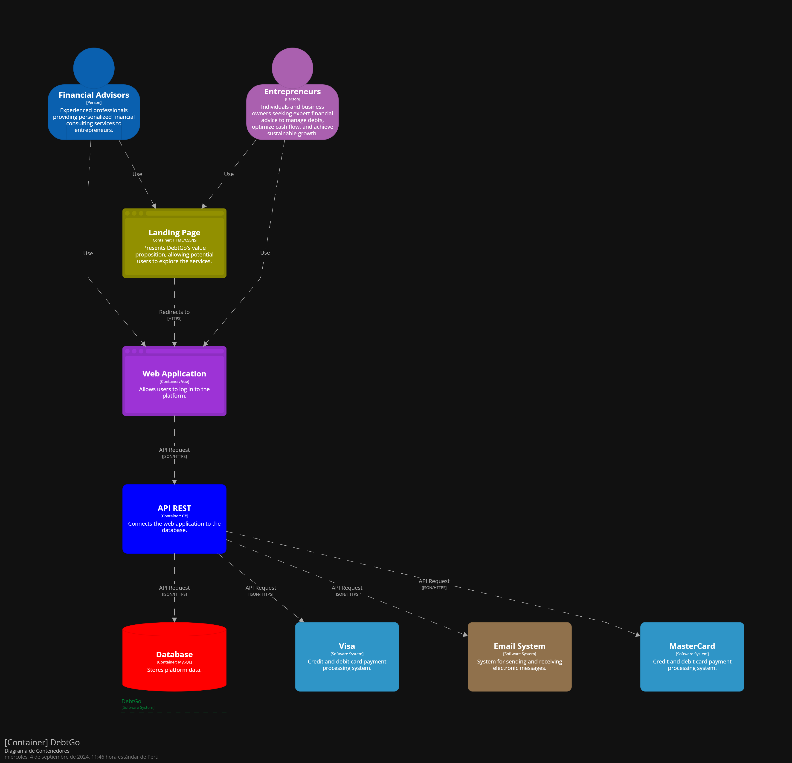
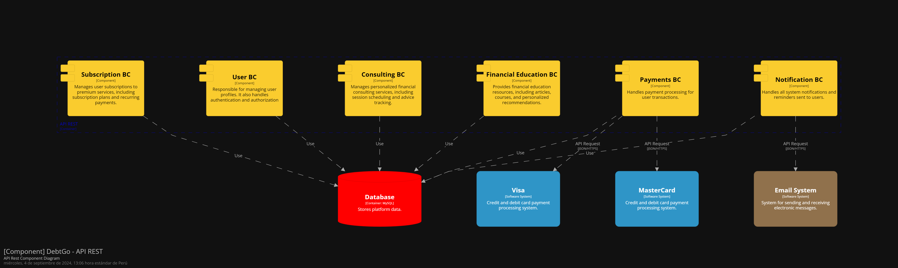

<hr>

# <center>COURSE PROJECT</center>

<p align="center">
    <strong>Universidad Peruana de Ciencias Aplicadas</strong><br>
    </img><br>
    <strong>Ingeniería de Software - 2024-2</strong><br>
    <strong>Aplicaciones Web - WX53</strong><br>
    <strong>Profesor: Alberto Wilmer Sanchez Seña</strong><br>
    <br>INFORME DE TRABAJO FINAL - TB1
</p>

</p>

<p align="center">
    <strong>Startup: Apple Web</strong><br>
    <strong>Producto: DebtGo</strong>
</p>

<div style="text-align:center;">
    <h3>Team Members:</h3>
    <table align="center">
        <tr>
            <th style="text-align:center;">Member</th>
            <th style="text-align:center;">Code</th>
        </tr>
        <tr>
            <td>Medina Chocce, Karito Dianeth</td>
            <td>U20221C769</td>
        </tr>
        <tr>
            <td>Sanchez Rios, Camila Cristina</td>
            <td>U202210973</td>
        </tr>
        <tr>
            <td>Durand Vera, Gianfranco Angel</td>
            <td>U20201F640</td>
        </tr>
        <tr>
            <td>Chávarri Zarzosa, Daniel Jhared </td>
            <td>U202211108</td>
        </tr>
         <tr>
            <td>Duran Santander, Emilia Mercedes </td>
            <td>U201914541</td>
         </tr>
    </table>
</div>

<p align="center">
    <strong>Agosto, 2024</strong>
</p>
<br>

<h1 align="center">Registro de versiones del Informe</h1>
</br>
<table>
        <thead>
            <tr>
                <th>Versión</th>
                <th>Fecha</th>
                <th>Autor</th>
                <th>Descripción de modificaciones</th>
            </tr>
        </thead>
        <tbody>
            <tr>
                <th>TB1</th>
                <td>20/08/2024</td>
                <td>
                    <ul>
          <li>Karito Medina</li>
          <li>Camila Sanchez</li>
          <li>Gianfranco Durand</li>
          <li>Daniel Chávarri</li>
          <li>Emilia Duran</li>
                    <ul>
           </td>
      <td>            
             <ul>
          <li>Capítulo I: Introducción</li>
          <li>Capítulo II: Requirements Elicitation & Analysis</li>
          <li>Capítulo III: Requirements Specification</li>
          <li>Capítulo IV: Product Design</li>
          <li>Avance del Capítulo V: Product Implementation, Validation & Deployment hasta el punto 5.2.1.8</li>
          <li>Avance de Conclusiones, Bibliografía y Anexos</li>
        </ul>
      </td>
  </tr>
</tbody>
</table>

# Project Report Collaboration Insights

# Contenido
[Student Outcome](#student-outcome)

[Capítulo I: Introducción](#capitulo-i-introducción)
- [1.1. Startup Profile](#11-startup-profile)
  - [1.1.1. Descripción de la Startup](#111-descripción-de-la-startup)
  - [1.1.2. Perfiles de integrantes del equipo](#112-perfiles-de-integrantes-del-equipo)
- [1.2. Solution Profile](#12-solution-profile)
  - [1.2.1 Antecedentes y problemática](#121-antecedentes-y-problemática)
  - [1.2.2 Lean UX Process](#122-lean-ux-process)
    - [1.2.2.1. Lean UX Problem Statements](#1221-lean-ux-problem-statements)
    - [1.2.2.2. Lean UX Assumptions](#1222-lean-ux-assumptions)
    - [1.2.2.3. Lean UX Hypothesis Statements](#1223-lean-ux-hypothesis-statements)
    - [1.2.2.4. Lean UX Canvas](#1224-lean-ux-canvas)
- [1.3. Segmentos objetivo](#13-segmentos-objetivo)

[Capítulo II: Requirements Elicitation & Analysis](#capítulo-ii-requirements-elicitation--analysis)
- [2.1. Competidores](#21-competidores)
  - [2.1.1. Análisis competitivo](#211-análisis-competitivo)
  - [2.1.2. Estrategias y tácticas frente a competidores](#212-estrategias-y-tácticas-frente-a-competidores)
- [2.2. Entrevistas](#22-entrevistas)
  - [2.2.1. Diseño de entrevistas](#221-diseño-de-entrevistas)
  - [2.2.2. Registro de entrevistas](#222-registro-de-entrevistas)
  - [2.2.3. Análisis de entrevistas](#223-análisis-de-entrevistas)
- [2.3. Needfinding](#23-needfinding)
  - [2.3.1. User Personas](#231-user-personas)
  - [2.3.2. User Task Matrix](#232-user-task-matrix)
  - [2.3.3. User Journey Mapping](#233-user-journey-mapping)
  - [2.3.4. Empathy Mapping](#234-empathy-mapping)
  - [2.3.5. As-is Scenario Mapping](#235-as-is-scenario-mapping)
- [2.4. Ubiquitous Language](#24-ubiquitous-language)

[Capítulo III: Requirements Specification](#capítulo-iii-requirements-specification)
- [3.1. To-Be Scenario Mapping](#31-to-be-scenario-mapping)
- [3.2. User Stories](#32-user-stories)
- [3.3. Impact Mapping](#33-impact-mapping)
- [3.4. Product Backlog](#34-product-backlog)

[Capítulo IV: Product Design](#capítulo-iv-product-design)
- [4.1. Style Guidelines](#41-style-guidelines)
  - [4.1.1. General Style Guidelines](#411-general-style-guidelines)
  - [4.1.2. Web Style Guidelines](#412-web-style-guidelines)
- [4.2. Information Architecture](#42-information-architecture)
  - [4.2.1. Organization Systems](#421-organization-systems)
  - [4.2.2. Labeling Systems](#422-labeling-systems)
  - [4.2.3. SEO Tags and Meta Tag](#423-seo-tags-and-meta-tag)
  - [4.2.4. Searching Systems](#424-searching-systems)
  - [4.2.5. Navigation Systems](#425-navigation-systems)
- [4.3. Landing Page UI Design](#43-landing-page-ui-design)
  - [4.3.1. Landing Page Wireframe](#431-landing-page-wireframe)
  - [4.3.2. Landing Page Mock-up](#432-landing-page-mock-up)
- [4.4. Web Applications UX/UI Design](#44-web-applications-uxui-design)
  - [4.4.1. Web Applications Wireframes](#411-general-style-guidelines)
  - [4.4.2. Web Applications Wireflow Diagrams](#442-web-applications-wireflow-diagrams)
  - [4.4.3. Web Applications Mock-ups](#443-web-applications-mock-ups)
  - [4.4.4. Web Applications User Flow Diagrams](#444-web-applications-user-flow-diagrams)
- [4.5. Web Applications Prototyping](#45-web-applications-prototyping)
- [4.6. Domain-Driven Software Architecture](#46-domain-driven-software-architecture)
  - [4.6.1. Software Architecture Context Diagram](#461-software-architecture-context-diagram)
  - [4.6.2. Software Architecture Container Diagrams](#462-software-architecture-container-diagrams)
  - [4.6.3. Software Architecture Components Diagrams](#463-software-architecture-components-diagrams)
- [4.7. Software Object-Oriented Design](#47-software-object-oriented-design)
  - [4.7.1. Class Diagrams](#471-class-diagrams)
  - [4.7.2. Class Dictionary](#472-class-dictionary)
- [4.8. Database Design](#48-database-design)
  - [4.8.1. Database Diagram](#481-database-diagram)

[Capítulo V: Product Implementation, Validation & Deployment](#capítulo-v-product-implementation-validation--deployment)
- [5.1. Software Configuration Management](#51-software-configuration-management)
  - [5.1.1. Software Development Environment Configuration](#511-software-development-environment-configuration)
  - [5.1.2. Source Code Management](#512-source-code-management)
  - [5.1.3. Source Code Style Guide & Conventions](#513-source-code-style-guide--conventions)
  - [5.1.4. Software Deployment Configuration](#514-software-deployment-configuration)
- [5.2. Landing Page, Services & Applications Implementation](#52-landing-page-services--applications-implementation)
  - [5.2.X. Sprint ](#52x-sprint)
    - [5.2.X.1. Sprint Planning n](#52x1-sprint-planning-n)
    - [5.2.X.2. Sprint Backlog n](#52x2-sprint-backlog-n)
    - [5.2.X.3. Development Evidence for Sprint Review](#52x3-development-evidence-for-sprint-review)
    - [5.2.X.4. Testing Suite Evidence for Sprint Review](#52x4-testing-suite-evidence-for-sprint-review)
    - [5.2.X.5. Execution Evidence for Sprint Review](#52x5-execution-evidence-for-sprint-review)
    - [5.2.X.6. Services Documentation Evidence for Sprint Review](#52x6-services-documentation-evidence-for-sprint-review)
    - [5.2.X.7. Software Deployment Evidence for Sprint Review](#52x7-software-deployment-evidence-for-sprint-review)
    - [5.2.X.8. Team Collaboration Insights during Sprint](#52x8-team-collaboration-insights-during-sprint)
- [5.3. Validation Interviews](#53-validation-interviews)
  - [5.3.1. Diseño de Entrevistas](#531-diseño-de-entrevistas)
  - [5.3.2. Registro de Entrevistas](#532-registro-de-entrevistas)
  - [5.3.3. Evaluaciones según heurísticas](#533-evaluaciones-según-heurísticas)
- [5.4. Video About-the-Product](#54-video-about-the-product)

[Conclusiones](#conclusiones)
- [Conclusiones y recomendaciones](#conclusiones-y-recomendaciones)
- [Video About-the-Team](#video-about-the-team)

[Bibliografía](#bibliografía)

[Anexos](#anexos)

# Student Outcome


# Capítulo I: Introducción
## 1.1. Startup Profile
### 1.1.1. Descripción de la Startup
### 1.1.2. Perfiles de integrantes del equipo
## 1.2. Solution Profile
### 1.2.1 Antecedentes y problemática
### 1.2.2 Lean UX Process
#### 1.2.2.1. Lean UX Problem Statements
#### 1.2.2.2. Lean UX Assumptions
#### 1.2.2.3. Lean UX Hypothesis Statements
#### 1.2.2.4. Lean UX Canvas
## 1.3. Segmentos objetivo

# Capítulo II: Requirements Elicitation & Analysis
## 2.1. Competidores
### 2.1.1. Análisis competitivo
### 2.1.2. Estrategias y tácticas frente a competidores
## 2.2. Entrevistas
### 2.2.1. Diseño de entrevistas
### 2.2.2. Registro de entrevistas
### 2.2.3. Análisis de entrevistas
## 2.3. Needfinding
### 2.3.1. User Personas
### 2.3.2. User Task Matrix
### 2.3.3. User Journey Mapping
### 2.3.4. Empathy Mapping
### 2.3.5. As-is Scenario Mapping
## 2.4. Ubiquitous Language

# Capítulo III: Requirements Specification
## 3.1. To-Be Scenario Mapping
## 3.2. User Stories
## 3.3. Impact Mapping
## 3.4. Product Backlog

# Capítulo IV: Product Design
## 4.1. Style Guidelines

Un Style Guidelines, o Guía de Estilo, es un documento que proporciona directrices claras y coherentes sobre la apariencia visual, la comunicación y la identidad de una marca o producto. Esta guía asegura que todos los elementos relacionados con la marca, como tipografía, colores, logotipos y tono de voz, se mantengan uniformes en todas las aplicaciones y plataformas, lo que ayuda a reforzar la identidad de la marca y garantiza una experiencia de usuario consistente y reconocible.

### 4.1.1. General Style Guidelines

**Branding:** 

La identidad visual de una marca, que incluye su logotipo, colores, tipografía y otros elementos visuales.La identidad de marca de DebtGo se basa en la misión de proporcionar educación financiera y ayudar a las personas a manejar sus deudas de manera efectiva. Valores clave incluyen la transparencia, la confianza y la accesibilidad. DebtGo debe proyectar una personalidad amigable, confiable y educativa, para que los usuarios sientan que están recibiendo orientación de un amigo de confianza.

**Logo**

El logo principal de DebtGo debe ser limpio y moderno, con un énfasis en la simplicidad y la claridad. Puede incorporar elementos que evocan finanzas, como gráficos de barras estilizados o un gráfico de línea ascendente para simbolizar el crecimiento financiero. Se pueden crear variaciones del logotipo para adaptarse a diferentes tamaños y plataformas, pero la esencia y los colores deben mantenerse coherentes.

<center>  </center>
<br>

**Tipografía:**

La elección tipográfica para DebtGo es un componente esencial que complementa la identidad visual de la marca. Se han seleccionado tres familias tipográficas para la marca: Urbanist, Merriweather Sans y Sora. Siendo la principal **Urbanist**.

<center>  </center>
<br>

**Colores:** 

La paleta de colores de DebtGo ha sido cuidadosamente seleccionada para transmitir profesionalismo, confianza y accesibilidad. Cada color tiene un propósito específico y se utilizará de manera consistente en toda la identidad visual de la marca.

<center>  </center>
<br>

- #998EF7 (Lavanda suave): Este color se utilizará como el tono principal, predominando en el logotipo, encabezados y elementos clave de la interfaz como las llamadas a la acción (CTA), botones y elementos interactivos.

- #9B6CF0 (Lavanda): Se utilizará para fondos oscuros permitiendo resaltar los elementos claves con el tono principal.

- #7960F2 (Lavanda profunda): Este tono servirá para complementar al contraste de los elementos principales.

- #000000 (Negro): Utilizado para títulos en fondos claros.

- #FFFFFF (Blanco): Utilizado para títulos en fondos con las tonalidades principales.

- #F3F3FF (Gris suave): Para subtítulos en fondos con las tonalidades principales.

- #939393 (Gris medio): Se utilizará para cuerpo y textos de menor jerarquía.

- #3D3D3D (Gris oscuro): Este color será empleado en subtítulos con fondos claros.

**Tono de comunicación y lenguaje aplicado:**

 El estilo de comunicación que se utiliza en el diseño, que puede ser divertido/serio, formal/casual, respetuoso/irreverente o entusiasta/sereno.

 - Memorable y reconocible: La identidad de marca debe ser única y fácilmente identificable. Esto ayudará a que la empresa se destaque de la competencia y sea recordada por los clientes.
- Confiable y profesional: La identidad de marca debe transmitir la idea de que la empresa es confiable y profesional. Esto ayudará a que los clientes se sientan seguros de confiar en la empresa con sus finanzas.
- Atractiva y llamativa: La identidad de marca debe ser atractiva y llamativa. Esto ayudará a captar la atención de los clientes y a atraerlos a la empresa.

**Lenguaje aplicado:**

 El lenguaje que se utiliza en el diseño, que debe ser claro, conciso y fácil de entender.

**Marca** 

El nombre de la empresa, "DebtGo", es un juego de palabras con la palabra "Debt" (deuda en inglés). El uso de la letra "g" en lugar de la "d" crea un sonido similar, pero también sugiere una acción, como "go" (ir). Esto transmite la idea de que la empresa puede ayudarte a eliminar tus deudas.

**Spacing** 

El espaciado entre los elementos del logotipo es uniforme y equilibrado. Esto crea una sensación de orden y armonía. El espaciado entre las letras del nombre de la empresa es lo suficientemente amplio para que sean legibles, pero no tanto como para que se vean demasiado separadas.

### 4.1.2. Web Style Guidelines

 Es un documento creado para establecer un conjunto de reglas y recomendaciones de diseño, contenido y comportamiento para un sitio web específico. El propósito principal de un Web Style Guidelines es mantener una apariencia y consistencia visual en todo el sitio web. Proporciona pautas claras sobre cómo deben ser el diseño, la tipografía, los colores, las imágenes, los iconos y otros elementos visuales. También incluye recomendaciones sobre cómo debe ser el tono y estilo del contenido escrito, así como las pautas para el comportamiento y la interacción del usuario.

**Algunos objetivos de un Web Style Guidelines incluyen:**

- Consistencia: Un sitio web coherente y unificado esencial para crear una buena experiencia del usuario. La guía de estilo asegura que todos los elementos visuales y de contenido se mantengan consistentes en todo el sitio.
- Identidad de marca: La guía de estilo establece los elementos visuales y de contenido que representan la identidad de la marca, como el logotipo, los colores corporativos y el tono de voz. Esto ayuda a fortalecer la imagen de marca y a transmitir una imagen coherente.
- Eficiencia y ahorro de tiempo: Al tener pautas predefinidas, los diseñadores y desarrolladores pueden ahorrar tiempo y esfuerzo al seguir un conjunto de reglas ya establecidas en lugar de comenzar desde cero en cada proyecto.
- Experiencia del usuario: El objetivo final de un Web Style Guidelines es ofrecer una excelente experiencia del usuario. Al mantener una apariencia consistente y una estructura de contenido clara, los usuarios pueden navegar fácilmente por el sitio y encontrar la información que necesitan.

**Paleta de Colores**

Se utiliza la paleta de colores de DebtGo para todos los elementos de la web, asegurando consistencia y coherencia visual.

**Primarios:**

- #FFFFFF (Blanco puro): Usado como fondo principal.
- #9B6CF0 (Lavanda): Para para destacar secciones clave.
- #998EF7 (Lavanda suave): Color primario para botones importantes, enlaces y elementos interactivos, asegurando que las acciones clave sean claras y atractivas.
- #F3F3FF (Gris suave): Para subtítulos en fondos del color principal.

**Secundarios:**

- #939393 (Gris medio): Aplicado en títulos en fondos claros.
- #3D3D3D (Gris oscuro): Utilizado para el texto secundario en fondos claros, garantizando una excelente legibilidad sin recurrir al negro puro.
- #000000 (Negro): Para títulos dentro de fondos claros.

**Fuentes:**

**Urbanist:** Fuente principal, utilizado en títulos y elementos de mayor jerarquía.

**Merriweather Sans :** Utilizado para el cuerpo de texto y subtítulos en toda la plataforma.

**Sora:** Para elementos interactivos como CTA y enlaces.

## 4.2. Information Architecture

La Arquitectura de la Información (AI, por sus siglas en inglés) es una disciplina y una práctica de diseño que se ocupa de optimizar la forma en que se organiza, estructura, etiqueta y conecta la información en entornos digitales. Esta arquitectura es esencialmente una especie de ‘mapa’ que se usa para ayudar a los usuarios a comprender dónde se encuentran en un entorno digital, cómo llegaron allí y cómo pueden continuar hacia otras secciones relacionadas o importantes.

El objetivo clave de la Arquitectura de la Información es lograr un equilibrio entre las necesidades y las capacidades del usuario y los objetivos del negocio. Facilita la navegación eficiente y efectiva a través de la complejidad de la información que encontramos en las aplicaciones de software, sitios web, intranets, plataformas en línea, etc. Por tanto, su propósito principal es diseñar una estructura de información coherente, comprensible y utilizable, que permita a los usuarios alcanzar sus objetivos de manera fácil y rápida.

Además, la Arquitectura de la Información también es relevante para hacer que la información sea más entendible y utilizable. Esto se logra simplificando su estructura y su contenido, lo que ayuda a los usuarios a interpretar la información presentada, a tomar decisiones informadas y finalmente a interactuar con el sistema de una manera más efectiva e intuitiva.

Por lo tanto, una buena Arquitectura de la Información puede mejorar significativamente la experiencia del usuario, y puede jugar un papel vital en el éxito de cualquier producto o servicio digital.

### 4.2.1. Organization Systems

Los sistemas de organización se encargan de la estructura y los procesos que se implementan en una empresa u organización para mejorar la eficiencia y la productividad.

El objetivo principal del sistema de organización es establecer métodos y procedimientos claros para gestionar los recursos disponibles, tanto humanos como materiales, de manera eficiente. Esto implica organizar tareas, establecer responsabilidades, distribuir recursos y coordinar actividades para lograr los objetivos de la organización de manera efectiva.

**Algunos de los beneficios de implementar un sistema de organización incluyen:**

- Eficiencia: Un sistema de organización ayuda a optimizar el uso de los recursos disponibles, lo que se traduce en una mayor eficiencia en el trabajo realizado. Al establecer tareas y roles claros, se evita la duplicación de esfuerzos y se minimizan los errores.
- Productividad: Al contar con un sistema de organización efectivo, se establecen rutinas y procesos que permiten esfuerzos más enfocados y una mayor productividad en el cumplimiento de metas y objetivos.
- Coordinación: Un sistema de organización facilita la coordinación entre diferentes miembros de la organización. Al establecer una estructura clara de comunicación y responsabilidades, se asegura una sincronización adecuada de las actividades en equipo.
- Planificación estratégica: Los sistemas de organización ayudan a establecer metas y objetivos claros, y permiten una planificación estratégica efectiva. Esto implica definir la visión y los valores de la organización, así como establecer planes y acciones específicas para alcanzar esos objetivos.
- Control: Los sistemas de organización facilitan el seguimiento y control de las actividades y el rendimiento de la organización. Esto permite identificar áreas de mejora, corregir desviaciones y asegurar la conformidad con los estándares establecidos.

Los sistemas de organización son fundamentales para establecer procesos eficientes y coordinados en una organización, lo que resulta en una mayor productividad y logro de objetivos. Ayudan a definir roles y responsabilidades, optimizar el uso de recursos, establecer una estructura de comunicación clara y permiten una planificación estratégica efectiva.

### 4.2.2. Labeling Systems

Un Labelling System o sistema de etiquetado, se enfoca en un conjunto de técnicas y herramientas utilizadas para identificar y clasificar datos o elementos. El objetivo principal de un Labelling System es asignar etiquetas descriptivas a los datos, lo que facilita su organización búsqueda y procesamiento posterior.

Los Labelling Systems son comúnmente utilizados en diferentes industrias y aplicaciones, como la clasificación de productos, el etiquetado de información en bases de datos, el marcado de imágenes o el análisis de texto. Algunas de las áreas en las que se utilizan con frecuencia son:

- Aprendizaje automático (Machine Learning): En el campo del aprendizaje automático, los Labelling Systems son utilizados para etiquetar conjuntos de datos que serán utilizados para entrenar modelos de machine learning. Esto implica asignar etiquetas a los datos de entrenamiento para que el sistema pueda aprender a reconocer patrones y realizar predicciones precisas.

- Clasificación de productos: En el comercio electrónico y la logística, los Labelling Systems se utilizan para etiquetar productos con información como códigos de barras, números de lote, fechas de caducidad, etc. Esto facilita su identificación y seguimiento a lo largo de la cadena de suministro.

- Organización de archivos y documentos: Los Labelling Systems también son útiles para etiquetar archivos y documentos electrónicos, facilitando su organización y búsqueda rápida. Las etiquetas pueden incluir información como el tema, la fecha, el remitente, entre otros.

- Anotación de imágenes y videos: En el campo de la visión por computadora, los Labelling Systems se utilizan para etiquetar y anotar imágenes y videos para tareas como reconocimiento de objetos, segmentación de imágenes, detección de rostros, entre otros. Estas etiquetas proporcionan información descriptiva sobre los elementos presentes en las imágenes y facilitan el entrenamiento y la evaluación de algoritmos.

Los Labelling Systems son sistemas o técnicas de etiquetado utilizadas para clasificar y organizar datos, productos o elementos. Su objetivo principal es asignar etiquetas descriptivas que faciliten la organización, búsqueda y procesamiento posterior.

### 4.2.3. SEO Tags and Meta Tag

**SEO Tags**

SEO (Search Engine Optimization) Tags son elementos de HTML que ayudan a los motores de búsqueda a entender el contenido y la estructura de una página web. Estos tags influyen en cómo los motores de búsqueda indexan y clasifican tu sitio en los resultados de búsqueda. 

**Algunos ejemplos importantes de SEO Tags incluyen:**

**Title Tag:**

Es el título de la página web que aparece en la pestaña del navegador y como el título del enlace en los resultados de búsqueda. Importancia: Es crucial porque es uno de los factores más influyentes en el ranking de la página. Debe ser relevante, contener palabras clave, y tener una longitud de entre 50 y 60 caracteres. 

*Ejemplo:* 
``` html
<title>Compra Ropa de Moda Online - Tienda XYZ</title>
``` 


**Header Tags (H1, H2, H3, etc.):** 

Son etiquetas utilizadas para definir los encabezados y subencabezados dentro del contenido de la página. El H1 es el encabezado principal y es el más importante en términos de SEO. Importancia: Ayudan a organizar el contenido y permiten a los motores de búsqueda comprender la jerarquía y el tema principal de la página. 

*Ejemplo:*
```html
<h1>Las Mejores Ofertas en Ropa de Moda</h1>
```

**Alt Tags:**

Son atributos utilizados en imágenes para describir su contenido. Aunque los usuarios no pueden ver este texto directamente, los motores de búsqueda lo utilizan para entender el contenido de la imagen. Importancia: Mejoran la accesibilidad y también son importantes para el SEO, especialmente en la búsqueda de imágenes.

**Meta Tags**

Los Meta Tags son fragmentos de texto que describen el contenido de la página; no aparecen en la página misma, pero se encuentran en el código HTML de la página. Los motores de búsqueda y los navegadores utilizan estos tags para obtener información adicional sobre la página. Algunos de los Meta Tags más relevantes para SEO son:

**Meta Description Tag:**

Proporciona un resumen breve del contenido de la página. Aunque no afecta directamente al ranking de búsqueda, es importante porque aparece en los resultados de búsqueda bajo el título de la página. Importancia: Una meta descripción atractiva puede aumentar la tasa de clics (CTR) desde los motores de búsqueda. 

Originalmente, se utilizaba para listar palabras clave relevantes para la página. Sin embargo, hoy en día, la mayoría de los motores de búsqueda ya no utilizan este tag para el ranking. Importancia: Es menos relevante en la actualidad, pero puede ser utilizado por algunos motores de búsqueda secundarios. 

**Meta Robots Tag:**

Indica a los motores de búsqueda cómo deben indexar o seguir los enlaces en la página. Importancia: Se utiliza para controlar la indexación de la página. Por ejemplo, si no quieres que una página específica sea indexada, puedes usar este tag. 

*Ejemplo:*
```
 Viewport Tag
```
 Especifica cómo se ajustará la página a la pantalla del dispositivo (especialmente importante para dispositivos móviles). 
 
 Importancia: Crucial para la optimización móvil, ya que garantiza que el sitio web se visualice correctamente en dispositivos de diferentes tamaños.

### 4.2.4. Searching Systems

Un Searching Systems, también conocido como sistema de búsqueda o motor de búsqueda, es una aplicación automática diseñada para buscar y recuperar información almacenada en una base de datos o en internet. Su principal objetivo es encontrar y mostrar resultados relevantes que coincidan con las palabras clave o términos de búsqueda ingresados por el usuario.

El funcionamiento básico de un Searching System consiste en rastrear y analizar grandes cantidades de contenido o información estructurada, como páginas web, documentos, imágenes, videos, etc. Luego, utilizando algoritmos y técnicas de indexación, organiza esta información de manera que pueda ser rápida y fácilmente accesible cuando un usuario realiza una consulta de búsqueda.

El objetivo principal de un Searching System es brindar respuestas relevantes y precisas a las consultas de los usuarios. Para lograr esto, utilizan algoritmos de ranking que evalúan la relevancia y la calidad de los resultados en función de varios factores, como la coincidencia de palabras clave, la autoridad de la fuente, la popularidad del contenido, entre otros.

Los Searching Systems, se utilizan en una amplia variedad de aplicaciones y servicios en línea, como motores de búsqueda web (como Google, Bing, Yahoo), motores de búsqueda de sitios web internos, directorios de archivos locales, sistemas de recuperación de información, entre otros. También se utilizan en diferentes industrias, como el comercio electrónico, la investigación académica, la búsqueda y recuperación de documentos legales, la búsqueda de imágenes, entre muchos otros casos de uso.

Uns Searching System es una herramienta informática que permite buscar y recuperar información relevante almacenada en una base de datos o en internet. Su objetivo es proporcionar respuestas precisas y relevantes a las consultas de los usuarios.

### 4.2.5. Navigation Systems

Un sistema de navegación, también conocido como sistema de posicionamiento y navegación, es una tecnología utilizada para determinar la ubicación, la dirección y la ruta más adecuada para llegar a un destino específico. Su objetivo principal es ayudar a las personas a navegar de manera eficiente y precisa, ya sea en vehículos, aviones, barcos u otros medios de transporte.
El sistema de navegación utiliza una variedad de tecnologías como el GPS (Sistema de Posicionamiento Global), sensores inerciales y otros sistemas de comunicación para obtener información sobre la posición del vehículo en tiempo real. Estos datos se utilizan para calcular la ruta óptima hacia el sistema solicitado.

Además de proporcionar indicaciones de manejo paso a paso, los sistemas de navegación también pueden ofrecer información adicional, como el estado del tráfico, el tiempo estimado de llegada, la presencia de puntos de interés cercanos y la información actualizada del mapa.

El objetivo principal de un sistema de navegación es facilitar la navegación y mejorar la experiencia del usuario al proporcionar una guía precisa y confiable en el proceso de desplazarse de un lugar a otro. Esto ayuda a ahorrar tiempo, evitar posibles desvíos o atascos de tráfico, y proporcionar una sensación de seguridad al conocer la ruta y la ubicación en todo momento.

Un sistema de navegación es una herramienta tecnológica que utiliza varios sistemas para proporcionar información y guía para llegar a un destino específico de la manera más eficiente posible. Su objetivo es mejorar la experiencia de navegación al ofrecer indicaciones precisas y actualizadas, así como otros datos útiles relacionados con la ruta.

## 4.3. Landing Page UI Design
### 4.3.1. Landing Page Wireframe
El prototipado de la landing page cuenta diversas secciones:
- Header: Incluye botones para facilitar la navegación
- Hero: Con 2 CTA, uno para cada segmento objetivo, un título y una imagen de fondo.
- Segmentos y beneficios: Para cada segmento se tiene un título, una breve descripción, un CTA y una imagen. Debajo de cada sección se detallan los beneficios que se ofrecen.
- Testimonios: Consta de un título y subtítulo, así como de unos testimonios de usuarios de cada segmento, lo que aumenta la confianza en los potenciales clientes.
- Contacto: Tiene un título y subtítulo, un pequeño input para la introducción de un email y un botón para el envio del correo.
- Footer: Sección que da fin a la landing page, cuenta con las redes sociales de la plataforma.

**Wireframe Destkop**


*Imagen(N°). Elaboración propia. Realizado en figma*

**Wireframe Mobile** <br>
En la versión mobile el navbar se reemplaza por un menu desplegable.

<div align="center">


*Imagen(N°). Elaboración propia. Realizado en figma*
</div>

### 4.3.2. Landing Page Mock-up
Siguiendo los wireframes de la landing page se realizaron los mockups:
- Header y Segmentos: Se utilizan los colores primarios de la plataforma especificados.
- Hero: Cuenta con una imagen relacionada a la plataforma, además se tiene dos CTA en versiones alternativas para la diferenciación.
- Beneficios: Incluye iconos relacionados con los beneficios ofrecidos y con el color principal, además el fondo es claro alternando con la sección de Segmentos para una mejor separación.
- Testimonios: Con un fondo de color principal para constrastar con las tarjetas de cada testimonio.
- Contacto: Se tiene un CTA en color primario, siendo notorio al estar en un fondo claro.
- Footer: Al igual que el header, utiliza los colores primarios de la plataforma para dar un fin estético a la página.

**Mock-up Destkop**


*Imagen(N°). Elaboración propia. Realizado en figma*

**Mock-up Mobile** <br>
En la versión mobile el navbar se reemplaza por un menu desplegable.

<div align="center">


*Imagen(N°). Elaboración propia. Realizado en figma*
</div>

## 4.4. Web Applications UX/UI Design
El diseño UX/UI para aplicaciones web se centra en crear interfaces intuitivas y experiencias de usuario fluidas que maximicen la satisfacción y eficiencia al interactuar con una plataforma. Este enfoque combina la funcionalidad con la estética, asegurando que cada elemento visual no solo sea atractivo, sino que también facilite la navegación y el cumplimiento de los objetivos del usuario. En un entorno digital competitivo, un diseño UX/UI bien ejecutado es crucial para captar y retener usuarios, mejorando tanto la usabilidad como la percepción general de la aplicación.

Para los wireframes en Genentech usamos algunos de los principios Heurísticos:

1. Visibilidad del estado del sistema: los usuarios sabrán en qué parte de la aplicación se encuentran y cómo pueden utilizarla para traducir el lenguaje de señas. Esto podría
implicar el uso de indicadores claros de estado y progreso.
2. Coincidencia entre el sistema y el mundo real: Diseña los elementos de la interfaz de usuario de manera que se asemejan a los gestos y movimientos reales del lenguaje de señas. Esto facilitará la comprensión y la interacción de los usuarios.
3. Control y libertad del usuario: Proporciona a los usuarios la capacidad de desplazarse fácilmente por la aplicación y de volver atrás si cometen errores. Los usuarios de lenguaje de señas deben sentir que tienen el control total de la traducción.
4. Consistencia y estándares: los gestos y controles utilizados en la aplicación deben ser coherentes y que sigan estándares reconocidos en el lenguaje de señas.
5. Prevención de errores: Implementa características que ayudan a prevenir errores comunes, como la selección incorrecta de gestos o la entrada de datos erróneos.
6. Reconocimiento en lugar de recuerdo: Diseñar la aplicación de manera que los usuarios no tengan que recordar cómo realizar ciertas acciones o gestos. Debe ser intuitiva y fácil de usar.
7. Flexibilidad y eficiencia de uso: los usuarios pueden personalizar la aplicación para adaptarla a sus necesidades específicas en el uso del lenguaje de señas. Además, optimiza la velocidad y la eficiencia de las traducciones.
8. Diseño estético y minimalista: El diseño de la interfaz debe ser limpio y atractivo, pero no abrumador. Evitar la sobrecarga de información y priorizar la usabilidad sobre la estética.
9. Ayuda y documentación: Proporciona recursos de ayuda y documentación accesibles para los usuarios, como tutoriales o guías para aprender a usar la aplicación de traducción de lenguaje de señas.
10.  Feedback al usuario: Asegúrate de que los usuarios reciban retroalimentación clara y rápida sobre el progreso de la traducción y cualquier acción que realicen en la aplicación.

### 4.4.1. Web Applications Wireframes
Los wireframes ayudan a los diseñadores y desarrolladores a planificar la arquitectura y la funcionalidad de la aplicación, permitiendo visualizar cómo los usuarios interactuarán con ella. Son esenciales en las primeras etapas de desarrollo, ya que facilitan la comunicación de ideas, la identificación de problemas potenciales y la alineación de todos los involucrados en el proyecto antes de pasar al diseño detallado y la programación.

**Iniciar sesión**

La siguiente imagen evidencia el wireframe de la sección de “inicio de sesión” desde la vista desktop web browser. En ella, los usuarios deberán ingresar las credenciales necesarias para poder acceder a la aplicación, siempre y cuando posean con una cuenta previamente creada. 


*Imagen(N°). Elaboración propia. Realizado en figma*

**Crear cuenta**

La siguiente imagen presenta la sección de “registro de usuario”, a través de la cual los administradores podrán remitir a la aplicación la información necesaria para crear una cuenta. 


*Imagen(N°). Elaboración propia. Realizado en figma*

**Elegir plan de pago**

La siguiente imagen presenta la sección “Elegir plan de pago”, la cual despliega las categorías de planes disponibles en la plataforma. Los dos planes están diseñados para adaptarse a las necesidades de los emprendedores acorde a las necesidades.


*Imagen(N°). Elaboración propia. Realizado en figma*

**Pasarela de pagos**

La siguiente imagen corresponde a la sección “Pasarela de pagos” donde las empresas son dirigidas a un formulario para seleccionar y registrar su método de pago. Esta sección también muestra el monto correspondiente al plan elegido. Una vez que el proceso de pago es completado exitosamente, se notifica al usuario con un mensaje confirmando la suscripción y fecha de registro. 


*Imagen(N°). Elaboración propia. Realizado en figma*

### 4.4.2. Web Applications Wireflow Diagrams
Los Web Applications Wireflow Diagrams son una combinación de wireframes y flujos de usuario (user flows) que ilustran no solo la estructura y disposición de las páginas de una aplicación web, sino también cómo los usuarios navegarán entre ellas. Estos diagramas proporcionan una visión detallada del recorrido del usuario, mostrando las interacciones clave y las transiciones de una página a otra dentro de la aplicación.

Los wireflow diagrams son fundamentales en el proceso de diseño, ya que permiten a los equipos de desarrollo y diseño evaluar la lógica de navegación y la experiencia del usuario antes de la implementación completa. Al representar visualmente tanto la estructura como el flujo, estos diagramas aseguran que todos los involucrados tengan una comprensión clara del comportamiento de la aplicación y pueden ayudar a identificar y resolver problemas de usabilidad tempranamente.

[diagrama de web sin color]

### 4.4.3. Web Applications Mock-ups
Los Web Applications Mock-ups son representaciones visuales detalladas y de alta fidelidad del diseño de una aplicación web. A diferencia de los wireframes, que son más esquemáticos, los mock-ups incorporan colores, tipografías, imágenes y otros elementos de diseño, ofreciéndonos una vista previa realista de cómo se verá la interfaz de usuario final.

Al crear mock-ups, tenemos la oportunidad de visualizar y evaluar la apariencia y la funcionalidad del producto antes de la codificación. Esto nos permite realizar ajustes en el diseño, asegurar la coherencia visual y comunicar la visión final de nuestro brand. 


*Imagen(N°). Elaboración propia. Realizado en figma*

### 4.4.4. Web Applications User Flow Diagrams
Los Web Applications User Flow Diagrams son diagramas que mapean el recorrido que un usuario sigue al interactuar con una aplicación web, desde el punto de entrada hasta la secuencia de una tarea específica. Estos diagramas permiten visualizar cada paso que toma el usuario, ayudándo a entender cómo navegan por la aplicación y cómo interactúan con las diferentes páginas y funciones.

Al diseñar user flow diagrams, puedo identificar posibles puntos de fricción o áreas donde la experiencia del usuario podría mejorarse. Al comprender el flujo completo, puedo optimizar el diseño y la estructura de la aplicación, garantizando una experiencia de usuario fluida y coherente. 

[diagrama de web color]

## 4.5. Web Applications Prototyping

## 4.6. Domain-Driven Software Architecture


### 4.6.1. Software Architecture Context Diagram


### 4.6.2. Software Architecture Container Diagrams


### 4.6.3. Software Architecture Components Diagrams


## 4.7. Software Object-Oriented Design
### 4.7.1. Class Diagrams


### 4.7.2. Class Dictionary
**Class User**

| Attribute       | Type          | Description                  |
|-----------------|---------------|------------------------------|
| id              | int           | Unique identifier for the user |
| name            | string        | Name of the user             |
| email           | string        | Email address of the user    |
| password        | string        | Password for user authentication |
| role            | RoleType      | Role of the user |
| subscriptionId  | int           | Identifier for the subscription |
| paymentCard     | PaymentCard   | Details of the payment card used |


**Class Entrepreneur**

| Attribute       | Type          | Description                                      |
|-----------------|---------------|--------------------------------------------------|
| businessName    | string        | The name of the business                        |
| industry        | string        | The industry in which the business operates     |
| financialGoals  | string[]      | A list of financial goals for the business       |
| viewedCourses   | int[]         | A list of IDs for the courses that have been viewed |

**Class Advisor**

| Attribute       | Type          | Description                                      |
|-----------------|---------------|--------------------------------------------------|
| expertise       | string[]      | A list of areas of expertise of the advisor     |
| experienceYears | int           | Number of years of experience the advisor has   |
| reviews         | Review[]      | An array of reviews given to the advisor        |

**Class Course**

| Attribute      | Type           | Description                                    |
|----------------|----------------|------------------------------------------------|
| id             | int            | Unique identifier for the course               |
| title          | string         | Title of the course                            |
| description    | string         | Description of the course                      |
| duration       | int            | Duration of the course in hours                |
| level          | CourseLevelType| Difficulty level of the course                 |
| comments       | Comment[]      | Array of comments related to the course        |

**Class Comment**

| Attribute       | Type          | Description                              |
|-----------------|---------------|------------------------------------------|
| id              | int           | Unique identifier for the comment        |
| entrepreneurId  | int           | Identifier of the entrepreneur who made the comment |
| comment         | string        | The content of the comment               |

**Class AdviceSession**

| Attribute       | Type                    | Description                                     |
|-----------------|-------------------------|-------------------------------------------------|
| id              | int                     | Unique identifier for the advice session       |
| entrepreneurId  | int                     | Identifier of the entrepreneur participating in the session |
| advisorId       | int                     | Identifier of the advisor conducting the session |
| scheduledDate   | string                  | Date and time when the session is scheduled    |
| status          | AdviceSessionStatusType | Current status of the advice session           |

**Class Review**

| Attribute       | Type          | Description                                      |
|-----------------|---------------|--------------------------------------------------|
| id              | int           | Unique identifier for the review                |
| entrepreneurId  | int           | Identifier of the entrepreneur who received the review |
| comment         | string        | The content of the review                       |
| score           | int           | Score given in the review |


**Class PaymentCard**

| Attribute       | Type          | Description                                      |
|-----------------|---------------|--------------------------------------------------|
| id              | int           | Unique identifier for the payment card          |
| cardNumber      | int           | Credit or debit card number                     |
| expirationDate  | string        | Expiration date of the payment card             |
| securityCode    | int           | Security code (CVV) of the payment card         |

**Class Subscription**

| Attribute    | Type                    | Description                                    |
|--------------|-------------------------|------------------------------------------------|
| id           | int                     | Unique identifier for the subscription         |
| userId       | int                     | Identifier of the user associated with the subscription |
| planId       | int                     | Identifier of the subscription plan            |
| status       | SubscriptionStatusType | Current status of the subscription             |

**Class Plan**

| Attribute    | Type   | Description                          |
|--------------|--------|--------------------------------------|
| id           | int    | Unique identifier for the plan       |
| name         | string | Name of the plan                     |
| description  | string | Description of the plan              |
| price        | float  | Price of the plan                    |

**Class Payment**

| Attribute       | Type   | Description                                 |
|-----------------|--------|---------------------------------------------|
| id              | int    | Unique identifier for the payment           |
| subscriptionId  | int    | Identifier of the associated subscription   |
| paymentCardId   | int    | Identifier of the payment card used         |
| paymentDate     | string | Date of the payment                         |


## 4.8. Database Design
Para el presente proyecto se ha seleccionado el motor de base de datos MySQL por ser una plataforma escalable con una
interfaz sencilla y fácil de usar.
## 4.8.1. Database Diagram


# Capítulo V: Product Implementation, Validation & Deployment
## 5.1. Software Configuration Management
### 5.1.1. Software Development Environment Configuration
### 5.1.2. Source Code Management
### 5.1.3. Source Code Style Guide & Conventions
### 5.1.4. Software Deployment Configuration
## 5.2. Landing Page, Services & Applications Implementation
### 5.2.X. Sprint 
#### 5.2.X.1. Sprint Planning n
#### 5.2.X.2. Sprint Backlog n
#### 5.2.X.3. Development Evidence for Sprint Review
#### 5.2.X.4. Testing Suite Evidence for Sprint Review
#### 5.2.X.5. Execution Evidence for Sprint Review
#### 5.2.X.6. Services Documentation Evidence for Sprint Review
#### 5.2.X.7. Software Deployment Evidence for Sprint Review
#### 5.2.X.8. Team Collaboration Insights during Sprint
## 5.3. Validation Interviews
### 5.3.1. Diseño de Entrevistas
### 5.3.2. Registro de Entrevistas
### 5.3.3. Evaluaciones según heurísticas
# 5.4. Video About-the-Product

# Conclusiones
## Conclusiones y recomendaciones
## Video About-the-Team.

# Bibliografía

# Anexos
