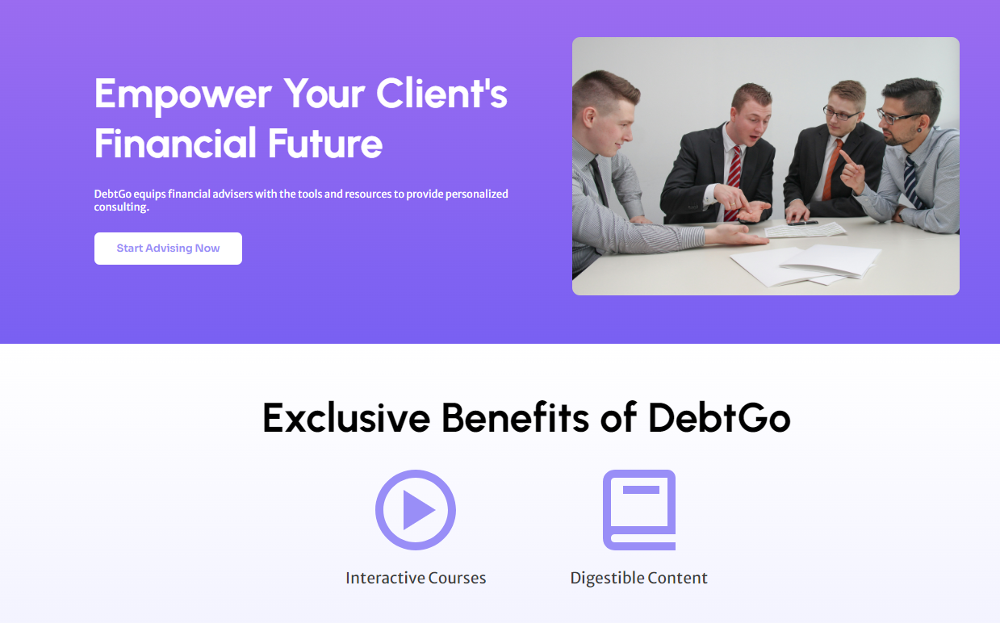

<hr>

# <center>COURSE PROJECT</center>

<p align="center">
    <strong>Universidad Peruana de Ciencias Aplicadas</strong><br>
    </img><br>
    <strong>Ingeniería de Software - 2024-2</strong><br>
    <strong>Aplicaciones Web - WX53</strong><br>
    <strong>Profesor: Alberto Wilmer Sanchez Seña</strong><br>
    <br>INFORME DE TRABAJO FINAL - TB1
</p>

</p>

<p align="center">
    <strong>Startup: Apple Web</strong><br>
    <strong>Producto: DebtGo</strong>
</p>

<div style="text-align:center;">
    <h3>Team Members:</h3>
    <table align="center">
        <tr>
            <th style="text-align:center;">Member</th>
            <th style="text-align:center;">Code</th>
        </tr>
        <tr>
            <td>Medina Chocce, Karito Dianeth</td>
            <td>U20221C769</td>
        </tr>
        <tr>
            <td>Sanchez Rios, Camila Cristina</td>
            <td>U202210973</td>
        </tr>
        <tr>
            <td>Durand Vera, Gianfranco Angel</td>
            <td>U20201F640</td>
        </tr>
        <tr>
            <td>Chávarri Zarzosa, Daniel Jhared </td>
            <td>U202211108</td>
        </tr>
         <tr>
            <td>Duran Santander, Emilia Mercedes </td>
            <td>U201914541</td>
         </tr>
    </table>
</div>

<p align="center">
    <strong>Agosto, 2024</strong>
</p>
<br>

<h1 align="center">Registro de versiones del Informe</h1>
</br>
<table>
        <thead>
            <tr>
                <th>Versión</th>
                <th>Fecha</th>
                <th>Autor</th>
                <th>Descripción de modificaciones</th>
            </tr>
        </thead>
        <tbody>
            <tr>
                <th>TB1</th>
                <td>20/08/2024</td>
                <td>
                    <ul>
          <li>Karito Medina</li>
          <li>Camila Sanchez</li>
          <li>Gianfranco Durand</li>
          <li>Daniel Chávarri</li>
          <li>Emilia Duran</li>
                    <ul>
           </td>
      <td>            
             <ul>
          <li>Capítulo I: Introducción</li>
          <li>Capítulo II: Requirements Elicitation & Analysis</li>
          <li>Capítulo III: Requirements Specification</li>
          <li>Capítulo IV: Product Design</li>
          <li>Avance del Capítulo V: Product Implementation, Validation & Deployment hasta el punto 5.2.1.8</li>
          <li>Avance de Conclusiones, Bibliografía y Anexos</li>
        </ul>
      </td>
  </tr>
</tbody>
</table>

# Project Report Collaboration Insights
Link del repositorio del reporte del TB1: https://github.com/upc-pre-202402-si730-wx53-apple-web 

Para el presente informe, se llevaron a cabo reuniones y se distribuyeron los puntos a elaborar para la entrega actual, correspondientes a los Capítulos I hasta el Capítulo V: Sprint 1. Quedando de la siguiente manera:
- Imágen de las Contribuciones del equipo:

<p></p>
<br><br>


# Contenido
[Student Outcome](#student-outcome)

[Capítulo I: Introducción](#capitulo-i-introducción)
- [1.1. Startup Profile](#11-startup-profile)
  - [1.1.1. Descripción de la Startup](#111-descripción-de-la-startup)
  - [1.1.2. Perfiles de integrantes del equipo](#112-perfiles-de-integrantes-del-equipo)
- [1.2. Solution Profile](#12-solution-profile)
  - [1.2.1 Antecedentes y problemática](#121-antecedentes-y-problemática)
  - [1.2.2 Lean UX Process](#122-lean-ux-process)
    - [1.2.2.1. Lean UX Problem Statements](#1221-lean-ux-problem-statements)
    - [1.2.2.2. Lean UX Assumptions](#1222-lean-ux-assumptions)
    - [1.2.2.3. Lean UX Hypothesis Statements](#1223-lean-ux-hypothesis-statements)
    - [1.2.2.4. Lean UX Canvas](#1224-lean-ux-canvas)
- [1.3. Segmentos objetivo](#13-segmentos-objetivo)

[Capítulo II: Requirements Elicitation & Analysis](#capítulo-ii-requirements-elicitation--analysis)
- [2.1. Competidores](#21-competidores)
  - [2.1.1. Análisis competitivo](#211-análisis-competitivo)
  - [2.1.2. Estrategias y tácticas frente a competidores](#212-estrategias-y-tácticas-frente-a-competidores)
- [2.2. Entrevistas](#22-entrevistas)
  - [2.2.1. Diseño de entrevistas](#221-diseño-de-entrevistas)
  - [2.2.2. Registro de entrevistas](#222-registro-de-entrevistas)
  - [2.2.3. Análisis de entrevistas](#223-análisis-de-entrevistas)
- [2.3. Needfinding](#23-needfinding)
  - [2.3.1. User Personas](#231-user-personas)
  - [2.3.2. User Task Matrix](#232-user-task-matrix)
  - [2.3.3. User Journey Mapping](#233-user-journey-mapping)
  - [2.3.4. Empathy Mapping](#234-empathy-mapping)
  - [2.3.5. As-is Scenario Mapping](#235-as-is-scenario-mapping)
- [2.4. Ubiquitous Language](#24-ubiquitous-language)

[Capítulo III: Requirements Specification](#capítulo-iii-requirements-specification)
- [3.1. To-Be Scenario Mapping](#31-to-be-scenario-mapping)
- [3.2. User Stories](#32-user-stories)
- [3.3. Impact Mapping](#33-impact-mapping)
- [3.4. Product Backlog](#34-product-backlog)

[Capítulo IV: Product Design](#capítulo-iv-product-design)
- [4.1. Style Guidelines](#41-style-guidelines)
  - [4.1.1. General Style Guidelines](#411-general-style-guidelines)
  - [4.1.2. Web Style Guidelines](#412-web-style-guidelines)
- [4.2. Information Architecture](#42-information-architecture)
  - [4.2.1. Organization Systems](#421-organization-systems)
  - [4.2.2. Labeling Systems](#422-labeling-systems)
  - [4.2.3. SEO Tags and Meta Tag](#423-seo-tags-and-meta-tag)
  - [4.2.4. Searching Systems](#424-searching-systems)
  - [4.2.5. Navigation Systems](#425-navigation-systems)
- [4.3. Landing Page UI Design](#43-landing-page-ui-design)
  - [4.3.1. Landing Page Wireframe](#431-landing-page-wireframe)
  - [4.3.2. Landing Page Mock-up](#432-landing-page-mock-up)
- [4.4. Web Applications UX/UI Design](#44-web-applications-uxui-design)
  - [4.4.1. Web Applications Wireframes](#411-general-style-guidelines)
  - [4.4.2. Web Applications Wireflow Diagrams](#442-web-applications-wireflow-diagrams)
  - [4.4.3. Web Applications Mock-ups](#443-web-applications-mock-ups)
  - [4.4.4. Web Applications User Flow Diagrams](#444-web-applications-user-flow-diagrams)
- [4.5. Web Applications Prototyping](#45-web-applications-prototyping)
- [4.6. Domain-Driven Software Architecture](#46-domain-driven-software-architecture)
  - [4.6.1. Software Architecture Context Diagram](#461-software-architecture-context-diagram)
  - [4.6.2. Software Architecture Container Diagrams](#462-software-architecture-container-diagrams)
  - [4.6.3. Software Architecture Components Diagrams](#463-software-architecture-components-diagrams)
- [4.7. Software Object-Oriented Design](#47-software-object-oriented-design)
  - [4.7.1. Class Diagrams](#471-class-diagrams)
  - [4.7.2. Class Dictionary](#472-class-dictionary)
- [4.8. Database Design](#48-database-design)
  - [4.8.1. Database Diagram](#481-database-diagram)

[Capítulo V: Product Implementation, Validation & Deployment](#capítulo-v-product-implementation-validation--deployment)
- [5.1. Software Configuration Management](#51-software-configuration-management)
  - [5.1.1. Software Development Environment Configuration](#511-software-development-environment-configuration)
  - [5.1.2. Source Code Management](#512-source-code-management)
  - [5.1.3. Source Code Style Guide & Conventions](#513-source-code-style-guide--conventions)
  - [5.1.4. Software Deployment Configuration](#514-software-deployment-configuration)
- [5.2. Landing Page, Services & Applications Implementation](#52-landing-page-services--applications-implementation)
  - [5.2.X. Sprint ](#52x-sprint)
    - [5.2.X.1. Sprint Planning n](#52x1-sprint-planning-n)
    - [5.2.X.2. Sprint Backlog n](#52x2-sprint-backlog-n)
    - [5.2.X.3. Development Evidence for Sprint Review](#52x3-development-evidence-for-sprint-review)
    - [5.2.X.4. Testing Suite Evidence for Sprint Review](#52x4-testing-suite-evidence-for-sprint-review)
    - [5.2.X.5. Execution Evidence for Sprint Review](#52x5-execution-evidence-for-sprint-review)
    - [5.2.X.6. Services Documentation Evidence for Sprint Review](#52x6-services-documentation-evidence-for-sprint-review)
    - [5.2.X.7. Software Deployment Evidence for Sprint Review](#52x7-software-deployment-evidence-for-sprint-review)
    - [5.2.X.8. Team Collaboration Insights during Sprint](#52x8-team-collaboration-insights-during-sprint)
- [5.3. Validation Interviews](#53-validation-interviews)
  - [5.3.1. Diseño de Entrevistas](#531-diseño-de-entrevistas)
  - [5.3.2. Registro de Entrevistas](#532-registro-de-entrevistas)
  - [5.3.3. Evaluaciones según heurísticas](#533-evaluaciones-según-heurísticas)
- [5.4. Video About-the-Product](#54-video-about-the-product)

[Conclusiones](#conclusiones)
- [Conclusiones y recomendaciones](#conclusiones-y-recomendaciones)
- [Video About-the-Team](#video-about-the-team)

[Bibliografía](#bibliografía)

[Anexos](#anexos)

# Student Outcome

<table>
    <tr>
    <td>Criterio específico</td>
    <td>Acciones realizadas></td>
    <td>Conclusiones</td>
    </tr>
    <tr>
        <td>Trabaja en equipo para proporcionar liderazgo en forma conjunta</td>
        <td></td>
        <td></td>
    </tr>
    <tr>
        <td>Crea un entorno colaborativoo e inclusivo, establece metas, planifica tareas y cumple objetivos</td>
        <td></td>
        <td></td>
    </tr>
</table>

# Capítulo I: Introducción
## 1.1. Startup Profile
### 1.1.1. Descripción de la Startup

DebtGo es una aplicación que revoluciona la manera en que las personas acceden a préstamos empresariales y manejan sus deudas personales. Esta startup impulsa la implementación de una aplicación intuitiva, brindando a los usuarios las herramientas necesarias para gestionar sus deudas de manera efectiva y mejorar su conocimiento financiero. La aplicación ofrece herramientas avanzadas para la gestión de deudas, seguimiento de ingresos y gastos, y el asesoramiento personalizado por parte de consultores financieros expertos.

Hoy en día las obligaciones económicas desde muy temprana edad son una realidad y DebtGo es el mejor aliado para ayudar tanto a jóvenes empresarios como a personas con deudas personales a gestionar sus finanzas y economía para gozar de un bienestar financiero.

Nuestro modelo de negocio digital se centra principalmente en ofrecer servicios de consultoría financiera personalizada y talleres en línea, que los usuarios pueden adquirir por una tarifa adicional. Estos servicios permiten a los usuarios recibir asesoramiento adaptado a sus necesidades específicas y participar en sesiones educativas especializadas. Además, ofrecemos un servicio de suscripción, donde los usuarios pagan una tarifa mensual o anual para acceder a características premium, como análisis financieros detallados, planes de pago personalizados, y contenido educativo exclusivo. Este enfoque diversificado garantiza que DebtGo sea independiente y sostenible, proporcionando un flujo de ingresos continuo mientras se centra en la creación de valor para el usuario.

DebtGo no se basa en el comercio electrónico ni en la publicidad, sino que permite mantener una experiencia de usuario limpia y enfocada en el bienestar financiero. Además, el componente innovador del modelo radica en la personalización avanzada de los presupuestos y recomendaciones financieras adaptadas a las necesidades y hábitos de gasto de los usuarios, lo que distingue DebtGo de otras aplicaciones en el mercado.

A manera de escalabilidad, proponemos introducir a futuro el uso de inteligencia artificial para personalizar aún más las recomendaciones financieras y proveer retroalimentación a los usuarios en su progreso educativo.

### 1.1.2. Perfiles de integrantes del equipo
<table>
  <tr>
    <th>
      
    </th>
    <td valign="top">
      <p><b>Durand Vera, Gianfranco Angel</b></p>
      <p>
        Soy estudiante de la carrera de Ingeniería de Software en la Universidad Peruana de Ciencias Aplicadas, actualmente me encuentro en el sexto ciclo, escogí esta carrera porque me 
        gusta mucho la programación. Tengo experiencia en lenguajes de programación como C++, C#, Python, Kotlin y JavaScript.
      </p>
    </td>
  </tr>
   <tr>
    <th>
      
    </th>
    <td valign="top">
      <p><b>Sanchez Rios, Camila Cristina</b></p>
      <p>
        Soy estudiante de la carrera de Ingeniería de Software en la Universidad Peruana de Ciencias Aplicadas, actualmente me encuentro en el cuarto ciclo. Me gusta escuchar música y 
        leer en los ratos libres y aprender más sobre la carrera.
      </p>
    </td>
  </tr>
     <tr>
    <th>
      
    </th>
    <td valign="top">
      <p><b>Medina Chocce, Karito Dianeth</b></p>
      <p>
        Hola, soy Karito Medina, actualmente estudio Ingeniería de Software en la Universidad de Ciencias Aplicadas (UPC). Me considero una persona responsable, respetuosa y con una 
        fuerte habilidad para trabajar en equipo. Me esfuerzo por contribuir positivamente a cada proyecto en el que participo, buscando siempre mejorar los resultados grupales y 
        alcanzar los objetivos comunes. Estoy entusiasmada por aplicar mis conocimientos y habilidades para enfrentar nuevos desafíos y seguir creciendo en el campo de la tecnología.
      </p>
    </td>
  </tr>
     <tr>
    <th>
      
    </th>
    <td valign="top">
      <p><b>Chávarri Zarzosa, Daniel Jhared</b></p>
      <p>
       Soy estudiante de la UPC, tengo 19 años. Estoy en la carrera de Ingeniería de Software, ya que, siempre me gustó la tecnología, los videojuegos, las páginas web, pero sobre todo 
       cómo crearlos. Estoy cursando el 5 ciclo de la carrera y mis habilidades son C++, Python, HTML y JavaScript. También soy bueno en ser responsable con cada curso y organizar mi 
       tiempo en ellos.
      </p>
    </td>
  </tr>
  <tr>
    <th>
      
    </th>
    <td valign="top">
      <p><b>Durán Santander, Emilia Mercedes</b></p>
      <p>
        Soy estudiante de la carrera de Ingeniería de Software, actualmente en el 6to ciclo en la Universidad Peruana de Ciencias Aplicadas. Cuento con conocimientos técnicos en C++, 
        HTML y Javascript. Mi experiencia en proyectos de múltiples iteraciones me ha ayudado a obtener mejores resultados.
      </p>
    </td>
  </tr>
</table>

## 1.2. Solution Profile
### 1.2.1 Antecedentes y problemática

Muchas personas enfrentan la falta de conocimiento y claridad en relación con el estado de sus finanzas, lo cual es un problema que afecta a una gran parte de la población. Esta situación no solo se debe a la falta de educación financiera, sino también a la complejidad con la que a menudo se presentan los términos y condiciones de los productos crediticios. Como resultado, muchas personas desconocen no solo las fuentes exactas de sus deudas, sino también los montos originales, los intereses acumulados, y las posibles penalidades por pagos tardíos o incumplimientos. Por otro lado, los emprendedores enfrentan el desafío de los préstamos bancarios, sus condiciones y lo que implica pagar estos préstamos de vuelta, o no pagarlos a tiempo.  

Esta falta de información clara y accesible puede llevar a situaciones en las que los individuos no recuerdan cuándo adquirieron una deuda específica, cómo se calcularon los intereses o qué entidad financiera está gestionando sus pagos. Además, la carencia de recordatorios efectivos o herramientas que faciliten la gestión de sus obligaciones financieras puede hacer que las personas pierdan de vista las fechas de vencimiento de los pagos, lo que a su vez incrementa el riesgo de caer en mora. Este desconocimiento no solo afecta su historial crediticio, sino que también puede generar estrés significativo, impactos negativos en su salud mental y dificultades en su vida cotidiana.

A medida que las deudas se acumulan y se vuelven más difíciles de manejar, muchas personas se encuentran atrapadas en un ciclo de endeudamiento, donde la falta de claridad y organización agrava su situación financiera. Esto puede llevar a tomar decisiones desesperadas, como adquirir nuevas deudas para pagar las existentes, lo que finalmente incrementa la carga financiera y perpetúa un círculo vicioso de deuda. Es fundamental abordar este problema mediante la educación financiera, la transparencia en la información proporcionada por las instituciones crediticias, y el desarrollo de herramientas que permitan a los usuarios gestionar y entender mejor sus deudas. Solo así se podrá reducir la incidencia de problemas financieros graves y mejorar la calidad de vida de las personas afectadas.

**5Ws y 2Hs:**

**Qué:** La falta de educación financiera en el público general conlleva a varios problemas en el futuro de las personas, y afecta sus prospectos al momento de adquirir préstamos - sean estos préstamos personales o empresariales. DebtGo es una aplicación innovadora que proporciona a los usuarios una plataforma para interactuar directamente con consultores financieros expertos, que ofrecen atención personalizada a los casos específicos de cada usuario. Adicionalmente, cuenta con herramientas avanzadas para comprender, monitorear y gestionar sus deudas de manera intuitiva, mientras fortalecen su educación financiera. Ofrece funcionalidades como la creación de presupuestos personalizados, seguimiento de ingresos y gastos, y acceso a contenido educativo.

**Quién:** Está dirigida a dos segmentos principales: consultores financieros, y emprendedores. El primer segmento está comprendido por jóvenes profesionales, entre 20-30 años, que están entrando en el mercado laboral en carreras de finanzas. El segundo segmento abarca a emprendedores que requieren soluciones efectivas para manejar la adquisición de préstamos, deudas y mejorar su flujo de efectivo.

**Dónde:** El problema nace de la falta de educación financiera, lo que afecta a las personas a largo plazo, y se observa más comúnmente en la creación de deudas por falta de pagos

**Cuándo:** Este problema se visualiza durante los procesos de obtención de préstamos y cancelación de deudas, lo que para varios de los afectados, ocurre una vez el problema ha existido por largo tiempo, y lo hace más difícil revertir.

**Por qué:** La falta de conocimiento financiero y la complejidad en la gestión de deudas lleva a muchas personas a enfrentar estrés y dificultades financieras debido a la falta de claridad en sus obligaciones crediticias, lo que puede llevar a decisiones financieras deficientes y un ciclo de endeudamiento. La aplicación ofrece una solución integral para mejorar el bienestar financiero.

**Cómo:** La falta de educación financiera lleva a las personas a tomar decisiones desinformadas, lo que a su vez afecta su bienestar económico. Algunas de las consecuencias más comunes son la acumulación de deudas y la pérdida de ahorros. Esta situación de inestabilidad financiera impide alcanzar oportunidades y beneficios futuros. Mejorar la educación financiera es clave para romper estos patrones.

**Cuánto:** Miles de personas enfrentan problemas financieros por falta de educación financiera todos los días. En Estados Unidos, por ejemplo, la deuda total de tarjetas de crédito supera el trillón de dólares, y el consumidor promedio tiene más de $6000 de deuda. Mejorar la educación financiera es crucial para minimizar la brecha creada por este problema.


### 1.2.2 Lean UX Process
#### 1.2.2.1. Lean UX Problem Statements

Nuestra aplicación, DebtGo, está diseñada para ofrecer a los usuarios una herramienta poderosa que les permita gestionar sus deudas de manera efectiva, al mismo tiempo que fortalece su educación financiera. DebtGo se presenta como una oportunidad para que los usuarios mejoren su situación financiera, adoptando hábitos saludables que les permitan alcanzar sus objetivos económicos y evitar el ciclo de endeudamiento.

Sin embargo, hemos identificado ciertos factores que podrían ser desafíos significativos para la adopción de nuestra aplicación. Uno de los principales retos es la desconfianza que algunos usuarios pueden tener hacia una nueva empresa tecnológica. Esta desconfianza podría surgir del temor a que la aplicación no cumpla con sus expectativas o que no proporcione los resultados prometidos.

Ante estos desafíos, es crucial que abordemos las siguientes preguntas:

¿Cómo podemos construir confianza y credibilidad entre nuestros usuarios potenciales? Es fundamental demostrar que DebtGo es una herramienta confiable, segura y efectiva para la gestión de deudas. Estrategias como testimonios de usuarios, demostraciones de resultados tangibles, y certificaciones pueden ser claves para eliminar esta desconfianza.

¿Qué tan esencial es una aplicación de educación financiera en el contexto actual? Considerando el aumento del endeudamiento y la falta de educación financiera en diversos segmentos de la población, es primordial mostrar cómo DebtGo no solo facilita la gestión de deudas, sino que también empodera a los usuarios mediante el conocimiento, ayudándoles a tomar decisiones financieras informadas.

¿Cómo podemos motivar a las personas a reconocer el valor de nuestra aplicación? Es necesario comunicar claramente los beneficios y el impacto positivo que DebtGo puede tener en la vida financiera de los usuarios. El uso de casos de éxito, la oferta de pruebas gratuitas, y la integración de contenido educativo relevante pueden motivar a los usuarios a probar y adoptar la aplicación como una herramienta esencial en su vida diaria.

Al abordar estas preguntas de manera proactiva, buscamos no solo atraer a usuarios a DebtGo, sino también convertirnos en un aliado confiable en su camino hacia la estabilidad y el bienestar financiero.

#### 1.2.2.2. Lean UX Assumptions

1. Nuestros clientes una aplicación que no solo les ayude a gestionar sus deudas de manera efectiva, sino que también les ofrezca herramientas y recursos educativos para mejorar su 
   conocimiento financiero. DebtGo está diseñada para facilitar este proceso, permitiendo a los usuarios tomar el control de su situación financiera con mayor confianza y seguridad.

2. La aplicación busca empoderar a los jóvenes adultos con las habilidades necesarias para gestionar sus deudas y mejorar su educación financiera. La aplicación no solo les 
   proporcionará las herramientas para administrar sus finanzas, sino que también los educará sobre conceptos clave que les ayudarán a evitar futuras dificultades financieras.

3. Los usuarios iniciales de DebtGo serán personas mayores de 18 años que buscan una solución intuitiva y educativa para gestionar sus deudas. Este grupo incluye tanto a jóvenes adultos 
   que recién están comenzando a asumir responsabilidades financieras como a personas que desean mejorar su control sobre sus finanzas personales.

4. DebtGo planea generar ingresos a través de un modelo premium, donde los usuarios pueden acceder a funciones avanzadas mediante una suscripción. Esto nos permitirá monetizar a medida 
   que crece la base de usuarios y estos reconocen el valor adicional de las funciones premium.

5. Adquiriremos la mayoría de nuestros clientes a través de alianzas estratégicas con instituciones educativas, universidades, y organizaciones sin fines de lucro que promueven la 
   educación financiera. Ofreceremos seminarios y talleres gratuitos sobre gestión de deudas y finanzas personales, integrando el uso de DebtGo como una herramienta clave en estos 
   programas. Además, lanzaremos campañas de sensibilización en comunidades y foros en línea especializados en finanzas personales, donde podremos interactuar
   directamente con nuestro público objetivo, ofreciendo demostraciones y acceso a recursos exclusivos dentro de la aplicación.

6. Nuestra competencia incluye otras aplicaciones de gestión de deudas y educación financiera que ya están establecidas en el mercado. Sin embargo, DebtGo se diferencia por su enfoque 
   en la simplicidad, la personalización, y la educación financiera continua, que juntas ofrecen una experiencia única y valiosa para los usuarios.

7. Superaremos a nuestra competencia ofreciendo una aplicación que es altamente intuitiva y eficiente, diseñada para ser accesible incluso para aquellos sin conocimientos tecnológicos 
   avanzados. Además, la personalización de los planes de pago y la oferta de contenido educativo relevante nos posicionarán como la opción preferida entre los usuarios.

8. El mayor riesgo para DebtGo radica en la fuerte competencia en el mercado, lo que podría afectar nuestra rentabilidad. Con tantas opciones disponibles, los usuarios pueden optar por 
   aplicaciones más conocidas, lo que dificultará nuestra penetración y crecimiento en el mercado.

9. Para mitigar los riesgos, realizaremos un análisis exhaustivo de las fortalezas y debilidades de nuestra aplicación en comparación con las de la competencia. Utilizaremos esta 
   información para mejorar continuamente DebtGo, enfocándonos en optimizar la experiencia del usuario, ampliar la funcionalidad, y fortalecer nuestra propuesta de valor, asegurando así 
   la calidad y rentabilidad de la aplicación.

#### 1.2.2.3. Lean UX Hypothesis Statements

Creemos que al implementar más herramientas de notificaciones en la aplicación DebtGo, brindaremos a los usuarios alertas más eficaces sobre sus pagos pendientes. Éxito: Sabremos que hemos tenido éxito cuando el 80% de las llamadas registradas no presenten deudas pendientes.

Creemos que al añadir un mecanismo de categorización que permita a los usuarios seleccionar si son empresas o particulares, y que ajuste las funcionalidades de la aplicación según esa selección, mejoraremos la experiencia del usuario. Éxito: Sabremos que hemos tenido éxito cuando el 100% de los usuarios y empresas estén registrados formalmente en la plataforma.

Creemos que al ofrecer recompensas a los usuarios que paguen sus deudas de forma anticipada y sin retrasos, incentivaremos un comportamiento de pago puntual. Éxito: Sabremos que hemos tenido éxito cuando el porcentaje de deudas hacia la empresa disminuya en un 35%.

Creemos que al registrar de manera precisa a los usuarios que pagan y a los que no, reduciremos las llamadas innecesarias y optimizaremos el uso del tiempo. Éxito: Sabremos que hemos tenido éxito cuando el registro de usuarios de las empresas aumente en un 65%.

Creemos que la falta de actualizaciones o implementaciones de software tempranas en la aplicación afectará negativamente la gestión de deudas. Fracaso: Sabremos que hemos fracasado cuando las deudas de las empresas aumenten en un 25%.

Creemos que al no contar con un sistema de seguridad actualizado y moderno en nuestra aplicación, seremos vulnerables a ataques cibernéticos o intentos de hackeo. Fracaso: Sabremos que hemos fracasado cuando los ataques cibernéticos al sistema DebtGo aumenten en un 48%.

#### 1.2.2.4. Lean UX Canvas

 

 *Imagen (N°1). Elaboración propia. Realizado en Canva*

## 1.3. Segmentos objetivo

<strong>1. Consultores financieros:</strong>

Descripción: Este segmento incluye a jóvenes jóvenes profesionales, que se encuentran entrando al mercado laboral, o que se encuentren en los últimos ciclos de la universidad para carreras de finanzas, economía y afines. (20-30 años). Estas personas van a estar interesadas en adquirir ganancias extras y adquirir experiencia relevante en el mercado laboral.

Necesidades Satisfechas: DebtGo les ofrece la oportunidad para comprartir sus conocimientos de manera flexible y conveniente, mientras adquieren experiencia en el sector de consultoría que pueden utilizar para ampliar sus experiencias y habilidades al momento de aplicar para otros empleos en el futuro.

<strong>2. Emprendedores</strong>
   
Descripción: Este segmento abarca a personas con emprendedimientos o propietarios de pequeñas empresas, y aquellos que necesitan préstamos para iniciar o expandir sus negocios. Estos individuos enfrentan situaciones financieras apremiantes y buscan soluciones rápidas y efectivas para gestionar sus negocios, sus deudas y mejorar su flujo de efectivo.

Necesidades Satisfechas: DebtGo les proporciona una plataforma centralizada para gestionar y consolidar sus deudas, crear planes de pago personalizados, y evitar el pago de intereses adicionales. Además, se ofrece el servicio de consultoría personalizada con consultores financieros expertos, que tienen experiencia en el rubro y la habilidad para ayudar a estos emprendedores a realizar sus objetivos.

# Capítulo II: Requirements Elicitation & Analysis
## 2.1. Competidores
### 2.1.1. Análisis competitivo
### 2.1.2. Estrategias y tácticas frente a competidores
## 2.2. Entrevistas
### 2.2.1. Diseño de entrevistas
### 2.2.2. Registro de entrevistas
### 2.2.3. Análisis de entrevistas
## 2.3. Needfinding
### 2.3.1. User Personas
### 2.3.2. User Task Matrix
### 2.3.3. User Journey Mapping
### 2.3.4. Empathy Mapping
### 2.3.5. As-is Scenario Mapping
## 2.4. Ubiquitous Language

# Capítulo III: Requirements Specification
## 3.1. To-Be Scenario Mapping
## 3.2. User Stories
## 3.3. Impact Mapping
## 3.4. Product Backlog

# Capítulo IV: Product Design
## 4.1. Style Guidelines
### 4.1.1. General Style Guidelines
### 4.1.2. Web Style Guidelines
## 4.2. Information Architecture
### 4.2.1. Organization Systems
### 4.2.2. Labeling Systems
### 4.2.3. SEO Tags and Meta Tag
### 4.2.4. Searching Systems
### 4.2.5. Navigation Systems
## 4.3. Landing Page UI Design
### 4.3.1. Landing Page Wireframe
### 4.3.2. Landing Page Mock-up
## 4.4. Web Applications UX/UI Design
### 4.4.1. Web Applications Wireframes
### 4.4.2. Web Applications Wireflow Diagrams
### 4.4.3. Web Applications Mock-ups
### 4.4.4. Web Applications User Flow Diagrams
## 4.5. Web Applications Prototyping
## 4.6. Domain-Driven Software Architecture
### 4.6.1. Software Architecture Context Diagram
### 4.6.2. Software Architecture Container Diagrams
### 4.6.3. Software Architecture Components Diagrams
## 4.7. Software Object-Oriented Design
### 4.7.1. Class Diagrams
### 4.7.2. Class Dictionary
## 4.8. Database Design
## 4.8.1. Database Diagram

# Capítulo V: Product Implementation, Validation & Deployment
## 5.1. Software Configuration Management
### 5.1.1. Software Development Environment Configuration
En la siguiente sección se describe la ruta de referencia de cada uno de los productos de software para
que cualquier miembro del equipo pueda desarrollar cada punto del trabajo.

- **UXPressia:** Plataforma colaborativa que nos permitirá crear user personas e integrados con los
múltiples mapas para evaluar sus prioridades.
- **Figma:** Herramienta colaborativa que nos permitirá desarrollar wireframes y mockups.
- **Vertabelo:** Plataforma colaborativa que nos permitirá crear nuestro diagrama de base de datos.
- **LucidChart:** Aplicación web destinada a la elaboración de Wireflows, Users Flows y diagramas
de clases.
- **WebStorm:** IDE que utilizaremos para trabajar con javascript y desarrollar la landing page y web
application.

### 5.1.2. Source Code Management
El proyecto seguirá las convenciones de flujo de trabajo establecidas por el modelo GitFlow para el control de versiones, utilizando GitHub como plataforma y sistema de control de versiones. A continuación, se detallará cómo se implementará GitFlow como Workflow de control de versiones, además de proporcionar los URL de los repositorios de GitHub para cada producto: Landing Page, Web Services y Frontend Web Applications.

-  [**Repositorio Landing Page:**](https://github.com/upc-pre-202402-si730-wx53-apple-web/Landing-Page)  https://github.com/upc-pre-202402-si730-wx53-apple-web/Landing-Page
-  [**Repositorio Web Services:**](https://github.com/upc-pre-202402-si730-wx53-apple-web/Web-Services) https://github.com/upc-pre-202402-si730-wx53-apple-web/Web-Services
-  [**Repositorio Frontend Web Applications:**](https://github.com/upc-pre-202402-si730-wx53-apple-web/Frontend-Web-Applications) https://github.com/upc-pre-202402-si730-wx53-apple-web/Frontend-Web-Applications

**GitFlow**

Estructura de branches (Ramas):

**1. Master branch (Rama principal):** Esta rama será considerada como la principal para la aplicación, y contendrá versiones
estables y finales del desarrollo. Solo se permitirán cambios que hayan sido previamente probados y verificados en otras
ramas de prueba.

**2. Develop branch (Rama de desarrollo):** El propósito de esta rama es llevar a cabo los avances del proyecto en equipo y
de mantener los archivos centrales del desarrollo continuo.

**3. Feature branches (Ramas de funcionalidad):** Cada funcionalidad desarrollada por el equipo o separada del enfoque
actual del desarrollo tendrá su propia rama. Una vez que una funcionalidad esté completamente trabajada, se fusionará
con la rama de desarrollo del proyecto. Las convenciones para nombrar las ramas de funcionalidad seguirán un patrón
descriptivo y único, por ejemplo, "feature/nombre-de-la-funcionalidad".

**4. Release branches (Ramas de lanzamiento):** Estas ramas se utilizarán para mantener una instancia de la rama develop
que esté próxima a ser incluida en la rama principal. Se seguirá el sistema de versionamiento semántico (Semantic
Versioning) para nombrar las Releases.

**5. Hotfix branches (Ramas de corrección):** Se crearán para abordar de manera puntual y eficiente la corrección de errores
identificados en la rama principal que afecten significativamente la experiencia de los usuarios.

**Versionamiento Semántico:** Para nombrar las Releases, se aplicará el sistema de versionamiento semántico (Semantic
Versioning 2.0.0).

**Convenciones de Commits:** Para los mensajes de los commits realizados, se utilizará la especificación Conventional Commits
basada en Angular Commit Guidelines. La estructura a seguir será la siguiente:


```bash
git commit -m "<type>[optional scope]:<title>" -m"<description>"
```

### 5.1.3. Source Code Style Guide & Conventions

**HTML:** Algunas de las prácticas que deben de seguirse para alcanzar un código coherente, sostenible y ordenado son las
siguientes:
1. Cerrar todos los elementos HTML. Por ejemplo:
``` html
<p>Esto es un párrafo.</p>
```

2. A pesar de que HTML permite combinar mayúsculas y minúsculas en los nombrs de los elementos y atributos, se limitará
al uso de minúsculas para mantener el orden y garantizar la legibilidad.

3. Utilizar comillas en caso de que los atributos contengan espacios entre sí.

4. Procurar especificar el texto alt y las dimensiones width y height de las imágenes, ya que de esta manera se facilitará la
disponibilidad del contenido. Por ejemplo:
``` html
 
```

**CSS:** Entre las prácticas empleadas se mencionan:

1. Los nombres de las clases deben de ser breves y autodescriptivos.

2. Separar los nombres de las clases y ID con un guión. Por ejemplo:
```css
#video-id .hero-shadow
```

3. Evitar especificar la unidad de medida luego de usar el valor 0.

4. Separar las declaraciones y selectores en nuevas líneas para agilizar la legibilidad.

**Gherkin:** Es un lenguaje de dominio específico, el cual busca solucionar un problema concreto, la comunicación entre los
negocios y la parte técnica al trabajar con Behavior Driven Development, abreviado por sus siglas en ingles como BBD. En busca
de una buena práctica, se ocuparon los saltos de línea para mejorar el orden de los diversos tipos de escenarios y diferenciarlos
de forma más óptima. Adicionalmente, se utilizaron las palabras clave "Given", "When", "Then" y "And" para estructurar los
escenarios.

### 5.1.4. Software Deployment Configuration

**Landing Page**

Para poder desplegar la Landing Page resulta necesario contar con una serie de requisitos, entre ellos, es necesario contar con
una cuenta personal, una organización y un repositorio al cual cargar los documentos. A partir de lo anterior, es posible
comenzar el despliegue de la landing page. A continuación se enuncian los pasos a seguir:

1. Crear un repositorio para alojar el Landing Page.

2. Asegurarse de que los archivos sigan las nomenclaturas "index.html", para el contenido de la landing page; "style.css" para los estilos. Se tendra una carpeta "assets" y dentro estaran las carpetas "styles" y "img".

3. Cargar los archivos al repositorio mediante un commit.

4. Dirigirse a Settings > Pages y seleccionar la branch correspondiente dentro de la cual se encuentra el proyecto,
generalmente se trata de "main" o "master".

5. Esperar a que GitHub realice las comprobaciones necesarias. Una vez culminado el proceso, se obtendrá un enlace que
llevará al Landing Page desplegado.

## 5.2. Landing Page, Services & Applications Implementation
### 5.2.1. Sprint 1
Para este Sprint nos enfocaremos en los task para la elaboración de la landing page. Nos dividiremos entre nosotros cada una de las tareas identificadas para el sprint.
#### 5.2.1.1. Sprint Planning 1
| Sprint # | Sprint 1 |
| -------- | -------- |
|**Sprint Planning Background**|
| Date | 2024-08-29|
| Time | 07:00 PM |
| Location | Discord Virtual Meeting |
| Prepared By | Camila Sanchez, Gianfranco Durand |
|Attendees (to planning meeting) | Camila Sanchez, Gianfranco Durand, Daniel Chávarri , Karito Medina, Emilia Duran
| Sprint n – 1 Review Summary | No hubo sprint anterior |
| Sprint n – 1 Retrospective Summary | No hubo sprint anterior |
| **Sprint Goal & User Stories** | 
| Sprint 1 Goal | Realizar la Landing Page |
| Sprint 1 Velocity | 20 |
| Sum of Story Points | 20 | 

#### 5.2.1.2. Sprint Backlog 1


[Link Trello:](https://trello.com/b/cVhofK92/sprint-1) https://trello.com/b/cVhofK92/sprint-1

<table>
    <thead>
        <tr>
        <th>Sprint #</th>
        <th colspan="7">Sprint 1</th>
        </tr>
    </thead>
    <tbody>
        <tr>
            <td colspan="2">User Story</td>
            <td colspan="6">Work-Item / Task</td>
        </tr>
        <tr>
            <td>Id</td>
            <td>Title</td>
            <td>Id</td>
            <td>Title</td>
            <td>Description</td>
            <td>Estimation (Hours)</td>
            <td>Assigned To</td>
            <td>Status (To-do/In-Process/To-Review/Done)</td>
        </tr>
        <tr>
            <td>US03</td>
            <td>Planes de la aplicación</td>
            <td>UT01</td>
            <td>Mostrar planes</td>
            <td>Mostrar los planes de suscripción y sus descripciones</td>
            <td>4</td>
            <td>Karito Medina</td>
            <td>Done</td>
        </tr>
        <tr>
            <td>US02</td>
            <td>Reseñas de la aplicación</td>
            <td>UT02</td>
            <td>Mostrar reseñas</td>
            <td>Mostrar reseñas verificadas por segmento </td>
            <td>4</td>
            <td>Camila Sanchez</td>
            <td>Done</td>
        </tr>
        <tr>
            <td>US05</td>
            <td>Información de servicios</td>
            <td>UT03</td>
            <td>Mostrar información</td>
            <td>Mostrar más información y beneficios</td>
            <td>4</td>
            <td>Emilia Durán</td>
            <td>Done</td>
        </tr>
        <tr>
            <td>US04</td>
            <td>Soporte de la aplicación</td>
            <td>UT04</td>
            <td>Mostrar formulario de consultas</td>
            <td>Mostrar formulario para recibir consultas, con cuerpo de mensaje y correo para retornar respuesta</td>
            <td>4</td>
            <td>Daniel Chávarri</td>
            <td>Done</td>
        </tr>
        <tr>
            <td>US06</td>
            <td>Normas de privacidad</td>
            <td>UT05</td>
            <td>Mostrar información de privacidad</td>
            <td>Mostrar información de seguridad, privacidad, y de tratamiento de datos</td>
            <td>4</td>
            <td>Gianfranco Durand</td>
            <td>Done</td>
        </tr>
        <tr>
            <td>US08</td>
            <td>Registro en aplicación</td>
            <td>UT06</td>
            <td>Formulario de registro</td>
            <td>Mostrar y redirigir al formulario de registro para nuevos usuarios desde landing page.</td>
            <td>4</td>
            <td>Gianfranco Durand</td>
            <td>Done</td>
        </tr>
    </tbody>
</table>

#### 5.2.1.3. Development Evidence for Sprint Review
 [Link del repositorio:](https://github.com/upc-pre-202402-si730-wx53-apple-web/Landing-Page) https://github.com/upc-pre-202402-si730-wx53-apple-web/Landing-Page

| Branch | Commit Id | Commit Message | Commited on (Date) |
| ------ | ----------| -------------- | ------------------ |
|feature/header-hero|15980848|feat: add header hero|4/9/24|
|feature/segment-1|7ef72a3b|feat: added benefits-learning|5/9/24|
|feature/segment-2|c60d0f89|chore: Update index.html|4/9/24|
|feature/segment-2|65a6d628|chore: Add segmento2.css|4/9/24|
|feature/testimonials|1042b6f87b5|feat: add testimonials|4/9/24|
|feature/testimonials|d1da88d5220|feat: add estilos|4/9/24|
|feature/contact-footer|ec5d7f793bc|Update index.html|4/9/24|


#### 5.2.1.4. Testing Suite Evidence for Sprint Review
[Link del repositorio:](https://github.com/upc-pre-202402-si730-wx53-apple-web/acceptance-testing) https://github.com/upc-pre-202402-si730-wx53-apple-web/acceptance-testing


| Branch | Commit Id | Commit Message             | Commited on (Date) |
|--------|-----------|----------------------------|--------------------|
| main   | 85b6471   | feat: add feature us08      | 13/10/24           |
| main   | fc74b61   | feat: add feature us06      | 13/10/24           |
| main   | 6d20901   | feat: add feature us05      | 13/10/24           |
| main   | 159b90f   | feat: add feature us04      | 13/10/24           |
| main   | 23733b8   | feat: add feature us03      | 13/10/24           |
| main   | 21e8475   | feat: add feature us02      | 13/10/24           |


#### 5.2.1.5. Execution Evidence for Sprint Review
Durante este Sprint, completamos la implementación de la Landing Page de DebtGo, enfocándonos en un diseño atractivo y responsivo que mejora la experiencia del usuario. A continuación, se muestran capturas de las principales vistas que ilustra la visualización y navegación logradas.

Hero y navbar


Sección para el segmento 1


Sección para el segmento 2


Sección sobre comentarios de nuestros usuarios


Sección para contactar con nosotros


#### 5.2.1.6. Services Documentation Evidence for Sprint Review
No se implementaron servicios en este sprint 1

#### 5.2.1.7. Software Deployment Evidence for Sprint Review
Para realizar el despliegue de la Landing Page se realizaron lo siguientes pasos:

- 1: Hacer merges de las ramas *feature* en la rama *develop* y finalmente merge en la rama *main*


- 2: Ir a la configuración del repositorio, luego a la seccion *Pages* y seleccionar la rama *main* para el despliegue


[Link Landing Page:](https://upc-pre-202402-si730-wx53-apple-web.github.io/Landing-Page/) https://upc-pre-202402-si730-wx53-apple-web.github.io/Landing-Page/ 

#### 5.2.1.8. Team Collaboration Insights during Sprint


### 5.2.2. Sprint 2
Para este Sprint nos enfocaremos desarrollar una primera version del Frontend.

#### 5.2.2.1. Sprint Planning 2
| Sprint # | Sprint 2 |
| -------- | -------- |
|**Sprint Planning Background**|
| Date | 2024-09-18|
| Time | 09:00 PM |
| Location | Meet Virtual Meeting |
| Prepared By | Emilia Duran |
|Attendees (to planning meeting) | Camila Sanchez, Gianfranco Durand, Daniel Chávarri , Karito Medina, Emilia Duran
| Sprint n – 1 Review Summary | Se logro completar la landing page |
| Sprint n – 1 Retrospective Summary | Se tuvo que manejar mejor los tiempos para evitar inconvenientes en la entrega |
| **Sprint Goal & User Stories** | 
| Sprint 1 Goal | Realizar una primera version del Frontend. |
| Sprint 1 Velocity | 20 |
| Sum of Story Points | 20 | 

#### 5.2.2.2. Sprint Backlog 2
Durante el segundo sprint, el equipo tuvo como meta implementar el frontend de TaskLinker utilizando JavaScript, Vue. CSS y HTML. El enfoque se centró en desarrollar funcionalidades clave en varias páginas. Además, el equipo se enfocó en las historias de usuario relacionadas con este desarrollo, asegurando que cada nueva característica no solo fuera funcional, sino también alineada con las necesidades de los usuarios. Se utilizó Trello para organizar y distribuir las tareas, permitiendo que cada integrante del equipo se especializara en áreas que se correspondían con sus competencias, lo que facilitó un avance eficiente y coordinado hacia el objetivo del sprint.

 

[Link Trello:](https://trello.com/b/ZCrrjFlj/sprint-2) https://trello.com/b/ZCrrjFlj/sprint-2

<table>
    <thead>
        <tr>
        <th colspan="7">Sprint 2</th>
        </tr>
    </thead>
    <tbody>
        <tr>
            <td colspan="2">User Story</td>
            <td colspan="6">Work-Item / Task</td>
        </tr>
        <tr>
            <td>Id</td>
            <td>Title</td>
            <td>Id</td>
            <td>Title</td>
            <td>Description</td>
            <td>Estimation (Hours)</td>
            <td>Assigned To</td>
            <td>Status (To-do/In-Process/To-Review/Done)</td>
        </tr>
        <tr>
            <td>US08</td>
            <td>Registro en aplicación</td>
            <td>UT06</td>
            <td>Formulario de registro</td>
            <td>Mostrar y redirigir al formulario de registro para nuevos usuarios desde la landing page.</td>
            <td>4</td>
            <td>Gianfranco Durand</td>
            <td>Done</td>
        </tr>
        <tr>
            <td>US020</td>
            <td>Sistema de mensajes y casos</td>
            <td>UT10</td>
            <td>Mensajes entre usuarios</td>
            <td>Desarrollar sistema de mensajería para consultas entre usuarios.</td>
            <td>4</td>
            <td>Daniel Chávarri</td>
            <td>Done</td>
        </tr>
        <tr>
            <td>US020</td>
            <td>Sistema de mensajes y casos</td>
            <td>UT1
            UT2
            UT3</td>
            <td>Implementación de Idioma
            Implementación de Notificaciones
            Implementación de Log out, Profile</td>
            <td>Crear la barra de herramientas (toolbar) para la navegación del sistema.</td>
            <td>4</td>
            <td>Camila Sanchez</td>
            <td>Done</td>
            <tr>
        <td>US009</td>
            <td>Creación de perfil - Consultor financiero</td>
            <td>UT1
            UT2
            UT3
            </td>
            <td>Completar información personal
            Agregar experiencia profesional
            Tipo de Plan
            </td>
            <td>Recolectar datos personales básicos (nombre, email, etc.).
            Permitir al consultor agregar
            Poder cambiar el tipo de Plan (Basico y Premium)
            </td>
            <td>3</td>
            <td>Karito Medina</td>
            <td>Done</td>
        </tr>
        <td>US010</td>
            <td>Creación de perfil - Emprendedor</td>
            <td>UT1
            UT2
            UT3
            </td>
            <td>Completar información personal
            Agregar experiencia profesional
            Tipo de Plan</td>
            <td>Recolectar datos personales básicos (nombre, email, etc.).
            Permitir al consultor agregar
            Poder cambiar el tipo de Plan (Basico y Premium)</td>
            <td>3</td>
            <td>Karito Medina</td>
            <td>Done</td>
        </tr>
        <td>US015</td>
            <td>Publicación de servicios</td>
            <td>UT1
            UT2
            UT3</td>
            <td>Crear nuevo servicio<br>
            Definir precios del servicio
            Agregar descripción del servicio</td>
            <td>Permitir al consultor crear un nuevo servicio a publicar
            Permitir al consultor definir el precio de su servicio. Permitir al consultor agregar una descripción detallada del servicio</td>
            <td>4</td>
            <td>Emilia Duran</td>
            <td>Done</td>
        </tr>
        <td>US022</td>
            <td>Envío de documentos adjuntos</td>
            <td>UT1
            UT2</td>
            <td>Adjuntar imágenes al servicio<br>
            Publicar servicio</td>
            <td>Permitir al consultor adjuntar imágenes que describan su servicio. Finalizar la publicación del servicio y ponerlo disponible para los usuarios</td>
            <td>5</td>
            <td>Emilia Duran</td>
            <td>Done</td>
        </tr>
        </tr>
        <td>US027</td>
            <td>Visualización de métricas propias</td>
            <td>UT1
            UT2 
            </td>
            <td>Ver métricas de ingresos<br>
            Ver evolución de métricas</td>
            <td>Mostrar los ingresos generados por los servicios prestados. 
            Mostrar gráficas con la evolución de las métricas a lo largo del tiempo</td>
            <td>6</td>
            <td>Emilia Duran</td>
            <td>Done</td>
        </tr>
         </tr>
        <td>US03</td>
            <td>Planes de la aplicación</td>
            <td>UT1
            UT2 
            </td>
            <td>Ver descripción de planes<br>
            Seleccionar plan preferente </td>
            <td>Se encuentra en el landing page cuando navega a la sección Plans entonces visualiza de modo comparativo los planes de suscripción</td>
            <td>1</td>
            <td>Camila Sanchez</td>
            <td>Done</td>
        </tr>
    </tbody>
</table>


#### 5.2.2.3. Development Evidence for Sprint Review
Link del repositorio: https://github.com/upc-pre-202402-si730-wx53-apple-web/Frontend-Web-Applications

| Branch | Commit Id | Commit Message | Commited on (Date) |
| ------ | --------- | -------------- | ------------------ |
| feature/fake-api | 5c5d7931 | feat: add id to db.json, update route |21/09/24|   
| feature/iam | 9c4d9322 | feat: add user model |24/09/24|   
| feature/iam | a386f446 | feat: add login component |24/09/24|
| feature/iam | 482e16ae | feat: add register component |24/09/24|
| feature/iam | ec93716c |feat: add authentication service |24/09/24|
| feature/iam | 883b586f |feat: add global styles |24/09/24|
| feature/public | 796ac959 |feat: add toolbar|24/09/24|
| feature/public | 1db5b029 |feat: add toolbar |27/09/24|
| feature/routes | 87057be1 |feat: add routes login, register, messages|24/09/24|
| feature/users | 42a1a805 |feat: Create Register.vue |24/09/24|
| feature/users | 333356ee |chore: Added UserProfile in App.vue |24/09/24|
| feature/users | 1375d4f0 |feat: update message panel |24/09/24|
| feature/workspace | 83ad4cff |feat: added services and metrics cards |24/09/24|
| feature/workspace | 8eb70039 |feat: added information panel |24/09/24|
| feature/workspace | dbea978e |feat: added workspace information component |24/09/24|
| feature/workspace | d3f2dfaf |feat: added metrics card & workspace view |24/09/24|

#### 5.2.2.4. Testing Suite Evidence for Sprint Review
#### 5.2.2.5. Execution Evidence for Sprint Review
- Login y register
  
- Pasarela de pagos
  
- Mi perfil
  
- My Workspace
  
- Mensaje


#### 5.2.2.6. Services Documentation Evidence for Sprint Review
No se implementaron servicios en este sprint 2
#### 5.2.2.7. Software Deployment Evidence for Sprint Review
Para realizar el despliegue del Frontend se realizaron lo siguientes pasos:

1: Hacer merges de las ramas feature en la rama develop y finalmente merge en la rama main

2: Ir a Netlify, seleccionar Add new site, seguidamente seleccionar Import an existing project

3: Seleccionar el repositorio del Frontend

4: Ingresar un nombre disponible para la página del frontend y seleccionar la rama main
#### 5.2.2.8. Team Collaboration Insights during Sprint


### 5.2.3. Sprint 3
Para este Sprint nos enfocaremos desarrollar una primera version del Web-Services

#### 5.2.3.1. Sprint Planning 3
| Sprint 3 | Sprint 3 |
| -------- | -------- |
|**Sprint Planning Background**|
| Date | 2024-08-29|
| Time | 07:00 PM |
| Location | Discord Virtual Meeting |
| Prepared By | Karito Medina, Gianfranco Durand |
|Attendees (to planning meeting) | Camila Sanchez, Gianfranco Durand, Daniel Chávarri , Karito Medina, Emilia Duran
| Sprint n – 1 Review Summary | No hubo sprint anterior |
| Sprint n – 1 Retrospective Summary | No hubo sprint anterior |
| **Sprint Goal & User Stories** | 
| Sprint 1 Goal | Realizar la Landing Page |
| Sprint 1 Velocity | 20 |
| Sum of Story Points | 20 | 

#### 5.2.3.2. Sprint Backlog 3
Para el Sprint #3 nos trazamos como objetivo desarrollar y desplegar la parte del back end de la aplicación web y completar las funcionalidades del front end.


[Link Trello:](https://trello.com/b/z15MxWUY/sprint-3) https://trello.com/b/z15MxWUY/sprint-3

<table>
    <thead>
        <tr>
        <th colspan="7">Sprint 3</th>
        </tr>
    </thead>
    <tbody>
        <tr>
            <td colspan="2">User Story</td>
            <td colspan="6">Work-Item / Task</td>
        </tr>
        <tr>
            <td>Id</td>
            <td>Title</td>
            <td>Id</td>
            <td>Title</td>
            <td>Description</td>
            <td>Estimation (Hours)</td>
            <td>Assigned To</td>
            <td>Status (To-do/In-Process/To-Review/Done)</td>
        </tr>
        <tr>
            <td>TS12</td>
            <td>Gestión de Métodos de Pago</td>
            <td>UT01
            UT02
            UT03</td>
            <td>Implementar validación de métodos de pago soportados (tarjeta de crédito, débito, PayPal).
            <br>Crear endpoint para agregar método de pago.</br>
            Crear endpoint para eliminar método de pago.</td>
            <td>Permitir al usuario agregar, actualizar y eliminar métodos de pago en su cuenta de usuario.</td>
            <td>6</td>
            <td>Gianfranco Durand</td>
            <td>Done</td>
        </tr>
        <tr>
            <td>TS23</td>
            <td>Implementación de endpoint para notificaciones de actualizaciones</td>
            <td>UT01
            UT02
            UT03</td>
            <td>Crear endpoint para envío de notificaciones de actualizaciones.
            <br> Diseñar interfaz de usuario para activar/desactivar notificaciones.</br>
            Implementar sistema de preferencias de notificaciones por usuario.</td>
            <td>Desarrollar un endpoint que permita notificar a los usuarios sobre actualizaciones en la plataforma (nuevas funciones, mejoras de seguridad, etc.).</td>
            <td>6</td>
            <td>Camila Sanchez</td>
            <td>Done</td>
        </tr>
        <tr>
            <td>TS24</td>
            <td>Endpoint para envío de alertas de fechas importantes</td>
            <td>UT1
            UT2
            UT3</td>
            <td>Crear lógica para envío de alertas en diferentes formatos (email, push notification).
            Diseñar interfaz para visualización de alertas en la aplicación.
           Crear endpoint para alertas de vencimiento de suscripciones.</td>
            <td>Implementar un endpoint que permita enviar alertas sobre fechas importantes (vencimiento de suscripción, fechas de pago, publicacion nueva, etc.).</td>
            <td>6</td>
            <td>Camila Sanchez</td>
            <td>Done</td>
            <tr>
        <td>TS08</td>
            <td>Endpoint para registro de usuarios</td>
            <td>UT1
            UT2
            UT3
            </td>
            <td> Implementar verificación de correo electrónico.
            Diseñar interfaz para formulario de registro de usuario.
            Agregar lógica para contraseñas.
            </td>
            <td>Desarrollar un endpoint para permitir el registro de nuevos usuarios en la plataforma.
            </td>
            <td>6</td>
            <td>Karito Medina</td>
            <td>Done</td>
        </tr>
        <td>TS03</td>
            <td>Endpoint para obtener planes de suscripción</td>
            <td>UT1
            UT2
            </td>
            <td>Crear endpoint para consulta de planes de suscripción.
            Crear pruebas de integración para el endpoint de planes de suscripción.</td>
            <td>Crear un endpoint que permita obtener los diferentes planes de suscripción disponibles en la plataforma.</td>
            <td>6</td>
            <td>Daniel Chávarri </td>
            <td>Done</td>
        </tr>
        <td>TS11</td>
            <td>Gestión de Planes de Suscripción</td>
            <td>UT1
            UT2
            UT3</td>
            <td>Crear endpoint para actualizar el plan de suscripción del usuario.<br>
            Crear endpoint para cancelar suscripciones.
            Diseñar interfaz de usuario para gestión de planes en la app.</td>
            <td>Proporcionar funcionalidades para que los usuarios gestionen sus planes de suscripción (actualizar, cancelar, etc.).</td>
            <td>6</td>
            <td>Daniel Chávarri </td>
            <td>Done</td>
        </tr>
    </tbody>
</table>

#### 5.2.3.3. Development Evidence for Sprint Review
Link del repositorio: https://github.com/upc-pre-202402-si730-wx53-apple-web/Web-Services

| Branch | Commit Id | Commit Message | Commited on (Date) |
| ------ | --------- | -------------- | ------------------ |
| feature/IAM | ac465252  | feat: implement user authentication endpoints                    | 30/10/24           |
| feature/IAM | 00cddbc6  | feat: add user command service and hashing functionality         | 30/10/24           |
| feature/IAM | 2320e3f2  | feat: add user model and commands                                | 30/10/24           |
| feature/shared | ada340de | feat: add base repository and unit of work interfaces |22/10/24|   
| feature/shared | b259c0e8 | feat: add DbContext configuration, ModelBuilder String extensions |22/10/24| 
| feature/shared | f79cf71f | feat: add base repository and unit of work implementations |22/10/24|
| feature/Notification-BC | 63ecd982 | feat: add base repository and unit of work interfaces|25/10/24| 
| feature/Notification-BC | 9b381fa8 | feat: add DbContext, Interfaces, Infrastructure  |25/10/24|
| feature/User-BC | 21d5a262 | feat(User): add value object  |29/10/24|
| feature/User-BC | 38c47b17 | feat(User): add command. |29/10/24|
| feature/User-BC | 2ab30c2f | feat(User): add queries. |29/10/24|
| feature/User-BC | fa502cab | feat(User): add aggregates. |29/10/24|
| feature/User-BC | 6f451265 | feat(User): add infrastructure. |29/10/24|
| feature/User-BC | 389f95be | feat(User): add IUserContextFacade.cs. |29/10/24|
| feature/User-BC | 763a7cd3 | feat(User): add UserContextFacade.cs. |29/10/24|
| feature/User-BC | 1f6c6949 | feat(User): add resources. |29/10/24|
| feature/User-BC | 850d2a9d | feat(User): add transforms. |29/10/24|
| feature/User-BC | 8f26bc53 | feat(User): add services. |29/10/24|
| feature/User-BC | f1e779fa | feat(User): add UsersController.cs. |29/10/24|
| feature/User-BC | 7ee3e664 | feat(User): add IUserRepository.cs. |29/10/24|
| feature/User-BC | 34668505 | feat(User): add UserCommandService.cs. |29/10/24|
| feature/Notification-BC | 1d71f6df | feat: add base repository Aplication and Domain  |30/10/24|


#### 5.2.3.4. Testing Suite Evidence for Sprint Review

#### 5.2.3.5. Execution Evidence for Sprint Review
La realización de estas tareas refleja un enfoque estructurado para el desarrollo de la aplicación web. Cada tarea aborda un componente crucial del producto, lo que asegura que se cubran tanto aspectos visuales como funcionales. Este enfoque modular permite no solo mantener un orden en el proceso de desarrollo, sino también garantizar que cada sección cumple con las funcionalidades.  
#### 5.2.3.6. Services Documentation Evidence for Sprint Review
Para este tercer sprint usamos la primera versión de nuestro servicio desarrollado en c#.

#### 5.2.3.7. Software Deployment Evidence for Sprint Review
Durante este sprint, se utilizó FireBase como plataforma de despliegue para la aplicación web.

#### 5.2.3.8. Team Collaboration Insights during Sprint


## 5.3. Validation Interviews
En esta sección se detalla el proceso de validación mediante entrevistas con usuarios y expertos. Estas entrevistas son cruciales para evaluar la usabilidad, funcionalidad y eficacia de la aplicación DebtGo, garantizando que cumple con las necesidades y expectativas de nuestros segmentos de mercado.

### 5.3.1. Diseño de Entrevistas
Se decribe la metodología utilizada para diseñar las entrevistas de validación, incluyendo la selección de participantes, la formulación de preguntas y el enfoque adaptaddo para obtener información relevante y precisa sobre la experiencia del usuario con la aplicación DebtGo.

### Segmento Objetivo 1: Consultores Financieros

- **Preguntas Generales**
  - ¿Cuál es su nombre?
  - ¿Cuál es su sexo?
  - ¿Cuántos años tiene?
  - ¿Cuál es su ocupación?
  
- **Preguntas Específicas**
  - Según lo visto, ¿qué te pareció la estructuración de la página?
  - ¿Cuáles son los puntos de mejora?
  - ¿Crees que la aplicación es intuitiva y fácil de usar?
  - ¿Hubo alguna sección de la aplicación que te resultó complicada?
  - ¿Cuáles son los aspectos positivos y negativos que destacarías de la aplicación?
  - ¿Qué funcionalidades consideras esenciales para tu trabajo como consultor financiero?
  - ¿La información presentada es relevante y útil para tu labor profesional?

### Segmento Objetivo 2: Emprendedores

- **Preguntas Generales**
  - ¿Cuál es su nombre?
  - ¿Cuál es su sexo?
  - ¿Cuántos años tiene?
  - ¿Cuál es su ocupación?
  
- **Preguntas Específicas**
  - Según lo visto, ¿qué te pareció la estructuración de la página?
  - ¿Cuáles son los puntos de mejora?
  - ¿Crees que la aplicación es intuitiva y fácil de usar?
  - ¿Hubo alguna sección de la aplicación que te resultó complicada?
  - ¿Cuáles son los aspectos positivos y negativos que destacarías de la aplicación?
  - ¿Qué características adicionales crees que serían útiles para emprendedores?
  - ¿Cómo la aplicación podría apoyarte en el crecimiento de tu negocio?


### 5.3.2. Registro de Entrevistas
Esta subsección presenta un registro detallado de las entrevistas realizadas, documentando las respuestas de los participantes, las observaciones clave y los comentarios obtenidos durante las sesiones de validación. Estos registros proporcionan una base sólida para el análisis y la mejora del producto.

**Segmento Objetivo 1: Consultores Financieros**
-------------------------------------------
**Entrevistado(a) #1:** <br>
**Sexo:** <br>
**Edad:**  años<br>
**Ocupación**<br>
**Minuto de la entrevista:**<br>
**Enlace del video completo de las entrevistas:**<br>

<br>

**Resumen de la entrevista:**<br>
El entrevistado mostró ...
<br><br>

**Segmento Objetivo 2: Emprendedores**
-------------------------------------------
**Entrevistado(a) #1:**<br>
**Sexo:**<br>
**Edad:** años<br>
**Ocupación**<br>
**Minuto de la entrevista:**<br>
**Enlace del video completo de las entrevistas:**<br>

<br>

**Resumen de la entrevista:**

<br><br>


### 5.3.3. Evaluación según heurísticas
Aquí se explican las evaluaciones realizadas utilizando principios heurísticos de usabilidad. Se analizan los resultados obtenidos y se identifican áreas de mejora en la interfaz y la funcionalidad de la aplicación, con el fin de optimizar la experiencia del usuario y asegurar la eficacia del producto.

**UX Heuristics & Principles Evaluation Usability - Inclusive Design - Information Architecture**

**Carrera:** Ingeniería de Software
**Curso:** Aplicaciones Web
**Sección:** WX53
**Profesores:** Todos
**Cliente(s):** ,

**Site o App a Evaluar:** DebtGo

**Tareas a Evaluar:**
**Escala de Severidad:**
Los errores serán puntiados tomando en cuenta la siguiente escala de severidad

| Nivel | Descripción |
|-------|-------------|
|   1   | Problema superficial: puede ser fácilmente superado por el usuario ó ocurre con muy poco frecuencia. No necesita ser arreglado a no ser que exista disponibilidad de tiempo. |
|   2   | Problema menor: puede ocurrir un poco más frecuentemente o es un poco más difícil de superar para el usuario. Se le debería asignar una prioridad baja de cara resolverlo al siguiente release. |
|   3   | Problema mayor: ocurre frecuentemente o los usuarios no son capaces de resolverlos. Es importante que sean corregidos y se les debe asignar una prioridad alta. |
|   4   | Problema muy grave: un error de gran impacto que impide al usuario continuar con el uso de la herramienta. Es imperativo que sea corregido antes del lanzamiento. |

**Tabla Resumen:**

| # | Problema | Escala de Severidad | Heurística/Principio violada(o) |
|---|----------|---------------------|---------------------|
| 1 |  |  |  |
| 2 |  |  |  |
| 3 |  |  |  |

----
<br>

**Descripción del Problemas:**

- **Problema #1:**
- **Severidad:** 
- **Heurística/Principio violado(a):** 
- **Problema:** 
- **Recomendación:** 

---

- **Problema #2:**
- **Severidad:** 
- **Heurística/Principio violado(a):** 
- **Problema:** 
- **Recomendación:** 

---

- **Problema #3:**
- **Severidad:** 
- **Heurística/Principio violado(a):** 
- **Problema:** 
- **Recomendación:** 
<br>


## 5.4. Video About-The-Product
En esta sección se presenta un video explicatiovo sobre la aplicación DebtGo. El video destaca las principales características y beneficios del producto, demostrando cómo satisface las necesidad de los clientes. Este recurso visual es esencial para comunicar de manera efectiva el valor de la apliación a potenciales usuarios e inversores.

Enlace al Video About-The-Product: [https://youtu.be/xg8zKvR-nrQ](https://youtu.be/m73QDqMx1vo)

# Conclusiones
## Conclusiones y recomendaciones

<strong>Conclusiones</strong> <br> <br>
<strong>Resultados frente a los Problem Statements</strong>
El equipo ha logrado abordar los desafíos definidos en los Problem Statements, logrando una comprensión profunda de las necesidades del usuario y los problemas subyacentes que afectan su experiencia. Los resultados obtenidos validan que el enfoque planteado desde el inicio es adecuado, aunque algunos ajustes deben ser considerados para mejorar aún más los resultados.

<strong>Assumptions frente al comportamiento real de los segmentos</strong>
Al comparar los assumptions iniciales con el comportamiento real de los segmentos de usuarios, se identificaron varias discrepancias. Esto fue fundamental para reajustar las estrategias y adaptar el producto a las necesidades reales de los usuarios, ya que permitió optimizar la experiencia y obtener una mayor aceptación.

<strong>Hypotheses Statements establecidos</strong>
Las hipótesis planteadas inicialmente fueron validadas en su mayoría, esto demuestra que la comprensión inicial de los problemas y necesidades era adecuada. Sin embargo, algunas hipótesis requirieron ajustes basados en las validaciones con usuarios, revelando oportunidades para iterar sobre el diseño y la funcionalidad del producto.

<strong>Criterios de éxito en el proceso de Lean UX</strong>
Los criterios de éxito establecidos en el proceso de Lean UX se cumplieron en gran medida, con métricas clave que indican mejoras significativas en la satisfacción del usuario y la usabilidad del producto. Sin embargo, algunas áreas aún necesitan mejoras adicionales para cumplir con los objetivos más ambiciosos de la organización.

<strong>Recomendaciones</strong>

Es crucial seguir ajustando los procesos de recolección de feedback para asegurarse de que reflejen de manera precisa las necesidades cambiantes de los usuarios. Esto permitirá que los futuros ciclos de desarrollo sean aún más alineados con el mercado.

Con base en los hallazgos obtenidos, se recomienda ajustar el roadmap de los productos digitales para priorizar características y funcionalidades que respondan a las nuevas necesidades identificadas durante las validaciones. También es importante tener en cuenta la implementación de mejoras continuas en áreas donde se encontraron deficiencias.

El equipo debe continuar adoptando un enfoque iterativo, incorporando los aprendizajes de las validaciones en cada ciclo de desarrollo. Esto asegurará que el producto continúe evolucionando de manera efectiva y se adapte a los cambios en el comportamiento y expectativas de los usuarios.

A medida que se avanza en el desarrollo, se recomienda aumentar la frecuencia de validaciones con usuarios reales. Esto ayudará a detectar posibles problemas de manera temprana y a iterar más rápido sobre las soluciones propuestas.

## Video About-the-Team.

# Bibliografía

<<<<<<< HEAD
=======
1. Conexión ESAN. (s. f.). 7 de cada 10 peruanos están endeudados y no pueden cubrir sus gastos: ¿Cuáles son los factores? Recuperado de: (https://www.esan.edu.pe/conexion-esan/7-de-cada-10-peruanos-estan-endeudados-y-no-pueden-cubrir-sus-gastos-cuales-son-los-factores)

2. Diario Oficial El Peruano. (s. f.). Peruanos tendrán más facilidades para pagar deudas por créditos. Recuperado de: (https://elperuano.pe/noticia/104634-peruanos-tendran-mas-facilidades-para-pagar-deudas-por-creditos)

3. El Comercio Perú. (2022, 26 de abril). InfoCorp: Consulte AQUÍ tu reporte de deudas solo con tu número de DNI. Recuperado de: (https://elcomercio.pe/economia/personal/infocorp-consulta-aqui-tu-reporte-de-deudas-solo-con-el-documento-nacional-de-identidad-como-saber-mi-estado-crediticio-como-salir-de-infocorp-rmmn-noticia/#google_vignette)

4. Infobae. (2022, 10 de octubre). Aumenta en más del 76% deuda morosa de los peruanos en los últimos tres años. Recuperado de: (https://www.infobae.com/america/peru/2022/10/10/aumenta-en-mas-del-76-deuda-morosa-de-los-peruanos-en-los-ultimos-tres-anos/)

5. Infobae. (2022, 25 de mayo). SBS: Deudas de peruanos son cuatro veces más altas que sus ingresos. Recuperado de: (https://www.infobae.com/america/peru/2022/05/25/sbs-deudas-de-peruanos-son-cuatro-veces-mas-altas-que-sus-ingresos/)
   
6. Periche-Delgado, G. S. (2020). La morosidad ante un confinamiento del Covid-19 en la Caja Rural de Ahorro y Crédito Raíz, Perú. Recuperado de: (https://www.redalyc.org/journal/5860/586066112004/html/)
   
7. RPP. (2018, 6 de junio). Endeudamiento de peruanos sube sostenidamente, advierte el Banco Central. Recuperado de: (https://rpp.pe/economia/economia/endeudamiento-de-peruanos-sube-sostenidamenteadvierte-el-banco-central-noticia-1127473?ref=rpp)
   
8. RPP. (2022, 18 de julio). Más de 7 de cada 10 peruanos no pueden cubrir todos sus gastos y tienen deudas. Recuperado de: (https://rpp.pe/economia/economia/mas-de-7-de-cada-10-peruanos-no-pueden-cubrir-todos-sus-gastos-y-tienen-deudas-noticia-1418691)
   
9. RPP. (2022, 22 de agosto). Deudas: ¿Cuántos peruanos presentan atraso en sus pagos a bancos y servicios? Recuperado de: (https://rpp.pe/economia/economia/deudas-cuanto-peruanos-presentan-atraso-en-sus-pagos-a-bancos-y-servicios-noticia-1425578?ref=rpp)

14. Terranova, J. (2023, 3 de enero). Economía familiar: 62% de peruanos se ha endeudado para cubrir gastos del hogar. Recuperado de: (https://gestion.pe/tu-dinero/economia-familiar-62-de-peruanos-se-ha-endeudado-paracubrir-gastos-del-hogar-noticia/)

>>>>>>> 3bb5bb3836d9c9897747b1ec388fa177046c2d4c
# Anexos
